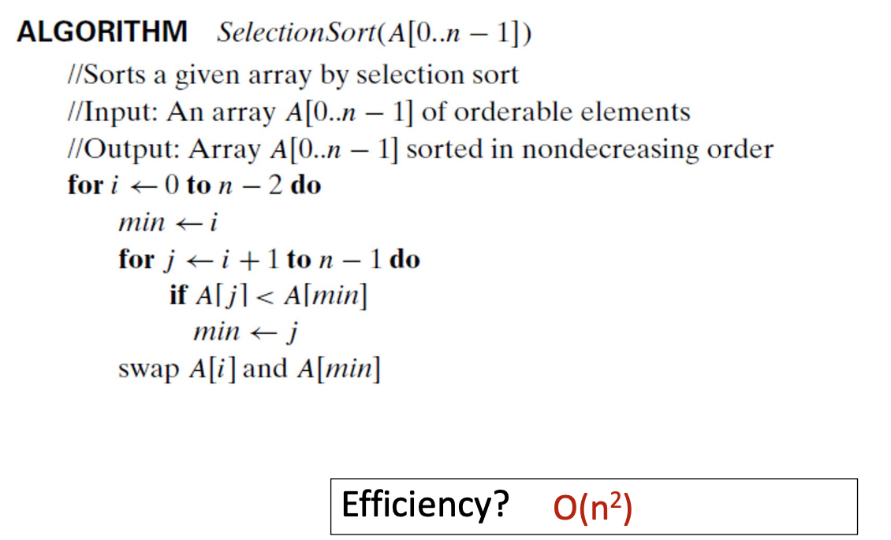

`same format as mt
cheatsheet, 1page, both sides, hand written
2/3 MC/TF, 1/3 short answer/write algos
more focus on stuff after mt (about 1/4 on stuff before mt)
emphasis on using algos to solve problems`

# Lecture 1. Algorithm Analysis

## Session Topics

• Why do we care? What are we doing here?
• Define algorithm
• Examine time efficiency and space efficiency
• Determine the basic operation for a given algorithm
represented in pseudocode
• Determine running time of an algorithm
• Define asymptotic notations (big-O)

## Why we learn algorithm

Algorithms are at the core of computer
programming
• There are many important, standard algorithms
• We want to design new algorithms and analyze
their efficiency

Important problem types
• Sorting
• Searching
• String processing
• Graph problems
• Combinatorial problems
• Numerical problems
• Optimization problems

Algorithm design techniques
• Brute force
• Divide and conquer
• Decrease and conquer
• Transform and conquer
• Space and time
tradeoffs
• Greedy approach
• Dynamic programming
• Iterative improvement
• Backtracking
• Branch and bound

## Definition

What is an Algorithm?
• Definition:
An algorithm is a sequence of unambiguous instructions
for obtaining a required output for any legitimate input
in a finite amount of time

• There is always more than one algorithm for the
same problem
• We care about several characteristics:
• Is it correct?
• Is it time-efficient?
• Is it space-efficient?

## Correctness

Will find work correctly?
• for any possible input? (how many are there?)
• within a finite amount of time?
• How would you argue this
rigorously?

## Time Efficiency

• Is find a time-efficient algorithm?
• Seems good
• To find the largest, you need to check each array
element exactly once

## Space Efficiency

• Is find a space-efficient algorithm? (amount of
memory )
• Again… it seems reasonable
• Two temp variables introduced

## Variation of the Problem

Variation of the problem
• What if you are guaranteed that A is pre-sorted?
• Is this find() algorithm still efficient?
• Could you do better?

Fib is a basic example of why we care about
algorithm efficiency
• A well thought out algorithm can run much faster
• There can be big variation in efficiency

```
NOT GOOD
Algo: fib( n )
if n ≤ 1
return n
else
return fib( n-1 ) + fib( n-2 )
```

```
BETTER
Algo: fib2( n )
F[0] ← 0; F[1] ← 1;
for i ← 2 to n do
F[i] ← F[i-1] + F[i-2]
return F[n]
```

## How to Determine Efficiency

idea: estimate efficiency before writing code
• What we know:

1. Running time (efficiency) of an algorithm depends on
   the input size
2. The total execution time for any algorithm depends
   primarily on the number of instructions executed
   • Different execution times of specific instructions is of
   secondary importance

- We define the basic operation of an algorithm as the
  statement that gets executed most frequently
  ◦ Tiebreakers: deepest inside the loop; which one is more
  “expensive”; or maybe sometimes we don’t care

## Basic Operations

The deepest
This is the fundamental concept we use to analyze algorithmic efficiency:
count the number of basic operations
executed for an input of size n

We don’t count instructions that are not basic
operations

```
1. Mystery1(n) // n > 0
2. S ← 0
3. for i ← 1 to n do
4. S ← S + i *  i // basic algorithm
5. return S
```

## Basic Operations: Tie-Breakers

1. Function calls (growing with N)
2. Function calls (constant time)
3. Key comparisons (comparing data)
4. Assignments (copying data)
5. Expression evaluations
   • Arithmetic tie-breakers:
6. Multiplication/division
7. Addition/subtraction
   • These are all more like guidelines than strict rules

SO FAR: we learned how to determine the running
time aka the efficiency of an algorithm
• Non-recursive algorithms only
• Count the statements, or the basic operations
• The result is a function of n (input size)

An algorithm for analyzing
algorithms?
• Given an algorithm (as input):
• Decide on the basic operation
• May require tie-breakers
• Count how many times the basic operation is
executed
• Set up summations
• Simplify to an expression (function) that depends on N
• This is the running time
• Determine big-O class of the running time function

Running times of algorithms are functions.

## Simplifying the sum


## Computing functions

Comparing functions
• Some functions are bigger than others
• What does “bigger” mean?
• We need a formalized way to talk about this

From earlier:

1. Efficiency of an algorithm depends on input size
2. Efficiency of an algorithm also depends on basic operation
3. Efficiency can be expressed by counting the basic operation


## Worst case, average case, best case

• Worst case:
• Most possible number of steps needed by an algorithm
• Average case:
• Number of steps needed “on average”
• Best case:
• Number of steps needed if you “get lucky” with a
particular input
• Consider the

• We will focus on worst-case analysis in this course
• Unless otherwise specified, you should always analyze
the worst case
• There are many situations where best case = worst
case
• Example: find the largest element in an unsorted list

Running time/efficiency can be
many different functions

## General strategy for analysis of non-recursive algorithms

From the textbook (p62):

1. Decide on a parameter indicating the input’s size.
2. Identify the algorithm’s basic operation.
3. Be sure the number of times the basic operation is executed depends only on the size of the input.
   • If it depends on some other property, the best/worst/average case efficiencies must be investigated separately
4. Set up a sum expressing the number of times the basic operation is executed.
5. Use summation algebra to find a closed-form expression for the
   sum from step 4 above.
6. Determine the efficiency class of the algorithm using asymptotic
   notations

## Asymptotic order of growth

Asymptotic order of growth
A way of comparing functions
• Big O (Pronounced “big oh”)
• Big Ω
• Big Θ

## Big-O

Big-O (formal definition)
Definition:
• a function f(n) is in the set O(g(n)) [denoted: f(n) ∈
O(g(n))] if there is a constant c and a positive integer n0
such that
f(n) ≤ c \* g(n) , for all n ≥ n0
i.e. f(n) is bounded above by some constant multiple of g(n)

Set of all functions whose rate of growth
is the same as or lower than that of g(n).
We also say “f(n) is bounded above by a
constant multiple of g(n)”
or (carelessly) just “f(n) is bounded by g(n)”


Big-O
• Simple Rule: Drop lower order terms and constant
factors

1. 50n3 + 20n + 4
2. 4n2 + 10
3. n(2n + 1)
4. 3log n + 1
5. 3log n + n
6. 1 + log6
7. 5! + 32
   ∈ O(n3)
   ∈ O(n2)
   ∈ O(n2)
   ∈ O(log n)
   ∈ O(n)
   ∈ O(1)
   ∈ O(1)

## Big Omega


Set of all functions whose rate of growth is the
same as or higher than that of g(n).


Big Omega
Definition:
• a function f(n) is in the set Ω(g(n)) [denoted: f(n)
∈ Ω(g(n))] if there is a constant c and a positive
integer n0 such that
f(n) ≥ c \* g(n) , for all n ≥ n0
• i.e. f(n) is bounded below by some constant
multiple of g(n)

## Big Theta

Big Theta
Definition:
• a function f(n) is in the set Θ(g(n)) [denoted: f(n) ∈
Θ(g(n))] if there are constants c1 and c2, and a
positive integer n0 such that
c2 g(n) ≤ f(n) ≤ c1 g(n) , for all n ≥ n0
• i.e. f(n) is bounded both above and below by constant
multiples of g(n)


Set of all functions that
have the same rate of growth as g(n).


## Summary of Notations


Summary of notations - intuition
• Big-O  execution will take at MOST that long
• Big-Ω  execution will take at LEAST that long
• Big-Θ  execution will take THAT long

In general…
• We will usually focus on Big-O
• Why?
• Focuses on worst case efficiency
• Most common when people talk about algorithms

Examples
What is the efficiency class of the following functions?
• 10n
• 5n2 + 20
• 10000n + 2n
• log(n) \* (1 + n)
O(n)
O(n2)
O(2n)
O(nlog(n))

Example 1

• Problem: find the max element in a list
• Input size measure:
• Number of list items, i.e. n
• Basic operation:
• Comparison

Example 2
• Problem: Multiplication of two matrices
• Input size measure:
• Matrix dimensions or total number of elements
• Basic operation:
• Multiplication of two numbers


Example 3: Element uniqueness problem


More practice problems
For each of the following problems, write an
algorithm and then determine:
a. its basic operation
b. basic operation count
c. if basic op count depends on input form

1. Computing the sum of a set of numbers
2. Computing n! (n factorial)
3. Checking whether all elements in a given array
   are distinct

# Lecture 2. Brute Force

## Agenda

• Brute force algorithms
• “Generate and test” subcategory
• Examples:
• A couple of sorting algorithms
• String matching
• Optimization problems

## Brute Force Technique

Brute force technique
• Direct, “obvious”, or straightforward algorithm
• The first thing you’d think of
• Nothing too clever
• No over-optimization
• “Just do it”

Important subcategory:
Exhaustive search
“Generate and test”:

1. Generate/consider all possible solutions
2. Test every one to see if it works
   • If only need one solution, break when you find it
   • May be looking for all solutions

• Advantage: easy to understand, implement
• Disadvantage:
• Maybe not the most efficient
• But you can get lucky
• Sometimes called a naïve approach
• But this is subjective and possibly misleading
• A better word would be “straightforward”

Brute force examples
• What is the brute force solution for these
problems:
• Search for a key value in a list
• Computing n!
• Computing an (a > 0, n is a nonnegative integer)
• Find the combination to a bicycle lock with 4 numbers
• Given an unsorted list of numbers, find the two that
have the largest product

## Selection Sort

Selection sort – general idea
• “Sorted part” and “unsorted part”
• At each iteration:
• Find the smallest item remaining in the unsorted part
• Move it to the end of the sorted part

Selection sort: idea
• Scan the whole array to find the smallest element.
• Swap it with the 1st element (A[0]).
• Scan A[2..n-1] for the smallest element
• Swap it with the 2nd element (A[1])
• Scan A[3..n-1] for the smallest element
• Swap it with the 3rd element (A[2])
• Generally: on pass i, find the smallest element in
A[i..n-1] and swap it with A[i].




Why is this brute force?
• Each main iteration involves a sequential search
(aka linear search) for the smallest remaining item

## Bubble Sort

Bubble sort – general idea
• “Sorted part” and “unsorted part”
• At each iteration:
• Run a “bubble” across the unsorted part
• The largest (remaining) element bubbles to the end


## String Matching

Pattern： compress
Text： We introduce a general framework which is suitable to
capture an essence of compressed pattern matching

The String Matching Problem
Input:

- Pattern: A string of m characters to search for
- Text: A longer string of n characters to search in
  Problem:
  Find a substring in the Text that matches the Pattern

Solution (in words)
Brute-force algorithm


1. Align pattern at beginning of text
2. Moving from left to right, compare each character of
   pattern to the corresponding character in text until
    all characters are found to match (successful search); or
    a mismatch is detected
3. While pattern is not found and the text is not yet
   exhausted, realign pattern one position to the right and
   repeat Step 2
   

Worst-case analysis
• There are m comparisons for each shift in the worst
case (inner loop)
• There are n-m+1 shifts (outer loop)
• So, the worst-case running time is:
O((n-m+1)*m)
• In the example on previous slide, we have (13-
4+1)*4 comparisons in total

## Travelin Salespoerson Problem

• A salesperson needs to visit n cities. You know the distance between any two
cities. Find the shortest path that visits each city exactly once and returns to the
starting city.
• Note that this has lots of applications in real life.


Brute force for “optimization
problems”
• Generate a list of all potential solutions to the
problem in a systematic manner
• Evaluate potential solutions one by one,
disqualifying infeasible ones, and keeping track of
the best one found so far
• When search ends, announce the solution(s) found

• Abstract model:
• A weighted graph.
• Hamiltonian circuit: a circuit that visits every node
exactly once
• Goal:
• Find lowest cost Hamiltonian circuit


TSP efficiency
• How many possible routes – for large n?
• Remember that since we are always starting and ending at a specific city (eg: a),
we only need to consider routes that start with ‘a’
• ie: we would consider a→b→d→c→a but not b→d→c→a→b
• this means there are only (n-1)! permutations to consider
• but we also notice that there are some duplicate routes, eg: a→b→d→c→a is
the same as a→c→d→b→a (it is just reversed)
• so we only consider one of them
• every route has a reverse path, so ...
• the brute force solution requires that we generate and compute the length of
(n-1)!/2 routes

TSP brute-force solution
for each permutation P of cities
for each city i in P
length ← length + weight(i,i+1)
if length < min
min ← length
minroute ← P
return minroute
Efficiency? (n-1)!/2 = O(n!)

## Knapsack Problem

• Input:
• weights: w1 w2 … wn
• values: v1 v2 … vn
• a knapsack of capacity W
• Goal:
• Find most valuable subset of the items that fit into
the knapsack

Knapsack problem
• Generate all possible subsets of the n items
• Compute total weight of each subset
• Identify feasible subsets
• Find the subset of the largest value

Efficiency?
Need to generate all subsets. For n
items, there are 2n subsets. So this is
an O(2n) algorithm.

Assignment problem
• Brute force algorithm:
• Check every combination of assignments
• Calculate the cost of each one
• Find the combination with minimum cost

for each permutation P of job assignments
totalcost ← sum of the job costs for P
if totalcost < mincost
mincost ← totalcost
minperm ← P
return minperm

Efficiency? Need to generate all permutations. For n
jobs, there are n! permutations. So this is
an O(n!) algorithm.

Comments on brute force
• Brute force (exhaustive-search) algorithms run in a
realistic amount of time only on very small inputs
• In many cases, exhaustive search or its variation is
the only known way to get an exact solution

Strengths
• wide applicability
• simplicity
• yields reasonable
algorithms for some
important problems
• matrix mult.
• sorting
• searching
• string matching

Weaknesses
• rarely yields the most
efficient algorithms
• some brute-force
algorithms are
unacceptably slow
• not as constructive as
some other design
techniques

Practice problem
You have a row of 2n discs of 2 colors, n dark and n light. They
alternate dark, light, dark, light, dark, and so on. You want to get all
the dark discs on the right hand side and all the light discs on the
left.
The only move you are allowed to make is to interchange two
adjacent discs.

(a) Design an algorithm that solves this problem
(b) Analyze the efficiency of your algorithm

# Lecture 3. Decrease and Conquer

Aside:
Programs/algorithms
as “black boxes”

How many edges in Kn?
• Recursive definition (algorithm):

ALGORITHM num_edges(int n)
// n is the number of vertices in a complete graph
// Return the number of edges in the graph
if n = 1
return 0
else
return (n-1) + num_edges(n-1)
endif
END

• num_edges(K37) = 36 + num_edges(K36)

Decrease and conquer
• Reduce problem instance to smaller instance of the
same problem and solve smaller instance
• I.e. Solve a smaller problem
• Extend solution of smaller instance to obtain
solution to original instance
• Extend, augment, enhance, adapt, adjust, …
• Sometimes this part is trivial
• Can be implemented:
• Top-down (recursive)
• Bottom-up (iterative)

## Top-down


top-down (recursive)
Factorial(n)
if n=0 or n=1 then
return 1
else
return n \* Factorial(n − 1)


## Bottom-up

Example: bottom-up (iterative)
Factorial (n)
F ← 1
for i ← 1 to n
F ← F \* i
return F


Three types of
Decrease and Conquer
• Decrease by a constant (usually by 1)
• Insertion sort
• Generating permutations
• Generating subsets
• Decrease by a constant factor (usually by half)
• Binary search
• Exponentiation by squaring
• Fake coin problem
• Variable-size decrease
• Euclid’s algorithm (we won’t have time)

## Decrease by a constant amount


Generating permutations
Example of “decrease by 1”
Example: To find all permutations of 3 objects
A, B, C
• First find all permutations of 2 objects, say B and C:
B C and C B
• Then insert the remaining object, A, into all possible
positions in each of the permutations of B and C:
ABC BAC BCA and ACB CAB CBA
• To find all permutations of n objects:

1. Find all permutations of n-1 of those objects
2. Insert the remaining object into all possible positions
   of each permutation of n-1 objects
   • Example: find all permutations of A, B, C
   

generatePerms (a1, a2, ..., an)
if n==1
// return “list” with one item a1
else // case where n > 1
PermsOfNMinus1 = generatePerms (a1, a2, ..., an-1)
initialize allPerms to {}
for each p in PermsOfNMinus1
insert an before a1 and add to allPerms
for i  1 to n-1
insert an after ai and add to allPerms
return allPerms

Generating subsets
Example of “decrease by 1”

In “lexicographic” order:
{},
{a}, {b}, {c}, {d},
{a,b}, {a,c}, {a,d}, {b,c}, {b,d}, {c,d},
{a,b,c}, {a,b,d}, {a,c,d}, {b,c,d},
{a,b,c,d}

Generating subsets: IDEA
To find all subsets of a set with N items:

1. Find all subsets of a set with N-1 of the items
2. Copy/clone the subsets
3. Insert the last item into all the copies
   

generateSubsets (a1, a2, ..., an)
if n==0
return “list” of just one set, the empty set {}
else // nonempty input i.e. n > 0
subsetList = generateSubsets (a1, a2, ..., an-1)
for each subset s in subsetList
clone s to create s’
insert an to s’
add s’ to subsetList
return subsetList

## Insertion Sort

Insertion sort
Example of “decrease by 1”

Sort algorithm idea:

1. Sort items A[0] through A[n-2]
   • This is a big step ... think of it as a subroutine
2. Find the spot where last item A[n-1] goes
3. Shift items over and drop in A[n-1]


Insertion sort
• Insertion sort (A[0..n-1])

1. Insertion sort (A[0..n-2])
2. Insert A[n-1] in its proper place among the sorted
   A[0..n-2]


InsertionSort(A,n) - RECURSIVE
1 if n > 1
2 InsertionSort(A,n-1)
3 key  A[n-1]
4 i = n-2
5 while i ≥ 0 and A[i] > key
6 A[i+1]  A[i]
7 i  i - 1
8 A[i + 1]  key

Insertion Sort (iterative)

1. InsertionSort(A[0..n-1])
2. for i ← 1 to n-1 do
3. v ← A[i]
4. j ← i-1
5. while j≥0 and A[j]>v do
6. A[j+1] ← A[j]
7. j ← j-1
8. A[j+1] ← v

Insertion sort and Selection sort:
Similarities
• "Sorted" and "unsorted" piles
• Each main iteration does two things:
• Choose item from "unsorted"
• Place item in "sorted"
• Number of main iterations is O(n)
• O(n2) overall (worst case)

Insertion sort and Selection sort:
Differences
• Selection sort: each main iteration
• "Choose from unsorted part" is O(n) (linear search)
• "Place into sorted part" is O(1) (it goes at the end)
• Insertion sort: each main iteration
• "Choose from unsorted part" is O(1) (choose first item)
• "Place into sorted part" is O(n) (shift the other items)

## Decrease by a constant factor

Make the problem smaller
by some constant factor
• Often the constant factor
is two, i.e, we divide the
problem in half
• Discard one or more of
the parts
Program F (n)
if n=BASECASE then
return (SomethingSimpleHere)
else
return (ExtendResultOrNot)
endif
END

## Binary Search

Example of “decrease by factor of 2”
i.e. solve a problem of size n/2

Example: binary search, key =7


• Binary Search works by dividing the sorted array
(i.e. the solution space) in half each time, and
searching in the half where the target should exist
• In other words, we eliminate half the input on each
iteration!
• It makes efficiency gains by ignoring the part of the
solution space that we know cannot contain a
feasible solution

binarySearch(a[], k, s, e)
if e < s
return not found
m ← floor((s+e)/2)
if k > a[m]
return binarySearch(a[], k, m+1, e)
else if k < a[m]
return binarySearch(a[], k, s, m-1)
else
return m

Binary search
• Example: Binary search, k=90
binarySearch(a[], k, s, e)

Call trace:

1. binarySearch(a, 90, 0, 20)
   1.1 binarySearch(a, 90, 11, 20)
   1.1.1 binarySearch(a, 90, 16, 20)
   1.1.1.1 binarySearch(a, 90, 16,17)
   1.1.1.1.1 binarySearch(a, 90, 17, 17)
   \*\*target found, returns

• Time efficiency
• Worst-case efficiency…
• C(n) = log2(n) + 1
• So binary search is O(log n)
• This is VERY fast: e.g., C(1000000) = 20
• Optimal for searching a sorted array
• Limitations: must be a sorted array

Binary search (recursive)
Example: Trace the values of s,e,m as the algorithm runs with different keys (k)
◦ Trace for k=81 (s=0, e=20 initially)
 iteration 1: s,e,m = 11,20,10
 iteration 2: s,e,m = -
,
-,15 ** target found
◦ Trace for k=22
 iteration 1: s,e,m = 0,9,10
 iteration 2: s,e,m = 5,9,4
 iteration 3: s,e,m = 5,6,7
 iteration 4: s,e,m = 6,6,5
 iteration 5: s,e,m = -
,
-,6 ** target found
◦ Note: largest number of iterations is 6, when

Binary search (iterative)
binarySearch(a[], s, e, k)
while s ≤ e
m ← floor((s+e)/2)
if k > a[m]
s ← m+1
else if k < a[m]
e ← m-1
else
return m
return not found

## Exponentiation by squaring

Example of “decrease by factor of 2”
i.e. solve problem of size n/2

Exponentiation by squaring
• Compute an where n is a nonnegative integer
• Brute-force algorithm requires n–1 multiplications
• We can do much better!

Example: calculating a38
a38  a19 _ a19
a19  a _ a9 _ a9
a9  a _ a4 _ a4
a4  a2 _ a2
a2  a \* a

Compute an where n is a nonnegative integer
For even values of n
For odd values of n
a n = (a n /2 )2
a n = (a (n-1)/2 )2 a

power(a, n):

1. if (n = 1)
2. return a
3. if (n % 2 = 0)
4. t = power(a, n/2)
5. return t\*t
6. else:
7. t = power(a, (n - 1) / 2)
8. return a * t*t

Efficiency of exp-by-sqr

O(logn)

## Fake coin problem

Example of “decrease by factor of 2”
i.e. solve problem of size n/2
(Bonus: alternate solution that is “decrease by factor of 3”)
Fake coin problem
• A mischievous banker gives you n identical-
looking coins, but tells you one is a fake (it is
made from a lighter metal). Luckily, you have a
balance scale, and can compare any two sets
of coins.
• Design an efficient Decrease by a Constant
Factor algorithm that finds the fake coin.
Key observation:
• Divide the pile in half
• Half on each side
of balance
• Lighter half has the fake
• We eliminate HALF the coins in one step

Picky details
• What if n is odd?
• Set aside one coin, then divide and weigh
• Lighter pile  fake coin is there
• Equal piles  fake coin is the extra (bonus!)
• Repeat the procedure until down to only 2 (or 3)
coins

Fake coin problem
• Assume that n=17. How many times will you need
to use the scale? Give two answers, one for the
best case and one for the worst case.
• Best case: 1 weight comparison is needed.
• Worst case: 4 weight comparisons are needed.

Algorithm FindFakeCoin(C[N])
if N = 1 then
return C[0] // just one coin – it's the fake
else
if N is odd
remove C[0] and set it aside
endif
divide remaining coins into 2 piles C1 and C2
weigh C1 vs. C2
if they weigh the same
return C[0]
else
discard the heavier pile
return FindFakeCoin(the lighter pile)
endif
endif
END

• This solution is O(log2n)
• It involves dividing the problem in half every time
• There is a better solution
• Runs in O(log3n)

Something to ponder
• The 3-pile solution is better by actual running time
• log3(n) is less than log2(n)
• But they are both O(logn)
• So how much “better” is the 3-pile solution?
• What is log3(100) vs. log2(100)?
• How about log3(1000000) vs. log2(1000000)?
• P.S. the 3-pile solution has a slightly trickier “base
case”

# Lecture 4. Divide and Conquer

## Agenda

• Divide and conquer algorithms
• Example: Count a key in an array
• How to analyze Divide and Conquer (the “Master
Theorem”)
• Example: Mergesort

generatePerms (a1, a2, ..., an)
if n > 1
smallerPerms = generatePerms (a1, a2, ..., an-1)
initialize allPerms to {}
for each p in smallerPerms
insert an before a1 and add to allPerms
for i = 1 to n-1
insert an after ai and add to allPerms
return allPerms

Divide and conquer algorithms
• Divide a problem into two or more smaller
instances
• Solve smaller instances (often recursively)
• Obtain solution to original (larger) instance by
combining these solutions

## Divide and conquer technique

Divide-and-conquer vs.
decrease-and-conquer
• Think of the fake coin problem (decrease-and-
conquer):
• We discarded half the coins at each step
• So we only worked on one “subproblem”
• For divide and conquer…
• You need to solve all of the subproblems

## Count a key in an array

• Problem:
• Count the number of times a specific key occurs in an
array.
• For example:
• If input array is A=[2,7,6,6,2,4,6,9,2] and key=6…
• ... should return the value 3.
• Design an algorithm that uses divide and conque


Algorithm CountKeys(A[], Key, L, R)
//Input: A[] is an array A[0..n−1]
// L & R (L ≤ R) are boundaries of the current search
//Output: The number of times Key exists in A[L..R]

1. if L = R
2. if (A[L] = Key) return 1
3. else return 0
4. else
5. leftCount = CountKey(A[], Key, L, (L+R)/2)
6. rightCount = CountKey(A[], Key, (L+R)/2+1, R)
7. return leftCount + rightCount

• Superficially, CountKeys resembles Binary Search
• Similar arguments (array bounds)
• Finding a midpoint
• What’s the difference?
• We have to process both sides
• In CountKeys, both sides must be searched
• In Binary Search, one half gets ignored

## Analysis of divide and conquer

Analyzing a divide-and-conquer
algorithm
• What matters:

1. Number of parts
2. Size of each part
3. Cost of combining subproblems
   a
   n/b
   F(n)

This expression is your new friend: nlogba

Algorithm CountKeys(A[], Key, L, R)
//Input: A[] is an array A[0..n−1]
// L & R (L ≤ R) are boundaries of the current search
//Output: The number of times Key exists in A[L..R]

1. if L = R
2. if (A[L] = Key) return 1
3. else return 0
4. else
5. leftCount = CountKey(A[], Key, L, (L+R)/2)
6. rightCount = CountKey(A[], Key, (L+R)/2+1, R)
7. return leftCount + rightCount

each subproblem is
half the size (n/2)
b = 2

additional computation
time is O(1)
F(n) = 1


What is the big-O
efficiency class of T(n)?
T(n) = a T(n/b) + F(n)
Compare
nlogba and F(n)
The bigger
one wins
f they’re equal:
O(nlogbalogn)

The Master Theorem
If T(n) = a T(n/b) + F(n)


Another version
If T(n) = a T(n/b) + F(n)


# Lecture 5. Transform and Conquer

# Lecture 6. Space/time Trade-offs

# Lecture 7. Data Structures and Graphs

# Lecture 8 and 9. Solving Problems with Graph Algorithms

# Lecture 10. Dynamic Programming

# Lecture 11. Backtracking, Branch & Bound
