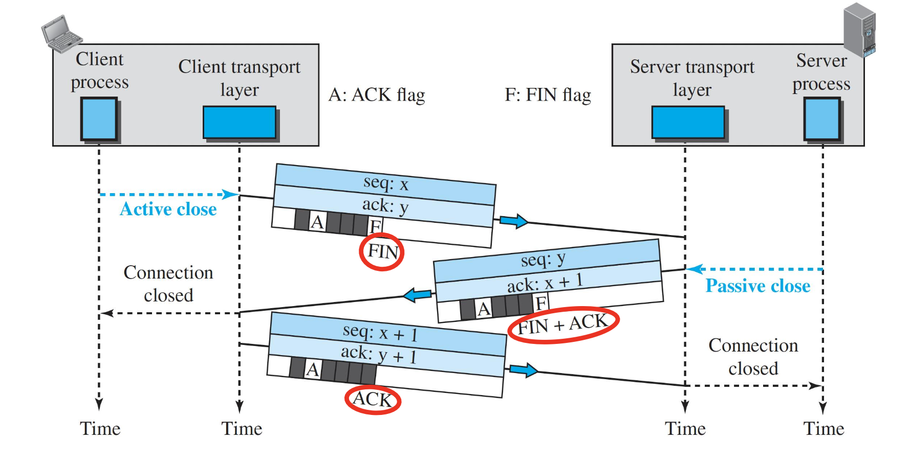

# Summary of Week 1: **Data Communication Basics**

#### **Data Communication System**

- **Components**:
  - **Message**: Information to be communicated (text, audio, video, etc.).
  - **Sender**: Device sending the message (e.g., computer, phone).
  - **Receiver**: Device receiving the message.
  - **Transmission Medium**: Path for data (e.g., cable, fiber optic, air).
  - **Protocol**: Rules for communication (e.g., message format, order, actions).

#### **Modes of Communication**:

1. **Simplex**: One-way (e.g., TV).
2. **Half-Duplex**: Two-way, but one at a time (e.g., walkie-talkie).
3. **Full-Duplex**: Two-way, simultaneous (e.g., phone).

---

#### **Networks**

- **Definition**: Interconnection of devices (nodes) via links (wired/wireless).
- **Types of Connections**:
  - **Point-to-Point**: Dedicated link (e.g., remote control).
  - **Multipoint**: Shared link (spatially or time-shared).

---

#### **Topologies**:

1. **Mesh**: Devices connected to all others.
   - Pros: High reliability, security, fault tolerance.
   - Cons: Expensive, complex wiring.
2. **Star**: Devices connected to a central hub.
   - Pros: Easy to install/reconfigure, fault isolation.
   - Cons: Central hub dependency.
3. **Bus**: One backbone cable with devices attached via drop lines.
   - Pros: Less cabling, simple setup.
   - Cons: Fault isolation is difficult.
4. **Ring**: Each device connected to two others in a loop.
   - Pros: Easy reconfiguration.
   - Cons: Unidirectional traffic; failure breaks the network.

---

#### **Network Types**:

- **LAN**: Local Area Network (small, private).
- **WAN**: Wide Area Network (spans large areas, uses routers).

---

#### **The Internet**:

- **Internet**: A network of interconnected networks.
- **Access Methods**:
  - Dial-up, DSL, Cable, Wireless, Direct Connection.
- **Internet Standards**: Created by **IETF** via RFCs (Request for Comments).

---

#### **Protocol Layering**

- **Definition**: Dividing communication into smaller tasks.
- **Benefits**:
  - Modularity, easier maintenance, cost-effective intermediate systems.

---

#### **Network Models**

1. **TCP/IP Protocol Suite** (5 Layers):

   - **Physical (1)**: Transmits raw bits (e.g., cables, fiber optics).
   - **Data Link (2)**: Transfers frames without errors (e.g., Ethernet, Wi-Fi).
   - **Network (3)**: Host-to-host routing (e.g., IP).
   - **Transport (4)**: Process-to-process communication (e.g., TCP/UDP).
   - **Application (5)**: Network applications (e.g., HTTP, DNS).

2. **OSI Model** (7 Layers):
   - Similar to TCP/IP, but adds:
     - **Presentation (6)**: Data format/translation (e.g., encryption).
     - **Session (5)**: Synchronization, session management.

---

#### **Encapsulation/Decapsulation**:

- **Encapsulation**: Adding headers (Data → Segment → Packet → Frame → Bits).
- **Decapsulation**: Removing headers in reverse.

#### **Addressing**:

- **Application Layer**: Names (e.g., website URLs).
- **Transport Layer**: Port numbers.
- **Network Layer**: Logical (IP) addresses.
- **Data Link Layer**: MAC (link-layer) addresses.

# Summary of Week 2: **Data, Signals, and Transmission Media**

#### **Data and Signals**

- **Data**:

  - **Analog**: Continuous (e.g., sound waves).
  - **Digital**: Discrete (0, 1 in computers).

- **Signals**:
  - **Periodic**: Repeats over time.
    - Parameters: **Amplitude**, **Frequency**, **Phase**.
    - \( s(t) = A \sin(2 \pi f t) \).
  - **Nonperiodic**: Does not repeat.

---

#### **Characteristics of Signals**

1. **Amplitude (A)**: Signal’s highest intensity (volts).
2. **Frequency (f)**:
   - Cycles per second (Hertz, Hz).
   - \( f = 1/T \), \( T = 1/f \).
3. **Phase (\(∅\))**:
   - Position of the waveform relative to time 0.
   - \(∅ = 360^\circ \cdot \text{shift in cycles} \).
4. **Wavelength (\(𝝀\))**:
   - Distance a signal travels in one cycle.
   - \( 𝝀 = c / f \), where \( c \) = propagation speed.
5. **Bandwidth (B)**: Difference between highest and lowest frequencies:
   - \( B = f_h - f_l \).

---

#### **Digital Signals**

- **Bit Rate (bps)**: Bits per second.
- **Bit Duration**: \( \text{1/Bit Rate} \).
- **Levels**: Discrete states of the signal (e.g., binary: 2 levels; hexadecimal: 16 levels).
  - Number of bits per level: \( \lceil \log_2(\text{levels}) \rceil \).
- **Composite Analog Signals**: Digital signals can be represented as infinite sine waves (Fourier analysis).

---

#### **Transmission Media**

- **Guided Media (Wired)**:

  1. **Twisted-Pair Cable**:
     - **UTP**: Common, low-cost, prone to interference.
     - **STP**: Shielded, better performance, expensive.
  2. **Coaxial Cable**:
     - High bandwidth, high attenuation (needs repeaters).
  3. **Fiber-Optic Cable**:
     - Uses light, high bandwidth, low attenuation, costly.

- **Unguided Media (Wireless)**:
  1. **Radio Waves**:
     - Omnidirectional, penetrates walls, for broadcast.
  2. **Microwaves**:
     - Unidirectional, line-of-sight, high data rates.
  3. **Infrared**:
     - Short range, cannot penetrate walls, for remote controls and indoor LANs.

# Summary of Week 3: **Digital Signal Transmission and Performance**

#### **Transmission of Digital Signals**

1. **Baseband Transmission**:

   - Sends digital signals **without conversion**.
   - Requires a **low-pass channel** (wide bandwidth).
   - Example: Wired LANs.

2. **Broadband Transmission**:
   - Converts digital signals to **analog signals** via modulation.
   - Requires a **bandpass channel**.
   - Example: Telephone lines, digital cellular networks.

---

#### **Transmission Impairments**

1. **Attenuation**:
   - Loss of signal energy.
   - Compensation: **Amplifiers**.
   - Formula: \( dB = 10 \log*{10}(P_2/P_1) \) or \( dB = 20 \log*{10}(V_2/V_1) \).
2. **Distortion**:
   - Change in signal shape (phase/frequency misalignment).
   - Common in composite signals.
3. **Noise**:
   - Types: Thermal, Induced, Crosstalk, Impulse.
   - **Signal-to-Noise Ratio (SNR)**:
     - \( SNR = \text{Signal Power} / \text{Noise Power} \).
     - \( SNR*{dB} = 10 \log*{10}(SNR) \).

---

#### **Data Rate Limits**

1. **Nyquist Formula** (Noiseless Channel):
   - \( \text{Bit Rate} = 2 \times \text{Bandwidth} \times \log_2(\text{Levels}) \).
   - Increasing levels reduces reliability.
2. **Shannon Formula** (Noisy Channel):
   - \( \text{Capacity} = \text{Bandwidth} \times \log_2(1 + SNR) \).
   - Gives the **upper limit** of data rate.

---

#### **Bandwidth**

1. **Hertz**: Range of frequencies a channel can pass.
2. **Bits per second (bps)**: Number of bits transmitted per second.
3. **Bandwidth-Delay Product**:
   - Bits in transit = \( 2 \times \text{Bandwidth} \times \text{Delay} \).

---

#### **Transmission Modes**

1. **Parallel Transmission**:
   - Multiple channels; faster but expensive.
2. **Serial Transmission**:
   - Single channel; slower but cost-effective.
3. **USB**: Evolved from parallel to serial for efficiency.

# Summary of Week 4: **Line Coding and Digital Signal Conversion**

---

#### **Digital-to-Digital Conversion**

- Represents **digital data** using **digital signals**.
- **Line Coding**: Converts digital data into a digital signal.
  - Common characteristics:
    1. Signal element vs. Data element (ratio \( r \)).
    2. Data rate (\( N \)): Bits per second (bps).
    3. Signal rate (\( S \)): Signal elements per second (baud).
    4. Bandwidth: Proportional to signal rate.
    5. Baseline wandering: Avoid long sequences of 0s/1s.
    6. Self-synchronization: Ensures clocks of sender/receiver are synchronized.
    7. DC components: Avoid low-frequency bias.

---

#### **Key Formulas**

1. **Signal Rate vs Data Rate**:

   - \( S = N / r \) (Signal rate = Data rate / Ratio).
   - \( S\_\text{avg} = c \times N \times (1 / r) \) (average signal rate with case factor \( c \)).

2. **Bandwidth (B)**:
   - \( B = c \times N \times (1 / r) \) (case factor \( c \)).
   - Nyquist Formula: \( N\_\text{max} = (1 / c) \times B \times \log_2L \).

---

#### **Line Coding Schemes**

1. **Unipolar Scheme (NRZ)**:

   - Signal levels on one side of the time axis.
   - \( 1 \): Positive voltage, \( 0 \): Zero voltage.
   - Issue: No self-synchronization or baseline wandering prevention.

2. **Polar Schemes**:

   - Signal levels on **both sides** of the time axis.
   - **NRZ-L**: Voltage depends on bit value (\( 0 \): Positive, \( 1 \): Negative).
   - **NRZ-I**: Voltage changes for \( 1 \), no change for \( 0 \).
   - **Manchester/Differential Manchester**:
     - Transition in middle of bit ensures self-synchronization.
     - No baseline wandering or DC components.
     - Higher signal rate.

3. **Bipolar Schemes (AMI)**:
   - Three voltage levels: Positive, Negative, Zero.
   - \( 0 \): Neutral (zero voltage).
   - \( 1 \): Alternating positive/negative voltages.
   - Advantages: No DC components, fewer baseline wandering issues.

---

#### **Key Points for Line Coding**

- Goal: Maximize data rate while minimizing bandwidth and signal rate.
- Avoid baseline wandering and ensure self-synchronization.
- DC components cause problems for systems that block low frequencies.

# Summary of Week 5: **Analog-to-Digital, Digital-to-Analog, and Analog-to-Analog Conversion**

---

#### **Analog-to-Digital Conversion (Pulse Code Modulation - PCM)**

1. **Steps in PCM**:

   - **Sampling**: Converts the analog signal into discrete values at regular intervals.
     - **Nyquist Theorem**: Sampling rate \( f_s \geq 2 \times f_m \) (highest frequency).
   - **Quantization**: Approximates sampled values to the nearest discrete levels.
     - \( \Delta = \frac{V*\text{max} - V*\text{min}}{L} \), where \( L \) = quantization levels.
     - Quantization error: \( -\Delta/2 \leq \text{Error} \leq \Delta/2 \).
     - \( \text{SNR}\_{\text{dB}} = 6.02n_b + 1.76 \), where \( n_b \) = bits per sample.
   - **Encoding**: Converts quantized levels into binary codes.
     - \( n_b = \log_2L \), Bit rate = \( f_s \times n_b \).

2. **Bandwidth of PCM**:
   - \( B*{\text{min}} = n_b \times B*{\text{analog}} \).

---

#### **Digital-to-Analog Conversion (Modulation)**

1. **Amplitude Shift Keying (ASK)**:

   - Varies **amplitude** of the carrier signal.
   - Examples: Binary ASK (BASK), Multi-level ASK.
   - Bandwidth proportional to signal rate.

2. **Frequency Shift Keying (FSK)**:

   - Varies **frequency** of the carrier signal.
   - Examples: Binary FSK (BFSK), Multi-level FSK.
   - Less bandwidth-efficient compared to PSK.

3. **Phase Shift Keying (PSK)**:

   - Varies **phase** of the carrier signal.
   - Examples: Binary PSK (BPSK), Multi-level PSK.
   - **More robust to noise** than ASK or FSK.

4. **Quadrature Amplitude Modulation (QAM)**:
   - Combines ASK + PSK.
   - Most efficient for digital communication.
   - Widely used (e.g., Wi-Fi standards).

---

#### **Constellation Diagram**

- Represents signal elements by their **amplitude** and **phase**.
- Helps analyze multilevel ASK, PSK, QAM.
- Example: \( n \) constellation points transmit \( \log_2n \) bits per signal element.

---

#### **Analog-to-Analog Modulation**

1. **Amplitude Modulation (AM)**:

   - Amplitude of the carrier varies with the signal.
   - Bandwidth: \( 2 \times \text{signal bandwidth} \).
   - Example: AM radio (10 kHz per station).

2. **Frequency Modulation (FM)**:

   - Frequency of the carrier varies with the signal.
   - Bandwidth: \( \approx 10 \times \text{signal bandwidth} \).
   - Example: FM radio (200 kHz per station).

3. **Phase Modulation (PM)**:
   - Phase of the carrier varies with the signal.
   - Less common than AM/FM.

# Summary of Week 6: **Bandwidth Utilization, Multiplexing, and Data-Link Layer**

---

#### **Bandwidth Utilization**

- **Goal**: Efficient use of available bandwidth.
- Achieved through **Multiplexing** (combining multiple channels on one link).

---

#### **Multiplexing Techniques**

1. **Frequency-Division Multiplexing (FDM)**:

   - Analog multiplexing technique using different carrier frequencies.
   - Guard bands prevent signal interference.
   - Used in radio/TV broadcasting and telephone networks.
   - Example: \( \text{Bandwidth} = \text{channels} \times \text{channel bandwidth} + \text{guard bands} \).

2. **Wavelength-Division Multiplexing (WDM)**:

   - Similar to FDM but uses **optical signals** in fiber-optic cables.
   - Combines signals of different light wavelengths.

3. **Time-Division Multiplexing (TDM)**:
   - Digital multiplexing technique where channels share the link in time.
   - **Synchronous TDM**: Allocates fixed time slots per frame.
     - Inefficient if a channel is idle.
     - Solutions: **Multilevel multiplexing**, **Multiple-slot allocation**, **Pulse stuffing**.
   - Frame synchronization maintained using framing bits.
   - Example: \( \text{Bit rate of shared link} = \text{channels} \times \text{channel bit rate} \).

---

#### **Data-Link Layer**

1. **Responsibilities**:

   - Encapsulation (framing): Packs network-layer packets into frames.
   - Flow control: Manages data production/consumption rates.
   - Error control: Detects and corrects errors in transmission.
   - Congestion control: Prevents network overload.

2. **Sublayers**:

   - **Data Link Control (DLC)**: Handles framing, flow control, and error control for all links.
   - **Media Access Control (MAC)**: Manages access to shared links (e.g., Ethernet).

3. **Link-Layer Addressing**:

   - **MAC Address**: 48-bit physical address (6 bytes), used in LANs (e.g., Ethernet).
   - Format: Hexadecimal, e.g., `00:1A:2B:3C:4D:5E`.

4. **Switch**:
   - Layer 2 device (data-link and physical layers).
   - Forwards frames based on MAC addresses.

---

#### **Address Resolution Protocol (ARP)**

- Maps **IP addresses** to **MAC addresses** for communication within a link.
- Required for host-to-host communication in a multi-hop path:
  1. Sender uses ARP to find the MAC address of the next hop.
  2. Frame is delivered to the next hop using the resolved MAC address.
  3. Process repeats until the packet reaches the destination.

---

This summary captures the key points for **multiplexing techniques**, the **data-link layer**, and **ARP**. Let me know when you're ready to share Week 7!

# Summary of Week 7: **Error Control, DLC, and Protocols**

---

#### **Error Types**

1. **Single-Bit Error**:
   - Only one bit is flipped (1 → 0 or 0 → 1).
2. **Burst Error**:
   - Multiple bits are affected by noise.
   - **Number of affected bits** = Data rate × Duration of noise.

---

#### **Error Detection vs Error Correction**

- **Error Detection**:
  - Identifies whether an error occurred, but not its exact location.
- **Error Correction**:
  - Detects and corrects errors by identifying corrupted bits and their locations.
  - Requires more redundancy and is computationally expensive.

---

#### **Redundancy for Error Control**

- **Block Coding**:

  - **Dataword**: \( k \)-bit blocks of original data.
  - **Codeword**: \( n = k + r \)-bit blocks with redundant bits.
  - **Hamming Distance** (\( d(x, y) \)):
    - Minimum distance to detect errors: \( d\_{\text{min}} = s + 1 \).
    - To correct \( s \) errors: \( d\_{\text{min}} = 2s + 1 \).

- **Parity Check Code**:

  - Adds a single bit to ensure the number of 1s is even (or odd).
  - Minimum Hamming distance: \( d\_{\text{min}} = 2 \).
  - Detects single-bit errors and any odd number of errors.

- **Cyclic Codes (e.g., CRC)**:

  - **Cyclic Redundancy Check (CRC)**:
    - Uses generator polynomial \( G(x) \).
    - Detects single-bit, double-bit, and burst errors (based on \( G(x) \)).
    - Example: CRC-32 is widely used in Ethernet and WANs.

- **Checksum**:
  - Error-detection technique where all data blocks are summed, and the result is complemented.
  - Used at the **network and transport layers**.

---

#### **Forward Error Correction (FEC)**

1. **Hamming Distance**:
   - To correct \( s \) errors, \( d\_{\text{min}} = 2s + 1 \).
2. **XOR Technique**:
   - Combine \( N \) chunks with XOR to create redundancy.
   - If one chunk is lost, it can be reconstructed.
3. **Chunk Interleaving**:
   - Allows small portions of data to be missing without losing the entire packet.

---

#### **Data Link Control (DLC)**

- **Responsibilities**:

  1. **Framing**: Pack data into frames for transmission.
     - Fixed-size frames: Easier to manage.
     - Variable-size frames: Use flags or stuffing for boundaries.
  2. **Flow Control**: Regulate the sender to match the receiver's processing rate.
  3. **Error Control**: Detects and corrects transmission errors.

- **Framing Techniques**:
  1. **Character-Oriented**:
     - Uses flags and byte stuffing.
     - Problems with non-text data (e.g., Unicode).
  2. **Bit-Oriented**:
     - Uses flags and bit stuffing.
     - Efficient for all types of data.

---

#### **DLC Protocols**

1. **Simple Protocol**:
   - No flow or error control.
   - Assumes receiver can handle all incoming frames.
2. **Stop-and-Wait Protocol**:
   - **Connection-based**: Ensures flow and error control.
   - Sender sends one frame and waits for acknowledgment (ACK).
   - Retransmits on timeout or lack of ACK.
   - Uses **sequence numbers** to handle duplicates and maintain order.

---

This summary highlights key points for **error control**, **DLC protocols**, and **block coding**, ensuring efficient study for your exam. Let me know when you're ready for Week 8!

# Week 8: **Summary for MAC Protocols and VLANs**

---

#### **MAC Protocols** (Media Access Control)

- **Purpose**: Coordinate access to shared broadcast links.
- Categories:

  1. **Random Access Protocols** (e.g., ALOHA, CSMA):

     - Stations transmit when desired; collisions are resolved with predefined protocols.
     - Key protocols:
       - **Pure ALOHA**:
         - Vulnerable time: \( 2 \times T\_{\text{frame}} \).
         - Max throughput: \( S\_{\text{max}} = 0.184 \).
       - **Slotted ALOHA**:
         - Transmissions only at slot start.
         - Vulnerable time: \( T\_{\text{frame}} \).
         - Max throughput: \( S\_{\text{max}} = 0.368 \).
       - **CSMA (Carrier Sense Multiple Access)**:
         - **1-persistent**: Transmit immediately if idle; high collision risk.
         - **Non-persistent**: Wait and retry; lower collision, but idle time.
         - **P-persistent**: Transmit with probability \( p \); balance efficiency and collision.
       - **CSMA/CD (Collision Detection)**:
         - Monitors medium during and after transmission.
         - Collision detected → sends a jamming signal.
         - Min frame size: \( 2 \times T\_{\text{propagation}} \).
       - **CSMA/CA (Collision Avoidance)**:
         - Used in wireless networks.
         - Techniques: Interframe Space (IFS), Contention Window (CW), and Network Allocation Vector (NAV).

  2. **Channelization Protocols**:
     - Divide the channel into fixed, shared resources (e.g., frequency, time, code).
  3. **Controlled Access Protocols**:
     - Stations take turns using the medium.

---

#### **VLANs (Virtual Local Area Networks)**

- **Definition**: Logical grouping of devices on a LAN, independent of physical location.
- **Purpose**: Isolate traffic, reduce costs, and create virtual workgroups.

---

#### **Benefits of VLANs**

1. **Broadcast Domain Control**:
   - VLANs define broadcast domains.
   - Frames in a VLAN do not cross into other VLANs.
2. **Security**:
   - Isolate sensitive traffic from other users/groups.
3. **Cost Reduction**:
   - Eliminates the need for physical reconfiguration.
4. **Flexibility**:
   - Create workgroups spanning different physical locations.

---

#### **VLAN Configuration**

- **Membership Criteria**:
  - Port numbers, MAC addresses, IP addresses, or combinations.
- **Configuration Methods**:
  - Manual: Set by admin during setup.
  - Automatic: Based on predefined criteria.
  - Semiautomatic: Mix of manual setup and automatic migration.

---

#### **VLAN Communication**

1. **Frame Tagging**:
   - Adds a VLAN tag (IEEE 802.1Q) to identify VLAN membership.
2. **VLAN Trunking**:
   - Allows multiple VLANs to share a single physical link.

---

#### **Devices and Their Roles**

1. **Switches**:
   - Link-layer devices.
   - Separate collision domains; no collisions within switch-based LANs.
   - Self-learning: Build switching tables dynamically.
2. **Routers**:
   - Separate broadcast domains.
3. **Hubs**:
   - Do not separate collision or broadcast domains.

# Week 8 Summary: **Packet Switching, Network Layer Services, IPv4, and NAT**

---

#### **Packet Switching**

- **Definition**: Data is split into **packets**, which are routed independently from source to destination.
- No **resource reservation**; packets may face delays or loss.
- **Datagram Networks**:
  - Packets may take different paths.
  - Provides **connectionless service**.
  - Routing is based on **destination address** in packet headers.

---

#### **Network Layer Services**

1. **Packetizing**:
   - Encapsulation of payload in network-layer packets.
   - Fragmentation at routers if necessary.
2. **Routing and Forwarding**:
   - **Routing**: Selecting the best path for packets.
   - **Forwarding**: Directing packets to their next hop.
3. **Error Control**:
   - Checksum in the packet header for header corruption detection.
4. **Flow Control and Congestion Control**:
   - Usually implemented in the transport layer.

---

#### **Performance Metrics**

1. **Delay (Latency)**:
   - Total Delay = Processing + Transmission + Propagation + Queuing Delays.
   - **Transmission Delay** = Packet Length / Bandwidth.
   - **Propagation Delay** = Distance / Propagation Speed.
2. **Throughput**:
   - The actual rate of successful data delivery.
   - Limited by the slowest (bottleneck) link in the path.
3. **Packet Loss**:
   - Occurs when router buffers overflow.
4. **Jitter**:
   - Variation in packet delay, affecting real-time applications.

---

#### **IPv4 Addressing**

- **32-bit address space** with ~\(2^{32}\) addresses.
- Divided into:
  - **Prefix**: Network.
  - **Suffix**: Host within the network.

---

#### **Addressing Schemes**

1. **Classful Addressing**:
   - Fixed sizes for address blocks.
   - Obsolete due to inefficiency and address depletion.
2. **Classless Addressing**:
   - Variable-length prefixes (CIDR).
   - Example: `192.168.0.1/24` indicates a prefix of 24 bits.
   - **Subnetting**:
     - Divides networks into smaller subnets.
     - Provides hierarchical routing.

---

#### **Forwarding of IP Packets**

1. **Destination-Based Forwarding**:
   - Uses **forwarding tables** to determine the next hop.
   - Efficient routing with **longest mask matching** in classless addressing.
2. **Hierarchical Routing**:
   - Uses multiple layers (e.g., ISPs, local networks) to simplify routing tables.
3. **Address Aggregation**:
   - Combines smaller address blocks into larger ones for efficiency.

---

#### **Dynamic Host Configuration Protocol (DHCP)**

- Assigns **IP addresses dynamically** to devices.
- Supports both **permanent** and **temporary** assignments.
- Used for seamless connectivity in networks (e.g., hotels, offices).

---

#### **Network Address Translation (NAT)**

- **Purpose**: Map **private IP addresses** to **public IP addresses**.
- Ensures efficient use of limited IPv4 addresses.
- **Advantages**:
  - One public IP for multiple devices.
  - Enhances security by hiding internal network details.
  - Devices retain internal IPs when ISP changes.

---

#### **Key Takeaways**

- **Packet switching** enables efficient, scalable communication across the internet.
- The **network layer** handles routing, forwarding, and addressing.
- IPv4 addressing evolves with **CIDR**, **DHCP**, and **NAT** to mitigate address limitations.
- Performance depends on minimizing delays, increasing throughput, and reducing packet loss.

Let me know if you need clarification or assistance with any of these concepts!

# Week 9: **Packet Switching, Network Layer Services, IPv4, and NAT**

---

#### **Learning Outcomes**

1. Describe **packet switching**.
2. Explain **network-layer services**.
3. Describe how a **router** works.
4. Explain performance metrics at the **network layer**.
5. Explain **IPv4 addressing**, **classful** and **classless addressing schemes**.
6. Explain **destination-based forwarding**.
7. Understand the role of **DHCP**.
8. Explain **NAT** and its functionality.

---

### **Key Concepts**

#### **Packet Switching**

- **Definition**: Data is split into **packets**, enabling efficient use of network resources.
- **Characteristics**:
  - **No resource reservation** (bandwidth and processing time allocated on demand).
  - Packets may be delayed, dropped, or arrive out of order.
- **Datagram Networks**:
  - Packets routed independently.
  - Suitable for **connectionless services** (e.g., Internet).

---

#### **Network Layer Services**

1. **Packetizing**:
   - Encapsulates data with headers containing source and destination **IP addresses**.
   - Reassembles fragmented packets at the destination.
2. **Routing**:
   - **Routers** select the best path for packet delivery using routing protocols.
   - Routers modify **MAC addresses** (not IP addresses) when forwarding packets.
3. **Forwarding**:
   - Uses **routing tables** to send packets to the next hop.
4. **Error Control**:
   - **Checksum** in the packet header detects corruption.
5. **Flow and Congestion Control**:
   - Primarily handled at the transport layer.

---

#### **Performance Metrics**

1. **Delay (Latency)**:
   - Total Delay = Processing + Transmission + Propagation + Queuing Delays.
     - **Transmission Delay**: Time to push bits onto the link.
     - **Propagation Delay**: Time for bits to travel across the link.
     - **Queuing Delay**: Time spent in router queues.
2. **Throughput**:
   - Effective data rate between source and destination.
   - Limited by the **bottleneck link**.
3. **Packet Loss**:
   - Occurs when router buffers overflow.
4. **Jitter**:
   - Variability in packet delay, critical for time-sensitive applications like **VoIP**.

---

#### **IPv4 Addressing**

- **32-bit address** uniquely identifies a device's network connection.
- **Notations**:
  1. Binary.
  2. Dotted-decimal (e.g., `192.168.0.1`).
  3. Hexadecimal.

##### Addressing Schemes

1. **Classful Addressing**:
   - Fixed block sizes (e.g., Class A, B, C).
   - Inefficient due to **address depletion**.
2. **Classless Addressing (CIDR)**:
   - Variable-length prefixes define **subnet size**.
   - Example: `192.168.1.0/24`.
   - Benefits:
     - Efficient use of address space.
     - Allows **hierarchical routing**.

##### Subnetting

- Divides larger address blocks into **subnets** for better management.
- Follows rules:
  - Subnet size = Power of 2.
  - Prefix length adjusted based on subnet size.

---

#### **Forwarding and Routing**

1. **Destination-Based Forwarding**:
   - Relies on **forwarding tables** in routers.
   - Uses **longest prefix matching** for efficient routing.
2. **Address Aggregation**:
   - Reduces the size of forwarding tables by combining smaller blocks into larger blocks.
3. **Hierarchical Routing**:
   - Organizes ISPs and networks into tiers (backbone, regional, local).

---

#### **DHCP (Dynamic Host Configuration Protocol)**

- **Purpose**: Dynamically assigns IP addresses to devices.
- Modes:
  - **Permanent Assignment** for fixed devices.
  - **Temporary Assignment** for transient devices (e.g., hotel guests).

---

#### **NAT (Network Address Translation)**

- **Purpose**: Maps **private IP addresses** to **public IP addresses**.
- **Advantages**:
  - Conserves public IP addresses.
  - Enhances security by hiding internal network details.
  - Allows flexibility in changing ISPs or internal network structures.
- **Translation Table**:
  - Tracks mappings between private and public addresses.
- Common in homes, institutions, and mobile networks.

---

### **Summary**

- **Packet switching** enables efficient, scalable communication in datagram networks.
- The **network layer** is responsible for **packetizing**, **routing**, and **forwarding** packets.
- **IPv4 addressing** ensures unique device identification and is enhanced by **CIDR** and **NAT**.
- **DHCP** simplifies IP address management for dynamic networks.
- Metrics like **delay**, **throughput**, and **jitter** are critical to evaluating network performance.

# Week 10: **IPv4, ICMP, and IPv6**

---

#### **Learning Outcomes**

1. Explain how the **IPv4 protocol** works.
2. Describe the behavior and purpose of the **ICMP protocol**.
3. Explain how the **IPv6 protocol** works and its benefits.

---

### **Key Concepts**

---

#### **IPv4 Protocol**

- **Purpose**: The main protocol for packetizing, forwarding, and delivering data at the network layer.
- **Characteristics**:
  - **Unreliable**: Provides a best-effort delivery service.
  - **Connectionless**: Datagrams are treated independently; they may take different routes and arrive out of order.
  - **Dependency**: Requires reliable transport protocols (e.g., **TCP**) for reliability.

---

#### **IPv4 Datagram Format**

- **Header** (20-60 bytes): Contains routing and delivery information.

  - **Fields**:
    - **Version (VER)**: Identifies the IP version.
    - **Header Length (HLEN)**: Number of 4-byte words in the header.
    - **Time-to-Live (TTL)**: Limits the number of hops a packet can take.
    - **Checksum**: Validates the header.
  - **Payload**: Contains data from upper-layer protocols.

- **Best-Effort Delivery**:
  - No guarantees for packet delivery, order, or integrity.
  - Relies on higher layers for error correction.

---

#### **Datagrams and Fragmentation**

- **MTU (Maximum Transmission Unit)**:

  - The maximum payload a link-layer frame can carry.
  - **Fragmentation**:
    - Divides datagrams into smaller fragments if they exceed the MTU.
    - Each fragment has its own header.
    - Reassembly occurs only at the destination.

- **Fragmentation Fields**:
  - **Identification**: Identifies fragments of the same datagram.
  - **Flags**:
    - **More Fragments (MF)**: Indicates if more fragments follow.
  - **Fragment Offset**: Position of a fragment within the original datagram.

---

### **ICMP Protocol (IPv4)**

- **Purpose**: Communicates network-layer issues between hosts and routers.
- **Encapsulation**:

  - ICMP messages are encapsulated in IPv4 packets.
  - **Protocol Field** in IPv4 is set to `1` for ICMP.

- **Types of Messages**:

  1. **Error Reporting**:
     - Reports issues encountered during packet delivery.
     - Common types:
       - **Destination Unreachable**: Host/network unreachable.
       - **Time Exceeded**: TTL expired.
  2. **Query**:
     - Requests and receives information.
     - Examples:
       - **Echo Request/Reply**: Used by tools like **Ping**.
       - **Timestamp**: Synchronizes clocks.

- **Debugging Tools**:
  - **Ping**: Tests the reachability of a host.
  - **Traceroute/Tracert**: Tracks the route packets take to a destination.

---

### **IPv6 Protocol**

- **Purpose**: Addresses limitations of IPv4, such as address depletion.
- **Key Features**:
  - **128-bit Addressing**:
    - Vast address space: \( 2^{128} \).
    - Sufficient for future scalability.
  - **Simplified Header**:
    - Reduces processing overhead.
  - **Better Support for QoS**:
    - Facilitates handling of time-sensitive data (e.g., VoIP).

---

#### **IPv6 Address Representation**

1. **Binary**: For internal use in devices.
2. **Colon-Hexadecimal**: Human-readable format.
   - **Zero Compression**:
     - Replace consecutive sections of zeros with `::` (used only once per address).

---

#### **IPv6 Address Types**

1. **Unicast**:
   - Identifies a single interface.
2. **Anycast**:
   - Delivered to the nearest device in a group.
3. **Multicast**:
   - Delivered to multiple devices in a group.

---

#### **IPv6 Transition Strategies**

1. **Dual Stack**:
   - Devices run both IPv4 and IPv6 until IPv4 is phased out.
2. **Tunneling**:
   - IPv6 packets are encapsulated within IPv4 packets in IPv4 regions.
3. **Header Translation**:
   - Converts IPv6 headers to IPv4 headers for compatibility.

---

### **Comparison: IPv4 vs. IPv6**

| Feature           | IPv4                 | IPv6                  |
| ----------------- | -------------------- | --------------------- |
| **Address Size**  | 32 bits (4 bytes)    | 128 bits (16 bytes)   |
| **Header Size**   | 20-60 bytes          | 40 bytes              |
| **Address Space** | \( 2^{32} \) (4.3B)  | \( 2^{128} \) (340UD) |
| **Checksum**      | Yes                  | No                    |
| **Fragmentation** | By routers and hosts | By source only        |
| **Security**      | Optional (IPSec)     | Mandatory (IPSec)     |

---

### **Summary**

- **IPv4**:
  - Provides best-effort, connectionless service.
  - Datagram fragmentation ensures adaptability across networks with varying MTUs.
- **ICMP**:
  - Assists IPv4 in error handling and network diagnostics.
- **IPv6**:
  - Solves IPv4 limitations with larger address space and efficient design.
  - Transition strategies like **dual stack**, **tunneling**, and **header translation** ensure gradual migration.

# Week 11: **Unicast Routing and UDP**

---

### **Learning Outcomes**

1. Explain **unicast routing**.
2. Understand **distance-vector** and **link-state routing algorithms**.
3. Explain intra-domain routing protocols: **RIP** and **OSPF**.
4. Describe transport-layer services.
5. Explain how **UDP** works and its characteristics.

---

### **Key Concepts**

---

#### **Unicast Routing**

- **Definition**: Routing a datagram destined for **one** destination (one-to-one delivery).
- **Routing Protocols**: Ensure routers have a **forwarding table** to determine the next hop toward the destination.
- **Forwarding Table**: Built and updated dynamically using routing protocols.

---

#### **Routing Algorithms**

1. **Distance-Vector (DV) Routing Algorithm**:

   - **Decentralized**: Each router maintains a **distance vector** (an array with the cost to reach each destination).
   - Updates based on the **Bellman-Ford equation**:
     > \( D*{xy} = \min \{ D*{xy}, (c*{xz} + D*{zy}) \} \)
     - \( D\_{xy} \): Shortest distance from \( x \) to \( y \).
     - \( c\_{xz} \): Cost of the link between \( x \) and \( z \).
     - \( D\_{zy} \): Distance from \( z \) to \( y \).
   - Routers exchange vectors with neighbors to update routes.

2. **Link-State (LS) Routing Algorithm**:
   - **Centralized**: Routers compute the least-cost paths using **global network knowledge**.
   - Steps:
     1. Each router gathers information about **link costs** via **flooding** (sending Link-State Packets, LSPs).
     2. Routers build a **Link-State Database** (LSDB).
     3. Use **Dijkstra's Algorithm** to calculate least-cost trees.
   - **Advantages**: Faster convergence, better handling of large networks.

---

### **Intra-Domain Routing Protocols**

1. **Routing Information Protocol (RIP)**:

   - Based on **distance-vector routing**.
   - Cost metric: **Number of hops**.
   - Maximum hop count: **15** (16 is infinity).
   - Updates exchanged periodically or when changes occur.

2. **Open Shortest Path First (OSPF)**:
   - Based on **link-state routing**.
   - Routers broadcast routing information across the AS.
   - Flexible cost metric: Based on **throughput**, **reliability**, etc.
   - Supports **hierarchical routing** with **areas** to reduce traffic in large ASs.

---

### **Transport Layer**

- Responsible for **process-to-process communication**.
- Services provided:
  1. **Addressing**: Uses **port numbers** to identify processes.
  2. **Encapsulation/Decapsulation**: Wraps and unwraps data from the application layer.
  3. **Multiplexing/Demultiplexing**: Manages multiple communication streams.
  4. **Flow Control**: Prevents sender from overwhelming the receiver.
  5. **Error Control**: Detects and retransmits lost/corrupted data.
  6. **Congestion Control**: Manages network traffic to avoid overloading.

---

#### **Connectionless vs. Connection-Oriented Protocols**

1. **Connectionless**:

   - Independent packets with no dependency.
   - Example: **UDP**.

2. **Connection-Oriented**:
   - Establishes a connection before data transfer.
   - Implements **flow**, **error**, and **congestion control**.
   - Example: **TCP**.

---

### **UDP (User Datagram Protocol)**

- **Unreliable**, **connectionless** transport-layer protocol.
- **Features**:
  - Lightweight: Minimal overhead, suitable for simple data exchange.
  - Faster than TCP but lacks reliability mechanisms (no flow/error control).
  - Data is sent as independent **user datagrams**.
- **Use Cases**:
  - Simple request-response protocols (e.g., DNS).
  - Real-time applications (e.g., video conferencing, online gaming).
  - Network management (e.g., SNMP).

---

#### **UDP Header Format**

| Field                | Size    | Purpose                                |
| -------------------- | ------- | -------------------------------------- |
| **Source Port**      | 16 bits | Identifies the sending process         |
| **Destination Port** | 16 bits | Identifies the receiving process       |
| **Length**           | 16 bits | Total length of the user datagram      |
| **Checksum**         | 16 bits | Optional error-checking for the header |

---

### **Key Differences: TCP vs. UDP**

| Feature           | **TCP**                  | **UDP**                      |
| ----------------- | ------------------------ | ---------------------------- |
| **Connection**    | Connection-oriented      | Connectionless               |
| **Reliability**   | Yes                      | No                           |
| **Flow Control**  | Yes                      | No                           |
| **Error Control** | Yes                      | Optional (checksum)          |
| **Speed**         | Slower (due to overhead) | Faster                       |
| **Use Case**      | Reliable data transfer   | Real-time/low-overhead tasks |

---

### **Summary**

1. **Routing Algorithms**:
   - DV: Decentralized, uses Bellman-Ford.
   - LS: Centralized, uses Dijkstra's Algorithm.
2. **Intra-Domain Protocols**:
   - RIP: Simple, based on hop count.
   - OSPF: Flexible, scalable, supports areas.
3. **Transport Layer**:
   - Provides process-to-process communication.
   - Handles flow, error, and congestion control.
4. **UDP**:
   - Lightweight, connectionless, and fast.
   - Ideal for time-sensitive or low-overhead applications.

# Week 12: **Understanding TCP (Transmission Control Protocol)**

---

### **Learning Outcomes**

1. Explain how **TCP** works.
2. Describe the characteristics and mechanisms of **TCP**.

---

### **Key Concepts**

---

#### **TCP Overview**

- **Transmission Control Protocol (TCP)**:
  - Connection-oriented protocol that ensures reliable, in-order, error-free data delivery.
  - Full-duplex communication: Data flows in both directions simultaneously.
  - Logical connection: Established via **three-way handshake** and terminated gracefully using **four-way handshake**.
  - Supports **flow control**, **error control**, and **congestion control**.

---

#### **TCP Characteristics**

1. **Stream-Oriented Protocol**:

   - Data is transmitted as a **stream of bytes**, not discrete messages.
   - Sender and receiver maintain buffers to manage data flow.

2. **Numbering System**:

   - Each byte in the stream is assigned a unique **sequence number**.
   - Two key header fields:
     - **Sequence Number**: Identifies the first byte in a segment.
     - **Acknowledgement Number**: Indicates the next expected byte from the sender.

3. **Segment Format**:
   - Contains a **mandatory header** and optional fields.
   - Important fields:
     - **Checksum**: Ensures data integrity.
     - **Window Size**: Determines flow control.
     - **Control Flags**: Manage connection setup, teardown, and data transfer.

---

#### **TCP Connection Management**

1. **Connection Establishment**: **Three-Way Handshake**

   - Ensures both sender and receiver are ready for communication.
   - Exchange of **SYN** (synchronize) and **ACK** (acknowledge) flags.

   

2. **Connection Termination**:

   - **Four-Way Handshake**:
     - Initiated by either client or server.
     - Exchange of **FIN** (finish) and **ACK** flags.
   - **Half-Close**:
     - One side can stop sending data while still receiving from the other.

   

---

#### **TCP Flow Control**

- Ensures the sender doesn't overwhelm the receiver's buffer.
- Managed using the **Receive Window (rwnd)**:
  - Advertised by the receiver to inform the sender of available buffer space.
  - Sender limits unacknowledged data to the **rwnd** value.

---

#### **TCP Error Control**

1. **Acknowledgements**:

   - Confirms receipt of data.
   - Cumulative: Acknowledges all bytes up to the missing byte.

2. **Sequence Numbers**:

   - Detects **lost**, **duplicate**, or **out-of-order** segments.
   - Helps reassemble data at the receiver.

3. **Retransmissions**:

   - Two types:
     - **After Timeout**: Resends if no ACK is received within a timeout interval.
     - **Fast Retransmission**: Triggered by three duplicate ACKs, indicating a likely loss.

4. **Checksum**:
   - Verifies data integrity using a 16-bit checksum.

---

#### **TCP Congestion Control**

- Prevents overwhelming the network.
- Adjusts the sending rate based on network feedback.
- Key mechanism: **Congestion Window (cwnd)**:
  - Limits the number of unacknowledged bytes in the network.
  - Adjusted dynamically based on perceived congestion.

1. **Congestion Control Phases**:

   - **Slow Start**:
     - cwnd starts at 1 MSS and doubles each round-trip time (RTT) until it reaches a threshold (**ssthresh**).
   - **Congestion Avoidance**:
     - cwnd increases linearly after reaching **ssthresh**.
   - **Fast Recovery**:
     - Triggered by three duplicate ACKs.
     - cwnd is reduced but allows for quicker recovery.

2. **Congestion Detection**:
   - **Timeout**: Indicates severe congestion; cwnd is reset to 1 MSS.
   - **Duplicate ACKs**: Indicates mild congestion; cwnd is halved.

---

#### **TCP vs. UDP**

| Feature                | **TCP**                        | **UDP**                |
| ---------------------- | ------------------------------ | ---------------------- |
| **Connection**         | Connection-oriented            | Connectionless         |
| **Reliability**        | Reliable (error-free delivery) | Unreliable             |
| **Flow Control**       | Yes                            | No                     |
| **Congestion Control** | Yes                            | No                     |
| **Error Detection**    | Checksum + retransmission      | Optional checksum      |
| **Speed**              | Slower (due to overhead)       | Faster (low overhead)  |
| **Use Case**           | Reliable file transfer         | Real-time applications |

---

#### **Summary**

- TCP is a **reliable, connection-oriented protocol** offering error-free, in-order delivery of data.
- Key mechanisms:
  - **Connection management**: Three-way handshake for setup; four-way handshake for teardown.
  - **Flow control**: Uses the receiver's advertised **rwnd** to prevent buffer overflow.
  - **Error control**: Acknowledgements, sequence numbers, and retransmissions ensure data integrity.
  - **Congestion control**: Manages network traffic using **cwnd** and phases like **slow start**.
- TCP is ideal for applications requiring reliable communication, such as file transfers and email.
