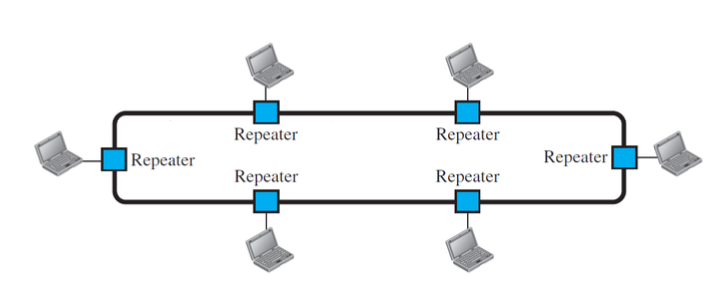
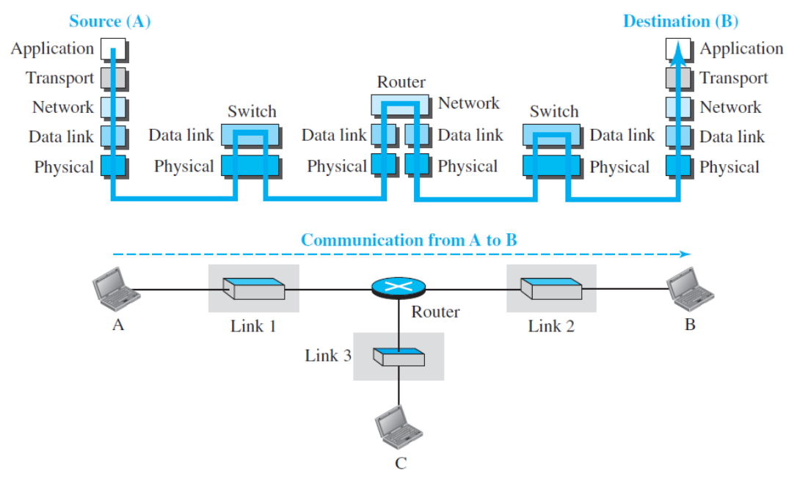

# Learning Outcomes

- Explain what is a data communication system is and what are its components
- Explain networks, their criteria, their topologies, their types
- Explain what is the Internet, its accessing methods, and its standards
- Explain the concept of protocol layering in network design
- Explain two network models
  - TCP/IP protocol suite
  - OSI Model

# Data Communication

- Terminology
- `Communication`: Exchange of information
- `Telecommunication`: communication at distance
  - telephony, telegraphy, television
- `Data`: **raw facts** or information presented in a form is agreed upon by sender and receiver
  - text, numbers, images, audio, video
- `Data Communications`: the exchange of data between two devices
  - via **transmission medium**
- `Data Communication System`:a network of hardward and software that enables the exchange of data between devices over various transmission mediums

## Types of `Medium`

- **electric conductive material** for a wired communication
- **Digital communication** is the electronic transmission of information
  - data, text, audio, video
  - fiber optic(light)
  - using digital signals over communication channels
  - digital communication messages should be represented and transmitted as **bits**
- **Analog communication** involves the transmission of information using continuous signals
  - amplitude, frequency, or phase
  - air or space (radio waves, electromagnetic waves)
  - ex. medium of language - air

## Effectivess of Data Communications

- `Delivery`: correct destination
- `Accuracy`
- `Timeliness`: timely manner
- `Jitter`: uneven delay of audio or video packets

## The Benefits of Data Communication

- Real-time data and information sharing and analysis
- Cost saving
- Enhanced connectivity
- Expanded social engagement

# Data Communication

- `Message` is the information(data) to be commniated
  - text, numbers, pictures, audio, video
- `Sender` is the device that sends the data message
  - computer, workstation, telephone handset, video camera,
  - all digital communication messages should be represented and transmitted as **bits**
- `Receiver` is the device that recieves the message
  - computer, workstation, telephone handset, video, tv...
- `Transmission Medium` is the physical path by which a message travels from sender to receiver
  - twisted-pari wire, coaxial cable, fiber-optic cable, air
- `Protocol` is a set of rule that govern data communications
  - represents an agreement between the communicating devices

## Data Flow (Modes of Communication)

1. `Simplex`
   - unidirectional communication
   - tv
2. `Half-duplex`
   - two-directional communication
   - **one at a time**
   - walkie talkie
3. `Full-duplex`
   - two-directional communication
   - **simultaneously**
   - phone

# Networks

- Terminology
  - `Network` is a system or structure composed of interconnected **nodes** or **entities** using some **links**
  - `Nodes` are individual entities or points within a network
  - `Edges` are links or components, represent the relationships or interactions between nodes in a network

## Computer Networks

- `Network`: the **interconnection** of a set of devices capable of communication
- `Device` or `Nodes`:
  - **Host** (end system): a large computer, desktop, laptop, workstation, phone
  - connecting/networking/communication device: router, switch, modem, etc
- Connection between devices (edges): wired or wireless

## Computer Networks Criteria

- Performance: mainly. mesured in terms of **throughput** and **delay**
- Reliability: accuracy of delivery, failure rate, recovery time from failure, network's robustness
- Security: protecting data from unauthorized access/damage and implementing policies and procedures for recovery from branches and data losses

## Networks - Connection Types

1. `Point-to-point`
   - dedicated link between two devices
   - capacity of the link is **reserved** for transmission between two devices
     - wire, microwave, satellite links, changing tv channels with remote control
2. `Multipoint`
   - +2 devices share a single link
   - capacity of the link is **shared**
     - **spatially shared**: several devices can use the link simultaneously
     - **timeshared**: users must take turns

## Topologies

- The topology of a network
  - geometric representation of the relationship of all the links and linking devices(nodes) to one another
- Four basic network topologies
  - `Mesh`, `Star`, `Bus`, `Ring`

### Mesh Topology

- Every device has a **dedicated point-to-point link to every other device**
- Advantages
  - each connection can carry its own data load due to dedicated links
  - robustness
  - privacy and security
  - easy of fault identification
  - easy of fault isolation
- Disadvantages
  - difficult installation and reconnection
  - wiring can be greater than the available space
  - expensive
    > _n_ devices needs $n*(n-1)/2 = C(n,2)$

### Star Topology

- Each device has a **dedicated point-to-point link** only to a **central controller&(hub)**
- Advantages
  - less expensive than mesh
  - ease of installation
  - ease of reconfiguration
  - less cabling
  - robustness
  - easy fault identification
  - easy fault isolation
- Disadvantages
  - the dependency of the whole topology one single point
  - more cabling is required compare with bus and ring
    > _n_ device in the network, _n_ cable links

### Bus Topology

- **Multipoint**
  - one long cable as a backbone to link all devices in a network
- Drop lines and taps to connect nodes to the cable
- Tap has limits
  - number of taps and distance between taps
- Advantages
  - ease of intallation
  - less cabling tha mesh and star
- Disadvantages
  - difficult reconnection and adding new devices
  - difficult fault isolation
    > _n_ devices in the network, 1 backbone line and _n_ drop lines

### Ring Topology

- Each device has a **dedicated point-to-point** connection with only two devices on either side of it
- A **repeater** for each device
- Advantages
  - ease of installation and reconfiguration
  - ease of fault isolation
- Disadvantages
  -unidirectional traffic: a break in the ring can disable thew hole network

## Network Types

1. `LAN` (Local Area Network)
   

   - privately owned
   - conencts some hosts in a single office, building, campus
   - size limit
   - each host in a LAN has a `unique identifier`
   - called **WLAN** if wireless

2. `WAN` (Wide Area Network)
   - wider geographical span
   - interconnects network devices
     - switches, router, modems
   - created and run by communication companies and leased by an organization
   - WAN Types
     - `point-to-point WAN`: connecting two devices
     - `switched WAN`: 2+ devices, **backbone of global communication**

# Internet

- `internet`: 2+ networks communicate with each other
- `Internet`: the most notable internet, composed of thousands of interconnected networks

## Internetwork

- When +2 networks are connected, they make an `internetwork`
  - e.g., different branches of same organization

## History of the Internet

## How Internet Works in Simple Words

## The Internet

- Image explanation:

  - ISPs : provider network + backbones
  - international IPSs: backbones
  - national or regional ISPs: provider network

- **End Systmes** or **Hosts**
  - sit at the edge of theinternet
  - hosts run application programs(browser)
- **Access network**
  - the network that physically connects and ened system to the first router(edge router) on a path from the end system to any other distant end system
- **Core network**
  - the entwork of routers, link-layer switches, and link that interconnects the Internet's end systems

## Accessing the Internet

- Telephone networks
  - dial-up service
  - DSL(digital subscriber line) service
    - the line can be used simultaneously for both voice and data communication
- cable networks
- wireless networks
- direct connection to the Internet

## Internet Standards

- a throughly tested specification and a formalized regulation
- created and publisehd by **IETF**(internet engineering task force)
- we need standards for interoperability between systems/products

### RFC

- **Request for Comment**
  - a series of documnets used to define standards, protocols, procedures, technologies
  - assigned a number
  - technical and detailed
  - IETF is the organization reponsible for the develoment and publication

# Protocol Layering in Network Design

- `Protocol` defines what is communicated, how and when

  - provides accurate and timely transfer of information between different devices on a network
  - defines the **format** and the **order of messages** exchanged between two+ communicating entities as well as **the actions** taken on the transmission and/or recipt of a message or other event

- `Protocol Layering` enables us to divide the complex task of communication into multiple and smaller and simpler tasks
  - service model of a layer in protocol layering is the services that a layer offers to the layer above
  - each layer provides its service by performing certain actions within that layer and by using the services of the layer directly below it

## Principles of Protocol Layering

1. Each layer must be able to perform **two opposite tasks** for having bidirectional communication
2. The two objects under each layer at both sites should be identical

## Protocol Layering Benefits

1. Separating the services from the implementation
2. Simpler and less expensive intermediate systems
3. Modularity
   - independent layers -> black box
   - ease of maintenance and updating system
   - layer's service implementation is transparent to rest of system

# Two Network Models

- `Protocol Suite` (Stack) : a set of protocols organized in different layers (designed to work together)

## TCP/IP Protocol Suite

- Transmission Control Protocol/Internet Protocol
  - used in the interent today (the interent protocol stack)
  - five-layer hierachical model

### Physical Link Layer(1) in TCP/IP Protocol Suite

- Carries individual **bits** across the lnk (from one noe to the next)
- Bits received in a fram from data-link layer are **transformed to signals** and sent through the transmission medium
  - physical layer protocols are **link dependent**
  - they rely on the actual transmission medium of the link

### Data Link Layer(2) in TCP/IP Protocol Suite

- Data transfer between neighbouring network elements/devices (w/o errors)

  - PDU name: **frame**
  - protocols: Ethernet, Wifi(802.11)...

- What's `PDU`?
  - Protocol Data Unit
  - A unit of data that is passed between different layers of a protocol stack

### Network Layer(3) in TCP/IP Protocol Suite

- a.k.a IP layer
- Routing of datagrams from source to destination
- **host-to-host** communication
- PDU name: **datagram/packet**
- protocols: IP(internet protocol), ICMP, DHCP, ARP, routing protocols...

### Transport Layer(4) in TCP/IP Protocol Suite

- **Logical communication** between application processing running on different hosts
- **process-to-process delivery** of the entire message
- PDU name: **segment/user datagram**
- protocols: TCP, UDP, SCTP
- Transport layer protocols almost implemented in **software** in the end systems

### Application Layer(5) in TCP/IP Protocol Suite

- Communication for a network application takes place between end systems at the application layer
- PDU name: **message**
- protocols: IMAP, SMTP, HTTP, FTP, Telnet, DNS...
- Application layer protocols are implemented in **software** in the end systems

## Communication through an interent

## Encapsulation and Decapsulation

- Encapsulation: data(L5) -> Segment(L4) -> Packet(L3) -> Frame(L2) -> Bits(L1)
- Decapsulation: reverse

## Addressing in TCP/IP Protocols

- Application layer: `Names` (website URLs, email address...)
- Transport layer: `Port numbers` (idenfitying a process on a host)
- Network layer: `Logical address` (an IP address uniquely defines a host on the Internet)
- Data-link layer: `Link-layer address`: defining a specific host or router in a network(LAN or WAN)
- Physical layer: n/a

### Extra

- Physical layer and data-link layer
  - implemented in a NIC(network interface card)
  - they handle **communication over a specific link**
- Hosts(end systems) implement all 5 layers of the TCP/IP protocol stack

# OSI Model

- Open Systems Interconnection Model
  - an ISO standard for network communications
  - 7 layers framework
  - application/presentation/session = the Application layer in TCP/IP suite
  - `Presentation layer` allows communicating applications to the interprer the meaing of data exchanged
    - data compression, data encryption
  - `Session layer`
    - session management, synchronization of data exchange...

# Summary

- Data communications are the transfer of data form one device to another via some form of transmission medium
- Five components of a data communication system
- Networks - topology, types
- Internet
- Protocol layering and its benefits
- Network models - TCP/IP protocol suite and OSI model
