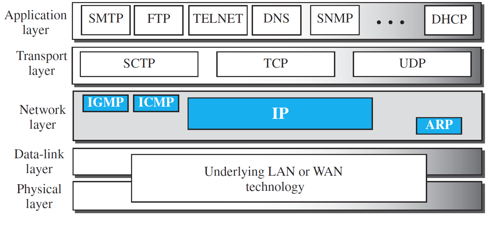
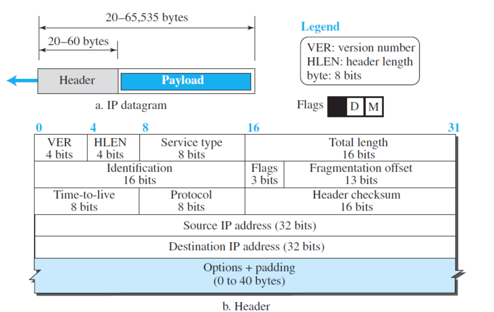
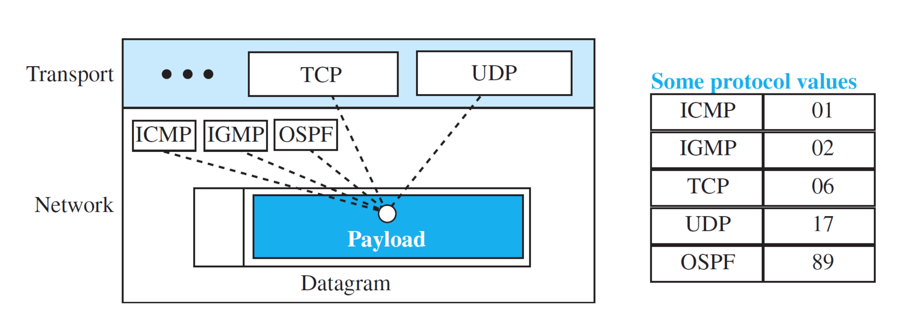
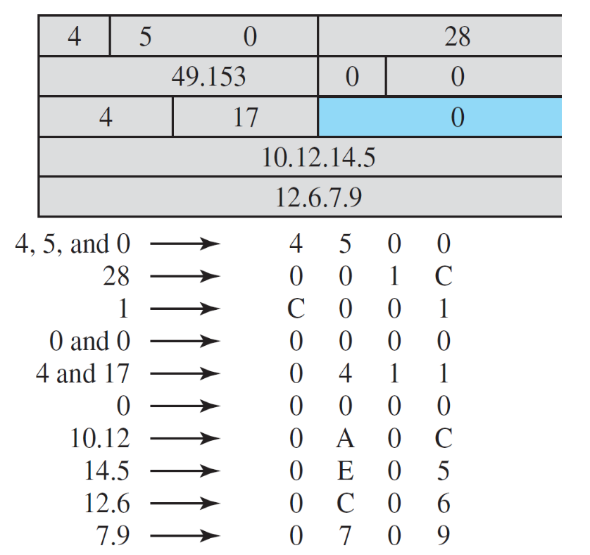
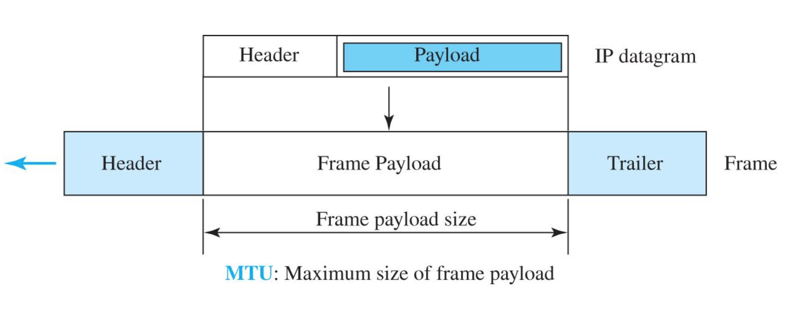
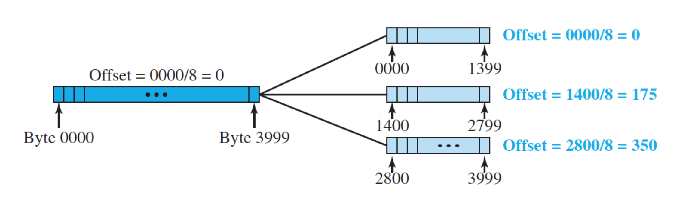
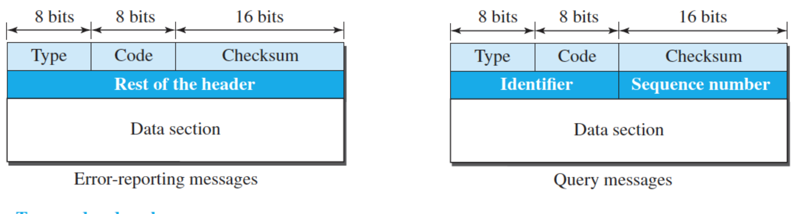
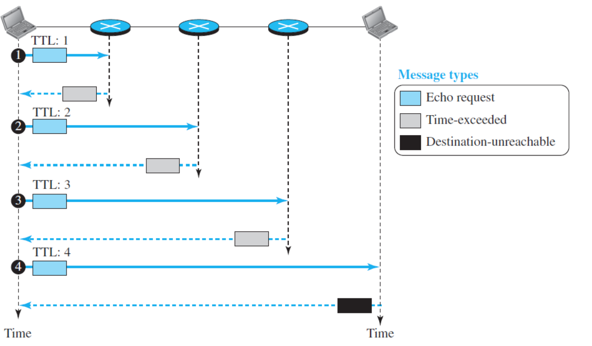
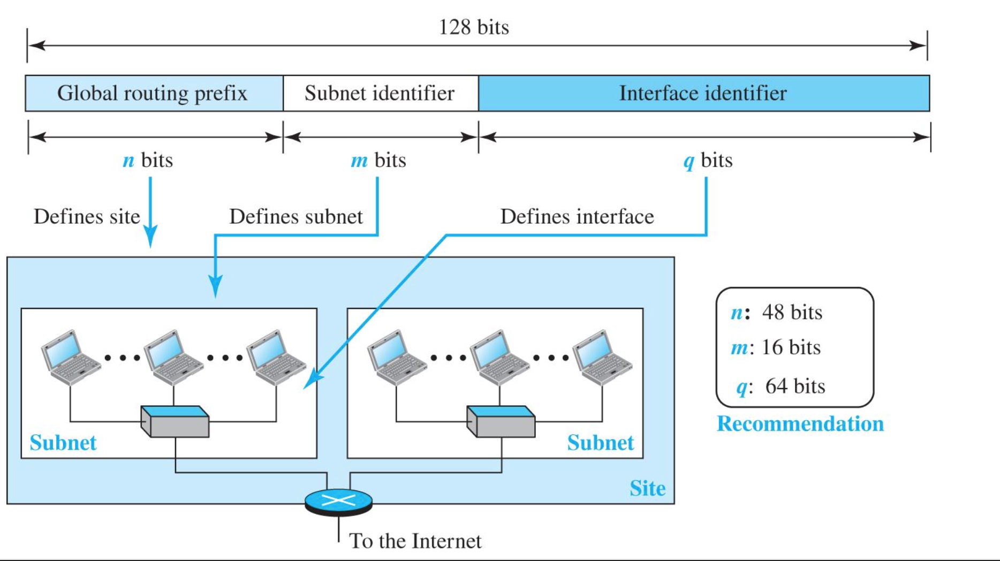

# Learning Outcomes
- Explain how the IPv4 Protocol works
- Explain the behaviour and purpose of ICMP protocol
- Explain how the IPv6 protocol works and what are its benefits

## Introduction - Network-Layer Protocols
- **IPv4** (main protocol)
    - The main network-layer protocol is reponsible for **packetizing, forwarding** and **delivery of a packet** at the network layer
- Three auxilary protocols:
    1. **Address Resolution Protocol** (ARP)
        - mapping network-layer addresses (IP addresses) to link-layer addresses
    2. **Internet Control Messae Protocl version 4** (ICMPv4)
        - helps IPv4 to handle some errors that my occur in the network-layer delivery
    3. **Internet Group Management Protocol** (IGMP) 
        - helps IPv4 in multicasting

- **IPv6** opr IPng(IP new generation)
    - 128-bit address(16 bytes)
    - The address space size = 2128
    - overcome the small size of the address space in IPv4

# IPv4
- An **unreliable** datagram protocol which provides **best-effort delivery service**
    - IPv4 packets can be corrupted, be lost, arrive out of order, or be delayed, and may create congestion for the network
    - IPv4 must be paried with a reliable transport-layer portocol such as **TSP** for the reliability
- Packets used by the IP are **datagrams**
    - a **variable-length packet** consisting of two parts: *header* + *payload*(data)
    - header: essential information for routing and delivery
    - payload: packet coming from other protocols that uses service of IP
- A connectionless protocol uses the **datagram approach**

## Best-Effort and Connection-Less
- Connection-less protoco
    - each datagram is handled *indetpendently*
    - each datagram can follow *a different route to the destination* -> datagrams could arrive out of order
- Datagram relies on *higher-level protocol* (like TCP) to overcome those problems

## IPv4 Datagram Foramt
- Header: 20-60 bytes
- Payload + Header = 20-65,535 bytes
- VER: version number
- HLEN: total number of header in 4-byte words
- Total length: total length of IP adatagram in bytes (including both header and payload)
- Time-to-live: controls the max number of hops(routers) visited by the datagram
- Protocol: its packets are carried in the payload
- Header checksum: error handling for IP header for efficiency, checksum recalculated at each router (they change)

#### IPv4 Datagram Protocol Field

##### Example

An IPv4 packet has arrived with the first 8 bits as (01000010)2. 
The receiver discards the packet. Why?
> There is an error in this packet. The packet has been corrupted in transmission
> version: The four leftmost bits (0100)2 = 4 = correct
> (0010)2 = 2 
> header length:  2 * 4 = 8 -> Invalid (the minimum number of bytes in the header must be `20`)

16-bit checksum to be included in the checksum field of the IP header. We should consider each 16-bits (2-byte) section of the header. For simplicity of representation, we use Hex format. Each hex letter/number represents 4 bits. Assume the following represents the IP header fields of an IP packet. Calculate the checksum
'
Wrapped Sum = Sum mod FFFF
Checksum = FFFF - Wrapped Sum
'

> Sum = 1344E16
> Wrapped sum = 344F16
> Checksum = CBB016

## Datagram and Frame
- A datagram can travel through different *networks*
- Each router decapsulates the IP datagram from the frame it receives, processes it, and then **encapsulates** it in another frame
    - the format and size of the received frame depend on the protocol used by the physical network through which the frame has just traveled
    - ex. if a router connects a LAN to WAN, it receives a frame in the LAN format and sends a frame in the WAN foramt

### Frame Formats
- Each link-layer protocoal has **its own frame format**
    - one of the features of each format is the **max size of the payload** that can be encapsulated
- When a datagram is encapsulated in frame, the total size of the datagram must be **less than this minimum size**

### MTU
- **Maximum Transfer/Transmission Unit**
    - the maximum amount of data that a link-layer frame can carry
    - 1500 bytes for LAN
    - problem: each of the links along the route between sender and destination can use different link-layer protocols, and each of these protocols can have *different MTUs*
- To make the IP protocol independent of the physical network
    - make the max length of the IP datagram = 65,535 bytes

### Fragmentation
- *Dividing the datagram* allows it to pass through different networks with different MTUs
    - when fragmented, **each fragment has its own header** with most of fields repeated, but *some has been changed*
        - a datagram may be fragmented several times before it reaches the final destination
        - if passes through a network with an even small MTU
    - a datagram can be fragmented by the *source host* or any *router* in the path
        - the reassembly of the datagra is done only by the *destination host*
    - the *payload* of a datagram is fragmented
        - most parts of the header must be copied by all fragments
        - some options are exception

- The host or router that fragments a dagatra must change the values of 
    - **flags**
    - **fragmentation offset**
    - **total length**
    - The value of the checksum must be recalculated regardless of fragmentation

- 3 fields in the IP datagram header to help the destination host to **perfrom the reassembly** tasks
    - **identification number** (16-bit field)
        -same for the original and all rragments of a datagram
    - **flags** (3-bit field)
        - leftmost bit is not used
        - second bit(*M*, *do not fragment bit*)
            - if 1, the datagram must be fragmented even if it cannot pass it
        - third bit(*D*, *more fragment bit*)
            - helps in determining the last fragment 
            - 0 for the last(or only) fragment
    - **fragmentation offset**
        - specify where the fragments fits(position) within the original IP datagram
        - in the original datagram, offset ofthe data are measured in *units of 8 bytes*

#### Fragmentation Example

- length of the offset field is only 13 bits long, cannot represent a sequence of bytes greater than 213
- forces hosts or routers that fragmnet datagrams to choose the size of each fragment so that the first byte number is divisible by 8

- The value of the offset field is always relative to the original datagram

# ICMPv4
- A **network-layer protocol**(RFC792)
- used by hosts and routers to communicate network-layer information to each other
- ICMP messages are the first encapsulated IP datagrams before going to the lower layer 
    - the value of the **protocol field** in the IP datagram is **set to 1** to indicate that **the IP payload is an ICMP message**
- **no error-reporting** or **no error-correcting**
- Possible errors during trasmission
    - router discards a datagram bc it cannot find a route
    - time-to-live field = 0
    - final destination discards the received fragments of a datagram becasue it has not received all fragments

- lack of host/management queries mechanism
    - a host needs to determind if a router or another host is alive
    - a network manager needs information from another host or router

=> Internet Control Message Protocol version 4 has been designed to compsensate for the mentioned deficiencies

## ICMPv4 Messages
1) Error-reporting messages
    - report problems that router or a host(destination) may encounter when it **process an IP packet**
    - ICMP uses the source IP address to send the error message to the source(originator) of the datagram

2) Query messages
    - these messages occur in paris(request, reply) and they help a host or a network manager get specific information from a router or another host
    - used to **probe** or **test** liveliness of hosts or routers on the Interent, find the **one-way** or **round-trip time** for an IP datagram between two devices, or even find out whether the clocks in two devices are synchronized

- An ICMP message has an **8-byte header** and a **variable-size data section**
    - in the header: *type* and *code*

    - Error-reporting messages (type: value)
        03: Destination unreachable (codes 0 to 15)
        04: Source quench (only code 0)
        05: Redirection (codes 0 to 3)
        11: Time exceeded (codes 0 and 1)
        12: Parameter problem (codes 0 and 1)
    - Query messages
        08 and 00: Echo request and reply (only code 0)
        13 and 14: Timestamp request and reply (only code 0)

### ICMPv4 Destination Unreachable
- The most widely used error message (type 3)
    When we use the HTTP protocol to access a web but the server is down

### ICMPv4 Time Exceeded Message with Code 0
- **Time-to-live** (TTL)field in the IP datagram is to prevent a datagram from being aimeless circulated on the interent
- TTL = 0 -> the datagram is dropped by the visiting router and a time exceeded message, type 11 with code 0

### ICMPv4 Echo Request and Reply
- Query message
- echo request(type 8) echo reply(type 0) pari of messages are used by a host or a router to test the liveliness of another host or router
- if the latter is alive, it responds with an echo reply message
- application: **debugging tools** (ping, traceroute)

## ICMP and Debugging Tools on the Internet
- **Ping**
    - based on two query messages(echo request/reply)
    - to find if a host is alive and responding
- **Traceroute/Tracert**
    - traceroute(UNIX/Linum), tracert(windows)
    - two error-reporting messages
        - *time-exceeded* and *destination-unreachable*
        - *echo-request query message*
        - to trace the path of packet from a source to the destination
        - it can find the IP addresses of all the routers that are visitied along the path
        - usually set to check for the max 30 hops(routers) to be visitied
    

# IPv6 
## IPv6 Address Space
➢  How much larger IPv6 address length is comparing to IPv4 address length?
➢  How much larger IPv6 address space is comparing to IPv4 address space?
➢  Imagine the world population becomes 234 (more than 16 billion), and we
just assign 1/64 (almost 2%) of the IPv6 addresses to them.
    - How many unique numbers can be assigned to each person?
## IPv6 Representation
- **Two notations**:
    - Binary used when the addresses are stored in a computer
    - Colon hexadecimal
        - Abbreviation
            - Leading zeros of a section are removed 
                000F -> F or 0074 -> 74
            - 3210 cannot be abbreviated
            - If consecutive sections include only zeros (zero compression), replace them with a double colon (*allowed only once per address*)
                - FDEC:0:0:0:0:BBFF:0:FFFF → FDEC::BBFF:0:FFFF
## IPv6 Address Types
1) **Unicast address**: single interface(host or router)
2) **Anycast address**: 
    - group of computers that all share a single address
    - the packet is devlivered to the most reachable one
3) **Multicast address**:
    - group of computers that all share a single address
    - each member receives a copy of the packet
    - broadcasting is considered as a special case of multicasting

### IPv6 Global Unicast Address
- global routing prefix: used by global routers on the internet to route the packet to its destination site
- subnet identifier: a subneet in an organization
- interface identifier: allows a relationship between IP address and link-layer address

## Transition to IPv6 - Strategies
- **Dual stack**
- **Tunneling**
- **Header translation**
- strategies can be implemented during transition period

### Dual Stack
- A host must run IPv4 and IPv6 simultaneously until all the Interent uses IPv6
- how to indicate which version to use
    - answer:

### Tunneling
- The packet must pass through a region that uses IPv4 and two computers using IPv6 
- IPv6 packet is encapsulated in an IPv4 packet when it enters the region, and it leaves its capsule when it exits the region
- The value of protocol field in the header of IPv4 packet is set to 41

### Header Transition
- The sender wants to use IPv6 but the receiver does not understand IPv6
- The header of the IPv6 packet is converted to an IPv4 header

# Summary
- **IPv4** is an unreliable connectionless protocol responsible for source-to-destination delivery
- packets in IP layer(network layer) are alled **datagrams** (each datagram includes a header and a payload)
- the IPv4 datagrams can be fragmented in the path to the destination
- **Checksum** is calculated only for the header of datagram
- **ICMP** messages are encapsulated in IP datagrams
- Two types ICMP messages: **error-reporting** and **query**
- **IPv6** addresses as a long-term solution for IPv4 address depletion problem
- IPv6 global unicast address has three parts: site, subnet and an interface
- Strategies to transition to IPv6: **dual stack**, **tunneling** and **header transition**