# Learning Outcomes

- Explain what is unicast routing
- Explain distance-ventor and link-sate routing algorithms
- Explain intra-domain routing protocols, including RIP and OSPF
- Explain what are the transport-layer services
- Explain how UDP works and what are its characteristics

# Introduction

- The goal of the network layer is to deliver a datagram from its source to its detination or destinations
- **Unicast routing**
  - if a datagram is destinated for only **one** destination
  - one-to-one delivery
- **Multicast routing**
  - if the diagram is destined for several destinations
  - one-to-many delivery
- **Routing Protocols**
  - routing is possible if a router has a **forwarding table** to forward a packet to teh appro pritate next node on tis way to the fianl destination(s)
    - To create the forwarding routing table: the Interent needs **routing protocols**
    - the protocol will be active all the time in the background and update the forwarding tables
- Transport layer
  - provides services to the application layer
  - receives services from the network layer
  - **end-to-end** local vehicle for transferring data from one point to another in the internet
    - from source to destination

# Unicast Routing

- **Only the routers need forwarding tables**
  - The source host needs to no forwarding table
    - it delivers its packet to the default router in its local network
  - The destination host needs no forwarding table
    - it receives the packet from its default router in its local network
- Routing a packet from its source to its destination means
  - routing the packet from a _source router_ to a _destinatino router_
    - source router: the default router of the source host
    - destination router: the router connected to the destination network

## An Interent as a Weighted Graph

- An interent can be modeled a _weighted graph_ to find the best rotue

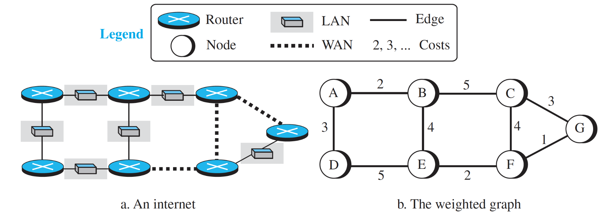

### Least-Cost Routing

- To interpret the **best route** from the source router to the destination router
  - find the **least cost path** between two
    - A least-cost tree is a tree with the source router as the root that spans the whole graph (visits all other nodes)
      - in which the path between the root and any other node is the shortest
      - we can have only one shortest-path tree for each node
- _N_ routers in an interent, there are _(N - 1)_ least-cost paths from each router to any other router
  > $N*(N - 1)$ least cost paths for the whole internet

#### Least-Cost Trees

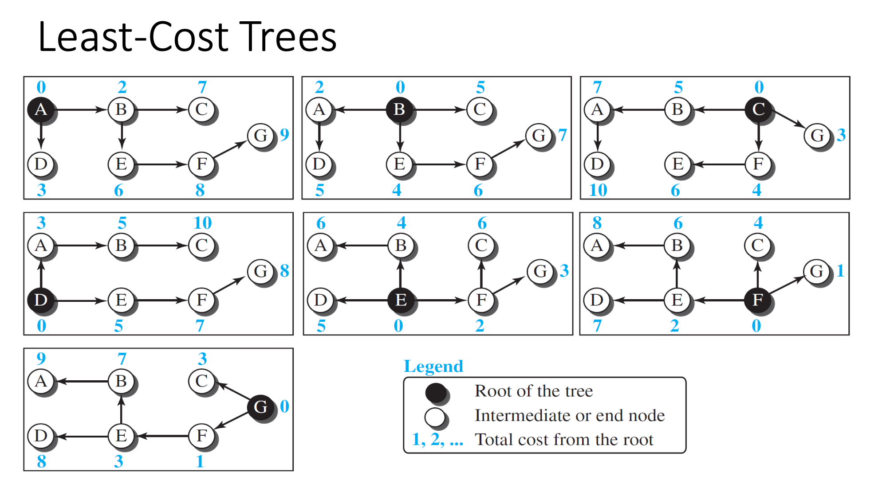

## Routing Algorithms

- Two main routing algorithms:
  - Distance Vector (DV) Routing Algorithm
  - Link-State (LS) Routing Algorithm

### Distance Vector Routing Algorithm

- DV
- A **decentralized** routing algorithm
- Distance vector is _one-dimension array_ that contains the _cost_ of the least-cost path to all other nodes
- A distance vector doesn't give the path to the destinations
  - it gives **only the elast costs to the destinations**
  - distance vector can be changed to a _forwarding table_
    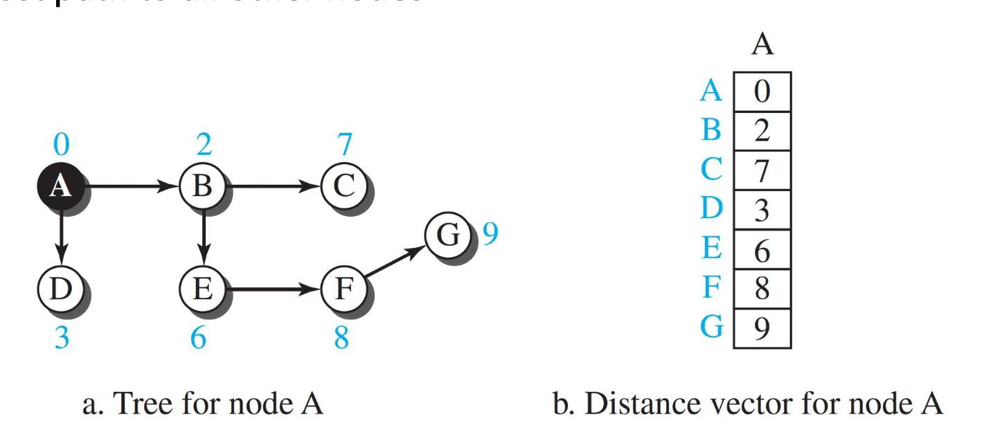

#### First Distance Vectors for the Nodes

- The algorithm is run by each node **independently** and **asynchronously**
- Each node in an internet, when it is **booted**
  - creates a very rudimentary distance vector with the minimum informatino the node can obtain from tis neighborhood
    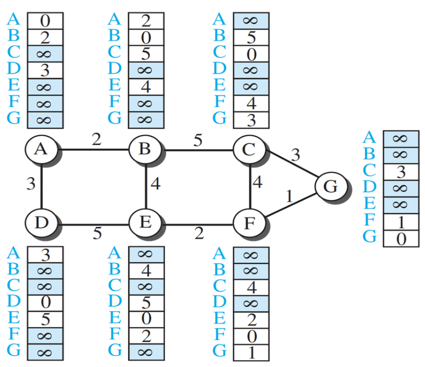

##### Updating Distance Vectors

- **Exchanging information**: the nodes in the internet need to help each other by it to improve the first vectors
- After each node created its vector the nodes **send a copy of the vector** to all its immediate neighbours
- After a node receives a distance vector from a neighbour, it updates its distance vector using the **Bellman-Ford equation**
- Exchanging vectors eventually stablizies the systema nd allows all nodes to find the ultimate least cost between themselves and any other nodes

###### Bellman-Ford Equation

- Is used to find the least cost (shortest distance)
  - between a source node `x` and a destination node `y` thorugh some intermediary nodes (`a`, `b`, `c`...)
  - given the costs between the source and the intermediary nodes and the least costs between the intermediary nodes and the destination
- _Dij_ is the shortest distance and _cij_ is the cost between nodes _i_ and _j_
  > _Dij_ = min{(_cxa_ + _Day_), (_cxb_ + _Dby_), (_cxc_ + _Dcy_),...}
- In distance-vector routing, normally we want to update an existing least cost with a least cost through an intermediatry node, such as _z_ if the latter is shorter
  - shortest distance between x and y = cost between x and z + shortest distance between z and y
    > Dxy = min{Dxy, (cxz + Dzy)}

###### Graphical Idea Behind the Bellman-Ford Equation

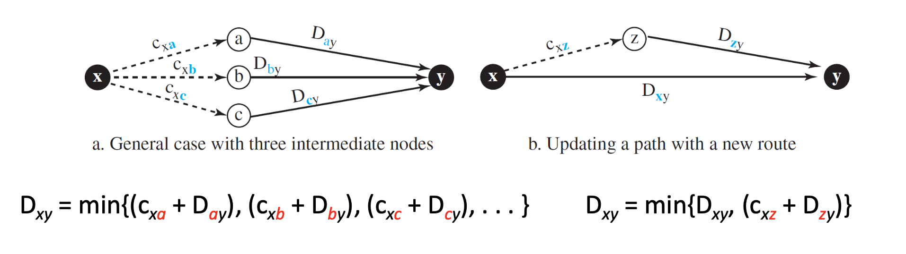

###### Updating Distance Vectors

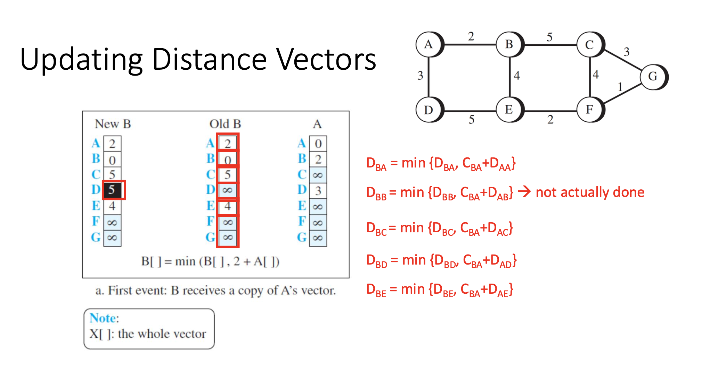

### Link-State Routing ALgorithm

- LS
- A **centralized** routing algorithm that computes the least-cost path between a source and destinatino using complete, global knowledge about the network
- LS and DV goals are to create at least-cost trees and forwarding tables for each node
- in LS the cost associated with **an edge** defines the state of the link
- Links with lower costs are preferred to links with **higher costs**
  - if the cost of a link is infinity, it means that the link does not exit or has been broken
- To create a least-cost tree with this method, each node needs to have complete _map_ of the network

#### Link-State Database

- The network topology and all link costs are known
  - they are available as **input to the LS algorithm**
- **Link-State Database** (LSDB): the collectin of states for all links
  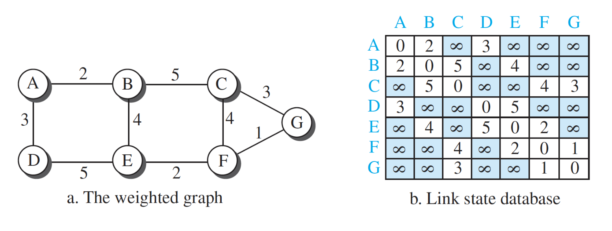
- There is _only one LSBD_ for the whole interent
  - each node needs to have a **duplicate**of it to be abel to create the least-cost tree
- The LSDB can be represented as a **two-dimension array** (matrix)
  - the value of each cell defines the cost of the corresponding link

##### **Flooding** (broadcasting)

- A process that each node contains info about the whole internet
- Each node can send some greeting messages to all its immediate neighbours to collec the identity of the node and the cost of the link
- **Link State Packet** (LSP)
  - the combination of identity of node + cost of the link
  - if the received LSP is newer or the first one received, the node idscards the old LSP and keeps the received one
  - then it _sends a copy of it out of each interface_ except the one from which teh packet arrived

##### Building LSDB using LSPs

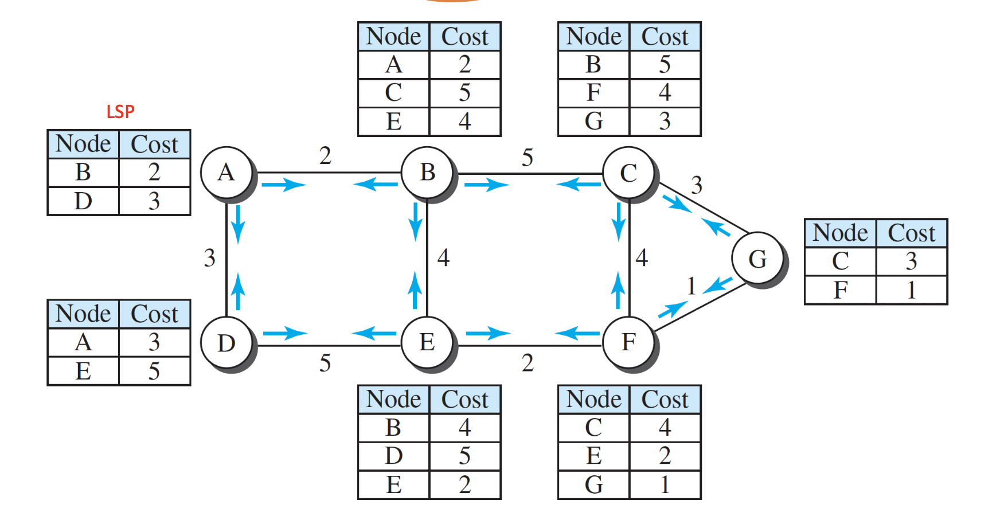

##### Formation of Least-Cost Trees

- **Dijkstra Algorithm**: a least-cost tree for itself using the shared LSDB, each node runs the Dijkstra Algorithm
  - solution to the single-source shortest path problem in graph theory
  - works on both directed and undirected graphs
  - all edges must have nonnegative weights
  - **approach**: greedy
  - **input**: weighted graph `G={E,V}` and source vertex `v ∈ V`, such that all edge weights are nonnegative
  - **output**: lengths of shortest paths from a given source vertex `v ∈ V`to all other vertices

###### Running Dijkstra Algorithm at nodt A

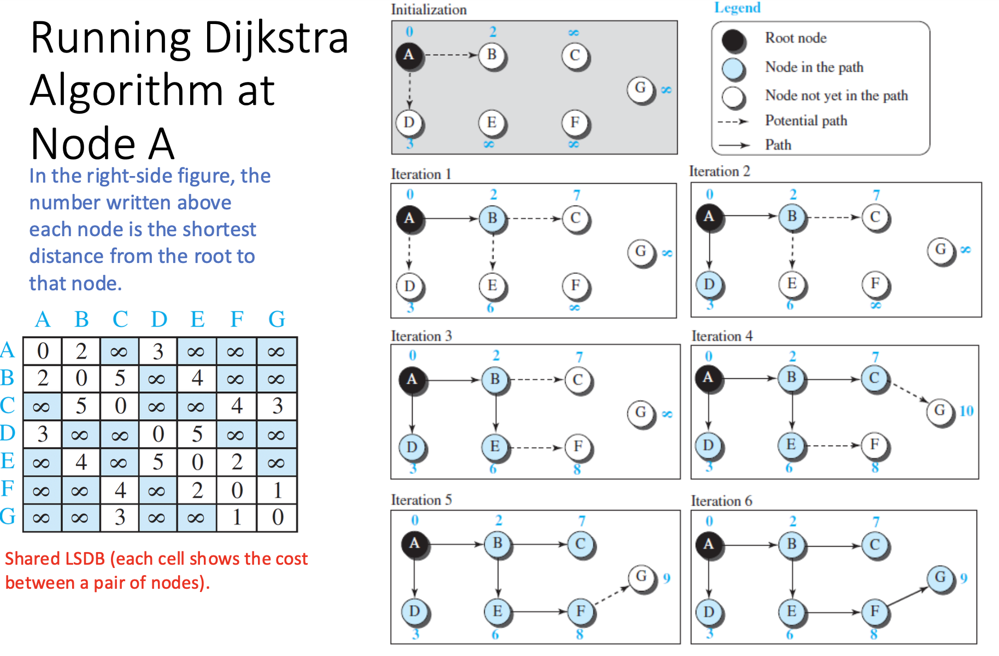

1. B is added to the tree. C and E are
   its neighbors and not in the tree.
   The distances for C and E are
   updated.
2. D is added to the tree. E is its
   neighbor and not in the tree. No
   change in the cost of E.
3. E is added to the tree. F is its
   neighbor and not in the tree. The
   distance for F is updated.
4. C is added to the tree. G is its
   neighbor and not in the tree. The
   distance for G is updated.
5. F is added to the tree. G is its
   neighbor and not in the tree. The
   distance for G is updated.
6. G is added to the tree.

# Unicast Routing Protocols

- Two common protocols used in the Interenet:
  1. **Routing Informatino Protocol** (RIP) - based on the _distance-vector algorithm_
  2. **Open Shortest Path First** (OSPF) - based on the _link-state algorithm_

## Internet Structure and Routing Protocols

- A routing protocol on the Internet implements one of the routing algorithms
- algorithm ≠ protocol
- Although a routing protocol is based on a routing algorithm, it needs to defined the following as well:
  - its domain of peration
  - the messages exchanged
  - communication between routers
  - interaction with protocols in other domains
- The structure of today's Internet
  - a mini-backbone structure run by different private corporations

### Internet Structure

- **Interent Service provider** (ISP) provides services but at different levels
  - backbone, provider network, customer network
    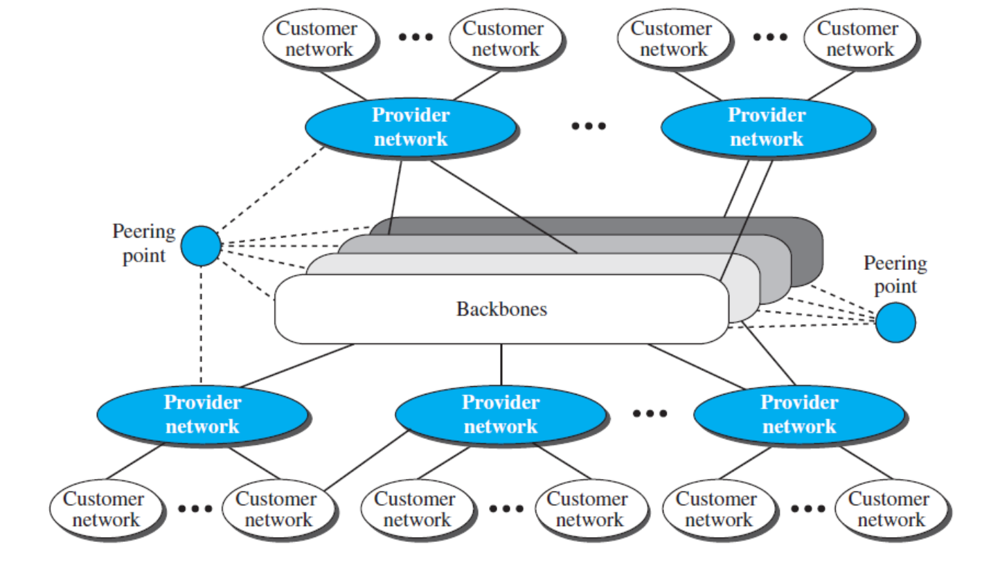

## Routing on the Internet

- Cannot be done using a single protocol

  1. **scalability problem**

  - the size of the forwarding tables becomes huge, searching for a destination in a forwarding table becomes time-consuming, and updating creates a huge amount of traffic

  2. **administrative issue**

  - the organization must be able to use as many subnets and routers as it needs (from any manufacturer)
  - the organization may run a specific routing algorithm etc

### Hierarchial Routing

- **Hierarchial routing** means considering each ISP as an **autonomous system**(AS)
  - Each autonomous system is operated by a _single large organization_
    - Internet service provider(ISP), a large enterprise tech company, a university...
    - Each AS can run a routing protocol that meets its needs
    - but the global Internet runs a global protocl to glue all ASs together
  - Interior Gateway Protocol(**IGP**) = intra-as routing protocol
    - the routing protocol run in each AS
    - two common domain routing protocols
      - **RIP** and **OSPF**
        - Enhanced Interior Gateway Routing Protocol (**EIGRP**): advanced distance-vector routing protocol developed by Cisco as a proprietary solution exclusively for Cisco routers
  - Exterior Gateway Protocol(**EGP**) = inter-as routing protocol
    - the global routing protocol
      - Border Gateway Protocol(**BGP**)
        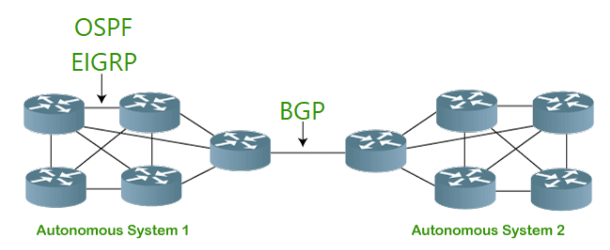

# Routing Information Protocol (RIP)

- Based on the **distance-vector routing algorithm**
- RIP routers advertise the cost of reaching diffrent networks intead of reaching other nodes in a theoretical graph
- Normally used in _small ASs_
- The cost is defined as _the number of hops_
  - the number of hops is the number of networks (subnets) a packet needs to travel through from the source router to the final destination host

## Hop Counts in RIP

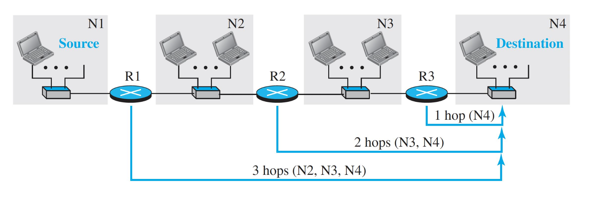

- The maximum cost of path can be **15**, which means **16** is considered as infinity (no connnection)
- RIP can be used only in ASs in which the diameter of the AS is not more than 15 hops

### Rip and Forwarding Tables

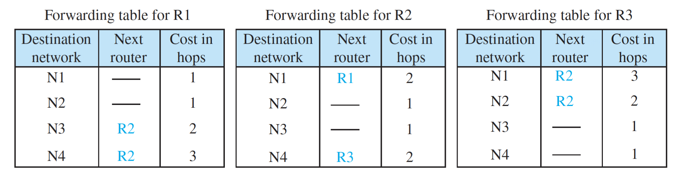
The third column is not needed for forwarding the packet, but it is needed for updating
the forwarding table when there is a change in the route
Although a forwarding table in RIP defines only the next router in the second column,
it gives the information about the whole least-cost tree. For example, R1 defines that
the next router for the path to N4 is R2; R2 defines that the next router to N4 is R3; R3
defines that there is no next router for this path. The tree is then R1 → R2 → R3 →N4

#### Example of an Autonomous System Using RIP

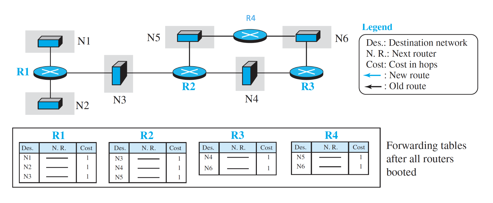
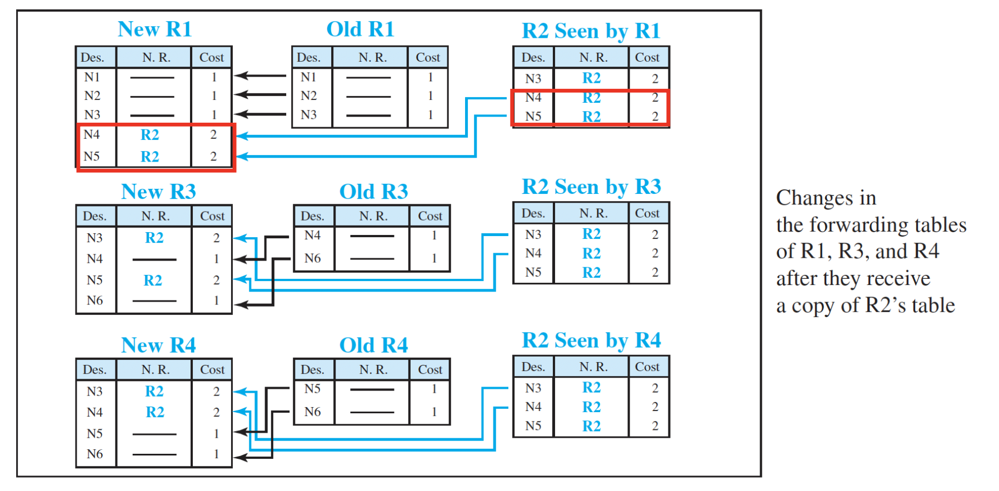
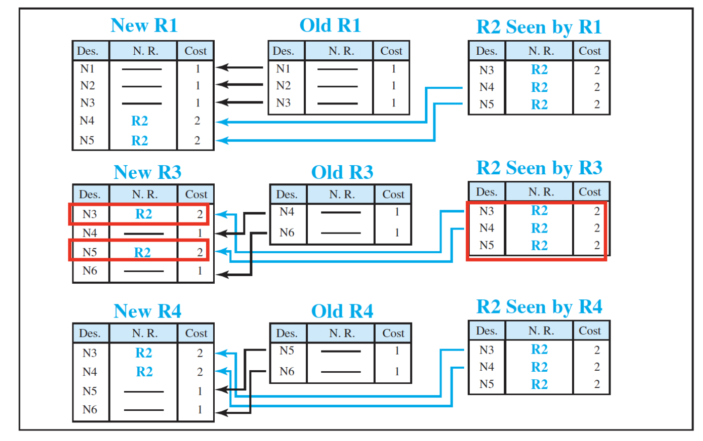
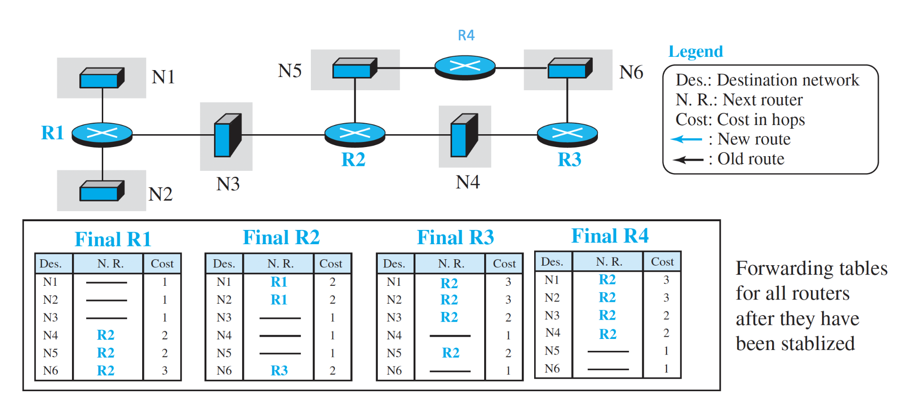

# Open Shortest Path First (OSPF)

- Based on the **link-state routing algorithm**
- The cost of reaching a destination from the host is calculated from he source router to the destinatino network
- Each link (network) can be assigned a **weight** based on the throughput, round-trip time, reliability and so on
  - OSPF doesn't manadate a policy for how link weights are set (the job of the network administrator)
  - Administration can also decide to use the hop count as the cost
- Used to handle routing in **small or large ASs**
- A router broadcasts routing information to all other routers in the AS, not just to its neighbouring routers
  - periodically (at least once every 30 mins)
  - when there is a change in a link's state (eg. a change in cost or a change in up/down status)
- The OSPF protocol also checks that links are operational (via a HELLO message that is sent to an attached neighbour)

## OSPF - Forwarding Tables

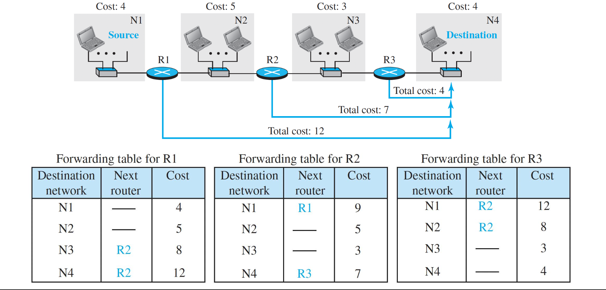

## OSPF - Areas

- **Areas** : the AS is divided into small sections
  - each area acts as a small independent domain for flooding LSPs (LSPackets)
  - reason to use areas
    - OSPF requires that all routers flood the whole AS with thier LSPs to create the global LSDB
      - it may create a huge volume of traffic in a larg AS

# Transport Layer

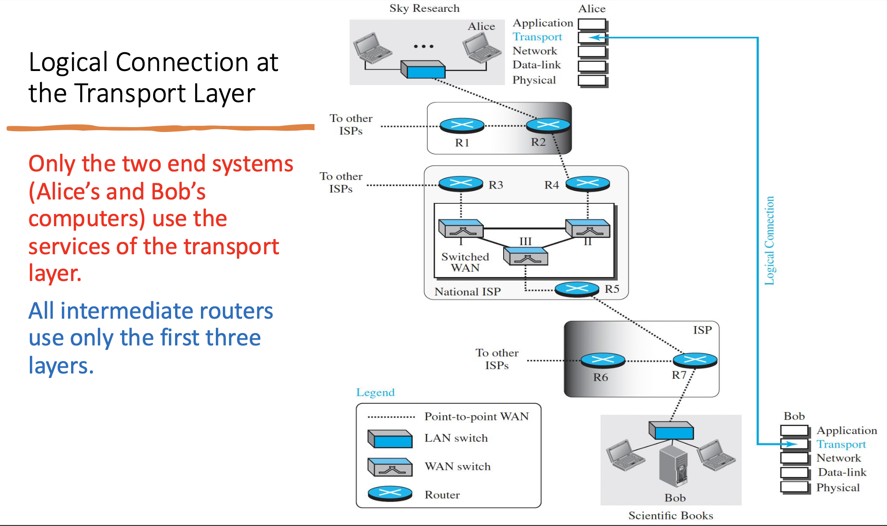

- The network layer is reponsible for communication at the computer level (host-to-host communication)
  - can devlier the message only to the destination computer
  - incomplete delivery
  - **transportation-layer** takes over **(process-to-process communication)**
- A transportation-layer protocol is reponsible for delivery of the message to the appropriate process

## Transport Layer Services

- Provide **process-to-process** communication
- Addressing: **Port numbrs**
- Encapsulation and decapsulation
- Multiplexing and demutiplexing
- **Flow control**
- **Error control**

### Press-to-Process Communication

- **Process**: an application-layer entity (_running program_) that uses the services of the transprotation layer
- **Client/server paradigm**: one way to achive process-to-process communication - process-to-process communication between two application layers - local host (client) - remote host(server)
  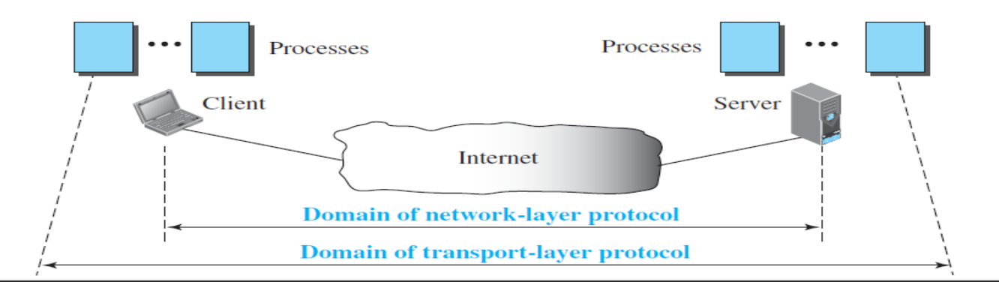

### Addressing: Port Numbers

- **Port numbers** provide end-to-end addresses at the transport layer
  - integers between 0 and 65,535 (16 bits)
  - _ephemeral/temporary port number_ port number of the client program (>1023)
  - _well-known port number_: port number of server process (<= 1023)
- To communication, must define
  - **local host**, **remote host**: defined using IP address
  - **local process**, **remote process**: defined using port numbers
- A Daytime server: responds to requests from a Daytime client with the current date and time.
  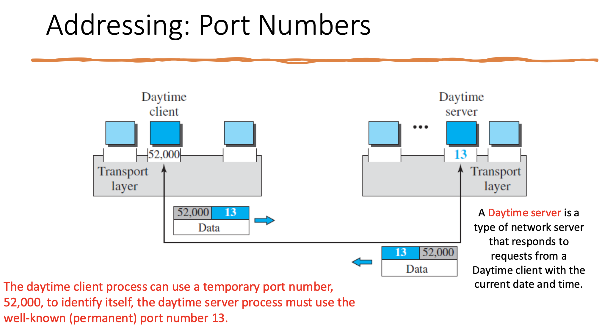

### IP Address vs Port Numbers

- The destination IP address: defines the host among the different hosts in the world
- The port number: defines one of the processes on this particular host

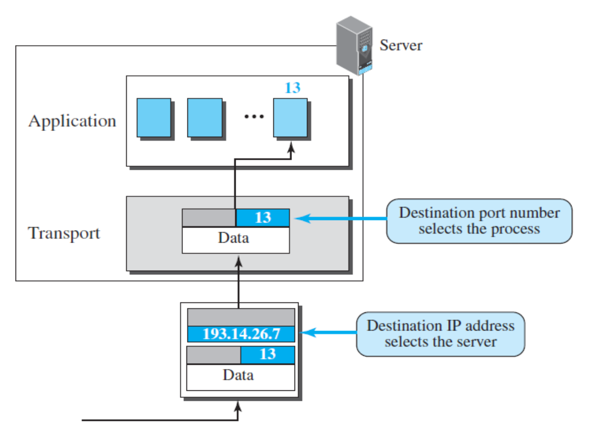

#### Socket Address

> Socket address = IP address + Port number

- The client socket address defines the client process uniquely
- the server socket address defines the server process uniquely
- **A pair of socket addresses** are needed to use the service of the transport layer (client socket address + server socekt address)

### Flow Control

- Main goal: **avoid overwhelming the receiver**
- **Buffer**: a set of memory locations that can hold packets at the sender and receiver
- Flow control can be implemented by using two buffers
  - one at the sending transport layer
  - the other one at the reeceiving transport layer
    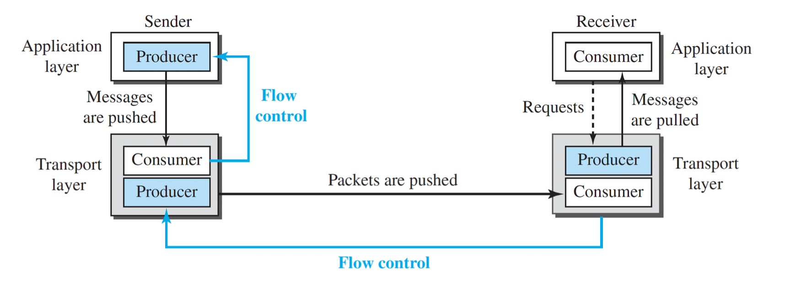

### Error Control

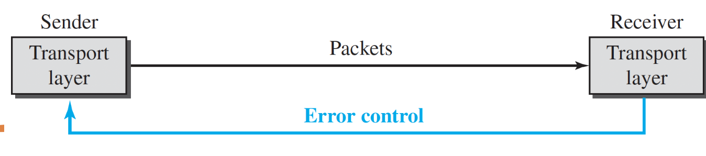

- The underlying network layer (IP) is unreliable
  - need to make the transport layer reliable if the application requires reliability
- Error control involes **only** the sending and receiving transport layers
- The receiving transportation layer manages error control
  - by informing the sending transport layer about the problems
- Error control at the transport layer is reponsible for handling
  - corrupted packets, duplicated packets, lost/discarded packets and out-of-order packets
- Error control can be achived by using **sequence numbers** and **acknowlegements**

#### Error Control - Sequence Numbers

- Sequence Nubmers are assigned to packets (a field in the header of the transportation layer packet)
  - _m_ = the size of sequence number field in bits
    > sequence numbers = modulo 2m
- Why it needed
  - error control requires that the **sending** transport layer know _which packet is to be sent_
    - corrupted or lost packets: the receiving transport layer can somehow inform the sending transport layer to resend that packet using the sequence number
  - error control requires that the **receiving** transport layer knows _which packet is a duplicate_ or _which packet has arrived out of order_
    - duplicated: if two received packets have the same sequence number
    - out-of-order packets: by observing gaps in the sequence numbers
- Duplicated packets and corrupted packets can be silently **discarded by the receiver**
- Out-of-order packets can be either discarded or stored until the missing one arrives
  - when discarded, packets to be treated as lost packets by the sender

#### Error Control - Acknowledgement

- The _receiver_ side can send an **acknowledgement** (ACK) for each or a collection of packets that have arrived safe and sound
- The *sende*r can deteect
  - lost packets if it uses a timer
  - if an ACK does not arrive before the timer expires the sender resends the packet

#### Combination of Flow and Error Control - Sliding Window Linear Format

- Flow conrol and error control can be combined if we use two numbered buffers
  - one at the sender, the other one at the receiver
    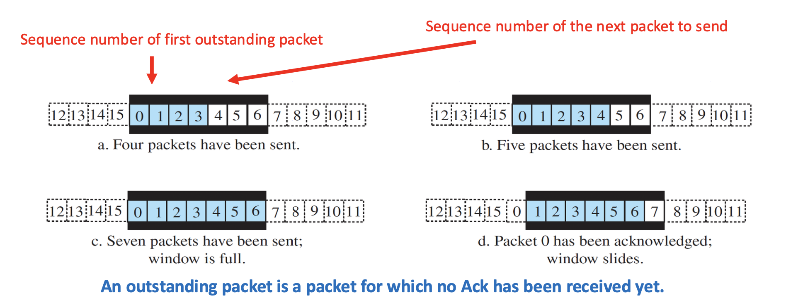

### Congestion Control

- Goal: **avoid overwhelming the network**
- Congestion in a network may occur
  - if the laod on the network is greater than the capacity of the network
    - load(i.e., the number of packets sent to the network)
    - capacity(i.e., the number of packets a network can handle)
- Congestion happens in any system that involves waiting
  - routers and switches have queues/buffers that hold the packets _before and after_ processing
  - if a router cannot process the packets at the smae rate at which they arrive, the queues become overloaded, and congestino occurs
- Congestion control refers to the mechanisms and techniques that control the congestion and keep the load below the capacity

## Connectionless and Connection-oriented Protocols

- A transport-layer protocol can provide two types of services
  - connectionless service: nodependency between packets
  - connection-oriented service: dependency between packets

### Connectionless Service

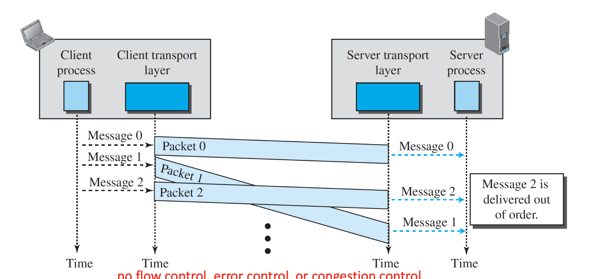

### Connection-Oriented Service

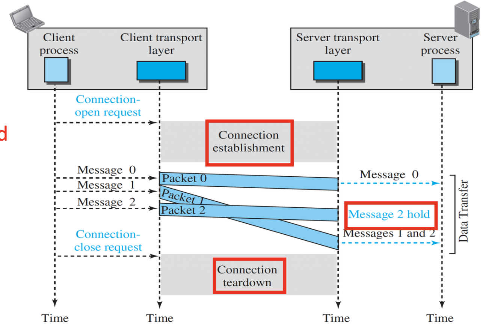

- We can implement flow control, error control, congestion control in a connection-oriented protocol

# UDP

- An **unreliable connectionless** transport-layer protocol
- Provides simplicity and efficiency:
  - minimum overhead
  - good for sending small messages
  - faster than TCP
- **User datagrams** = UPD packets
- The protocol field in the header of IP packet (network-layer packet) holds the value of **17** if the payload(data) belongs to UDP
- If a process uses UPD, its data must be small enough to fit into one user dataram
  - no stream of data can be sent
- **No flow control** -> no window mechanism
- **No congeston control**
- **No error control** (except for the optional checksum field in the header)

## UDP - Format of a User Datagram

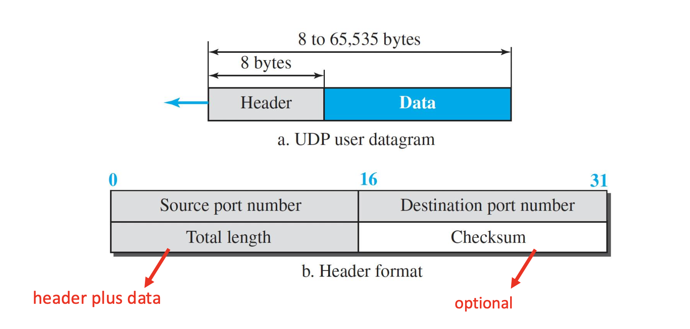

## UDP - A Connectionless Transport-Layer Protocol

- Each user datagram sent by UDP is an **independent** datagram
- NO relationship between the different user datagrams
- The user datagrams are not numbered (**no sequence number**)
- NO connection establishment and NO connection termination
  - each user datagram can travel on a different path

## UDP - Applications

- UDP is suitable for process that needs simple request-reponse communication
  - a bit concern for flow and error control
  - E.G., DNS
- Management process
- Online games
- Interactive real-time applications (Zoon, Teams)
- Some applications use both TCP and UDP

# Summary

- Although there are several routes that a packet can travel frame the source to the destination, the question is which should be the _best_
  - best: **cost and policy** imposed on the trip and routing algorithms help to find the best route
- Two most common used _intra-domain routing protocols_:
  - **RIP**: base on the distance-vector (DV) routing algorithm
  - **OSPF**: based on link-state (LS) routing algorithms
- **BGP**: an inter-domain routing protocol
- **Process-to-process** communication at transport layer
- **Port numbers** are needed to define processes
- Flow/error/congestion control
- Connectionless vs connection-oriented service
- **UDP**
  - user datagram (UDP packets)
  - unreliable, connectionless, little overhead, fast delivery, no flow/error control, half-duplex
