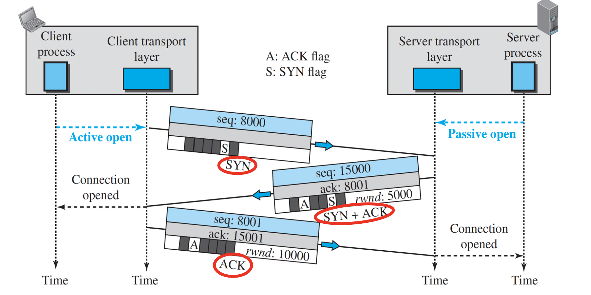
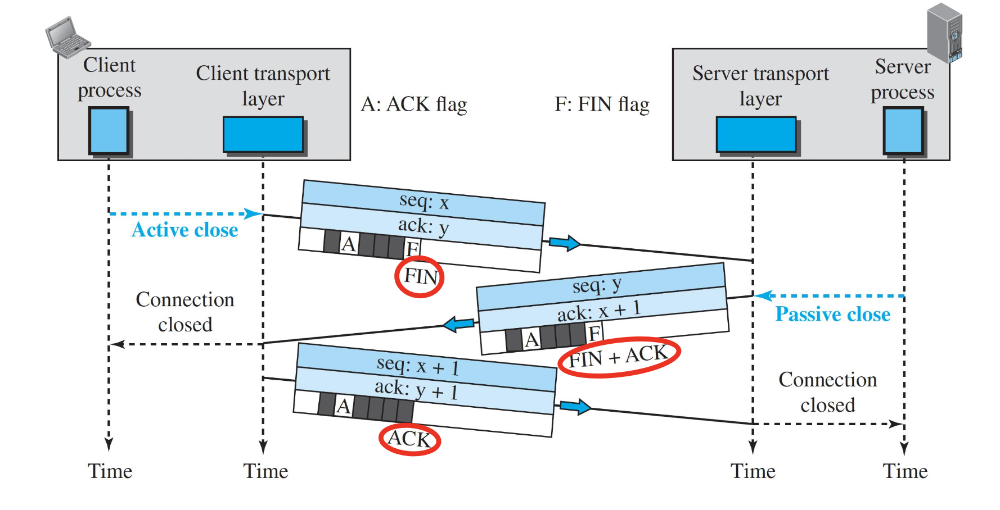
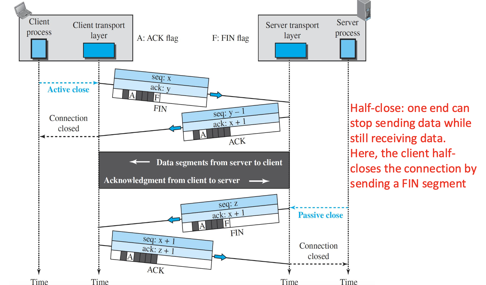
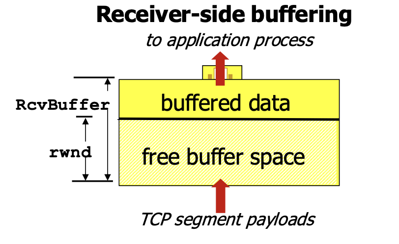
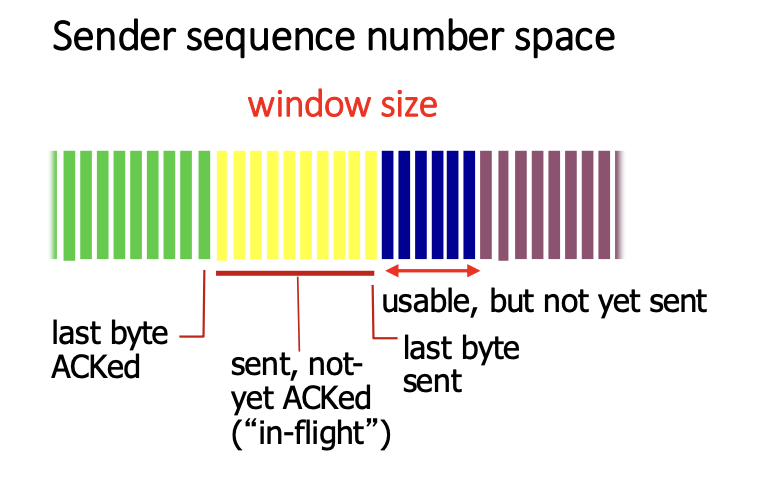

# Learning Outcomes

- Explain how TCP works and what are its characteristics

# TCP

- **Transmission Control Protocol**: connection-oriented protocol
  - TCP explicity defines
    - connectoin establishment
    - data transwer
    - connection teardown phases
      - a _single logic pathway_ is used for the segments belonging to the same message
  - _logical connection_
  - **full-duplex service**: data is exchanged in both directions

## TCP - A Stream-Oriented Protocol

- **Stream-oriented protocol** (byte-oriented)
  - the sending process delivers data as a **stream of bytes** and the receiving process obtains data as a stream of bytes
    

## TCP - Sending and Receiving Buffers

- Buffers are necessary for _flow control_ and _error control_
  

## TCP - Numbering System

- TCP numbers all data byts (octets) that are transmitted in a connection
- Number is **independent** in each direction
- Byte numbering is used for **flow and error control**
- Two filed in the segment header -_sequence number_ -_acknowledgement number_
  - each of above fields refer to a **byte number** and not a segment nubmer

## TCP Segment - Format

- HLEN(4bits) : the lengh of the TCP header in words (4-bytes)
- Control bits(flags)
  - URG: urgent pointer is valid (generally not used)
  - ACK: ACK# is valid
  - PSH: request for push(generally not used)
  - RST, SYN, FIN: connection establishment/set up and teardown
- Window size (16 bits): Receiving window size(rwnd) and determined by the receiver
  - used for flow control
  - the num of bytes the receiver is willing to accept
- Checksum(16 bits): _MANDATORY_ in TCP
- Options and padding (up to 40 bytes): optional field
  -e.g., when a sender and reeceiver negotiate the maximum segment size (MSS)

## TCP - Connection

### Extablishment

- TCP connection-establishment procedure is often referred to as a **three-way handshake**

### Termination

- Either of the two parties involved in exchanging data(client or server) can close the connection, although it is _usually initiated by the clinet_

- Most implementations today allow two options for connection termination
  1. three-way handshaking
  2. four-way handshaking with a half-close option

#### Termination - Half-Close

- Half-close
  - one end can stop sending data while still receiving data.
  - client half-closes the connection by sending a FIN segment

## TCP - Flow Control

- Flow control is used to **eliminate the possibility** of the sender **overflowing** the receiver's buffer
- TCP sender(at each side of the connection) maintains a variable called **receive window (rwnd)**
  - gives the sender an idea of how much free buffer space is available at the receiver
  - initial value of rwnd = receive buffer size(RcvBuffer)
- **Receiver** advertisees free buffer space by including _rwnd_ valud in TCP header of receiver-to-sender segments -_RcvBuffer_ size sent via socekt options (defaul = 4096 bytes)
  -auto-adjust RcvBuffer by operating systems
  

- **Sender** limits amount of unACKed data(in-flight or outstanding) to reecever's _rwnd_ value
  > LastByteSent - LastByteAcked <= rwnd
  - guarantees receive buffer will not overflow
- At **receiver**
  > rwnd = RcvBuffer - [LastByteRcvd - LastByteRead]

- TCP is a **reliable transport-layer protocol**
  - in order, without error, without any part lost/duplicated
  - an application program that delivers a stream data to TCP
    - relies on TCP deliver the entire stream to the application program on the other end

## TCP Error Control Mechanisms

1. Acknowledgements
2. Sequence Numbers
3. Retransmission
4. Checksum

### Acknowledgements

### Sequence Numbers

#### Sequence Numbers Example

### Retransmission

#### Retransmission after Time-out

#### Retransmission after Three Duplicate ACKs

### Checksum

### Some TCP Error Control Scenarios

#### Retransmission after Time-out: Lost Segment

#### Retransmission after Time-out: Lost Acknowledgement

#### Fast Retransmission (Three Duplicate ACKs)

#### Cumultive Acknowledgement: Lost Acknowledgement

## TCP Congestion

- Congestion in Network

### TCP Congestion Detection

### TCP COngestion Control: Window-based

#### TCP Congeestion Window

#### TCP Congestion Window and MSS

### TCP Congestion Control Algorithms

#### Slow Start: Exponential Increase

#### Congestion Avoidance

##### Tahoe TCP - Example

#### Fast Recovery

##### TCP Congestion Control vs. TCP Flow Control

# Summary
