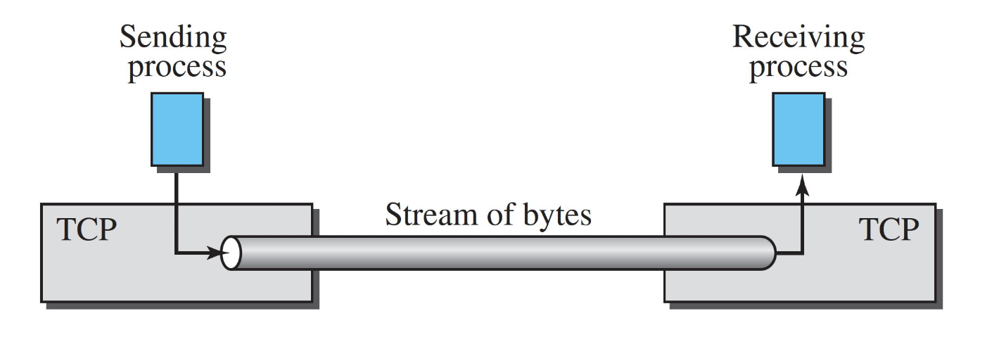
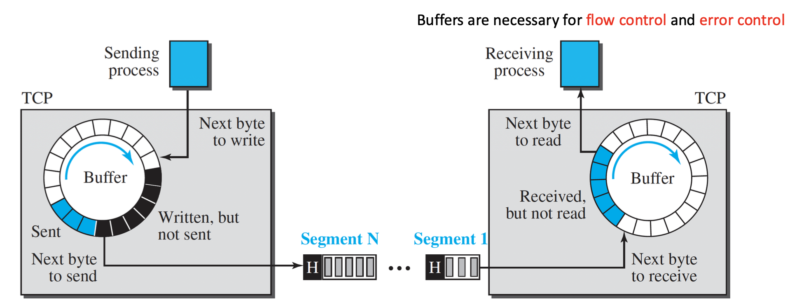
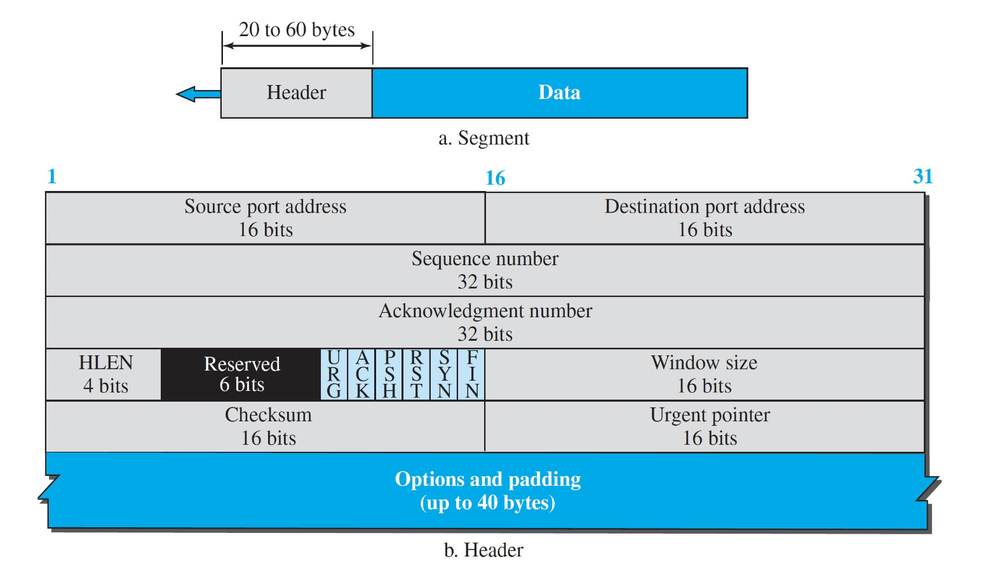

# Learning Outcomes

- Explain how TCP works and what are its characteristics

# TCP

- **Transmission Control Protocol**: connection-oriented protocol
  - TCP explicity defines
    - connectoin establishment
    - data transwer
    - connection teardown phases
      - a _single logic pathway_ is used for the segments belonging to the same message
  - _logical connection_
  - **full-duplex service**: data is exchanged in both directions

## TCP - A Stream-Oriented Protocol

- **Stream-oriented protocol** (byte-oriented)
  - the sending process delivers data as a **stream of bytes** and the receiving process obtains data as a stream of bytes
    

## TCP - Sending and Receiving Buffers

- Buffers are necessary for _flow control_ and _error control_
  

## TCP - Numbering System

- TCP numbers all data byts (octets) that are transmitted in a connection
- Number is **independent** in each direction
- Byte numbering is used for **flow and error control**
- Two filed in the segment header -_sequence number_ -_acknowledgement number_
  - each of above fields refer to a **byte number** and not a segment nubmer

## TCP Segment - Format

## TCP - Connection

### Extablishment

### Termination

## TCP - Flow Control

## TCP Error Control Mechanisms

### Acknowledgements

### Sequence Numbers

#### Sequence Numbers Example

### Retransmission

#### Retransmission after Time-out

#### Retransmission after Three Duplicate ACKs

### Checksum

### Some TCP Error Control Scenarios

#### Retransmission after Time-out: Lost Segment

#### Retransmission after Time-out: Lost Acknowledgement

#### Fast Retransmission (Three Duplicate ACKs)

#### Cumultive Acknowledgement: Lost Acknowledgement

## TCP Congestion

- Congestion in Network

### TCP Congestion Detection

### TCP COngestion Control: Window-based

#### TCP Congeestion Window

#### TCP Congestion Window and MSS

### TCP Congestion Control Algorithms

#### Slow Start: Exponential Increase

#### Congestion Avoidance

##### Tahoe TCP - Example

#### Fast Recovery

##### TCP Congestion Control vs. TCP Flow Control

# Summary
