# Learning Outcomes

- Data, signal and their types
- Characteristics of period analog signals
- Characteristics of digital signs
- Guided Media and unguided Media

# Introduction

- **Physical Layer**
  - moving data in the form of _electromagnetic signals_ across a _transmission medium_
- `Data` must be changed to `signals` for transmission
- Logical communication : transport, network, data-link layer
- Physical communication: physical layer

# Data, Signal, Types

## Data

- **Analog data**
  - continuous information
  - sound (analog wave)
  - Analog signal has many levles of intensity over a period of time
- **Digital data**
  - discrete states information
  - 0,1 in computer memory
  - has a limited number of defined values (0, 1)

## Signal

- **Periodic signal**
  - `cycle`: the completion of one full pattern
  - `period(T)`: the amount of time, a signal needs to complete one full pattern, in seconds
  - sign wave cannot be decomposed into simpler signals
- Nonperiodic(aperiodic)

# Periodic Analog Signals

- Simple: cannot be decomposed into simpler signals
- Composite: multiple sine waves
- Three parameters
  - `Peak amplitude`(A) : value of its hightes intensity (v)
  - `Frequency`(F) : # of completed cycles in 1s
  - `Phase`(∅): position of the waveform relative to time 0 (in degress or radians)

#### Example

- The electronical voltage is periodic with a peak value between 110 to 120v. Frequency is 60Hz.
- The voltage of a battery is constant (1.5V)

## Sine Wave

> $s(t) = A*sin(2*pi*f*t)$ = $A*sin(2*pi*t/T)$

`$s(t)$`: instantenous amplitude

`$A$`: peak amplitude

`$f$`: frequency

`$T$`: period

### Sine Wave - Peak Amplitude

- Volts
- The Absolute value of the signal's highest intensity

### Sine Wave - Frequency

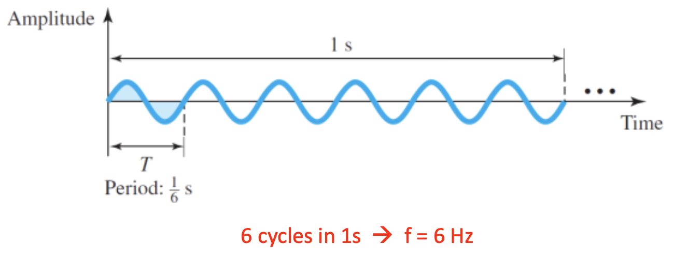

- The number of cycles in 1 second
  > Hertz(Hz) = cycles per second

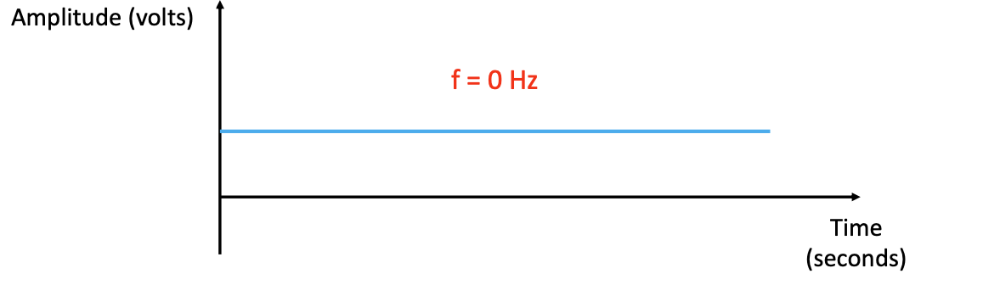

- Frequency is the rate of change with respect to time
  - High frequency: change in a short span of time
  - Low frequency: change over a long span of time
  - 0 frequency: no change
  - infinite frequency: changes instantaneously

#### Units of Period and Freuency

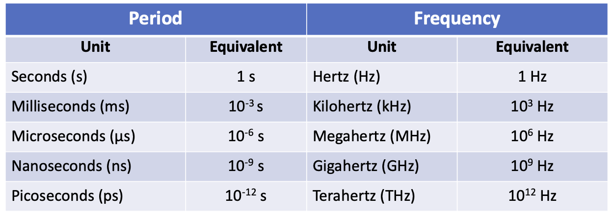

### Frequency vs Period

- `Period` is the inverse of frequency
- `Frequency` is the inverse of period

  > $ f = 1/T$

  > $T = 1/f$

### Sine Wave - Phase Shift

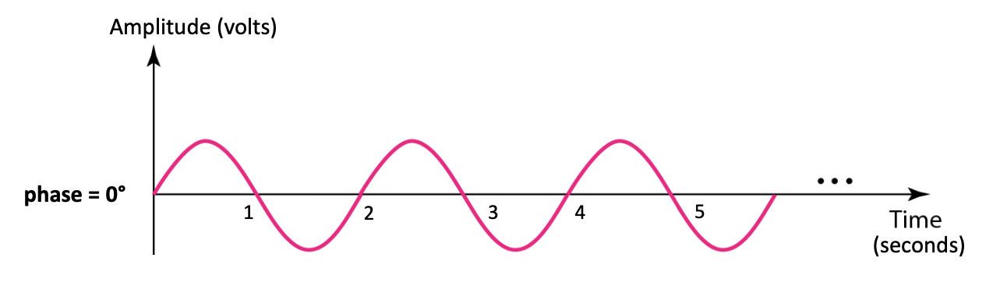

- The position of the waveform relative to time 0 (the status of the first cycle)
- `∅`
- degress or radians

##### Example

- The power we use at home has a frequency of 60Hz. Find the period of this sine wave in millisecons (ms)
  > $T = 1/f = 1/60 = 0.0166s = 16.6ms$
- Whats the frequency in kHz of a sine wave if the period is 200 μs?
  > f = 1/T = 1/(200 \* 10-6) = 1000000/200 = 5000 H = 5 kHz
- Find the peak amplitude, frequency, and period of the following sine waves

  a. $s(t) = 5*sin(20pi * t)$

  > peak: 5v, freq: 10 Hz period: 1/10 = 0.1s

  b. $s(t) = sin(20t)$

  > peak: 1v, freq: 10Hz, period: 10/2pi = 1.60 Hz, Period: T = 1/f = 0.628s

### Sine Wave Shifting

- By replacing `$2pi*f$` with `w` in the sine wave math representation
  > $s(t) = A * sin(w * t)$
  - Phase is zero
  - If we add or subtract a non-zero number `$c$` to/from `$w * t$` then our phase will be non-zero

#### Horizontal Shifting

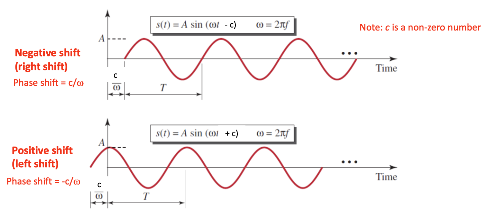

#### More aoubt Phase

- $`360 degree` = 2 * pi rad$
- $`1 degree` = 2 * pi / 360$
- $`1 rad` = 360/(2 * pi)$
- A shift of a complete cycle = a phase shift of `$360 degree$`

##### Example

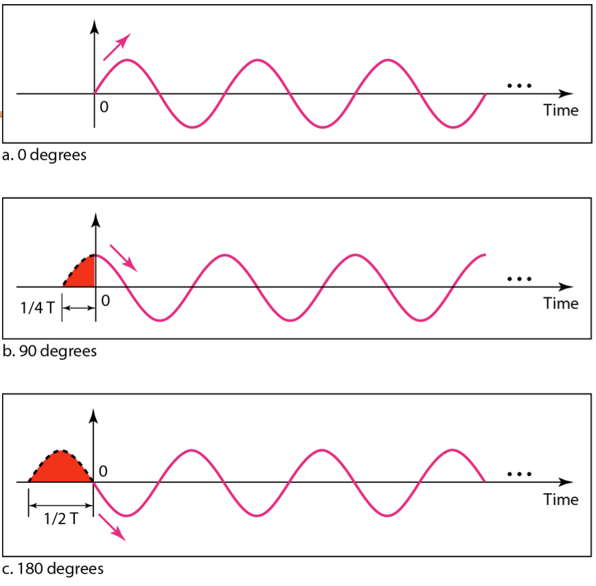

- Three sine waves with the same amplitude and frequency, but different phases

- A sine wave is offset 1/9 cycle with respect to time 0. What is its phase in degress and radians?

  > $∅ = 1/9 \* 360 = 40 degrees $

  > $40 * 2 * pi / 360 rad$

  > $2 * pi / 9 rad = 0.698 rad$

### Sine Wave - Wavelength 𝝀

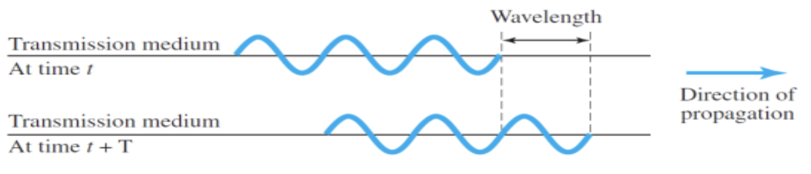

- The distance a simple signal can travel in one period
- The distance that is travelled by a signal in 1 cycle
- Usually used to describe the transmission of light in an optical fiber
- Usually mesaured in micrometres (μm)
- Wavelength binds the `period` of frequency of a simple sine wave to the propagaton speed of the medium
  - The propagation speed of electromagnetic signals depends on the medium and on the frequency of the signal
  - in a vacuum, light is propagated with a speed of 3 \* 108

#### Frequency vs Wavelength

- Frequency of a signal is indepenede of the transmission medium
- Wavelength relies on both `frequency` and `transmission medium`

  > $𝜆 = c / f = c * T$

  > c is propagation speed = 3 \* 108

##### Example

What is the wavelength of red light if it's frequency is 4 \* 1014Hz? Assume the propagation speed is 3 \* 108

> 0.75 \* 10-6 = 0.75 μm

## Time and Frequency Domains

- Time-domain plot
  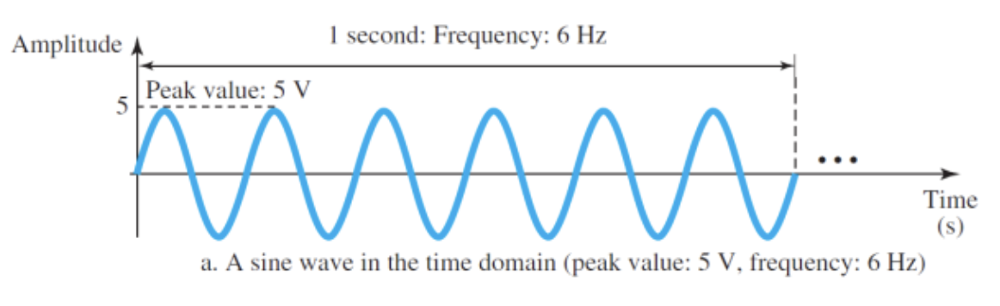

  - changes in signal amplitude `w.r.t` time
  - phase is not explicity shown

- Frequency-domain plot
  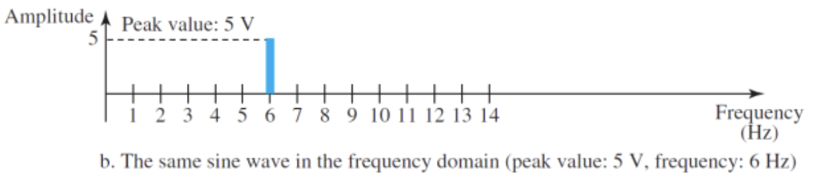
  - relationship between `amplitude` and `frequency`
  - advantage
    - immediately see the values of the frequency and peak amplitude
  - more compact and helpful when dealing with more than one sine wave
  - A complete sine wave in the time domain can be represented by _one single spike_ in the frequency domain

## Composite Signals

- A single-frequency sine wave is not useful in data communication
- Fourier analysis
  - any composite signal is a combination of simple **sine waves** with **different frequencies, peak amplitudes, and phases**

### Composite Periodic Signal

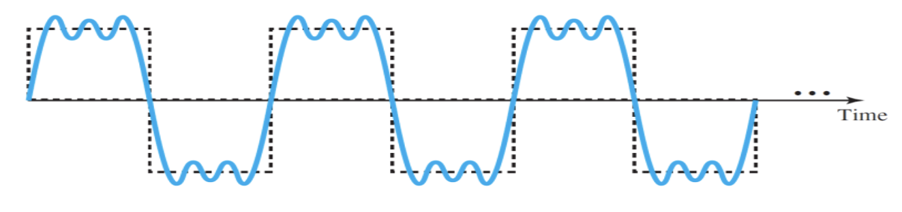

- The composition gives a series of simple sine waves with **discrete frequencies**
  - frequencies with integer values

#### Decomposition of a Composite Periodic Signal

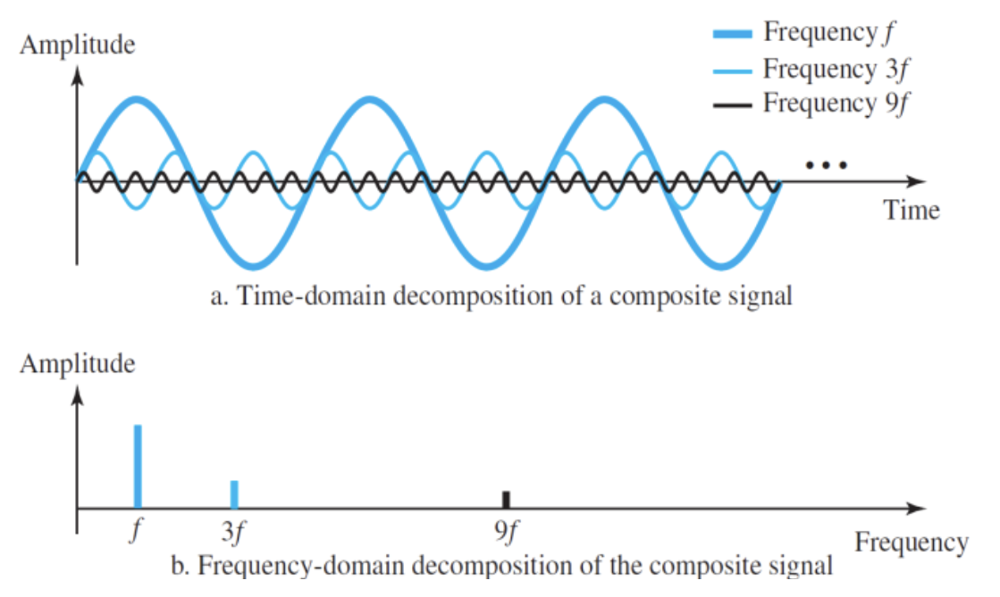

- frequency 3f - third harmonic
- frequency 9f - 9th harmonic

### Composite Nonperiodic Signal

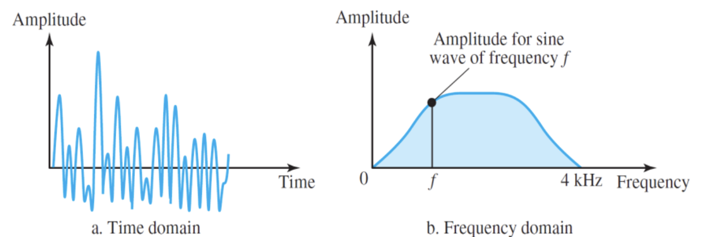

- The decomposition gives a combination of an **infinite number** of simple sine waves with **continuous frequencies**
  - frequencies with real vlues
  - human voice, AM, FM radio station

### Bandwidth of a Composite Singla

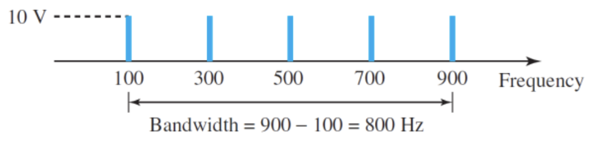

- `Bandwidth` (B) is the difference between the highest and lowest frequencies contained in a composite signal
  > B = fh - fl

# Digital Signals

- Most digital signals are nonperiodic
  - frquency and period are not suitable
- `Bit rate` = number of bits sent per second (bps)
- `Bit length` = the distance one bit occupies on the transmission medium
- `Bit duration` = 1/Bit rate (1/1 Mbps = 1 μs)
  > Bit length = propagation speed \* bit duration

##### Example

- Bit length = (2 \* 108m) x [1/(1Mbps)] = 200 m
  > a bit occupies 200 meters on a transmission medium

> 1/(1Mbps) = 1 / 1,000,000 bits per second = 1 microsecond (μs)

## Digital Signals - Level

- `Level` refers to a specific state or value that a digital signal can have at a given point in time
- Digital signals are characterized by having discre levels or states
  - each of them represents a distinct value or symbol
  - levels are typically associated with `voltage` or `current levels` in electronic circuits
    - in **binary digital systems**: low (0) high(1)
    - advanced digital systems: octal (8 levels), hexadecimal (sixteen levels)

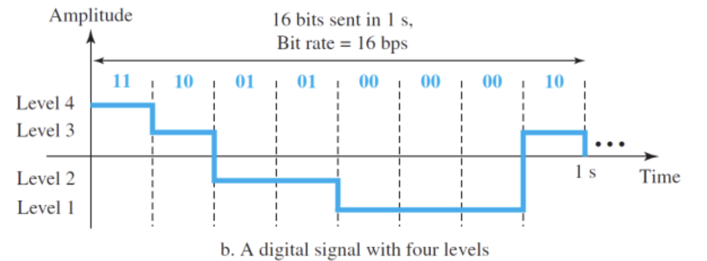

- Number of bits per level = **integer** and **power of 2**
  > Number of bits per level = ⌈log2⌉(level)

##### Example

A diital signal has 11 levels. How many bits are needed per level?

> 3.46 bits -> 4 bits

Assume we need to download text documents at the rate of 100 pages per minute. What is the required bit rate of the channel? A page is an average of 24 lines with 80 characters in each line. If we assume that one character requires 8 bits, the bit rate is:

> 1.536Mbps

## Digital Signal as a Composite Analog Signal

- Both periodic or nonperiodic digital signal is a **composite analog signal** w. frequencies between 0 to infinity (**infinite bandwidth**)
- Fourier analysis for decompose

## Digital Signal as a Composite Analog Signal - Nonperiodic Digital Signal

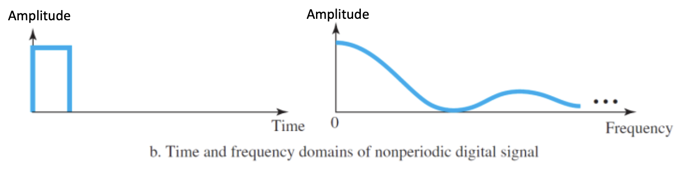

- Nonperiodic digital signal
  - infinite bandwidth and **continuous** frequencies

## Periodic Signal as a Composite Analog Signal

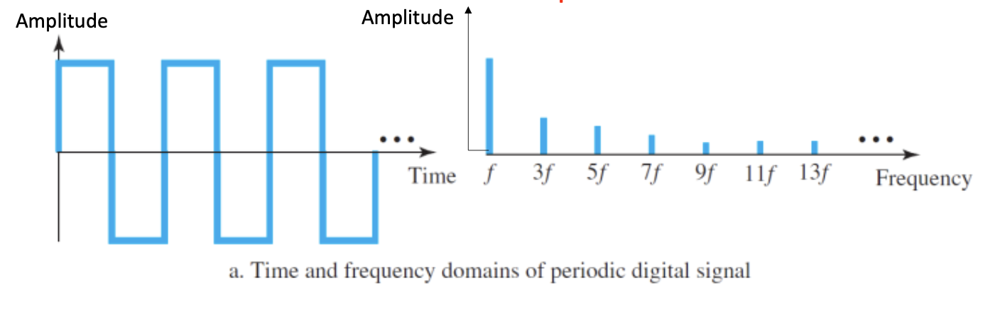

- Periodic digital signal (rare in data communications)
  - infinite bandwidth and discrete frequencies

# Transmission Media

- Transmission media are directly controlled by the physical lyaer
- Transmission medium: free space(air, vaccum, water), metallic cable, or fiber-optic
- The characteristics and quality of a data transmission
  - determiend by **characteristics of the medium** and **characteristics of the signal**

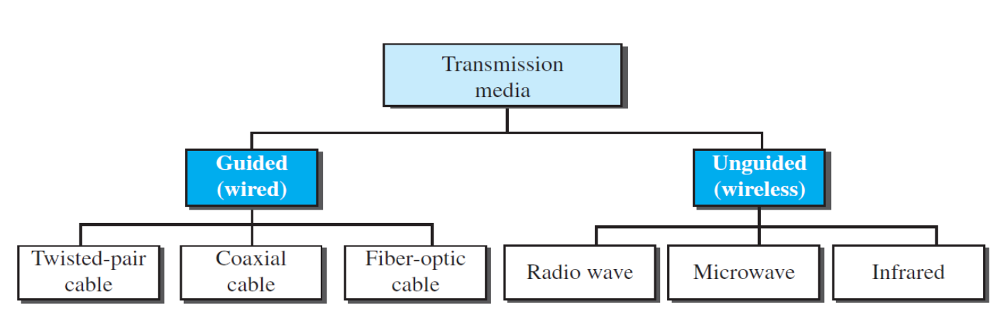

## Guided Media (Wired)

- A signal traveling along guided media
  - discreted and contained by the physical limits of the medium
- `Twisted-pair` and `Coaxial cable`
  - use **metallic constructors** (copper)
  - transport signals in the form of electric current
- `Optical fiber`
  - accepts and transports signals as light
- The **medium** itself is more important in determining the limitations of transmission

### Twisted-Pair Code - Guided Media

- Two conductors (copper with plastic insulation) twisted together
- Twisting the pairs
  - prevents `interference`, `noise`, `crosstalk`: external influences
  - unwanted signals are mostly canceld out
- `UTP` (Unshiled Twisted Pair)
  - the most common twisted-pari cable
  - ordinary telephone wire
  - subject to external electromagnetic interference
  - tigher the twisting, higher the supported transmission rate and the greater the cost per meter
- `STP` (Shielded Twisted Pair)
  - metal foil or braided mesh : reduces interference
  - imporves quality (better performance at higher data rates)
  - bulkier, expensive

#### Performance of UTP Cables

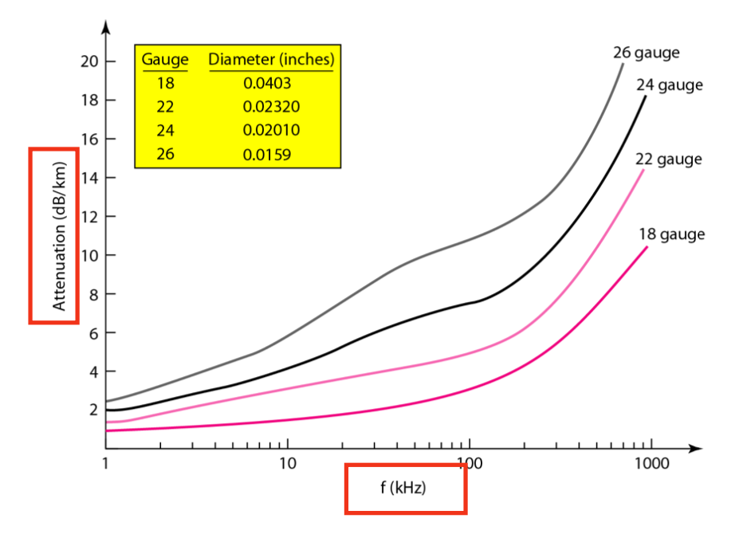

- gauce: a measure of the thickness of the wire

### Coaxial Cable - Guided Media

- Categorized by Radio Government ratings
  - physical specifications
  - specialized functions
    -e.g. RG-59 for Cable TV
- `BNC` connector
  - Bayonet Neil-Concelman
  - to connect the end of the coaxial cable to a device
- Performance
  - **Higher bandwidth** than twisted-pair cable
    -> higher data rate
    - carries high frequency ranges
  - **Higher attenuation** than twisted-pair cable
    - requires frequence use of **repeaters**
- Applications
  - analog/digital telephone networks, cable tv networks -> mostly fiber-optic
  - Ethernet LANs

### Fiber-Optic Cable - Guided Media

- Optical fibers use reflection to guide light through a channel
- Made of glass or plastic
- Transmits signals in the form of light
- Three connectors: `SC`, `ST`, and `MT-RJ`
- Advantages
  - less signal attenuation -> less repeaters
  - higher bandwidth
  - immunity to electromagnetic interference (noise)
  - resistence to corrosive materials
  - light-weight
  - great immunity to tapping
- Disadvantages
  - installation and maintenance
  - unidirectional light propagation
    - two fibers are needed for bidirectional communication
  - cost
- Applications
  - backbone networks
  - cable TV networks
  - fast Ethernet

## Unguided Media (Wireless)

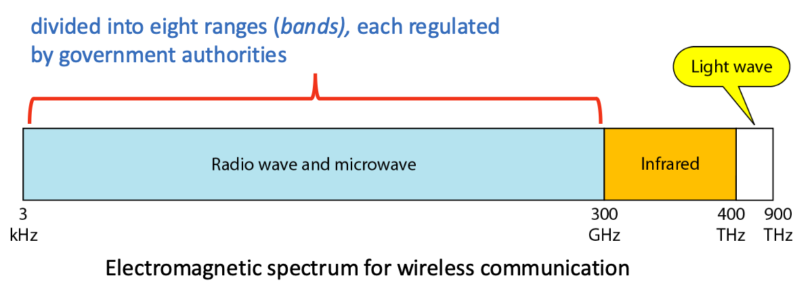

- Unguided medium transport electromagnetic waves **without using a physical conductor**
- 3 types: `Radio wave`, `Microwave`, `Infrared`

### Radio Waves - Unguided Media

- Electromagneetic waves in frequencies: **3 kHz to 1 GHz**
- mostly **omnidirectional**
- can penetrate walls
- regulated by authorities
- radio waves: multicast communication

## Microwaves - Unguided Media

- Waves ranges in frequencies between **1 GHz to 300 GHz**
- **Unidirectional**
- for unicast communication
  - cellular telephones, satellite networks, wireless LANs
- Line-of-sight propagation
- Very high-frrequence microwaves: cannot penetrate walls
- Higher data rate due to a wider badn
- Certain portions of the band requires permission

## Infrad Waves - Unguided Media

- Frequncies between **300 GHz to 400 GHz** (wavelengths from 1mm to 770mm)
- **Short-range communication** in a closed area
- line-of-sight propagation (indoor LANs)
- Cannot penetrate walls -> high frequencies
- No outside: sun's rays contain infrared waves
- Can be used to transmit **digital data** with very **high data rate** (wide bandwidth)
- Applications -> e.g., remote control, between a PC and peripheral device

# Summary

- Transformation of data to electric signals for transmission
- Types of data and signals as well as their characteristic
- Analog signals and their characteristic
- Digital signals and their characteristics
- Transmission media are actually located below the physical lyaer and are directly controlled by the physical layer
- Guided media -> twisted-pair, coaxial, fiber-optic cables
- Unguided media (free space)
