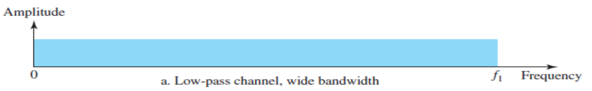
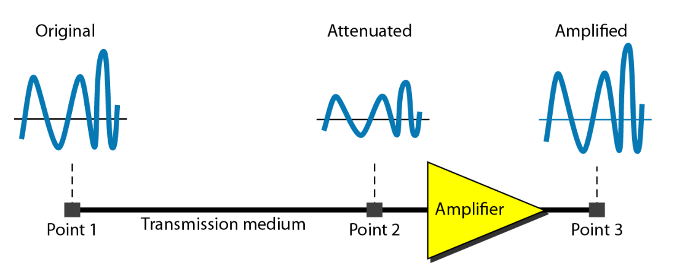
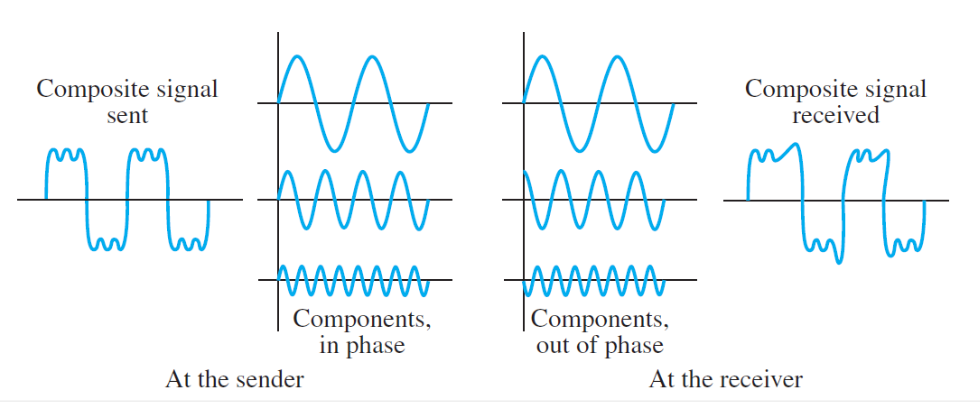
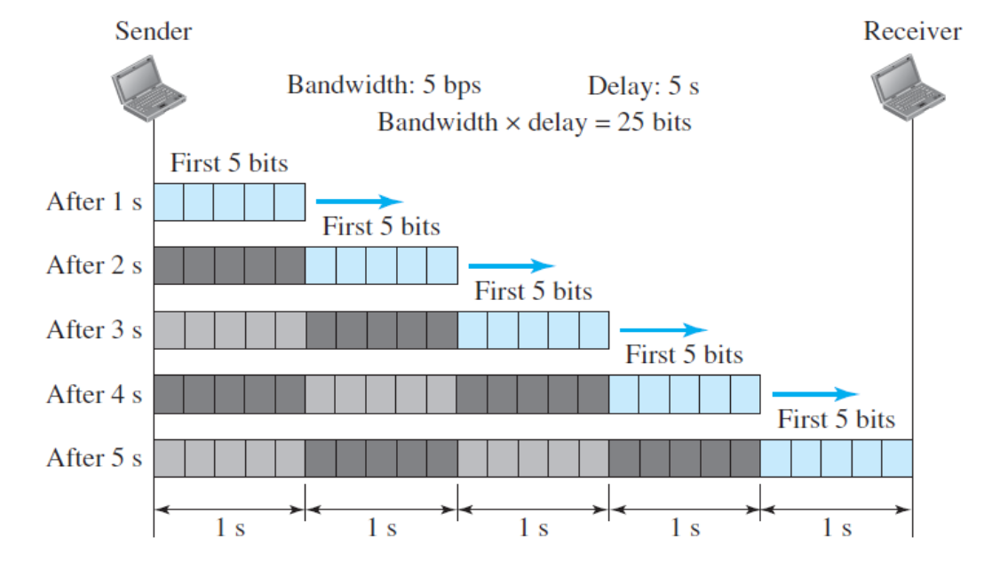
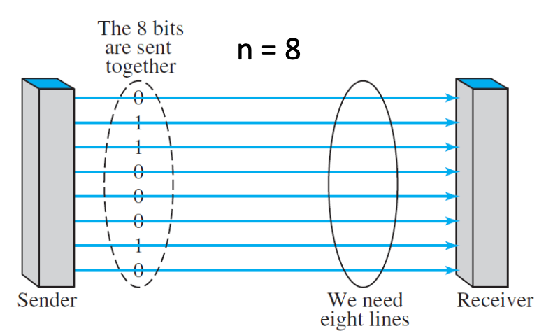
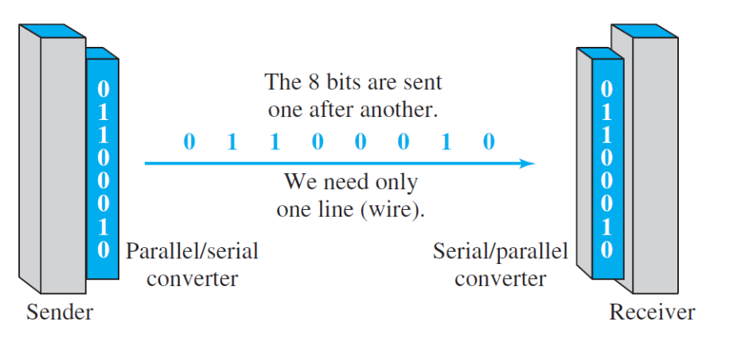

# Learning Outcomes

- Transmission of digital singals
- Transmission impairment
- Compute the limits of data rate using Shannon Capacity and Nyquist Formulas
- Bandwidth
- Transmission Modes

# Transmission of Digital Signals

- **Nonperiodic digital signals**
- Two approaches for transmission
  - `Basedband Transmission`
  - `Broadband Transmission` (Modulation)

## Baseband Transmission

- A digital signal is set over a channel **without changing the digital signal** to an analog signal
- Requirement: a **low-pass channel**
  - if the channel primarily passes signals below a certain frequency, it is called a low-pass channel (has an upper bound)
- Basedband transmission has a **dedicated medium** with a bandwidth consistuting **only one channel**
- Ex: a wired LAN

### Basedband Transmission - a Low-Pass Channel with a Wide Bandwidth

- Baseband transmission of a digital signal that preserves the shape of the digital shape
  - possible only with **low-pass channel** with an **infinite** or **very wide bandwidth**
- Low-pass channels are less common
  - required bandwidth is proportion to the bit rate

## Broadband Transmission

- Modulation
  - Changing the digital signal to an analog signal for transmission
  - Requirement
    - a **bandpass channel**
      - one that allows signals to pass between two frequency limits
        or
    - a channel with **bandwidth that does not start from 0**
  - More availalbe than a low-pass hannel
  - Digital signal **must be converted to an analog signal** before transmission
  - We can install two converts to change the digital signal to analog and vice versa at the receiving end
    - the converter is called **modem** (modulator/demodulator)

### Real-Life Examples of Broadband Transmission

1. Sending of computer data through a telephone subscriber line, the
   line connecting a resident to the central telephone office.
   - the lines designed to carry voice and have a bandwidth with
     frequencies between 0 and 4kHz → can be used as a low-pass
     channel but it is considered as a bandpass channel, why?
2. Digital cellular phones convert the digitized voice signal to a
   composite analog signal before sending.
   - their allocated bandwidth is very wide, so, why not sending the
     digital signal without conversion?

# Transmission Impairment

- The imperfection of transmission media causes signal impariment
- Imparement causes `attenuation`, `distortion`, `noise`

## Attenuation - Transmissino Impairment

- **Loss of energy** to overcome the resistance of the medium
- `Amplifier` to compensate for loss
  
- **Decibel** `db`

  - measures the relative streneghts of two signals or one signal at two different points
  - negative <- if a signal is attenuated
  - positive <- if a signal is amplified

    > dB = 10 \* log10(P2/P1)

    > db = 20 \* log10(V2/V1)

    `p` powers of a signal
    `v` voltages of a signal

##### Decibel Example

- Suppose a signal travels through a transmission medium and its power is reduced to one-half. Find the attenuation (loss of power)
  > -3 dB

## Distortion - Transmission Impairment

- The signal changes its form of shape
  - can occur in a composite signal made of diffrent frequencies
  - signal components at the receiver have phases different from what they had at the sender

## Noise - Transmission Impairment

- Different types of noise may corrupt the signal
  - Thermal noise
    - random motion of electrons in a wire creates an extra signal
  - Induced noise
    - from sources such as moters and applicances
  - Crosstalk noise
    - the effect of one wire on the other
  - Inpulse noise
    - a spike that comes from power lines, lightening, and so on

### Noise - SNR

- To find the theoretical bit rate limit, we need to know the ratio of the signal power to the noise power
- **Signal-to-Noise-Ratio** `SNR`

  - the average: because these may change with time
    > SNR = what is wanted / what is not wanted
    > SNR = average signal power / average noise power

  > SNRdB = 10 \* log10(SNR)

  - for noiseless channel

    > SNR = (signal power) / 0 = infinite

    > SNRdB = 10 \* log10(SNR) = infinite

- **High** `SNR`: the signal is less corrupted

##### SNR Example

The average power of a signal is 10 mW and the average power of the noise is 1 μW; what are the values of SNR and SNRdB?

> 40 dB

# Compute the Limits of Data Rate

- `Data rate`, `Bit rate`, `Capacity`
  - indicates how fast we can send the data in bps over a channel
  - relies on
    1. the availalbe bandwidth
    2. the number of signal levels
    3. the quality of the channel (the level of noise)
  - two **theoretical formuals**
    1. `Nyquist` for a noiseless channel
    2. `Shannon` for a noisy channel

## Nyquist Bit Rate - Noiseless Channel

- Theoretical maximum bit rate for a noiseless channel

  > BitRate = 2 x bandwidth x log2L

  > bps = 2 x (bandwidth of the channel) x (the number of signal levels)

- Incrasing the levels of a signal may reduce the reliability of the system
  - why?
- It gives us **how many signal levels** we need

## Shannon Capacity - Noisy Channel

- The channel is always noise in reality

  > SNR = average signal power / average noise power

  > Capacity = bandwidth x Log2(1 + SNR)

  > the capacity of the channel in bps = bandwidth of the channel ...

- No matter how many levels we have,
  - we cannot achive a data rate higher than the capacity of the channel
- An extremely noisy channel (signal-to-noise ratio is almost 0)
  - the **capacity of this channel is 0** regardless of the bandwidth
- It gives us the **upper limit**

##### Example

We need to send 265 kbps over a noiseless channel with a bandwidth of 30 kHz. How many signal levels do we need?

> 21.362 levels

> since the result is not a power of 2, need to increase the number of levels or reduce the bit rate

We have a channel with a 1MHz bandwidth. The SNR for this channel is 63. What are the appropriate bit rate and number of signal levels?

> 6 Mbps, 8 levls

# Bandwidth

1. Bandwidth in hertz
   - the range of frequencies included in a composite signal or
   - the range of frequencies a channel can pass
2. Bandwidth in bits per second `bit rate`
   - number of bits per second cna be transmitted

- Relationship between the bandwidth in herz and bandwidth in bits per second
  - an increase in bandwidth in hertz -> increase in bw in bit rate

## Bandwidth - Delay Product

- **The number of bits that can fill the link**
- Important if
  - need to send data in bursts and
  - wait for the acknowledgement of each burst before sending the next one
- To use the max capability of the link
  > number of bits that can be in transition at any time = 2 x bandwidth x delay

# Transmission Modes

- Digital Data Transmission Modes: `Parallel`, `Serial`

## Parallel Transmission

- **Increase the transfer speed** by a factor of (n / serial transmission)
- Advantage: speed
- Disadvantage: cost

## Serial Transmission

- Only one communication channel
- Reduces the cost of transmissionover a parallel by roughly a factor of n

## Evoluion of USB

- Universal Serial Bus

# Summary

- Baseband and Broadband transmissino of digital signals
- Transmission impairment
  - attenuation, distortion, noise
- Data rate limits using Shannon Capacity and Nyquist formula
- Bandwidth is one of the main performance metrics used in data communications
