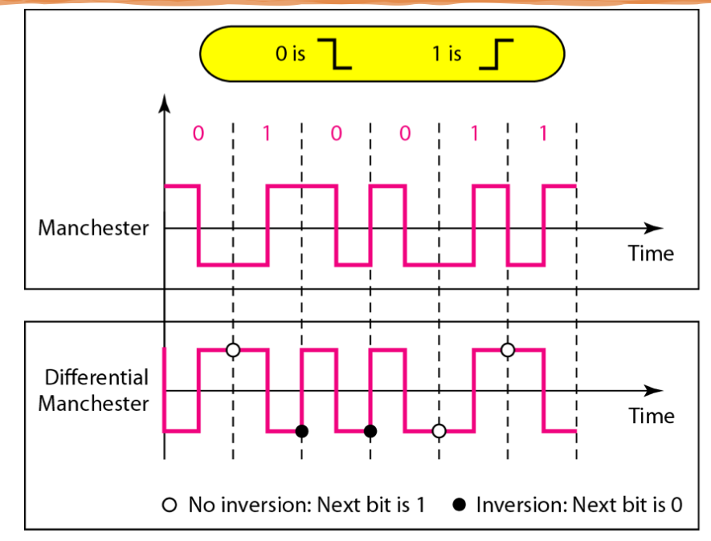

# Learning Outcomes

- Data rate, Signal rate
- Compute the bandwidth of a digital signal
- Line coding schemes

# Digital-To-Digital

- Representing **digital data** by using **digital signals**
- Digital-to-Digital conversion (convert digital data to digital signals)

## Line Coding

- `Line coding`
  - the process of converting digital data to digital signal
  - a sequnce of bits is converted to a digital signal
    
- Common characteristis of Line Coding Schemes
  1. signal element vs data element
  2. data rate vs signal rate
  3. bandwidth
  4. baseline wandering
  5. self-synchronization
  6. dc components

### Signal Element vs Data Element - Line coding

- `bit`: data element
  - 0, 1
  - the smallest entity to represent a peice of information
  - what we need to send
- `symbol`, `state`: signal element
  - carries data elements
  - the shortest unit(timewise) of a digital signal
  - what we can send
- Ratio r
  - the number of data elements carried by each signal element
  - different for each line coding scheme
    
    

### Data rate vs Signal rate - Line coding

- `Bit rate`: data rate
  - the number of data elements (**bits**) sent in **1s**
  - bps
  - increase data rate -> increase in the speed of transmission
- `baud rate`: signal rate
  - number of signal element sent in 1s
  - how fast data is sent over a serial line
  - baud
  - decrease in the signal rate -> decrease in the bandwidth requirement
- Goal: **increase the data rate while decreasing the signal rate**
- Relationship between data rate(`bit rate`) and signal rate(`baud rate`)

  > $S = N/r$

  > Signal rate = data rate / r

  - the relationship depends on the value or _r_ and the pattern of the data

  - Three cases:

    1. worst case (max signal rate`baud rate`)
    2. best case (min signal rate `baud rate`)
    3. average case
       > Save = case factor x N x 1/r

##### Example

A signal is carrying data in which one data element is encoded as one signal element. If the bit rate is 100 kbps, what is the average value of the baud rate if c is 1/2?

> 50 kbaud

### Bandwidth - Line coding

- The actual bandwidth of a nonperiodic digital signal is continuous with an **infinite** range (theoretically)
- The effective bandwidth: **finite**
- **The `baud rate`** determinds the required bandwidth for a digital signal
- The bandwidth(range of frequencies) is proportional to the singal rate(baud rate)
  > bandwidth = case factor x data rate x (1 / r)
  > B = c x N x (1 / r)
- Nuqiist formula

  - a signal with `L` levels carry `Log2L` bits per level
  - if each level corresponds to one signal element and we assume the average case (c=1/2)

    > Nmax = (1 / c) x B x log2L

    > Max data rate of a channle = 1/ casefactor x bandwidth x log2level

### Baseline Wandering - Line coding

- Baseline
  - a running average of the received signal power in _decoding_
  - receiver calculates it
  - the incoming signal power is evaluated against this baseline
    - to determine the value of the data element
- Baseline wanering
  - a drift in a baseline cause by a **long string of 0s/1s**
  - difficult for the receiver to decode
- We must **prevent baseline wandering**

### Self-Synchronization - Line coding

- The receiver clokc must be synchronized with the sender clock
- Self-Synchronization
  - timing information in the data being transmitted
  - transitions (changes in voltage level) in the signal alert the receiver
    - beginning, middle, end of pulse
- If the receiver clokc is not correct -> bit intervals are not matched -> receiver misinterpret
- Receiver has a shorter bit duration than sender
  

##### Example

In a digital transmission, the receiver clock is 0.1 percent faster than the sender clock. How many extra bits per second does the receiver receive if the data rate is 1 kbps? How many if the data rate is 1 Mbps?

> 1000 bits sent → 1001 bits received → 1 extra bps

> 1,000,000 bits sent → 1,001,000 bits received → 1000 extra bps

### DC Components - Line coding

- DC component (bias): the mean amplitude of the waveform
  - if mean amplitude is 0 -> no DC bias
- Very low frequencies created by the spectrum during fixing voltage level in a digital signal
- Causes issues for a system that cannot pass low frequencies or uses electrical couping
  -e.g., a line cannot pass frq below 200 Hz -> we need coding scheme with no DC component
  - with no DC component, **signal's an average amplitude = 0**

# Line Coding Schems

- `Unipolar`: NRZ
- `Polar`: NRZ, RZ, biphase
- `Bipolar`: AMI

## Unipolar Schemes (on-off keying)

- All the signal levels are on side of the time axis: either above or below
- Was designed as a **non-return-to-zero** `NRZ` scheme
  - signal does not return to zero at the middle of the bit
- positive voltage (bit 1), negative voltage (bit 0)

## Polar Schemes - NRZ-L and NRZ-I

- The voltages are on **both sides of the time axis**
- `NRZ-L` (level)
  - two levels of voltage amplitude
  - positive voltage level for 0
  - negative for 1
- `NRZ-I` (invert)
  - the change or lack of change in the level of voltage
    - determines the value of the bit
    - no change for 0
    - change for 1

### Polar Schemes - Problems

- DC components
  - power density is very high around frequences close to 0
- Baseline wandering
  - a long sequence of 0s or 1s
- No self-synchronization
  - a long sequence of 0s or 1s

## Polar Schemes - Manchester and Differential Manchester

- POpular techniques for data transmission
  - for IR protocols, RFID, NFC system
- Differential encoding: NRZ-I and differential manchester
- Self-synchronization
  - provided by the transition at the middle of the bit
- NO baseline wandering
- No DC component
  - each bit has a positive and negative voltage contribution
- Drawback
  - the signal rate for Manchester and differential Manchester is higher

## Bipolar Schemes (Multilevel Binary)

- Three voltage levels: `positive`, `negative`, `zero`
  - the voltage level for one data element (bit) is at zero
  - the voltage level for the ohter element alternates between positive and negative

### Bipolar Schemes (Mutilevel Binary) - AMI

- Alternate Mark Inversion - alternate 1 inversion
  - 0 : netural zero voltage
  - 1s: alternating positive nad negative voltages

# Summary

- Line coding schems (for digital-to-digital conversion) and their common characteristics
  - unipolar, polar, bipolar schemes
