# Learning Outcomes

- Explain the **Pulse Code Modulation (PCM)** technique for **analog-to-digital** conversion
- Explain three **digital-to-analog** conversion techniques
- Describe the **constellation diagrams**
- Explain analog-to-analog conversion techniques.

# Introduction

- microphone, medical imaging ...

# Analog-To-Digital Conversion

## Digitization

- converting an analog signal to digital data

#### Pulse Code Modulation (PCM)

- the most commonly used technique for digitization
- PCM encoder has three processes:

  1. **Sampling** of the analog signal

  - Pulse Amplitude Modulation (PAM) → another name for sampling process
  - `Sample interval` or sample period Ts
    - analog signal is sampled every Ts seconds
  - `Sampling rate` or sampling frequency fs
    > fs = 1 / Ts
  - Sig with an infinite bandwidth cannot be sampled
  - methods:

    - ideal sampling(cannot be achived)
    - natural sampling(Uses a high-speed switch)
      - A circuit that can rapidly connect and disconnect a signal path
    - `fat-top sampling`(sample and hold)
      - uses a circuit, most common

  - Restriction on sampling rate

            - According to the Nyquist theorem, to reproduce the original analog signal, the sampling rate must be at least 2 times the highest frequency contained in the signal
              > Nyquist rate → fN = 2 \* fm (hz)
              > Nyquist interval → 1 /fN = 1 / 2 \* fm (seconds)
            - Low-pass analog signal → **bandwidth = highest frequency**
            - Bandpass analog signal → **bandwidth < highest frequency**

            - Example
              - Nyquist rate sampling
                > fs = 2 \* f
                > a good approx of the original sine wave
              - Oversampling
                > fs = 4 \* f
                > same approx but redundatn and unnecesary
              - Undersampling
                > fs = f
                > Produces a signal that does not look like the original one
            - Nyquist theorem and sampling rate example
            Q. What is the minimum sampling rate for a low-pass signal that has a bandwidth of 100 kHz?
                > Minimum sampling rate = 2 x 100,000 = 200,000 samples per second
            Q. What is the minimum sampling rate for a bandpass signal that has a bandwidth of 100 kHz?
                > We cannot find the minimum sampling rate because we do not know the maximum frequency of the signal

  2. **Quantizing** the sampled signal

  - The set of amplitudes is mapped to a set of discrete values
    - can be infinite with nonintegral values, an approximation process
  - Steps

    1. Assume that the original analog signal has instantaneous amplitudes between Vmin and Vmax
    2. Divide the range into L zones (num of quantization levels) each of height (delta)
       > delta = (Vmin - Vmax) / L
    3. Assign quantized values of 0 to L − 1 to the midpoint of each zone
    4. Approximate the value of the sample amplitude to the quantized values
       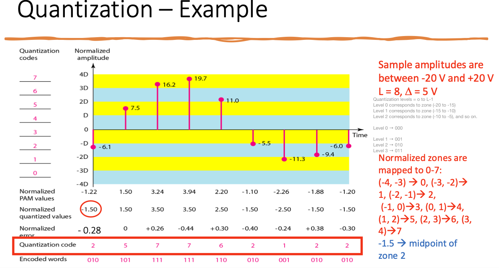

  - Quantization Levels
    Choosing `L` (the number of quantization levels) depends on:
    ➢the range of the amplitudes of the analog signal
    ➢the required accuracy of recovering the signal

            - If the amplitude of a signal fluctuates between two values only
              > L = 2
            - For a signal with many amplitude values, more quantization levels are needed
              - In audio digitizing,
                > L = 256
            - lower values of `L `increases the `quantization error`
                - if there is a lot of fluctuation in the signal

        - Quantization Error (Noise)

          > delta/2 <= quantization error <= delta/2

          - quantization error changes the SNR of the signal
            - the upper limit capacity (bit rate) is decreased
          - Num of quantization level `L`, bits per sample nb
            - quantizatino error to the SNRdB
              > SNRdB = 6.02 nb + 1.76 dB

        - Uniform Quantization
          - issues
            ➢only optimal for uniformly distributed signal

            ➢often the distribution of the instantaneous amplitudes in the analog signal is not uniform
            ➢applications such as speech and music (real audio signals) are more concentrated near zeros (lower amplitudes)
            - in nonuniform quantization, height of `Δ`delta is not fixed

  3. **Encoding** the quantized information as streams of bits

  - Each quantized sample can be changed to an nb-bit code word
  - Number of bits per sample (L is the number of quantization levels/zones)
    > nb = log2L
    > Bit rate = sampling rate _ number of bits per sample = fs _ nb

#### PCM Bandwidth

- Given the bandwidth of a **low-pass analog signal** , we want to find the new **minimum bandwidth** of the channel that can pass the digitized version of this signal

  > Bmin = c x N x 1/r = c x nb x fs x 1/r = c x nb x 2 x fmax x 1/r
  > Bmin = c x nb x Banalog x 1/r

  - if `c = 1/2` (average case) and `r = 1` (NRZ or bipolar line coding)
    > Bmin = nb x Banalog

- The minimum bandwidth of the digital signal is nb times greater than the bandwidth of the analog signal. This is the price we pay for digitization

# Digital-To-Analog Conversion

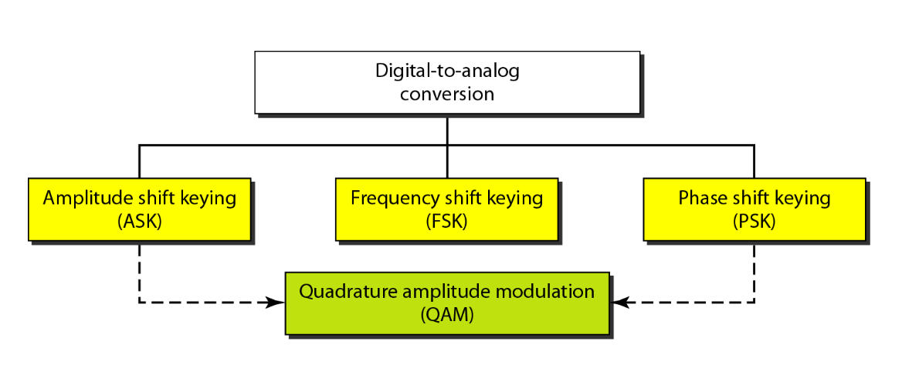

- Converting digital data to a bandpass analog signal
- Modifying any of the three characteristics (amplitude, frequency, and phase) of a sine wave (i.e., carrier signal)
  - based on the information in the digital data
- called **modulation** or **shift keying**

#### Definitions and Review

- Data rate(bit rate) vs. Signal rate(baud rate)
- Analog transmission
  - `L` is num of different signal elements/levels
    > data rate r = log2L
    > baud rate <= bit rate (s = N/r)
- **Carrier signal**(carrier frequency)
  ➢a high-frequency signal produced by the sending device and acts as a base for the information signal
  ➢the carrier signal is a simple sine wave
  ➢the receiver is tuned to the frequency of the carrier signal

## Amplitude Shift Keying (ASK)

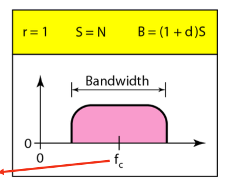

- The **amplitude of the carrier signal** is varied to create signal elements
- Both frequency and phase remain constant
- Bandwidth for ASK

  - nonperiodic composite signal
  - proportional to the signal rate

- `Binary ASK` (BASK)

  - Implemented using only two levels of signal elements
  - OOK (On-Off Keying)
  - Peak amplitude:
    for one signal level is 0, for the other one is equal to the peak amplitude of the carrier signal

- `Multi-Level Ask`
  - More than two voltage levels is used → but it is not common
  - More than 1 bit can be sent in a signal element
  - ex
    - 4 different amplitudes (voltage levels)→ 2 bits per signal element (r = 2)

## Frequnecy Shift Keying (FSK)

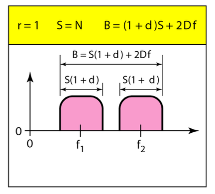

- The frequency of the carrier signal is changed to represent data
  - constant for the duration of one signal element.
  - changes for the next signal element if the data element changes
- Peak amplitude and phase are constant for all signal elements

- `Binary FSK`
  - Two career frequencies
    - data element 0 -> f1
    - data element 1 -> f2
  - difference between the two frequencies = 2 deltaf
  - ex: 4 frequencies to send 2 bits at a time (2 bits per signal element)

## Phase Shift Keying (PSK)

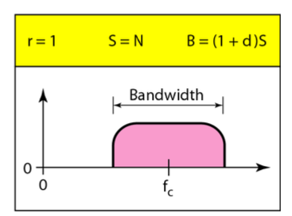

- The phase of the carrier is changed to represent two or more different signal elements
- peak amplitude and frequency remain constant as the phase changes
- More common than ASK or FSK
- Less susceptible to noise than ASK
  - because Noise can change the amplitude easier than it can change the phase
- PSK needs more sophisticated hardware to be able to distinguish between phases

- `Binary PSK` (BPSK)
  - Two signal elements are used (phase of 0 degree, phase of 180 degree)
  - same bandwidth as BASK but less than BFSK

## Quandrature Amplitude Modulation (QAM)

- ASK + PSK
  - same advantages as PSK over ASK
  - same minimum required bandwidth as ASK and PSK
- dominant method of digital-to-analog modulation
- Using two carriers, one in-phase and the other quadrature
  - with different peak amplitude levels for each carrier
- Widely used as as a modulation scheme for digital telecommunication systems, such as in 802.11 Wi-Fi standards

### Constellation Diagram

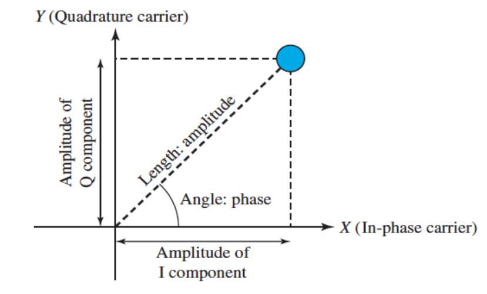

- A representation of a signal modulated by a digital modulation scheme
- defining the amplitude and phase of a signal element, particularly when we are using two carriers (one in-phase, one quadrature)
- Useful when dealing with multilevel ASK, PSK and QAM
- A signal element type is represented as a dot
- A modulation with `n` constellation points transmits log2n bits per signal element

Binary ASK
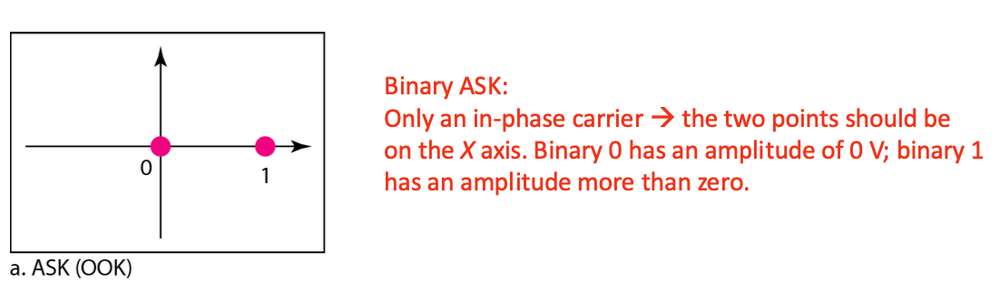

diagram for binary ASK
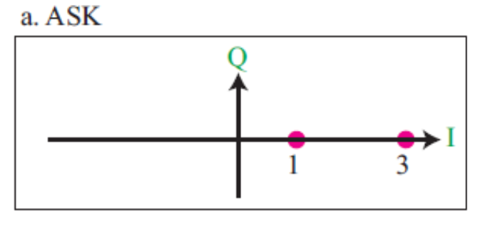

BPSK
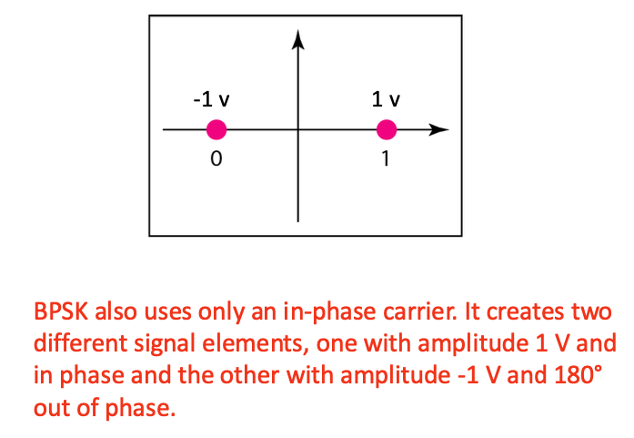

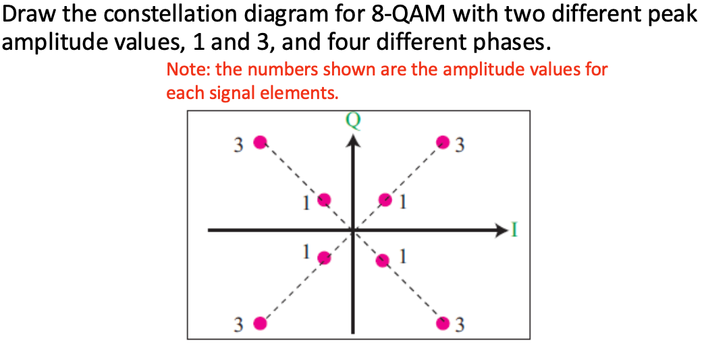

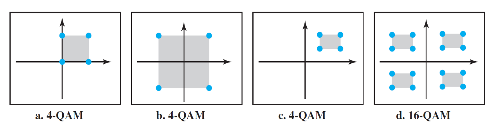

# Analog-To-Analog Modulation

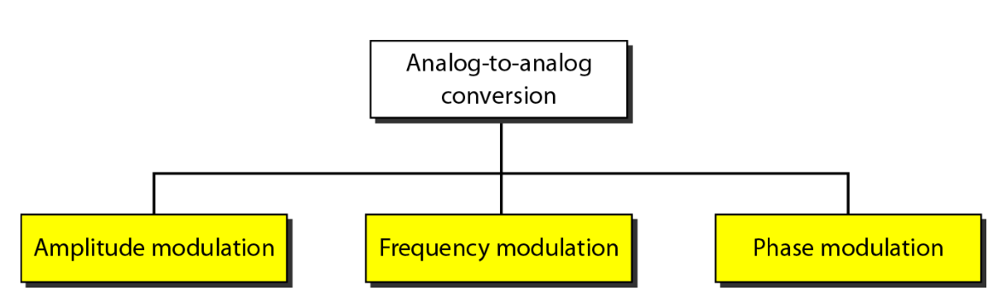

## Amplitude Modulation (AM)

- The carrier signal is modulated so that its amplitude varies with the changing amplitudes of the modulating signal

  - the frequency and phase of the carrier remain the same
  - The bandwidth of the modulated signal is twice the bandwidth of the modulating signal and covers a range centered on the carrier frequency

- Bandwidth Allocation for AM Radio
  - The bandwidth of an audio signal (speech and music) is usually 5 kHz → AM radio station needs a bandwidth of 10 kHz
  - The Federal Communications Commission (FCC) allows 10 kHz for each AM station
  - To avoid interference, each station’s carrier frequency must be separated from those on either side of it by at least 10 kHz

## Frequency Modulation (FM)

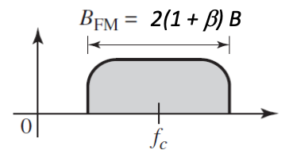

- The frequency of the carrier signal is modulated to follow the changing voltage level (amplitude) of the modulating signal
  ➢ the peak amplitude and phase of the carrier signal remain constant
- The total bandwidth required for FM can be determined from the bandwidth of the analog (modulating) signal
- Bandwidth Allocation for FM Radio
  - The bandwidth of an audio signal (speech and music) in stereo is almost 15 kHz
  - The FCC allows 200 kHz for each FM station
  - Stations must be separated by at least 200 kHz to keep their bandwidths from overlapping

## Phase Modulation (PM)

- The phase of the carrier signal is modulated to follow the changing voltage level (amplitude) of the modulating signal
  - The peak amplitude and frequency of the carrier signal remain fixed
