# Learning Outcomes

➢ Explain what is bandwidth utilization
➢ Explain what is multiplexing
➢ Explain multiplexing techniques in physical layer
➢ Explain the services of the data-link layer.
➢ Explain how the link-layer addressing work as well as being familiar with types of addresses.
➢ Explain the purpose and functionality of ARP.

# Bandwidth Utilization

- Bandwidth utilization is the wise use of available bandwidth
- `Multiplexing` + `Spectrum Spreading`

# Multiplexing

➢ goal: efficiency
➢ we combine several channels into one
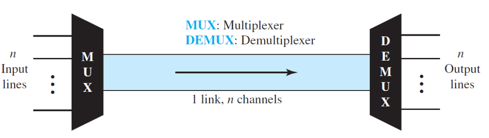

- Multiplexing is the set of techniques that allow the simultaneous transmission of multiple signals across a single data link
- `Link` refers to the physical path.
- `Channel` refers to the portion of a link
- Techniques
  - `Frequency-Division Multiplexing` (FDM)
  - `Wavelength-Division Multiplexing` (WDM)
  - `Time-Division Multiplexing` (TDM)

### Frequency-Division Multiplexing (FDM)

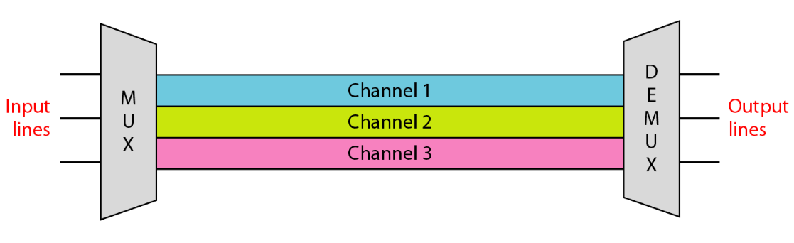

- An analog multiplexing technique
- Analog signals generated by each sending device modulate different carrier frequencies
- `Guard bands`
  ➢Strips of unused bandwidth that separate channels from each other.
  ➢To prevent signals from overlapping and interference.
- FDM can be used when the bandwidth of a link (in hertz) is greater than the combined bandwidths of the signals to be transmitted

- Each channel corresponds to a specific carrier frequency allocated to an individual signal source

- FDM Implementation
  • Telephone companies
  • AM and FM radio broadcasting
  • Television broadcasting
  - In many cases, no need for a physical multiplexer/demultiplexer
- Example
  Assume that a voice channel occupies a bandwidth of 4 kHz. We need to
  combine three voice channels into a link with a bandwidth of 12 kHz, from
  20 to 32 kHz. Show the configuration, using the frequency domain
  

### Wavelength-Division Multiplexing (WDM)

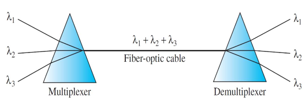

- An analog multiplexing technique to combine optical signals
- Due to the high data rate of a fiber-optic cable, using it for a single line wastes the available bandwidth
- WDM vs FDM
  ➢Similarity: both combine different signals of different frequencies.
  ➢Difference: in WDM, the multiplexing/demultiplexing involve optical
  signals transmitted through fiber-optic channels and the frequencies
  are very high.
  ➢The combining and splitting of light sources are easily handled by a
  prism

### Time-Division Multiplexing (TDM)

- A digital multiplexing technique that allows several digital signals to share the high bandwidth of a link in time.
  ➢each connection occupies a portion of time in the link.
  ➢TDM is a digital multiplexing technique for combining several low-rate channels into one high-rate one.

- Instead of sharing a portion of the bandwidth as in FDM, time is shared
  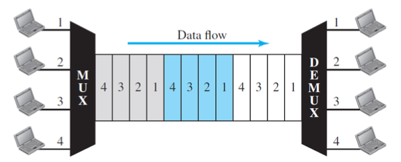
- TDM for analog signal

  - An analog signal can be sampled, changed to digital data, and then multiplexed by using TDM

- the data flow of each input connection is divided into units
- A unit can be 1 bit, one character, or one block of data
- A round of data units from each input connection is collected into a frame
- If we have `n` connections, a frame is divided into `n time slots` and one slot is allocated for each unit
- If the duration of the input unit is `T`, the duration of each slot is `𝑇/𝑛` and the `duration of each frame = T`

#### Synchronous TDM

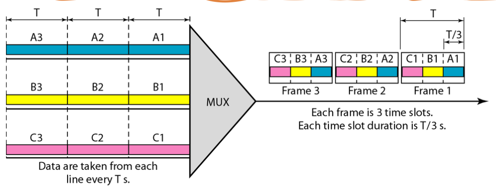
The data rate of the output link must be `n` times the data rate of a connection to guarantee the flow of data

- In synchronous TDM, the data rate of the link is `n` times faster, and the unit duration is `n` times shorter.
- In a system with `n` input lines, each frame has `n` slots, with each slot allocated to carrying data from a specific input line.
- The duration of a frame is the same as the duration of an input unit.
- The frame rate is always the same as any input rate
- Synchronous TDM is not efficient

  - If a source does not have data to send, the corresponding slot in the output frame is empty.
  - Statistical TDM can improve the efficiency by removing the empty slots from the frame

- Example
  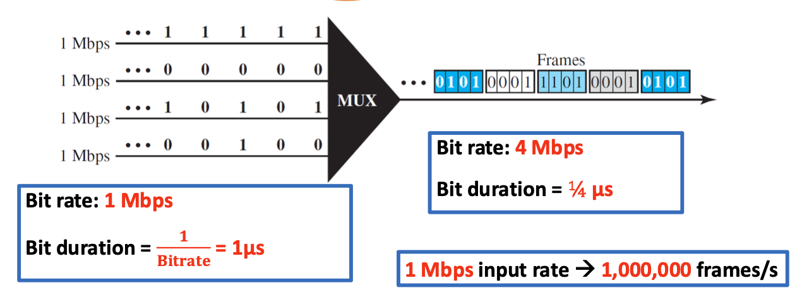
  Bit rate: 1 Mbps
  Bit duration = 𝟏 / 𝐁𝐢𝐭𝐫𝐚𝐭𝐞 = 1μs

- Synchronous TDM – **Data Rate Management**

  - to handle a disparity in the input data rates

    1. **`Multilevel multiplexing`**
       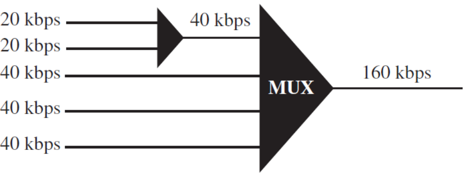
       - when the data rate of an input line is a multiple of others
    2. **`Multiple-slot allocation`**
       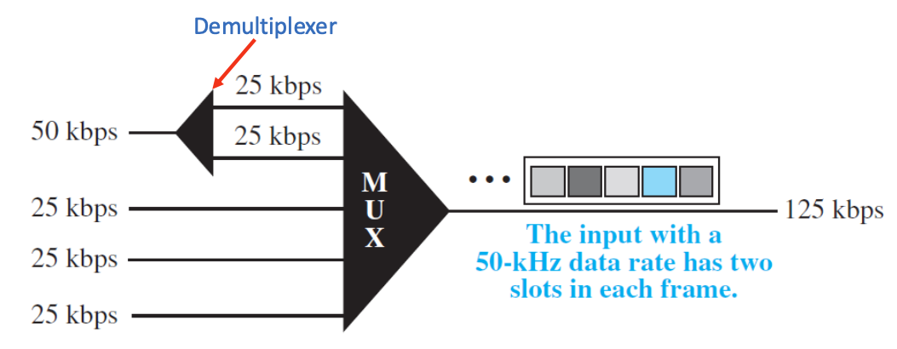
       - Allocating more than one slot in a frame to a single input line.
       - When an input line has multiple rates of the others.
    3. **`Pulse stuffing`**
       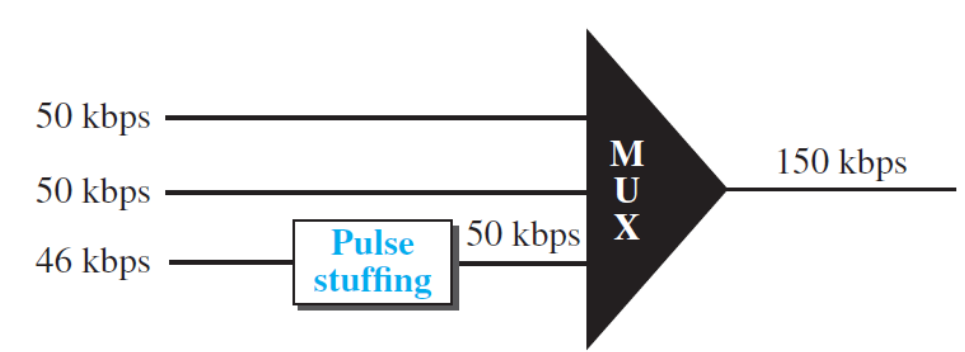
       - Pulse stuffing or bit padding or bit stuffing.
       - used when the bit rates of sources are not multiple integers of each other.
       - makes the highest input data rate the dominant data rate and then adds dummy bits to the input lines with lower rates→ their rates are increased

- Synchronous TDM – **Frame Synchronizing**

  - Synchronization between the multiplexer and demultiplexer is a major issue.
    - to maintain the integrity of the frames exchange between source and destination
  - `Framing bits`
    ➢ one or more synchronization bits that are usually added to the beginning of each frame.
    ➢ follow a pattern (0 1 0 1…) frame to frame →
    allows the demultiplexer to synchronize with the incoming stream so that it can separate the time slots accurately

- ex1
  Five channels, each with a 100-kHz bandwidth, are to be multiplexed together. What is the minimum bandwidth of the link if there is a need for a guard band of 10 kHz between the channels to prevent interference?
  > 5 channels → at least 4 guard bands
  > the minimum bandwidth = 5 × 100 + 4 × 10 = 540 kHz
- ex2
  A multiplexer combines four 100-kbps channels using a time slot of 2 bits.
  - What is the frame rate?
    > 50,000 frames per second
  - What is the frame duration?
    > 1/50,000 s = 20 μs
  - What is the bit rate of the shared channel?
    > Bit rate = 4 x 100 kbps = 400 kbps
  - What is the bit duration?
    > 1/400,000 bps = 2.5 μs
    > Note that the frame duration is 8 times the bit duration because each frame is carrying 8 bits.

# Spectrum Spreading

➢goal: privacy
➢We do not discuss this technique in this class

# Data-Link Layer

- The Internet
  ➢combination of networks glued together by connecting devices (routers or switches).
  ➢a packet traveling from a host to another host needs to pass through these networks.
- Node-to-Node Communication at the Data-Link Layer
- Encapsulation and Decapsulation at the Data-Link Layer

  - A packet at the data-link layer is called a frame
  - reasons
    1. Each link may be using a different protocol with a different frame format.
    2. Even if one link and the next are using the same protocol, encapsulation and decapsulation are needed because the link-layer addresses are normally different.

- The data-link layer is located between the physical layer and the network layer
  ➢provides services to the network layer
  ➢receives services from the physical layer

  1. framing → encapsulating the datagram in a frame before sending it to the next node.
  2. flow control → controlling the rate of producing frames w.r.t. the rate
     of consumed frames.
  3. error control → error detection and correction.
  4. congestion control

- Sublayers

1. Data Link Control (DLC)
   ➢Deals with issues common to both point-to-point (dedicated) and
   broadcast (shared) links.
   ➢Services: framing, flow control, and error control.
2. Media Access Control (MAC)
   ➢Deals only with issues specific to broadcast (shared) links.

- Link-Layer Addressing

  - Why do we need link-layer addressing?
    ➢The source and destination IP addresses in the header of a datagram define the two ends but cannot define which links the datagram should pass through.
    ➢The datagram (coming from the network layer) will be encapsulated in a frame and two data-link addresses are added to the frame header. These two addresses are changed every time the frame moves from one link to another.
  - **Link-layer address = physical address = MAC (Media Access Control) address**
  - In the most common LAN, Ethernet, MAC addresses are 48 bits (6 bytes) and are presented as 12 hexadecimal digits separated by colons

- MAC address

  - Organizationally Unique Identifier(6) + Universally Administered Address(6)

- Switch as a Layer 2 Device
  - A link-layer switch is involved only in two layers, data-link and physical
  - A switch connects devices within a network. Unlike a router, a switch only sends data to the single device it is intended for (which may be another switch, a router, or a user's computer), not to networks of multiple devices
  - Most switches, are layer 2 switches (we also have layer 3 switches, but they are less common)

# Address Resolution Protocol (ARP)

• Useful when moving a frame through a link.
• One of the auxiliary protocols defined in the network layer.
• It maps an IP address to a logical-link address.
• A host or a router need to run the ARP program all of the time in the
background.
➢ a host does not know when another host sends an ARP request; it needs to be ready all of the time to respond to an ARP request.

- Example
  Assume Alice needs to send a datagram to Bob, who is three nodes away on
  the Internet. Assume that Alice knows the network-layer (IP) address of Bob
  (i.e., NB). Also, Alice’s host knows its own IP address (i.e., NA) and its MAC
  address (i.e., LA). Explain/show the activities for communication at the data
  link layer at each node.
  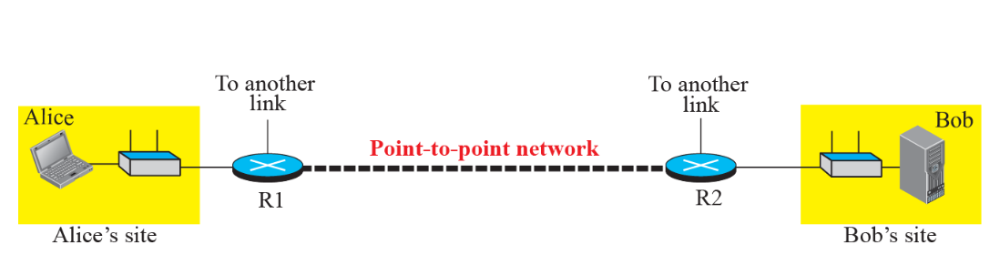
  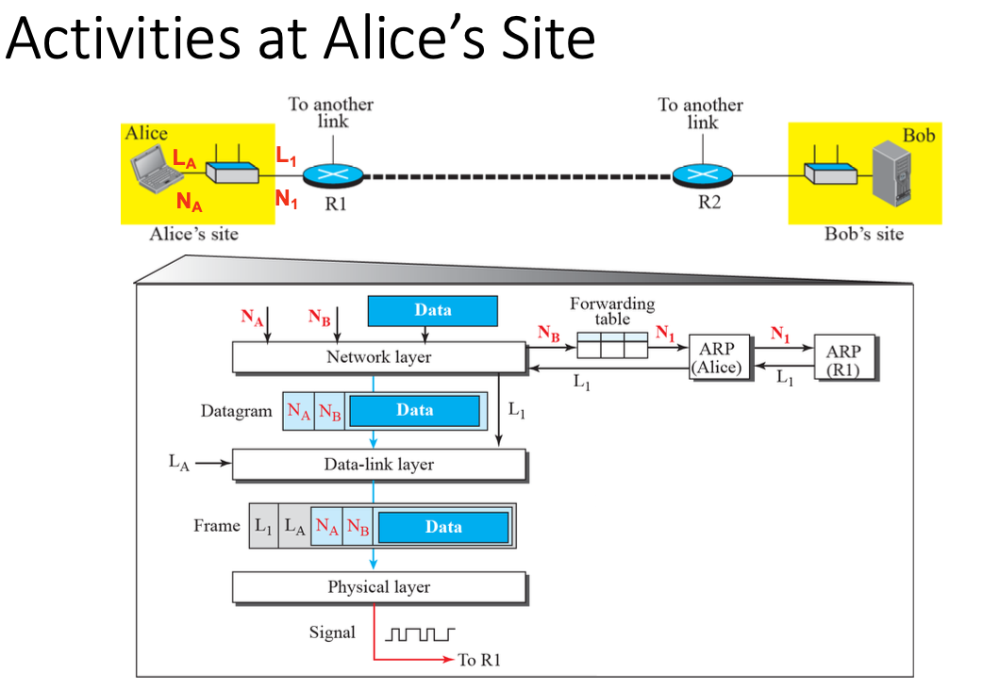
  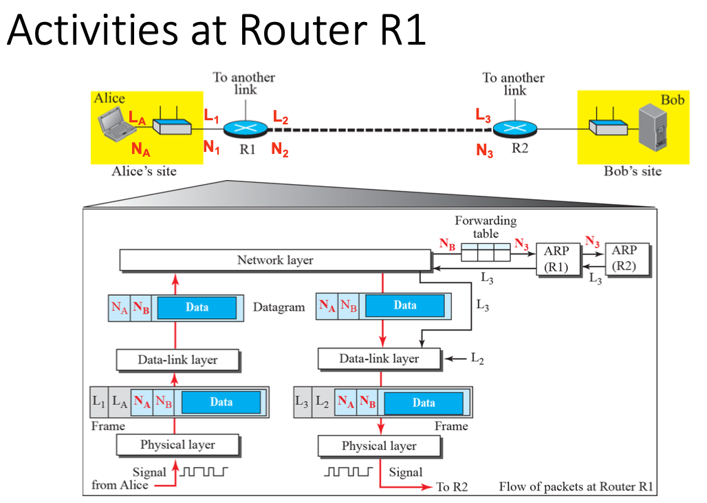
  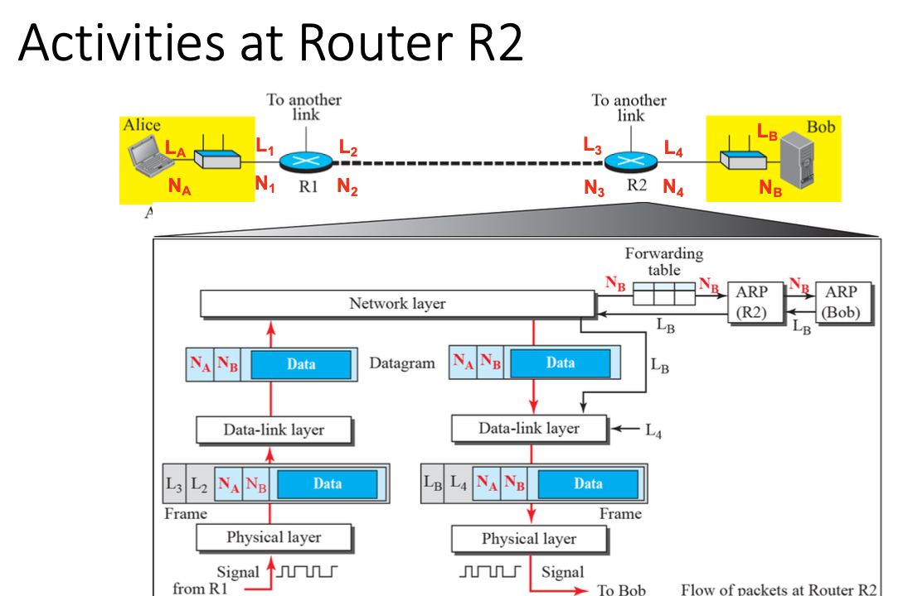
  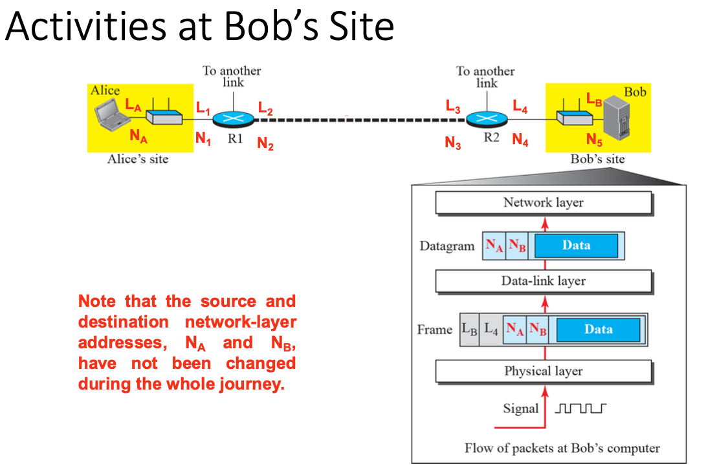

# Summary

• Bandwidth utilization
• Multiplexing → Efficiency
• Multiplexing techniques: FDM, WDM, and TDM
• The data-link layer is responsible for
➢the creation and delivery of a frame to another node, along the link
➢packetizing (framing)
➢flow control and error control along the link
➢controlling access to the link
• Link-layer addressing
• ARP to map IP addresses to MAC addresses
