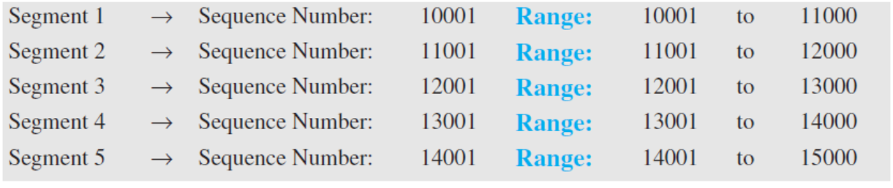
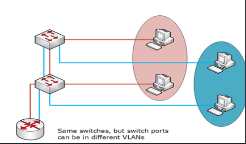
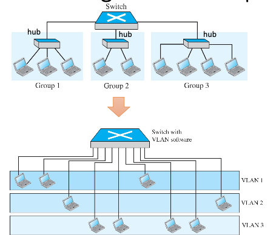

# Week 8
Learning outcome: 
    explain what are **MAC(Media Access Control) protocols** and how they function
    explain what are **VLANs** and what is the benefit of using them

## Introduction
- A **Broadcast link** can have *multiple sending and receiving nodes* all connected to the same, single, sahred broadcast channel
    - When any one node transmits a frame, the channel broadcasts the frame and each of the other nodes receives a copy
    - Ethernet, Wireless Lans (WLAN)
- **Multiple-access protocols** to coordinate across to a multipoint (broadcast) link

## Collision Domain
- A Collision domain is the part of a network where packet collisions can occur

## Broadcast Domain
- A broadcast domain is a domain in whicha broadcast is forwarded. 
- A broadcast domain contains all devices that can reach each other at the data link layuer by using broadcast
    - A destination MAC Address **FF-FF-FF-FF-FF-FF** is defined by IEEE 802.3

### Collision and Broadcast Domain in Network Devices
- **Hub** is neither a collision nor broadcast domain separator
- **Switch** is a *collision domain separator*. Each port is in a different domain. Messages send by devices connected to separate ports *never collide*
- **Router** is a *broadcast domain separator* and *collision domain separtor*. A broadcast message sent from one network to another will never be received because the *router will never permit it to flow*

## MAC Sublayer of the Data-Link Layer
- **Media Access Control** (MAC) sublayer includes protocols to *handle access to a shared (broadcast) link*
- Three categories of multiple-access protocols
    1) Random-acess protocols
    2) Channeliation protocols (channel-partitioning protocols)
    3) Controlled-access protocols (taking-turn protocols)


### Multiple-access protocols 1: Random Access (Contention) Protocols
- No station is superior to another, and none is assigned control over another
- Each station can transmit when it desire; on the condition that it follows the **predifiend procedure**, including *testing the state of the medium*
    - A station that has data to send uses a procedure defined by the **protocol** to decide on whether to send. This decision depends on the state of the medium (**idle or busy**)
- If more than one station tries to send data, there is an access confloict(**collision**): the frames will be either **destroyed** or **modified**
- Procedure to avoid collision:
    - When to access the medium
    - What to do if medium is busy
    - What to do if there is an access conflict (collision)
    - How to determine the success or failure of the transmission
- Two features
    1) Random access
        - No schedules time for a station to transmit
        - Transmission is random among the stations
    2) Connection among the stations to access the medium
        - No rules specify which station should send next
        - Stations compete with one another to access the menium

#### Pure ALOHA (Random-Access Protocol)
- The earliest random-access protocol
- Designed for a **radio LAN(wireless)** but it can be used on any shared medium
- Each station sends a frame whenever it as a frame to send: **possibility of collision** between frames from different stations

##### Pure ALOHA Procedure
- Relies on **acknowledgements** from the receiver
    - if the acknowlegement does not arrive after a time-out period, the station assumes that frame(or the acknowlegement) has been destroyed and **resends the frame**
- **Backoff time** *(T)B*:
    - Each station waits a **random amount of time** before resending its frame when the time-out period passes
    - Random value *R* that depends on the number of attempted unsuccessful transmissions 
    - After a Max number of retransmission attempts *K(max)*, a station must give up and try later
- **Maximum Propagation Time(delay)** *(T)p*:
    - The amount of time required to send a frame between the two most widely separated stations
    > **(T)p** = distance / propagation speed
    > Time-out period = 2 * (T)p
    > Maximum possible round-trip propagation delay = 2 * (T)p
- **Average Transmission Time** *(T)fr*:
    - The average amount of time required to send out a frame
    > (T)fr = frame size / transmission rate(data rate)

##### Pure ALOHA Vulnerable time
- **Vulnerable time**: The length of the time in which there is a possibility of collision
> Vul time = 2 * (T)fr

##### Pure ALOHA Throughput
- **G**: The average number of frames generated by the system during one frame transmission time
- **Throughput**: *average number of successfully transmitted frames*
    > S = G * (e)^-2G
- Max throughput
    - By setting the derivative of S with respect to G to 0
        > (S)max = 0.184 when G = 1/2
    or
    - G = 1/2 produces the max throughput becasue the vulnerable time is 2 times the frame transmission time. Therefore, if a staton generates only one frame in this vulnerable time (and no other stations generate a frame during this time), the frame will reach its destination successfully


##### Pure ALOHA Example
```
K: number of attemps (usually Kmax = 15)
(T)p: Maximum propagation time
(T)fr: Average transmission time: frame size / transmission rate(data rate)
(T)B: Back-off time: R * (T)p or R * (T)fr
R: Random number: 0 to 2^K -1
vul time = 2 * (T)fr
S: Throughput = G * (e)^-2G
(S)max = 0.184 when G = 1/2
``` 

```
The stations on a wireless ALOHA network are a max of 600km apart. If we assume that signals propagate at c = 3 x 10^8 m/s, what is the value of (T)p? If K = 2, what is the value of (T)B? 
```
     > Any value from {0,2,4,6} ms


```
A pure ALOHA network transmits 200-bit frames on a shared channel of 200 kbps. What is the requirement to make this frame collision-free?
```
    > vul time is 2ms
    > No station should send later than *1ms* before this station starts transmission 
    > Also, no station should start sending during the period *1ms* that this station is sending
    

        before trans.          station is sending
    |-----------------------|-----------------------|
    0                       1                       2
                    starts transmission

```
A pure ALOHA network transmits 200-bit frames on a shared channel of 200kbps. Compute is the throughtput if thesystem (all stations together) produces 1000 frames per second? Explain the result
```
    > S = G * (e)^-2G = 0.135
    > 135 frames out of 1000 will probably survive


#### Slotted ALOHA (Random-Access Protocol)
- Improves the efficiency of pure ALOHA
- The time is divided into Slots of *(T)fr* seconds, and the station is forced to send **only at the beginning of the time slot**

##### Slotted ALOHA Frame Colisions
- If two+ stations try to send at the beginning of the same time slot, frame collisions happens

##### Slotted ALOHA Vulnerable Time
- if t ~ t + (T)fr, then vul time = (T)fr

##### Slotted ALOHA Throughput
> S = G * (e)-G
> (S)max = 0.368 when G = 1
    - if one frame is generated during one frame transmission time, then **36.8%** of frames reach their destination successfully
    - **G = 1** produces max throughput because the vul time is equal to the frame transmission time. Therefore, if a station generates only one frame in this vul time (and no other station generates a frame during this time), the frame will reach its destination successfully

##### Slotted ALOSH Example
```
A slotted ALOHA network transmits 200-bit frames on a shared channel of 200kbps. What is the throughput if the system (all systems together) produces 1000 frames per second? Explain your result
```
    > (T)fr = 1 ms
    > 1000 frames / sec = G = 1
    > S = max 
    > Only 368 frames out of 1000 will probably survive

#### Carreir Sense Multiple Access (Random-Access Protocol)
- **CSMA**
- Developed to minimize the chance of collision and thus improving the performance
- Each satation **senses the medium** before transit

##### CSMA Space/Time Model of a Collision
- The possibility of collision still exists
- **Propagation delay** - it takes time for the first bit to reach every station

##### CSMA Vulnerable Time
> Vul time = max propagation time (T)p max

##### CSMA Persistence Methods
- When the channel is busy/idle what a station do?
- 3 persistent m ethods are designed
    1) 1-persistent
    2) non-persistent
    3) p-persistent

###### CSMA 1- Persistent Method
- Used in **Ethernet**, highest chance of collision

###### CSMA Non-Persistent Method
- Reduces the chance of collision but *decreases the efficiency*
- The medium remains idel when there may be stations with frames to send

###### CSMA P-persistent Method
- **Recudes collision and improves efficiency**
- Slot duration >= the max propagation time

#### Carrier Sense Multiple Access with Collision Detection (Random-Access Protocol)
- **CSMA/CD**
- A station monitors the medium after it sends a frame to see if the transmission was successful
    - success -> the station finished
    - collision -> the frame is sent again
- Thet traditional Ethernet Lan Protocol 
    - Bus and hub-based star topologies (frame collisions occur when noces transmitted at the same time)
    - Effective for a **wired broadcast LAN** spanning a small geographical region

##### CSMA/CD Collision and Abortion
##### CSMA/CD Flow Diagram
- Three **differences with ALOHA**
    1. Persistent process
    2. Frame transmission
    3. jamming signal

##### CSMA/CD Energy Level during Transmission, Idleness or Collision
- Zero: idle
- Normal: frame transmission
- Twice the normal: collision

- A station that has a frame to send or is sending a frame needs to monitor the energy level of the channel to determine if the channel is idle, busy or in collision mode

##### More about CSMA/CD
- **Minimum frame size**
    > (T)fr = 2 * (T)p
    >  Minimum frame size must be at least twice times the max propagation time 
    - Worst-case senario: If the two stations involved in a collision are the max distance apart, the singal from the first takes time *(T)p* to reach the second, and the effect of the collision takes another time *(T)p* to reach the first. So, The forst station must still be transmitting after *2 *(T)p*
- **Throughput**
    - Greater than pure or slotted ALOHA
    - Max throughput happens at a different level of G 

##### CSMA/CD Example
```
A network using CSMA/CD has a bandwidth of 10 Mbps. If the max propagation time (including delays in the devices and ignoring the itme needed to send a jaaming singal) is 25.6 μs, what is the minimum size of the frame?
```
> 64 bytes

#### Carrier Sense Multiple Access with Collision Avoidance (CSMA/CA) ((Random-Access Protocol))
- **CSMA/CA**
- invented for wireless networks
- Collisions are avoided using
    - **IFS**: interframe space
    - **CW**: contention window
    - **NAV**: network allocation vector: a timer: *key to collision avoidance*
    - **RTS/CTS** as control frames for handshaking
    - **Acknowledgements**: positive ack and time-out to garantee that the receiver has received the frame

###### CSMA/CA IFS
- **Collisions are avoided** by deferring transmission even if the channel is found idle
    -**IFS or interframe space**: station waits for a period of the time
        - IFS time allows the front of the transmitted signal by the distant station to reach this station
        - IFS variable can also be used to prioritize stations or frame types
            -e.g., a station that is assignd a *shorter IFS has a higher priority*
###### CSMA/CA Contention Window
- After waiting an IFS time, if the channel is still idle, the station can send. But it still needs to wait a time equal to the **contention window**
    - The contention window is an amount of time divided into slots. A station that is ready to send chooses a random number of slots as its wait time
    - The number of slots in the window changes according to the *binary exponential backoff strategy*

###### CSMA/CA Flow Diagram
- RTS includeds the duration of the time that it needs to occupy the channel
- Each station, before sensing the physical medium to see if it is idle, fir checks its **NAV** to see if it has expired

## TCP/IP Protocol Suite Review
- **Physical layer** and **data-link layer** typically implemented in **NIC**(network interface card) 
    - They handle communication over a *specific link*
- **Hosts** (end suystems) implement all 5 layers of the TCP/IP procotol stack
- Link-layer address = MAC address = hardware address = physical address
- **48-bit MAC address** burned in NIC e.g., 1A-2F-BB-76-09-AD
- Each interface in a LAN has a *unique MAC address*
- Switches = *link-layer devices*

## Connecting Devices
- **Connecting devices** are used to connect hosts together to make a network or connect networks together to make an *internet*
- 3 types of devices : Hubs, Link-layer switches, Routers

### Link-Layer Switches
- **Link-layer switch** receives imconing link-layer frames and forwards them omto outgoing links (forwards frames based on *destination MAC address*)
- **Transparent**: hosts unaware of presence of switches
- **Plug-and-play** (self-learning)
    - Switches do not need to be configured
    - Switches learn which hosts can be reachd through which interfaces
- **Filtering**: whether to forward a frame to an interface or drop it
- **Forwarding**: determines the interface to which the frame should be directed and moves the frame to that interface

- in a switch-based Ethernet LAN: no collisions
    - *NO need for CSMA/CD protocol*
    - a switch never forwards more than one frame onto the same interface at any time

### Switching Table
- **Switching table** includes entries for hosts and routers
    - it is initially empty
    - an empty in the table: *MAC address, port, other info*

### Link-Layer Switches Self-Learning

- Gradual building of table
    
    1. Original
            ----------------------------------------
                        Address            |  Port
            ----------------------------------------
    2. After A sends a frame to D
            ----------------------------------------
                        Address            |  Port
            ----------------------------------------
                71:2B:13:45:61:41          |    1
    3. After D sends a frame to B
            ----------------------------------------
                        Address            |  Port
            ----------------------------------------
                71:2B:13:45:61:41          |    1
                64:2B:13:45:61:13          |    4
    4. After B sends a frame to A
           ----------------------------------------
                        Address            |  Port
            ----------------------------------------
                71:2B:13:45:61:41          |    1
                64:2B:13:45:61:13          |    4    
                71:2B:13:45:61:42          |    2
    5. After C sends a frame to D
           ----------------------------------------
                        Address            |  Port
            ----------------------------------------
                71:2B:13:45:61:41          |    1
                64:2B:13:45:61:13          |    4    
                71:2B:13:45:61:42          |    2
                64:2B:13:45:61:12          |    3  


### Link-Layer Switches Filtering/Forwarding and Self-Learning
- The table is empty at the first
- When frame received at wwitch
    1. The switch records the source MAC address of the frame and the interface form which frame arrived in the table (when table is empty)
    2. If entry found for destination MAC address:
            if destination is on segment from which frame arrived -> drop frame:
            else forward frame on interface indicated by entry
       else flood

#### Link-Layer Switches Advantages
- Collision elimintion
    - the switches buffer frames and never transmit more than one frame on a segment at any one time
- Heterogenoeus links
    - links with different speeds and running over different transmission medium
- Ease of network management
    - detecting and disconnecting malfuntioning adapters
    - statics on bandwidth usage, traffic types etc
#### Link-Layer Switches Disadvantages
- Lack of traffic isolation/single broadcast domain
    - e.g., frames carrying ARP request messages or frames whose destination has not yet been learned by the switch yet
- Security/privacy/efficiency
- User management

## Virtual LANs vs Traditional LANs
- **VLANs**
    - is a LAN **configured by software**, not by physical wiring
    - allow differnet *local networks to share the same physical hardware*
    - red hosts connected to the same switches as the blue hosts, even though they are in different subnetworks. a VLAN port assignment can make this work
        
    - VLANs define **broadcast domains**
        - VLANs group stations belonging to one or more physical LANs into broadcast domains
        - the stations in a VLAN communicate with one another as though they belonged to a physical segment

- a LAN is divided into sevarl **VLANs**(locical LNAs)

### VLAN Membership
- How to group stations in a VLAN
    - interface numbers(ports)
    - MAC addresses
    - IP addresses
    - A combination of different characteristics

### VLAN Configuration
- **Logical configuration** and perforemd using *VLAN software*
- Example
    
    - A company with two separate buildings
    - People in the first building and the second building can be in the same work group although they are connected to different physical LANs
- Configuration methods
    - Manual (during setup or migration)
    - Automatic (criteria defined by the administrator)
    - Semiautomatic (manual setup and automatic migration)

#### Example of Port-Based VLANs
- Broadcast traffic from one port and only reach other ports in the group (same VLAN)
- a table of prot-to-VLAN mappings in maintained within the switch
- switch hardware only delivers frames between ports belonging to the same VLAN

### Communication among Switches
- a switch must know membership of stations to VLANs (not only for its connected stations)
- frame tagging and VLAN trunking
    - a special port (**trunk port**) on each switch is configured as the trunk port to provide connectino to toehr VLAN switches
    - an extra header is added to the MAC frame to define the destination VLAN
    - receiving switches use the **frame tag(VLAN tag)** to indicate the VLAns that should receive the broadcast messsage
    - *IEEE standard 802.1Q*

#### Interconnecting VLAN Switches - VLAN Trunking
- multiple VLANs transmitted over the same physical link (**trunk**)

### VLANs: Advantages
- Cost and the time reduction (physical reconfig. is $$$)
- Creating virtual work groups
- Security (traffic isolation)
    - users in other groups (VLANs) will not receive the messages

## Summary
- Handling access to shared link by MAC sublayer of the data-link layer
- MAC protocols we discussed
    - random access
    - channelization
- VLANs: we can logicallhy group different stations in a LAN based off the characteristics such ahs port numbers, MAC addresses, etc.
- VLANs provide easy and low-cost migration among different virtual groups
- VLAN trunking andf rame tagging is used to interconnect the VLAN switches