## Learning Outcomes

- Describe what is **packet switching**
- Explain what are the **network-layer services**
- Describe how a **router** work
- Explain different performance metrics at network layer

- Explain **IPv4** addressing
- Explain calssful and classless addressing **schems**
- Explain how the **destination-based forwarding** works
- Explain the role of **DHCP**
- Explain what is **NAT**

## Intoroduction

- The network layer in the TCP/IP protocol suite is reponsible for the **host-to-host delivery of datagrams**
- The network layer provides service to the _transport layer_ and receives service from _data-link layer_

- How to connect multiple devices in a network to make one-to-one communication possible?
  - **Mesh** or **Star topology** (point-to-point connection)
    - impractical and wasteful for large networks
      - too much infrastructure
      - majority of the links would be idle most of the time
  - **Bus topology** (multipoint connection)
    - ruled out
    - the distances between devices and the total number of devices increase beyon the capac ities of the media and equipment
  - **Switching**

# Switching

- Switches are devices capable of creating temporary connections between two or more devices linked to the switch (swtiches are used for routing)
- 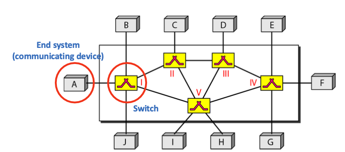

## Packet-Switched Networks

- A message (end system -> end system) is divided into **packets**
- The size of the packet is determined by the network and the governing protocol
- **No resource reservation**
  - resources are allocated on demand
  - no reserved bandwidth on the links
  - no scheduled processing time for each packet
- The packet _must wait_ if another is processing, when a switch receives a packet
- Subcategory
  - datagram networks
  - e.g, _The Internet_ -> Internet Protocol (IP)

## Datagram Networks

- Packets = _datagrams_
- Switchesw = _routers_
- **Network layer**: where datagram switching is done
- Packets of the same message may travel different paths to reach their destination -**non-uniform delay**for packets of a message
- Possibily of _out-of-order_, _lost_, _dropped_ packets
  -> handled by **upper-layer protocols**(usually transport-layer)
- No setup or teardown phases
- The destination addresses and the corresponding forwarding output ports are recored in the _routing(forwarding) tables_ of routers
- The network layer provides a **connectionless service**
  - the router does not keep information about the connection state
  - each packet is an _independent entity_
  - _no relationship_ between packets belonging to the same message

# Service of Network Layer

- **Packetizing**
- **Routing and forwarding**
- Error control (checksum filed to the datagram to control any corruption in the header, but not in the whole datagram)
- Flow control (usually implemented in transport layer)
- Congestion control (usually implemented in transport layer)

## Packetizing (network layer)

- Definition:
  **encapsulating** the payload(data received from upper layer) in a network-layer packet at the source and **decapsulating** the paylod from the network-layer packet at the destination
- Network layer's duty
  - carry payload from the source to the destination without changing it or using it
- Source host
  - receiving payload from an upper layer protoco
  - adding a header (including _src_ and _dst_ IP address)
  - deliverying the packet to the data-link layer
  - may fragment packets
- Routers on the path
  - not allowed to change the src or dst network addresses (i.e., IP address)
  - may fragment packets
- Destination host
  - receiving the network-layer packet from its data-link layer
  - decapsulating the packet
  - delivering the payload to the corresponding upper-layer protocol
  - if packets are fragmented, reassemble them before delivery to upper-layer

## Routing (network layer)

- Routing the packets from source to destination
  - choosing the **best route** among all possible routes by using routing protocols
- Routers implement the physical layer (1), data-link layer(2), network layer(3) of the TCP/IP protocol stack
- A **router connects networks**
  - router is an inter-networking device
- A router has a _link-layer address_(MAC address) and _IP address_ for each of its interfaces
  - each link may use its own data-link or physical protocol
- The router _modifies_ the source and destination link-layer (MAC) addresses of the packet before forwarding the packet
  - because MAC address ahve only local jurisdictions
- The router ONLY works on packets whose _link-layer destination address = the link-layer address of the interface_
- Router as a network-layer device
  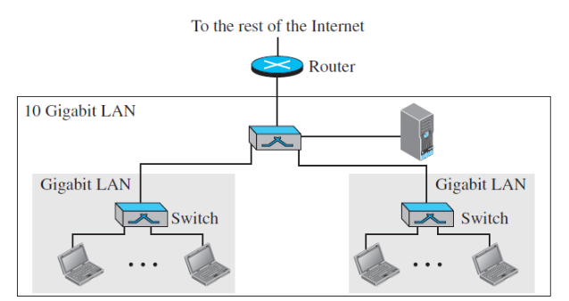

### Routing(Forwarding) Table

- The routing tables are dynamic and updated periodically
- The destination IP address is _fixed_ during the entire djourney of the packet
  - to **send error messages to the soruce** if the packet is discarded
- The forwarding decision is based on teh destination IP address of the packet
  - 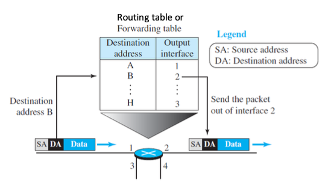

## Error Control

- **Checksum** filed in the **header of datagram** to control any corruption in the header, _not in the whole program_
- The packet in the network layer may be _fragmented_ at the router, so whole datagram error control is ineifficient

# Measure Performance of the Network Layer

## Delay (Latency)

- A measure of **how long it takes** for an entire message to completely arrive at the destination from the time the first bit is sent out from the source
  > Total Dealy = (Dealy)pr + (Delay)tr + (Delay)pr + (Delay)qu
- total delay = nodal processing delay + transmission dealy + propagation delay + queueing delay (waiting for transmission)

### Transmission Delay(time)

- time take to push all bits of a message/packet onto the link
- depneds on _the side of the message_ and _the bandwidth_(transmission rate) of the channel
  > (Delay)tr = Packet Length / Transmission rate

### Propagation Delay(propagation time)

- the time required for a bit to travel from the source to th e destination
- depends on _the medium_
- in a vaccum, speed = 3 \* (10)^8 m/s (lower in air and cable)
  > (Delay)pg = Distance / Propagation Speed

#### Propagation and Transmission Time Example

```
What are the propagation time and the transmission time for a 3.5-KB (kilobyte) message (an email) if the bandwidth of the network is 1 Gbps? Assume that the distance between the sender and the receiver is 15,000km and that light travels at 2.4 * (10)^8 m/s
```

    >(Delay)pg = 62.5ms
    >(Delay)tr = 0.028ms

### Processing Delay (processing time)

- the time required to process a packet in a router or destination host
- can be different for each packet, not burnally is calculated as an average

### Queuing/Waiting Dealy

- the time needed for each intermediate or end device to hold the mesage before it can be processed
  - mostly referred to the _waiting time of a packet in input/output ques of a router_
- changes with the load incurred on the network
- a router has an **input queue** connected to each of its input ports to store packets waiting to be prosessed
- the router also has an **output queue** connected to each of its output ports to store packets waiting to be transmitted

## Total Delay (Latency)

- source-to-destination delay for a packet
- assume equal delays for the sender, routers, and receiver
  > n : nubmer of routers
  > n + 1 : links
  > n + 1 : transmission delays related to n router and the source
  > n + 1 : processing delays related to r routers and the destination
  > n : queueing delays related to n routers
  > total delay = (n + 1)((Delay)tr + (Delay)pg + (Delay)pr) + (n)((Delay)qu)

## Throughput

- a measure of how we fast we can actually send data through a network
- different from _bandwidth_ in bits per second
  - bandwidth is a **potential measurement** of a link
  - a link may have a bandwidth of _B bps_
  - we can send _T bps_ through this link (_T < B_)
  - **max throughput = digital bandwidth capacity**
- the throughput of the whole path from source to destination
  - indicated by the _bottleneck link_, which is the link with the minimum data rate(tansmission rate)
  - for a paty with n links
    > Throughput = min{(TR)1, (TR)2, ... , TR(n)}
    - 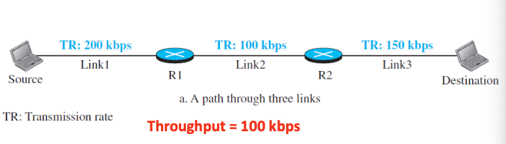
  - on the internet, the data normally passes through two access networks and the internet backbone (very high transmission rate)
    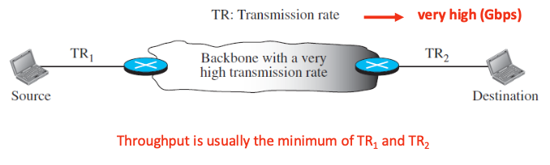
- example
  ```
  A network with badnwidth of 5 Mbps can pass only an average of 15000 packets per minute with each packet carrying and average of 10000 bits. What is the throughput of this network?
  ```
  > 2.5 Mbps

### Throughput in a Shared Link

- when the transmission rate of a link between two routers is shared between multiple flows
  - the transmission rate of the main link in the calculation of the throughput is only 200kbps because the loink is shared between three flows
  - 100 each
    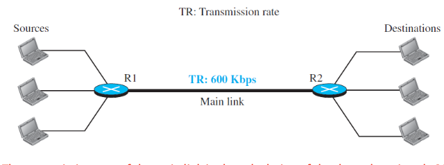

## Packet Loss

- The number of packets lost can severely affect performance
- The size of the input buffer(queue) of the router is limited
- If the buffer is full, **the next packet needs to be dropped**
- Impact of the packet loss on the Internet network layer:
  - the packet needs to be **re-sent**, which in turn may create overflow and cause more packet loss

### JItter

- the variations in delay
  - if different packets of data encouter different delays, the application using the data at the receiver site is time-sensitive (audio and video data)
  - example
    - if the delay for teh first packet is 20ms,the seoncd is 45ms, and for the third is 40ms
    - the real-time application tat uses the packets endures jitter

# IPv4 Address

- Internet Protocol version 4 addresses is a **32-bit address** that uniquely and universally defines the **connection of a host** or **a router** to the Internet
  - **uniqueness**
    - each address defines one, and only one, connection to the internet
  - **universality**
    - the addressing system must be accepted by any host that wants to be connecetd to the Interent
- The **IP address** is the **address of the connection**, not the host or the router
  - if the device is moved to another networ, the IP address may be changed

## IPv4 Address Space

- the total number of addresses used by the protocol
- if a protocol uses _b_ bits to define and address, the **address space** is **$(2)^b$**
- IPv4 uses _32-bit_ addresses, which means the address space is
  > $2^(32)$

## Three Common Notations to Show an IPv4 Address

1. Binary Notation
2. Dotted-decimal Notation : compact and easier to read
3. Hexadecimal Notation : used in network programming

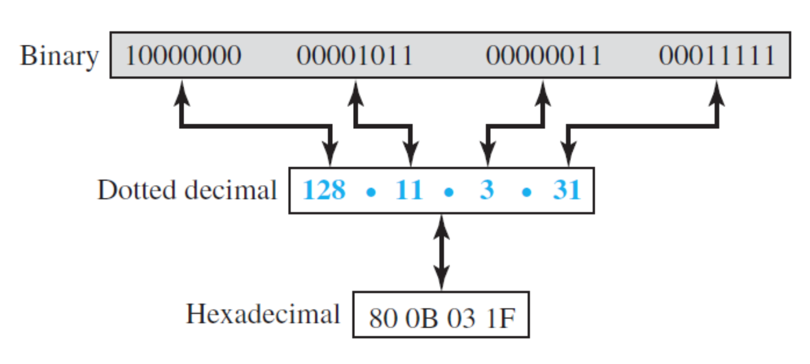

# Scheme

## Hierachy in Addressing in 32-bit IPv4 Address

- two parts
  - prefix: _n_ bits - defines network
  - surfix: _$32-n$_ bits - defines connection to the node

## Clssful Addressing

- obsolete due to address depletion (resulting from improper distribution of addresses in classes)

- address depletion / shortage from classful addressing

1. short term solution
   - **Classless addressing**
     - use the same IPv4 address space
     - changes the distribution of addresses to provide a fair share to each organization
   - **NAT**
     - network address translation
2. long term solution
   - **IPv6**
     - larger address spacce
     - length of IP address is required to be increased, which means the format of the aIP packests needs to be changed
     - **$2^(128)$**

## Classless Addressing

- Motivation
  - Ipv4 Address depletion
  - The emergence of ISPs (internet service providers)
    - an ISP is granted a large range of addresses and then subdivides the addresses and assigns them to customers
- The whole address space is divided into **variable length blocks**
- **Prefix**: defines the block (network), length $0 - 32$
- **Suffix**: defines the node (device)
- Restriction
  the number of addresses in block needs to be a power of 2
  - $2^0, 2^1, 2^2, ... 2^32$ addresses
- The **size of the network** is inversely proportional to the **length of the prefix**
  - a small prefix = larger network
  - a large prefix = smaller network
- An organization can be granted one blcok of address
  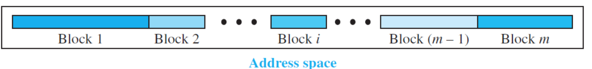

### Classless Interdomain Routing (CIDR)

- The prefix length(**mask**), **n**, is added to the address, separated by a slah
- this notation is referred to as **CIDR** (slash notation)
  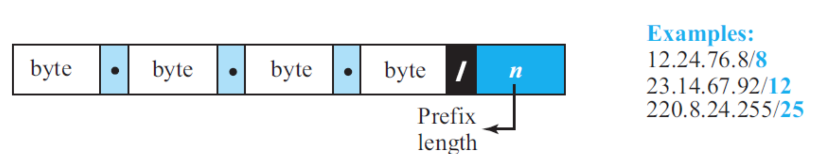

### Extracting Information from an Address

- The number of address
  > $N =  2 ^(32 - n)$
- The first address in the block : **network address**
  > keep the _n_ leftmost bits and set the _(32-n)_ rightmost bits all to **0**s
- The last address in the block
  > keep the _n_ leftmost bits and set the _(32-n)_ rightbost bits all to **1**s

#### Network Address

- The first address in the block
- it is used in _routing the packet to its destination_

##### Classless Addressing Example

```
A classelss address is given as 167.199.170.82/27. Find the number of addresses as well as the first and the last address
```

> number of address = $2^5$
> first address = 167.199.170.64/27
> last address = 167.199.170.95/27

```
In classless addressing, and address cannot per se define the block the address belongs to
For exampe, the address 230.8.24.56 can belong to many blocks. Some of the are shown below with the value of the prefix associated with that block
```

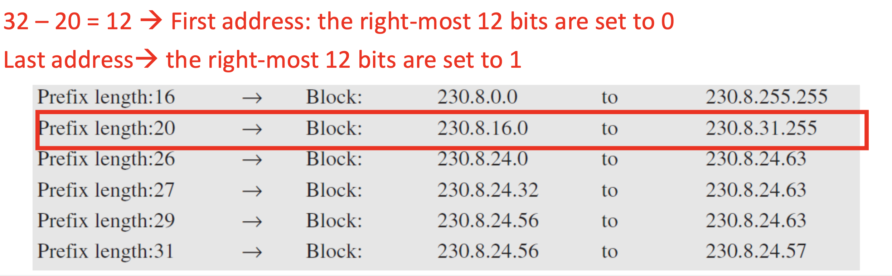

### Address Mask (Subnet Mask)

- The address mask is a 32-bit nubmer in which the _n_ leftmost bits are set to *1*s and the rest of the bits _(32-n)_ are set to *0*s
- e.g., 167.199.170.82/27 subnet mask is 256.256.256.224
  - 11111111.11111111.11111111.111 00000

### Block Allocation

- block allocation is the responsibility of a _global authority_ called the internet coroportation for assigned names and numbers (ICANN)
- ICANN assigns a alrge block of addresses to an ISP(or a larger organization)
- two restrictions are applied to the appocated block:
  1. the number of requestsed addresseds, _N_, needs to be a **power of 2**
  2. the first address needs to be divisible by the number of addressed in the block

#### Block Allocation Example

```
An ISP has reqeustsed a block of 1000 addresses. How how may addresses will be granted by the ISP and verify the allocation
```

> 1024 addresses
> prefix length $n = 32 - log(2)1024 = 22$
> available block 18.14.12.0/22 is granted to the ISP
> the first address in decimal is 302,910,464, which is divisible by 1024
> 00010010 00001110 00001100 00000000 mod 1024 = 0

# Subnetting

- Subnetting is **the process of creating a subnetwork**
- creates more levels of hierachy
- an organization (or an ISP) that is granted a range of addresses may divide the into several subranges and assign each subrange to a subnetwork (or subnet)
  - a subnetwork can be divided into several sub-subnetworks
  - a sub-sub entwork can be dividien into several sub-sub-sub...

## Designing Subnets

- Assumptions
  - **N**: the total number of addresses granted to the organization
  - **n**: the prfix length
  - **N<sub>sub</sub>**: the assigned number of addresses to each subnetwork
  - **n<sub>sub</sub>**: the prefix length for each subnetwork
- To guarantee the proper operation of the subnetworks
  1. the number of addresses in each subnetwork should be a **power of 2**
  2. the prefix length for each subnetwork should be found by
     > n<sub>sub</sub> = 32 - log<sub>2</sub>N<sub>sub</sub>
  3. the starting address in each subnetwork should be divisible by the number of addresses in that subnetwork
     - this can be achieved if we first assign addresses to larger subnetworks
- The subnetworks in a subnet should be carefully designed to enable the routing of packets
- After designing the subnetworks, the information about each subnetwork, such as first and the last address, can be found using the process we described to find the information about each network in the Internet

### Designing Subnets Example

```
An organization is granted a block of addresses with the beginning address 14.24.74.0/24.
The organization needs to have 3 subblocks of addresses to use in its three subnets:
one subblock of 10 addresses,
one of 60 addresses
one of 120 addresses. Design the subblocks.
```

> The first address is 14.24.74.0/24
> The last address is 14.24.74.255/24

> first address in this block is 14.24.74.0/25
> last address is 14.24.74.127/25.

> first address in this block is 14.24.74.128/26
> last address is 14.24.74.191/26

> first address in this block is 14.24.74.192/28
> 14.24.74.207/28

### Special Addresses

1. **This-host address**: the only address in this block `0.0.0.0./32`
   - whenever a host needs to send an IP datagram
   - host doesn't know its own address to use as the source address
2. **Broadcast address**: the only address in this block `255.255.255.255/32`
   - whenever a router or a host needs to send a datagram to all devices in a network
   - the routers in the network block the packet having this address as the dstination
   - the packet cannot travel outside the network
3. **Loopback address**: the block `127.0.0.0/8`
   - a packet with one of the addresses in this block as the destination address never leaves the host
   - testing a peice of software in the machine
   - running some services
4. **Private addresses**
   - `0.0.0.0/8`, `172.16.0.0/12`,`192.168.0.0/16`, and `169.254.0.0/16`
5. **Multicast addresses**
   - `224.0.0.0/4`

# Forwarding of IP Packets

- The interent today is made of a combination of links (networks)
- **Forwarding**: to deliver the packet to the next hop
  - hop can be the final destination or the intermediate conencting device
  - based on the **destination address of the IP datagram**
    - traditional approach and prevalent today
- IP protocol was originally designed as a connectionless protocol

## Forwarding based on Destination Address

- Destination-basd forwarding requires a host or a router to have a **forwarding (routing) table**
- In classess addressing:
  - one row of information is added to the forwarding table for each block invloved
    - information: **mask** + **network address**, **interface number**, **IP address** of the next route
- Forwarding table needs to be _seacrched based on the network address_
  - (i.e., the first address in the block)
- Search:
  - the router looks at each row.
  - the _n_ leftmost bits of the destionation address (prefix) are kept, and the rest of the bits(suffix) are set to *0*s
  - if the resulting address(network address) matches the address in the first column, the information in the next two column is extracted;
    else the search continues
    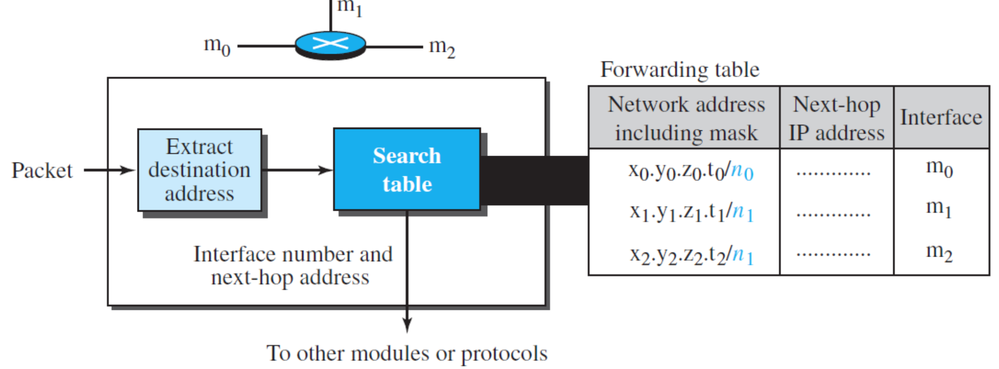

## Address Aggregation

- Address summarization/route summerization
- When the number of row in the fowrading table increases
  -> the time to search the table increases
- **Address aggregation** to allocate the above problem
  - when blcoks of addresses are combined to create a larger block, _routing_ can be done based on the prefix of the larger block
  - one of advantages of _CIDR_ strategy
- ICANN assigns a large blcok of addresses to an ISP
  - each ISP in turn divides its assigned blcok into smaller subblocks and grants the subblocks to its customers

## Longest Mask Matching

- A routing principle in classless addressing
- States that the forwarding table is sorted from **the longest mask to the shortest mask**
- When a router receives the IP packet, it compares the **destination IP address bit-by-bit with prefixes in the routing table**
  - the prefix with the most matching bits is the prefix that the router will use

### Longest Mask Matching Example

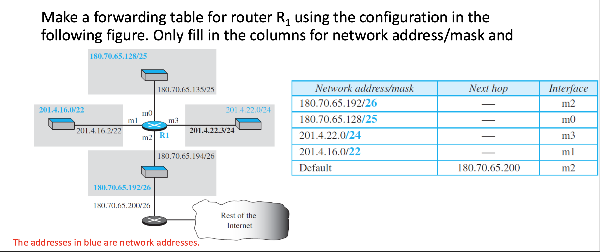

## Hierachial Routing

- To solve the problem of gigantic forwarding tables, we can create a sense of hierachy in the forwarding tables:
- The Internet
  - backbone ISPs
  - national ISPs
    - Regional ISPs
      - local ISPs
- **unlimited levels of hierachy** in classless addressing as long as the rules of addressing are followed
  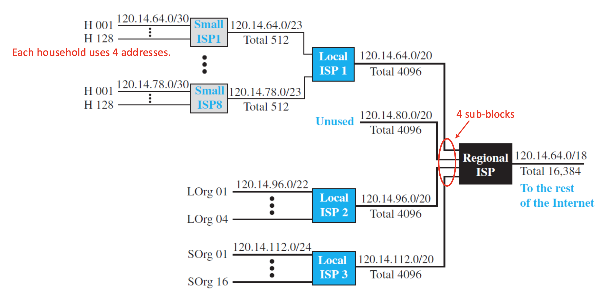

# Dynamic Host Configuration Protocol (DHCP)

- An **application-layer program**(protocol): using the client-server paradigm that actually helps TCP/IP at the network layer
- IP addresses must be assigned to the individual hosts or routers after a block of addresses are assigne dto an organization
  - **Manual assignment**: by the network administration
  - **Automatic/Dynamic assignment**: using DHCP(network admin configures it)
- DHCP can be configured to assign
  - **permanent IP addresses** to the host and routers
  - **temporary**, on demand, IP addresses to hosts
    (e.g., traveller staying at a hotel to connect a laptop to the Internet)

# Network Address Translation (NAT)

- In most situations, only a portion of computers in a small network need access to the Internet simultaneously
  - the num of allocated addresses does not have to match the number of computers in the network
  - company usually uses private IP addresses for internal communication
  - a set of _universal (public/global) IP addresses_ assigned by an ISP are used for universal communication
- NAT is a technology that provides **mapping between the private and universal IP addresses**
- All of the outgoing packets go through the NAT router, which replaces the source address in the packet with the global NAT address.
  - all incoming packets also pass through the NAT router, which replaces the destination address in the packet (the NAT router global address) with the appropriate private address
    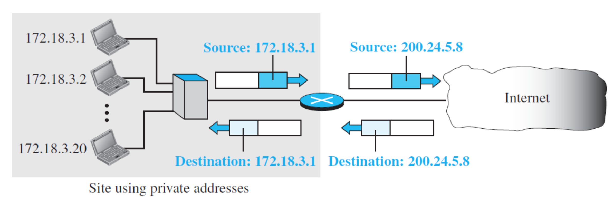

## NAT Translation Table

- Translating the source addresses for an outgoing packet is straightforward
- NAT router has a **translation table** to know the destination address for a packet coming from the Internet
  - NAT-enabled router is hiding the details of the home network from the outside world
    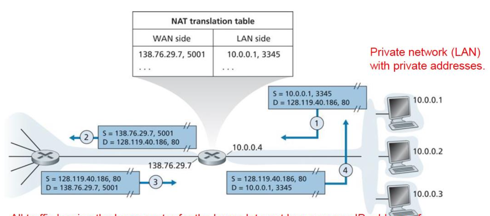

## NAT Advantages

- Just _one_ IP address can be used from the ISP for _all_ devices
- The address of hosts in a local network _can be changed_ without notifying outside world
- A different ISP can be chosen without changing addresses of devices in local network
- **Security**: devices inside local net not directly addressable, visible by outside world
- NAT has been extensively used in home, institutional nets, 4G/5G cellular nets

# Summary

- datagram networks provide **connectionless service**
- internet is a **packet-switched network**
- main servicse of network layer: **packetizing, routing, forwarding**
- **total delay** ahs four compenents: transmission delay, propagation delay, processing delay, and queuing delay
- the **end-to-end throughput** is limited by the slowest link on the path
- The main services provided by the network layer are **packetizing** and **\*routing** the packet from the source to the destination
- Addressing in IPv4
  - two address distribution mechanisms: classful and classless addressing
- **Destination-based routing** by the routers
- **DHCP** to dynamically assign IP addresses to hosts and routers
- Temporary alleviating address shortage in IPv4 using **NAT**
