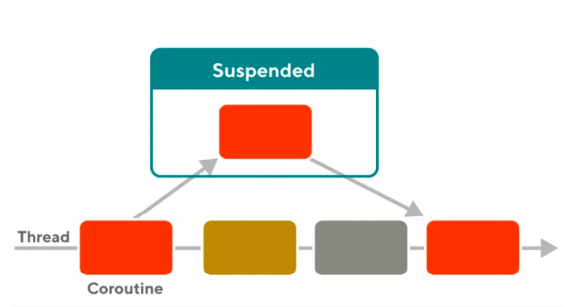
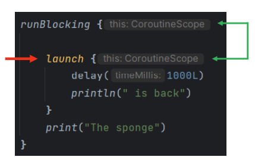
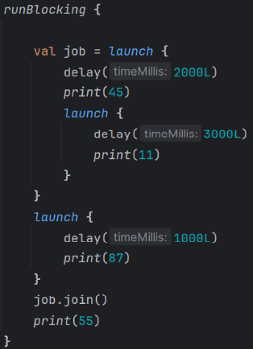
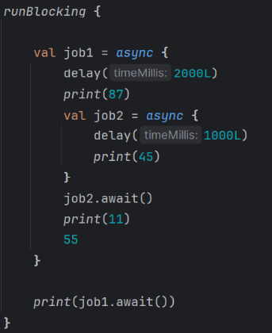
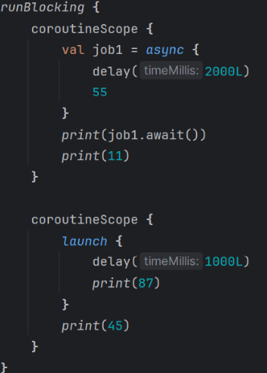
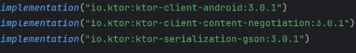
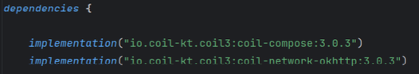
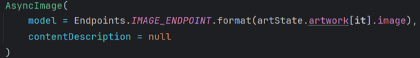

# Coroutines & API

## Asynchronous Programming

- The execution of one tas isn't depenedt on another (aka. non blocking)
- All our code in this course so far has run _synchronously_
  - the execusion of each operation depends on completing the one before it
- Asynchronous operations allow a program to be more efficient
  - e.g. making a request to server without freezing the screen

### Asynchronous Tools

- AsyncTask (deprecated, unstable)
- Executors and Future (java)
- RxJava & RxKotlin (popular)
- **Coroutines** (recommended for Kotlin)

### Coroutines

- A concurrency design pattern
- A coroutine can be compared to a thread but are different at the lower level
  - At the lower level, a coroutine saves states and runs at later time
    - uses _continuations_ under the hood; a special type of callback
    - can be done a single thread
- The way a coroutine saves state it through _suspending_ functions
- To make a function suspending we use the **suspend** modifier
  ```kotlin
  suspend fun mySuspendingFunction()
  ```
- When a coroutine calls a suspending function, the coroutine is suspended
- Once suspended its state gets saved and the regular flow of operations continue (aka. non-blocking)
- When the suspended operation completes (e.g. an http request), its state is restore back with the regular flow of operations
  
- Call suspend functions only from other suspend functions or directly within coroutine
- To create a coroutine we use a coroutine builder
  - runBlocking
    - blocks current thread, usually used at the top level of application
  - launch
    - non-blocking; returns a _job object_ and does not provide a result
  - async
    -non-blocking: returns a _Deffered Job_ which provides a result

#### Kotlin Coroutine

- A _CoroutineScope_ defines the lifetime and the context of a coroutine
  every coroutine will need a _CoroutineScope_
  `runBlocking{}`
- We must provide our own _CoroutineScope_, but it is created internally using _runBloking_
- **delay**

  - a suspending function that delays the coroutine for a given duration
  - since _runBlocking_ blocks the current thread, the above is like using _Thread.sleep_

  ```kotlin
  fun main() {
      runBlocking{
          print("The sponge...")
          delay(1000L)
          println("is back!")
      }
  }
  ```

  own suspend function

  ```kotlin
  fun main() {
      runBlocking{
          someFun()
      }
  }

  suspend fun someFun(){
      print("The sponge...")
      delay(1000L)
      println("is back!")
  }
  ```

- The **launch** coroutine builder creates a non-blocking coroutine

  - It can only be called with a _CoroutineScope_
  - it inherits runBlocking's _CoroutineScope_  
     

- We could also move all of this in to a suspend function and provide our own _CoroutineScope_ suing the **coroutineScope**

  ```kotlin
  fun main() {
      runBlocking{
          someFun()
      }
  }

  suspend fun someFun() {
      coroutineScope{
          launch {
              delay(1000L)
              println("is back!")
          }
          print("the scope...")
      }
  }
  ```

- The returend _Job_ obejct cna be used to manage our coroutine

  - **join**: waits untilo coroutine is finished

  ```kotlin
  runBlocking{
      val join = launch {
          delay(1000L)
          println(" is")
      }

      print("The sponge")
      job.join()
      println(" back")
  }
  ```

- We use **async** over _launch_ when we want a returend result

  - **await**: waits until coroutine is finished and provides a result

  ```kotlin
  runBlocking{
      val defferedJob = async {
          delay(1000L)
          " is" // returns a Deffered of type String
      }

      print("The sponge")
      print(defferedJob.await())
      println(" back")
  }
  ```

- Launch and async can also be **cancelled**
  ```kotlin
  val job = launch {
      println("The sponge is on his way...")
      repeat(1000){
          println("waiting...")
          delay(1000L)
      }
  }
  delay(5000L) // timeMills
  job.cancel()
  ```

##### Example

What will be printed?

1.  
    > 1. 87451155
2.  
    > 2. 87451155
3.  
    > 3. 55114587

## HTTP Request

- A common asynchronous task is to make an HTTP request
  -CONNECT, GET, POST, etc to and from and API
- An HTTP reqeust can take time, especially if the network is poor
  - we don't want to freeze our app(aka. block the main thread)
- There are many ways to make HTTP requests
  - use the java standard library - HttpURLConnection
  - use a third-party library such as Ktor

## Serialization and Deserialization

- Serialization
  - converting your data into a format that can be stored or transmitted
    - e.g., across a network
- Deserialization
  - converting that format back into a data structure
- Serializing data into JSON format is popular and simple
  - JSON: text-based format that uses key-value paris and arrays

## Allow Interent Access for Your App

- update system permissions first
- AndroidManifest.xml -> <use-permission android:name="android.permission.INTERNET"/>

## Ktor

- Built using Kotlin Coroutines and provides us with
  - making HTTP requests
  - JSON Serialization and deserialization
- Need a few dependencies
  
- Ktor's _HttpClient_ is built using Coroutines
  ```kotlin
  private val clinet = HttpClient{}
  ```
  - _HttpClient_ is the entry point for creating asynchronous HTTP requests
- Ktor ahs many JSON serializers but the one we will use is **GSON**
  - We only want to have one instance of the _HttpClient_ across the lifecycle of the application
  ```kotlin
  val clinet = HttpClient{
    install(ContentNegotiation){
        gson()
    }
  }
  ```

## Consuming an API

- Application Programming Interface
  - allows a way for 2+ computers to communicate
- Most modern APIs provide their data in JSON format
- First important to determine what data you want in your app
- Many APIs provide far more data than is needed for the programm requesting the info

- Automated tools for creating data models
  - online JSON formatters
  - JetBrains plugin (JSONToKolinClass)
  - or create yourself

### Understanding JSON

    - key(always string) and value(an object wrapped in{}, array warpped in {}, string, number, boolean) pair

## Consuming an API

- The **variable name** needs to match the name in the JSON

  ```kotlin
  data class Art(
      @SerializedName("data")
      val pieces: List<ArtPeice>
  )

  data class ArtPeice(
      val id: String,
      val title: String,
      @SerializedName("./img/image_id")
      val ./img/image: String?
  )
  ```

- Endpoints
  - URLs that represent specific resources or actions in an API
- Make endpoiunts constants
  - sometimes multiple endpoints
    ```kotlin
    enum class ApiEndpoints(val url:String) {
        BASE_URL("https://www.google.com"),
        ARTWORKS("${BASE_URL.url}/artworks")
    }
    ```
- Call the HTTP request GET

  - since this is business logic, we should put it in a Repository
  - Kotr's **client.get** is a suspend fucntion so we need to put this in another suspend function

  ```kotlin
    class ArtRepository(private val client: HttpClient) {
        suspend fun getArtwork(): Art {
            val response = client.get(ApiEndpoints.ARTWORKS.url)
        }
    }
  ```

- _HttpResponse.body_ provides us with the _Json_ in type JsonObject

  ```kotlin
    suspend fun getArtwork(): Art{
        val response = client.get(ApiEndpoints.FIELDS1.url)
        val json = response.body<JsonObject>().toString()

        return deserializedJson(json)
    }
  ```

- Use GSON to deserialize the Json object into a new instance of our **data model**
  ```kotlin
  private fun deserialization(json: String): Art {
      return Gson().fromJson(json, Art::class.java)
  }
  ```
- Once our repository is set up, we can set up our state holder

  - _getArtwork_ is **suspending** so it needs to go in another suspend function

    ```kotlin
    class ArtState(private val artRepository: ArtRepository) {
        var artwork = mutableStateListOf<ArtPeice>()

        suspend fun getArtwork(){
            artwork.also {
                it.clear()
                it.addAll(artRepository.getArtwork().peices)
            }
        }
    }
    ```

- _LaunchedEffect_ is a composable and coroutine

  - useful for running suspend functions in the scope of a composable
  - LaunchEffect will re-launch if the **key** changes
  - LaunchEffect will not re-launch if composed and the **key** doesn't change

  ```kotlin
  setContent{
    val artState = ArtState(artRepository)

    launchedEffect(artState) {
        artState.getArtwork()
    }

    MainContent(artState)
  }
  ```

- if API provides ./img/images, need to obtain the correct URL
  ```kotlin
  ./img/image_ENDPOINT("http://www.google.com/./img/image.jpg")
  fun format(str: String?): String {
    if (str == null) return ""
    return url.format(str)
  }
  ```

### Coil

- Coil is an ./img/image loader libarary for jetpack compose
  
  
