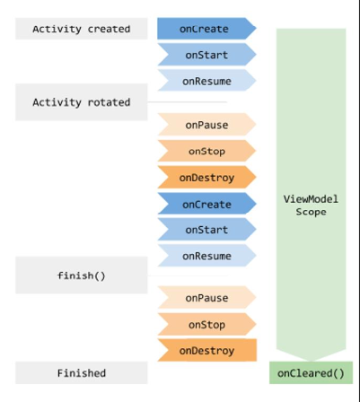

# ViewModel and Flows

## rememberSaveable

- works like the remember composable

  ```kotlin
  var search by rememberSaveable{
      mutableStateOf("")
  }
  ```

  - difference: state will also be remembered across configuration chagnes

- _rememberSavable_ can only save satate across configuration changes for primitive types and strings
  - only types taht can be stored in a Bundle

## rememberCoroutineScope

- When working with composables, we may need to launch a coroutine that is _not_ within a composable directly
  - i.e., a button's onClick event
  ```kotlin
  Button(onClick = {
      // cannot use LaunchedEffect here
  }) {
      Text("Search")
  }
  ```
- rememberCoroutineScope is a composable that returns a _CoroutineScope_
  - The scope is bount to its point in composition
    tied to its parent composable lifecycle
    ```kotlin
    @Composable
    fun Home(navController: NavController) {
        val scoope = rememberCoroutineScope()
    }
    ```
- Use the scope to launch coroutines within callback evetns
  - if its parent(home composable) leaves the composition, all its coroutines will be cancelled
  ```kotlin
   Button(onClick = {
    scope.launch {
        artState.search(search)
    }
  }) {
      Text("Search")
  }
  ```

## ViewModel

- A _ViewModel_ is a type of state holder that is lifecycle aware
  -survives configuration changes
  - Bound to the activity
    - we can share data easily across entire activity
- Allow us to use launch coroutines within its own scope
- Integrates well with other jetpack loibraries
- To make a class a ViewModel, extend the *ViewModel*class

  ```kotlin
  import androidx.lifecycle.ViewModel

  class ArtState(private val artRepository: ArtRepository): ViewModel()
  ```

- A _ViewModelState_ object is retained through configuration chagnes
- When creating a ViewModel, we need to scope it ot a _ViewModelStoreOwner_

  - ComponentActivity(default)
  - NavBackStackEntry (useful for navigation)
    

- To create one, we use the _viewModel_ function

  ```kotlin
    // the viewModel is scoped to the ComponentActivity ViewModelStoreOwner
    setContent{
        viewModel(LocalContent.current as ComponentActivity) {
            ArtState(artRepository)
        }
    }
  ```

- We could also scope it to a _NavBackStackEntry_ ViewModelStoreOwner

  ```kotlin
    NavHost(navController, "home") {
        composable("home"){
            // scope viewModel(navController.getBackStackEntry("home")) {
                ArtState(artRepository)
            }
            Home(navController)
        }
    }
  ```

- Once it's created, we can return the existing one by providing the same scope

  - Need to provide the _ViewModelStoreOwner_ it was scoped to when created
    ```kotlin
    @Composable
    fun Home(navController: NavController) {
        val artState: ArtState = viewModel(navController.getBackStackEntry("home"))
    }
    ```

- We can now share data across multiple destinations

  ```kotlin
  // destination 1
  @Composable
  fun Home(navController: NavController) {
      val artState: ArtState = viewModel(navController.getBackStackEntry("home"))
  }

  // destination 2
  @Composable
  fun Details(navController: NavController) {
      val artState: ArtState = viewModel(navController.getBackStackEntry("home"))
  }
  ```

- **viewModelScope**: launch coroutines within the scope of the ViewModel
  - it will not be cancelled unless the activity is destoryed, or we cancel manually
    ```kotlin
    fun launchSearch(str: String){
        viewModelScope.launch {
            delay(4000L)
            search(str)
        }
    }
    ```

## Sequences

- A sequence is like a collection, but elements are processed lazily
  ```kotlin
  val sequence = sequenceOf(1,2,3,4)
  ```
- The elements are only procssed when they are **consumed**

  ```kotlin
  val list = sequence.toList()
  ```

- A _terminal operation_ (aka the consumer) needed to consume elements
  - A terminal operation is any operation where we iterate the values in a sequence
    -toList,sum, count
- When multiple steps are invovled -> sequences

- Each processing step does not return a new collection
- Only when we use a termial operation does any processing happen

  ```kotlin
  val sequence = sequenceOf(1,2,3,4)
        .filter{ it < 3}
        .map{ it + 1 }
        .take(n)

  // terminal operation
  val list = sequence.toList()

  ```

- regular collection retuns a new collections
  ex. listOf()
- Sequences also have a different execution order than collections
- A sequence performs all processing steps for a single value before moving to next value
- A collection perfrom one processing step for all elements before moving to next processing step
- The order is important bc a sequence often has fewer processing steps
  -e.g.
