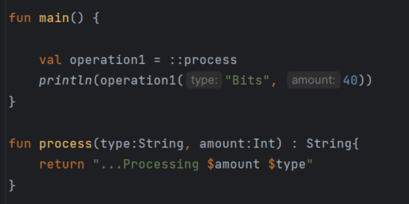
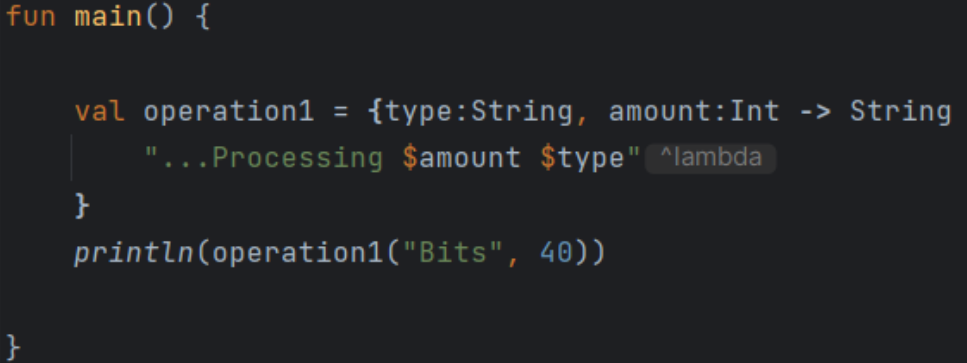
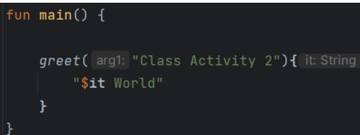
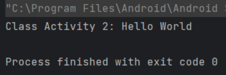
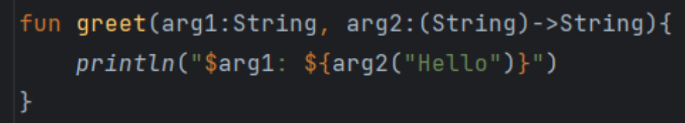

# Basics

## Functions

- default access modifier is `public
- default return type is `Unit`
- functions can be declared outside of classes

### Named Arguments

- Change the order we pass in arguments

```kotlin
greet(arg2=1, arg1="Someone")
fun greet(arg1: String, arg2: Int) {
    println("$arg1 has $arg2 friends")
}
```

### Default Arguments

- If set a **default value** for a parameter, we don't need to pass

```kotlin
greet(arg1="Someone")
fun greet(arg1: String, arg2: Int = 0) {
    println("$arg1 has $arg2 friends")
}
```

### Return Statement

- To exit out of a function before it ends
- A function can also return a value -> and exit

### Single Expression Function

- A function can be reduced down to a **single expression** if it returns a single statement
  - we can omit return type
  ```kotlin
    fun main() {
        val i = 30
        println(double(i))
    }
    fun double(arg: Int) = arg * 2
  ```

### Return Multiple Values

- Return a pair of values from a function

```kotlin
fun twoValues(): Pair<String, Int>{
    return "Sponge" to 3 // Pair("Sponge", 3)
}
```

- Triple

```kotlin
fun three(): Triple<String, Int, Int> =
    Triple(
        "Sponge",
        3,
        3
    )
```

    - we can deconstruct a Pair and Triple
    ```kotlin
    val(species, numFriends, friend) = three()
    ```

### Maps

- To create a list of key-value pairs
- Cannot have duplicate keys
  - will overwirte the key with the new value

```kotlin
val map = mapOf(
    "k1" to "v1",
    "k2" to "k2",
    "k3" to "k3"
    "k3" to "k4"
)

println(map["k1"]) // v1
println(map.keys) // [k1, k2, k3]
println(map.values) //[v1, v2, v3, v4]
```

- `mutableMapOf`

```kotlin
map["k1"] = "v11"
println(map) // {k1=k11, ...}
```

### HashMap vs MutableMap

- MutableMap
  - keeps entries **in order** they were inserted
- HashMap
  - order not garanteed
- use `HashMap` over `MutableMap` if order doesn't matter

### Sets

- A `Set` is similar to a `List` but it can only have unique values
- `elementAt(n)`: to access the element at an index
- `mutableSetOf` to use `.add("A")`, `.remove("B")`

#### Sets vs Lists

- Cannot access the index of a `Set` and change it's contents
  - Use a `Set` over a `List` if you are working with unique elements

#### HashSet vs MutableSet

- `MutableSet` keeps entries in order they were inserted
- `HashSet` not guaranteed
- Use a `HashSet` over a `MutableSet` if order doesn't matter

### Functions can be Assigned to Variables

- Kotlin functions are first class
  - they can be assigned to variables, and they are of higher order

```kotlin
fun main() {
    val fact1 = fact("Sponge", 3)
}

fun fact(name: String, friends: Int): String {
    return "..."
}

```

### Anonymous Functions

- Use the `fun`keyword without a function name

```kotlin
val factAnonymous = fun (name:String, friends:Int): String {
    return ...
}
```

### Function Literals (Lambda)

- When no arguments

```kotlin
val fact1: () -> Unit = { println(...) }
```

- When one argument, use `it`

  - `it`: implicit name of a single parameter

  ```kotlin
  val fact1: (String) -> Unit {
      println(it)
  }
  ```

- When multiple arguments
  - define arguments in the body

```kotlin
val fact1: (Int, String) -> Unit = { friends: Int, name: String ->
    println("...")
}
```

- Lambdas with **type inference**

```kotlin
val fact1 = { friends: Int, name: String ->
    println("...")
}
```

### Functions as Parameters

- Kotlin uses **higher order functions**

  - functions can be parameters
  - functions can be returend from other functions

- Setting a function with a return type `Unit` as a parameter

  ```kotlin
  fun greet(fact: () -> Unit) {
      fact()
  }
  ```

- Just like other parameters, we can provide a **default value**

```kotlin
  fun greet(fact: () -> Unit = {}) {
      fact()
  }
```

- We can use **named argument** to invoke the function argument

```kotlin
  greet(fact={
    println(...)
  })
```

- if a function literal is the _last parameter_, it can be invoked at the end of the whole function (**trailing lambda**)

  ```kotlin
  greet("Hi") { name: String, friends: Int ->
        println(...)
    }

  fun greet(arg: String, fact: (String, Int) -> Unit) {
      println(arg)
      fact("sponge", 3)
  }
  ```

- You can assign the whole expression to a _variable_ and pass it

  ```kotlin
  fun main() {
    val fact = { name: String, friends: Int ->
        println("...")
    }

    greet("hi", fact)
  }

  fun greet(arg: String, fact: (String, Int) -> Unit) {
      println(arg)
      fact("sponge", 3)
  }
  ```

### Double Colon :: Operator

- It is common to have a large prebuilt function that you want to pass around instead of lambda
- As long as the parameters match, `::` operator allows us to pass a function reference

  - when function parameters match -> we can pass a function reference

  ```kotlin
    fun main() {
        greet("Hi", ::fact)
    }

    fun greet(arg: String, fact(String) -> String) {
        println(arg)
        return(fact("sponge"))
    }

    fun fact(name: String) : String {
        return ...
    }
  ```

  - if function parameters do not match, **provide default values**

  ```kotlin
    fun main() {
        greet("Hi", ::fact)
    }

    fun greet(arg: String, fact(String) -> String) {
        println(arg)
        return(fact("sponge"))
    }

    fun fact(name: String, friends:Int = 3) : String {
        return ...
    }
  ```

#### Class Activity

- Recreate this code using a lmabda function instead of a function reference
  
  

- Create greet function
  
  
  
