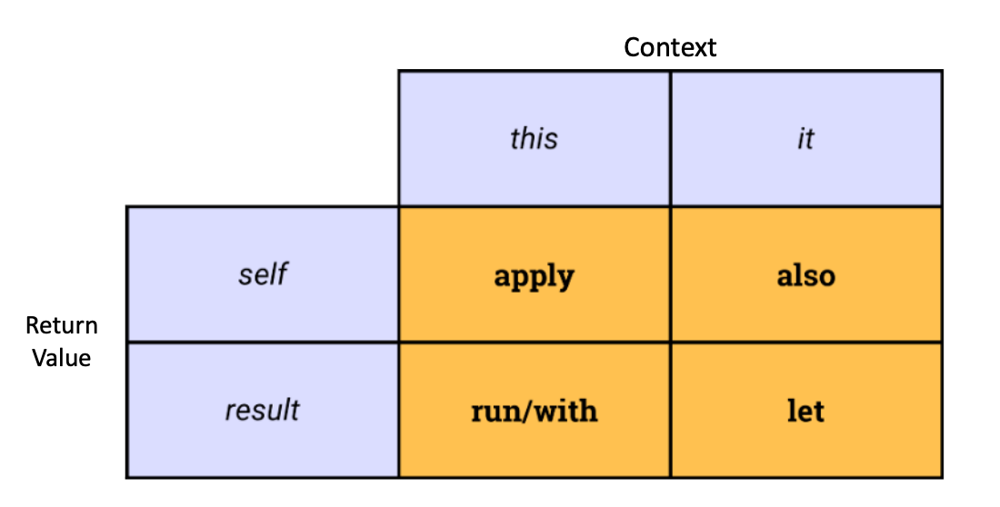

# Delegation & More

## Delegation

- Delegation is an OOP design pattern that Kotlin supports natively
- Delegation means delegaton responsibilities to another obbject
- Delegation is a way of aching association (has-a) between two objects rather than inheriting (is-a)
- We use delegation whenever
  - need some functionality of a class but not whole thing
  - need functionality from multiple classes
- **Interface Delegation** aka. : only works with interfaces

- Delegate (restaurant)
- Cafe class delegates it's responsibilities to it
- Kotlin support delegation natively, we can remove boilerplate code with
  - `by` keyword
    - make the property a regular parameter
    ```kotlin
    class BikiniBottomCafe(posSystem: POSSystem) : POSSystem by posSystem {
        ...
    }
    ```
- Common use case delegates: `Lazy`, `Observable`, `Vetoable`

### Lazy Delegate

- All properties can use the lazy delegate
- Initializing a property as lazy = it won't be initialized until it's first used
- Only be declared as `val`
  - it can only be initializd once
- When we make a property lazy, we delegate it's getter method to a `lazy()` function that tkaes in a lambda

  ```kotlin
  val lazyVal: String by lazy {
      "Hi"
  }

  lazyVal // execute the lambda and remember it's result
  lazyVal // return the remembered result
  ```

- When do we use it?

  - When need to delay the initialization of a property

  ```kotlin
  fun main() {
    val reg = RegularClass() // delay

    reg.heavy // only initialized once
    reg.heavy
    reg.heavy
  }

  class HeavyClass {
    init { println("...") }
  }

  class RegularClass{
    val heavy by lazy {
        HeavyClass()
    }
  }
  ```

  - When an expensive operation and aren't sure if or when it will actually be used

### Observable Delegate

- When we want to observe the changes in a property
- Delegate the property's setter method to a `observable()` function that takes in an initial value and a lambda
  - the lmabda provides the old and new value

```kotlin
fun main() {
    val sponge = Sponge()
    sponge.name = "Spongebob" // Bob, Spongebob
    sponge.name = "Mr. SquarePants" // Spongebob, Mr.SquarePants
}

class Sponge{
    var name: String by Delegates.observable("Bob"){_, oldVal, newVal ->
    println(oldVal)
    println(newVal)
    }
}
```

### Vetoable Delegate

- When we want to veto the changes to a property we can use the vetoable delegate
- We delegate the property's setter method to a `vetoable()` function that takes in an initial value, a lmabda and returns a Boolean
  - the lambda provides the old and new value
  - if the lambda returns true, then the changes will be made

```kotlin
fun main() {
    val sponge = Sponge()
    sponge.friends = -4 // not changed
    sponge.friends = 4 // changed
}

class Sponge{
    var friends: Int by Delegates.vetoage(3) {_, oldVal, newVal ->
    println(oldVal)
    println(newVal)
    newValue >= 0
    }
}
```

## Generics

- Generics allow us to define functions or classes that can work with different data types (Int, String, Double, etc)
- This is useful because we only have to write one piece of code for **multiple types**
- Use any letter for the generic type
- Common type parameters -`T`: type -`K`: key -`V`: value -`S`, `U`, `V`: 2nd, 3rd, 4th types
- Once a generic type is created
  - all other classes, objects, functions in that class can use the generic type as parameters
- We cam make a specific function getneric -`fun <T>sortElementFirst`
- Why we cannot use _Any_
  - generic provides type inference, so it will detect the specific type
  - `Any` doesn't have any type inference

```kotlin
fun main() {
    val list = listOf(1,2,3,4,5,6)
    val customerSortedList.= IntListUnits(list).sortElementFirst(3) // [3,1,2,4,5,6]
}
class ListUtils<T>(private val data: List<T>) {
    fun sortElementFirst(element: T): List<T> {
        val list = data.toMutableList()
        val indexOfElement = list.indexOf(element)

        return if (indexOfElement != -1) {
            list.removeAt(idnexOfElement)
            list.add(0, element)
            return list {
                else {
                    println("element doesn't exit")
                    data
                }
            }
        }
    }
}
```

## Comparing Objects

- Object variables, any object that is an instance of a class, **store their values as references** (aka. location in memory)

```kotlin
val sponge1 = Species("bob")
val sponge2 = Species("bob")
sponge1 == sponge2 // false
```

- Primitive types store their values with the data directly
- `==` is for comparing values

### Pass By Value

-**Pass-by-value**

- Kotlin passes its variables by value to a function

```kotlin
fun doSomething(s:Species) {
    s.name = "Sponge" // alter object's data
}

fun main() {
    val sponge = Species("Bob")
    doSomething(sponge) // pass in the value (memory location)
    sponge.name
}
```

## Data Class

- It is common to create a data class (POJO)
  - a simple class mainly used to hold data
- It is also common in Java for the POJO to
  - implement getters/setters for each data member
  - override the suplerclass' (object) toString, equals, and hashcode functions
    -kotlin uses `Any` not object
- Doing all this helps us manage and transfer our data
- In Kotlin
  - make `data cass`
    - cannot be `open` or `abstract`
    - cannot have a blank constructor
    - cannot be deconstructed
    ```kotlin
    data class Species(val name: String, val height: Int, val occupation: String)
    ```

## Scope Functions

- Funtions that execute a block of code within the context of an object
- The give _temporary scope_ to an object where _specific operations_ can be applied
- Scope functions make our code more concise and readable
  - five scope functions provided in the Kotlin standard library
    - `let`, `run`, `with`, `apply`, `also`
- We can differentiate thse scope functions in two ways
  - context: `it` or `this`
  - return value: `lambda result` or `itself`(context object)



### Let - scope function

- context: it
- return value: lambda result

```kotlin
val car = Car("ford", "red", 50).let{
    it.drive(50)
    it.paint("Blue")
    println(it) // it = Car object
}
// returns lambda result
// Car(make=ford, color=Blue, kilometers=50)
```

-`let` function is often used with null safety

```kotlin
val car2: Car? = null
car2?.let { car1` = it } // since car2 is null, the let function won't be applied
```

### Run - scope function

- context: `this`
  - when the context is using `this`, we can drop `this` compeletely
- return value: `lambda result`
  ```kotlin
  val car1 = Car("ford", "red", 50).run {
    drive(60) // drop keyward
    paint("Grey") // drop keyward
    this //Car(make=ford, color=Grey, kilometers=110)
  }
  ```

## With- scope function

- context: `this`
  - we can omit `this`
- return value: `lambda result`
- similart to run but syntax is slight differnet

```kotlin
val car1 = Car("ford", "red", 50)

with(car1){
    drive(80)
    paint("blue")
    drive(40)
}

println(car1) // Car(make=ford, color=blue, kilometers=170)
```

## Apply - scope function

- context: `this`
- return value: `itself` context object
  - since we return the context object, we don't need to return anything in the block

```kotlin
val car1 = Car("ford", "green", 20).apply{
    drive(20)
    paint("black")
}
println(car1) // Car(make=ford, color=black, kilometers=40)
```

## Run - scope function

- context: `this`
- return value: `lambda result`
- very similar to `let` but we use `this`
  - we can drop `this` completely
  ```kotlin
  val car1 = Car("ford", "red", 40).run {
    drive(40)
    paint("grey")
    this
  }
  ```

## Also - scope function

- context: `it`
- return value: `itself` context object
- similar to `apply` but we use `it`

```kotlin
val car1 = Car("ford", "red", 50).also {
    it.drive(30)
    it.paint("white")
    it.drive(60)
}
```
