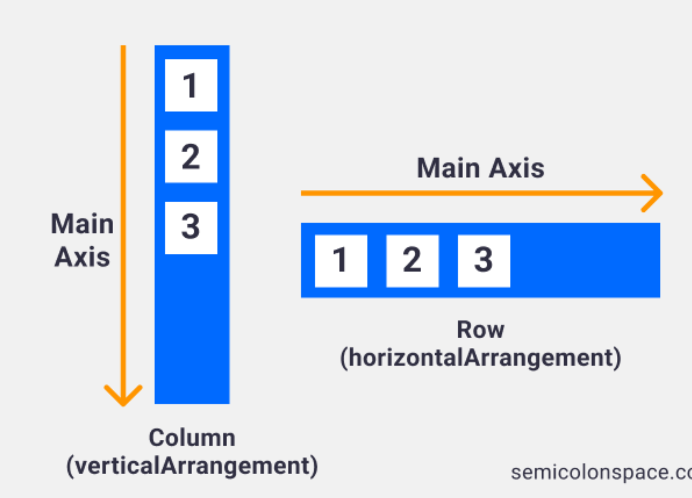

# Activities and Compose

## Activities
- Essential building blocks of an Android app
- Each screen of an adroid app is represented by an Activity
- Each app has a main activity which usually the first screen of the app
    - the main entry point for user interaction

### Why use Activities?
- Activities allow us to start other activities in the app
- Activities serve as **entry points** from other apps
    - ex. app A could launch another app B using any of app B's activities as entry points
- **The android single-activity architecture** is now the recommended appraoch

### Activity Lifecycle
- Each activity in an app goes through multiple stages depending on what happens to that activity
    - ex. when the app starts, leave or re-enter an activity you have control over how certain functionality is handled
-
- **6 main states** an Activity goes through from creation to being destroyed
    - **created, started, resumed, paused, stopped, destroyed**
    - these states your Activity goes through are handled with specific *callback functions*
    - callbakcs decide how efficient your app will be and will avoid *app crashes, wasted time and resources, losing progress*
        - **onCreate(), onStart(), onResume(), onPause(), onStop(), onDestroy()**
        - 

#### Created - onCreate()
- Performs basic application start-up logic that should happen *only once* for the entire lifecycle of the activity
- Common logic shat should go in **onCreate**
    - Handling the activities previously saved sate through a bundle
    >super.onCreate(savedInstanceState);
    - Setting the layout for the Activity
    >setContent{}

#### Started - onStart()
- The activity enters the **Started** state and invokes **onStart()** when entering the foreground
- The Started state's main purpose is to mkae an acitivity **visible** to the user and prepare the acitvity to enter the foreground
- onStart() vs onCreate()
    - onCreate() is only called once during an activities lifecycle whereas if the activity goes into the background then comes back to the foreground **onStart()** will be invoked again

#### Resumed - onResume()
- The **Resumed** state is when the activity *completely enteres foreground* in which it calls onResume() callback
- This state stays active until something takes focus away from this activity such as
    -minimizing the app
    - turning screen off on device
    - navigating to another activity

#### Paused - onPause()
- The **Paused** state is a brief state that usually occurs when an event interrupts the **Resumed** state
    - when app begins to be minimized
    - another activity begins to take focus
- Releasing components on **onPause()** that were initialized **onResume** is good practice


#### Stopped - onStop()
- When the activity is *completely out of foreground* the the **onStop** callback is invoked and the **Stopped** state occurs
- Commonly happens when
    - an app is completely minimized
    - a new activity completely overs the entire screen
- During the Stopped state, the Activity still *stays in memory* and maintains all information

#### Destroyed - onDestroy()
- The final lifecycle callback when destroys the Activity instance from the activity stack
- Called when the Activity is completely dismissed or configuration change happens such as *changing screen orientation*
- The *UI State* is preserved through **onSaveInstanceState** if the Activity is destroyed and recreated by the system
    - ex. changing screen orientation
- **onSaveInstanceState**
    - saves the state of the UI
    - you can override the default behaviour and save/restore other data as well
    - can be used for saving/restoring **small amounts of data** if the activity state is reloaded
    ```kotlin
    override fun onSaveInstanceState(outState: Bundle) {
        super.OnSaveInstanceState(outState)
        Log.i("Life Cycle States", "onSaveInstanceState")
    }
    ```

### Logging in Android

    • The device we are seeing logs for (red)
    • The filter for our logs (purle)
    • The date and timestamp (green)
    • The Process and Thread ID (orange)
    • The tag (pink)
    • The package (yellow)
    • The priority level (sky)
    • The message (indigo)


log the same tag and message for each
priority level
• verbose, debug, info, warning, error


When I run my code I can filter out my logs
• package:mine is the default filter
• It will filter out all logs in your package (ex. com.bcit.lecture6)
• To filter for your tag you can use tag: [your tag here]


Logging with custom tags is recommended but you can still use println
if you want
• The tag is System.out

### Bundles
- Similar to Maps
    - key-value mappins used with android specific components
- Bundles are used to pass data between activities through *intents*
    - when multiple activities were more common
- Bundles are used to restore state information
    ```kotlin
    @Override
    protected void onCreate(Bundle savedInstanceState)
    ```

## Compose
- MainActivity is a **subclass of ComponentActivity**
    ```kotlin
    class MainActivity : ComponentActivity() {}
    ```
- ComponentActivity is a subclass of Activity
- The ComponentActivity class allow us to use *composable functions*

### Jetpack Compose
- Modern toolkit for builing native Android UI
    - composable functions (a.k.a composable)
- Replaces the old way of using the Layout Editor with XML files
- Used by the Kotlin
- The shift from imperative UI programming to declaritve has sped up development time significantly 
    - ex. react and flutter have made the shift
- With imperative you focus on how the UI is created, positioned and updated
- With declarative we focus more on what the UI should look like, and the impoerative part is take care of us

### Composable Functions
- *setContent* defines the layout for the Activity
    - Text is an example of a composable function

    ```kotlin
    class MainActivity: ComponentActivity(){
        override fun onCreate(savedInstanceState: Bundle?) {
            super.onCreate(savedInstanceState)
            setContent {
                Text(text = "where we put our composables here")
            }
        }
    }
    ```
- Composable provides us with many composable functions to create our UI
    - text, button, image, card, and many more
- Use annotation `@Composable`
- Cannot put a composable function inside a regular function
    ```kotlin
    fun regularFunction(){
        Text(...) // Functions which invoke @Composable functions must be marked with the @Composable annotation
    }
    ```
- Composables can have parameters
    

    - **modifier** : one common parameter that many composables share
        - modifiers are used to decorate or configure a composable
            - change the size, layout, appearance, and more to the composable
            - multiple modifiers by *chaining them together*
                ```kotlin
                @Composable
                fun MyComposable(){
                    Text(
                        modifier = Modifer
                        .background(Color(0xFF2196F3))
                        .size(50.dp)
                        .padding(all=12.dp)
                    )
                    Box(
                        // Simple container
                    )
                }
                ```
            - ***order matters**
                
                

#### Wrapping Composables
- Composables are typically wrapped in other composables
- Child composables go inside the paretns' scope
- Parent composables enforce constraints on it's children
    

#### Composables - Row, Column
- **Arrangement** is done on the main axis
    - row : horizontally
    - column : vertically
    - With *arrangement*, the Row or Colum needs to fills it's parents space
        - **fillMaxSize()**
        - **fillMaxWidth()**
        - **fillMaxHeight()**
- **Alignment** is done on the cross axis
    - row: vertically
    - column: horizontally


    - align two boxes in a row to the bottom
    
    - align the boxes in a row to the center
    
    - align the boxes in a column to the end
    
    - align boxes in a column to the center, arrange them with space between
    
    
- **weight** modifier
    - to have children fill the availalbe space
    
    

#### Lists - LazyRow, LazyColumn
- They are efficient by only rendering the elements that are on the screen
- Scroll elements horizontally in LazyRow
- Wrap the children with item
    ```kotlin
    LazyRow(modifier = Modifier){
        item{
            ...
        }
        item{
            ...
        }
    }

- list of data
    ```kotlin
    data calss MyBoxDat(val color: Color, val size: Int)

    val boxDataList = listOf(
        MyBoxData(...)
        MyBoxData(...)
        MyBoxData(...)
    )

    @Composable
    fun MyComposable() {
        LazyRow(modifier = Modifier) {
            items(boxDataList.size) {
                MyBox(boxDataList[it])
            }
        }
    }
    ```