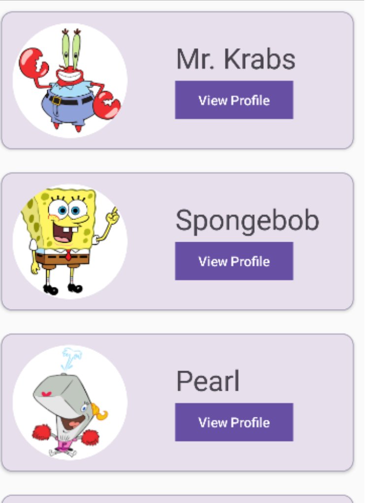
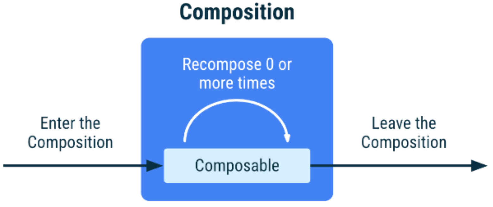
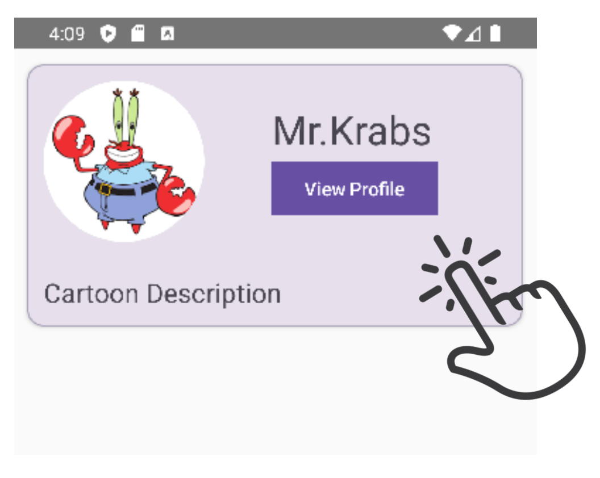

# Composable Lifecycle and State

## Displaying an ./img/image

- add to drawable folder -> sync proejct with gradle files
- **R** class gives us access to all the resources in our project

  - drawables, strings, fonts, colors, files etc
  - access through the R class, it returns a resource _id_ as an integer

  ```kotlin
  R.drawable.krabs
  ```

- Create an ./img/image composable with the two required parameters
  - painter & contentDescription
  ```kotlin
  ./img/image(
      painter = painterResrouce(id = R.drawable.krabs),
      contetnDescription = "Krabs picture"
  )
  ```

## Card

- small container that provides a sincle peice of content to the screen
- has a default colour with **elevation** and **border** params
  ```kotlin
  Card(
      modifier = Modifier
          .fillMaxWidth()
          .padding(12.dp),
      elevation = CardDefaults.cardElevation(defaultElevation = 2.dp),
      border = BorderStroke(width = 1.dp, color = Color(0FFAAA3B8))
  ) {
      ./img/image (...)
  }
  ```

## String Resources

- an xml resource that provides that strings for your application
- you can store a single string or any array of strings
- res>values>strings.xml
  ```xml
  <resources>
      <string name="app_name"> Lecture 8 </string>
      <string name="sponge"> Spongebob </string>
      <string-array name="cartoons">
          <item>Mr.Krabs</item>
          <item>Patrick</item>
          <item>Pearl</item>
          <item>Sandy</item>
          <item>Squidward</item>
      </string-array>
  </resources>
  ```
- To get your string resources you can use the composable
  stringArray resource or stringResource
- To find the specific id, we use the R class
  - **R.array** for an array of strings
  - **R.string** for a single string
  ```kotlin
  val cartoonNames = stringArrayResource(id = R.array.cartoons)
  val sponge = stringResource(id = R.string.sponge)
  ```

## Button

- A button has **onClick** event callback
  ```kotlin
  Button(
      onClick = {...}
      shape = RectangleShape
  ){
      Text("CLICK")
  }
  ```

### Example



```kotlin
data class Cartoon(val name:String, val ./img/imageId: Int)

setContent {
    val cartoonNames = stringArrayResource(id = R.array.cartoons)
    val sponge = stringResource(id = R.string.sponge)

    val cartoonList = ListOf(
        Cartoon(cartoonNames[0], R.drawable.krabs),
        Cartoon(sponge, R.drawable. spongebob),
        Cartoon(cartoonNames[1], R.drawable.pearl),
        ...
    )

    LazyColumn{
        items(cartoonList.size){
            CartoonCard(cartoonList[id])
        }
    }
}

@Composable
fun CartoonCard(cartoon: Cartoon){
    Card(
        modifier = Modifier.fillMaxWidth().padding(12.dp),
        elevation = CardDefaults.cardElevation(defaultElevation = 2.dp),
        border = BorderStroke(width = 1.dp, color = Color(0xFFAAA3B8)),
    ) {
        Row(
            modifier = Modifier.padding(12.dp)
            verticalAlighment = Alignment.CenterVertically,
        ) {
            ./img/image(
                painter = painterResource(id = cartoon../img/imageId),
                contentDescription = "",
                modifier = Modifier.size(120.dp).clip(shape = CircleShape)
            )
            Spacer(modifier = Modifier.size(width = 50.dp, height = 0.dp))
            Column {
                Text(cartoon.name, fontSize = 30.dp)
                Button(onClick = {}, shape = RectangleShape) {
                    Text("View Profile")
                }
            }
        }
    }
}
```

# Composable Lifecycle

- When Jetpack Compose executes a composable, it enter the _Composition_
- Two ways to enter the _Composition_
  1. The firs time you run your composable it goes through _intial composition_
  2. When the state read by your composable changes, it goes through _recomposition_
- Think of Composition as when a composable is being displayed to the UI
  - it leaves Composition when it is not being displayed anymore
    

## State

- To create _state_ we wrap a value in a **State object**

  - **mutableStateOf** returns an interface

    ```kotlin
    val num = mutableStateOf(0)
    ```

    > an integer with an initial value of 0 wrapped in Mutable State

    - Any composable functinos that reavd _value_ observe and schedule a recomposition when that value changes

    ```kotlin
    Text(text = "${num.value}")
    ```

    > Text composable **reads** and observes num.value

    ```kotlin
    Button(
        onClick = { num.value++ }
    ) {
        Text("Count")
    }
    ```

    > The Button composable **writes** num.value through its onClick event
    > The Text composable will go through _recomposition_ when the Button is clicked
    > It's not the button composbale, but intelligent recomposition

- Intelligent Recomposition
  - recompose onlhy the components that _read value_
  - others; ignore
- Skipping (not on exam)
- State should be **internal**(local) to the composable, with a few exceptions

  - internal state: easy test, encapsulation, modularity, more optimized recomposition
  - if we move our state object inside the composable you might get an error

    - creating a state obbject during composition without using remember

    ```kotlin
    var num = mutabelStateOf(0) // external state, exception

    @Composable
    fun counter() {...}
    ```

  - Without _remember_, the Text composable will still go through recomposition when the button is clicked
    - but the value will be re-initialized back to the **initial value** during each recomposition
    - to fix this, need to wrap our satate object in the **remember composable**
    ```kotlin
    val num = remember { mutableStateOf(0) }
    ```
    - a value wrapped in remember is stroed in the Composition
    - this stored value is kpet acreoss recomposition

- **Delegated properties** to omit value

  ```kotlin
  val num = remember { mutableStateOf(0) }

  Text (
      text = "$num"
  )
  Button (
      onClick = {
          num++
      }
  ) {
      Text("Count")
  }
  ```

- **mutableStateListOf**

  ```kotlin
  val myList = remember {
      mutableStateListOf(0,1,2,3)
  }

  val list = listOf(0,1,2,3)

  val myList = rememmber{
      list.toMutableStateList()
  }
  ```

  - The _mutableStateListOf_ function uses a different mechanims to trigger a recomposition
    - Snapshotting
  - Since it doesn't use the _MutableState<T>_ interface, we don't use the value property
    - we also wouldn't use the _by_ keyword

  ```kotlin
  val cartoonListState = remember {
      cartoonList.toMutableStateList()
  }

  LazyColumn(modifioer = Modifier.padding(bottom=80.dp)) {
      items(stateCartoonList.size) {
          CartoonCard(stateCartoonList[it])
      }
  }
  ```

  

  ```kotlin
  Button(
      onClick = {
          val i = Random.nextInt(cartoonList.size)
          cartoonListState.add(cartoonList[i])
      }
  )
  ```

## Clickable

- you can make any composable clickable

  - clickable modifier provides an _onClick_ event callback
  - Useful when you want to click a whole composable itself rather than just a button
  - **boolean state object** needed

  ```kotlin
  var isExpended by remember {
      mutableStateOf(false)
  }

  Card(
      modifier = Modifier
          .clickable {
              isExpanded = !isExpanded
          }
  )

  Row(modifier=Modifier.padding(12.dp)) {
      if (isExpanded) Text (
          "Cartoon Description",
          modifier = Modifier.padding(12.dp),
          fontSize = 20.sp
      )
  }
  ```

  

## Animation

- Compose has some built in animations such as **animateContentSize()**
  - Expanding the card will have a smoother transition

```kotlin
Button(
    onClick = {
        if (cartoonListSate.size>0) cartoonListState.removeLast()
    },
    shape = RectagleShape
) {
    Text("Remove Last")
}
```
