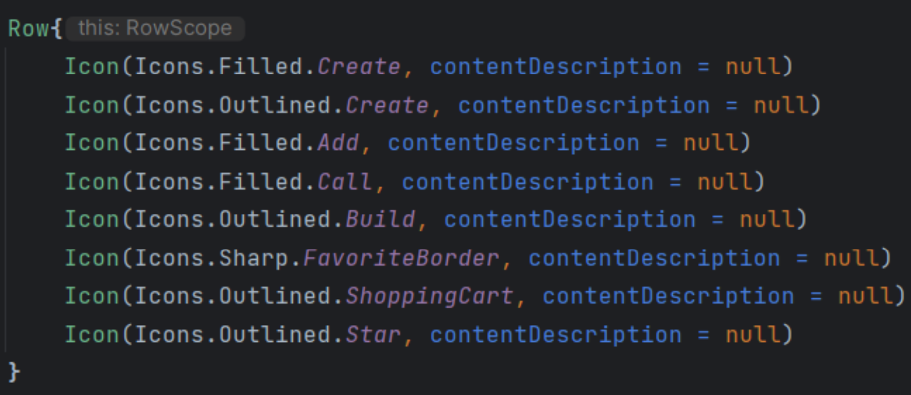

# Navigation and Menus

## Navigation

- Navigatino architecture
  - we need to add the dependency to our proejct
    - gradle scripts>build.gradle.kts>dependencies{implementation(libs.androidx.navigation.compose)}
- Advantages
  - composables are managed on the back stack
  - provides organized and structure when navigating between composables
  - easily add transitions between composables
- 3 components needed
  - **navigation controller**
  - **navigation host**
  - **navigation graph**

### Navigation Controller

- we use it to navigate to a destination (different content areas in the app)
- *rememberNavController*is a composable that allows us to create a _NavController_ with navigation functionally
  ```kotlin
  @Composable
  fun MainContent(){
      val navController = rememberNavController()
  }
  ```

### Navigation Host

- A navigation host is a single container where destinations are swapped in and out
- A navigation host is derived from a _NavHost_ composbale
- The NavHost first links your navigation controller with a string destination
- Each destination is associated with a **route** (a string that defines the path to your composable)

  ```kotlin
  val navController = rememberNavController()

  NavHost(
      navController = navController,
      startDestination = "home",
  )
  ```

### Navigation Graph

- The NavHost also links your navigation controller to your navigation graph
- A navigation graph specifies the **destinations** that you can navigate between

  ```kotlin
  val navController = rememberNavController()

  NavHost(
      navController = navController,
      startDestination = "home",
  ) {
      // MUST ADD ALL THE SCREENS WE WANT TO NAVIGATE
      composbale("home") {
          Home()
      }
      composbale("details") {
          HippoDetails()
      }
  }
  ```

- To navigate from one screen to another we need a **reference** to the navigation controller

  ```kotlin
  @Composbale
  fun Home(navController: NavController? = null) {
      ...
  }

  val navController = rememberNavController()

  NavHost(
      navController = navController,
      startDestination = "home",
  ) {
      composbale(navController) {
          Home() // Reference
      }
      composbale("details") {
          HippoDetails()
      }
  }
  ```

- Then we can invoke **navigate** on our navController through an event and pass in the route we want to navigate to
  ```kotlin
  fun HippoItem(
      hippoItem: HippoItem,
      navController: NavController? = null
  ){
      Column(modifier = Modifier
          .clickable {
              navController?.navigate("details")
          }
      )
      ...
  }
  ```

### Passing Argument with Navigation

- To pass an argument between destinations, we need to change the **route**
  - add `/{argument}` after the destination name
  ```kotlin
  composable("details/{name"}) {
      HippoDetails()
  }
  ```
- Then we can access the Bundle **arguments** and get the _key_ that we created in the previous line
  - Bundle: Like a Map but for android components
  ```kotlin
  composable("details/{name"}) {
      val name = it.arguments?.getString("name")
      HippoDetails(name)
  }
  ```
- Lastly, we need to properly provide the argument we want to pass when we navigate destinations
  - it should match the route, but using the _actual argument_
  ```kotlin
  .clickable{
      navController.navigate("details/${hippo.name}")
  }
  ```

### Passing Multiple Arguments with Navigation

- Add another `/{key}` to the route
  ```kotlin
      composbale("details/{name}/{./img/image}")
  ```
- By default, all arguments are strings
- To pass type non-string, we need to define it that way accessing our **list of arguments**
  ```kotlin
      composbale(
          "details/{name}/{./img/image}",
          arguments = listOf(navArgument("./img/image){
              type = NavType.IntType
          })
      )
  ```
- Now it can properly be accessed in our arguments Bundle

  - we use _getInt_ since it is an integer not a string

    ```kotlin
        composbale(
            "details/{name}/{./img/image}",
            arguments = listOf(navArgument("./img/image){
                type = NavType.IntType
            })
        ) {
            val name = it.arguments?.getString("name")
            val ./img/image = it.arguments?getInt("./img/image")

            HippoDetails(name, ./img/image)
        }
    ```

- Lastly, we need to properly provide the second argument that we want to pass when we navigate destinations
  - it should match the route, but using the **actual arguments**
  ```kotlin
      .clickable{
          navController.navigate("details/${hippo.name}/${hippo../img/image}")
      }
  ```

## Icons



### Icon Button

- Compose provides multiple button styles, such as _IconButton_ composable
  ```kotlin
      IconButton(onClick = {
          ...
      }){
          Icon(Icons.Filled.Close, contentDescription = null)
      }
  ```

### A Callback Example

- we could use callback to remove an item

  ```kotlin
      val stateList = remember {
          list.toMutableStateList()
      }

      val removeItemCallback:(Hippo)->Unit = {
          stateList.remove(it)
      }
  ```

- we pass down the callback and use it when needed

  ```kotlin
      @Composable
      fun HippoItem (
          removeItemCallback: (Hippo)->Unit
      ){
          ...
      }

      IconButton(onClick = {
          removeItemCallback(hippo)
      }){
          Icon(Icons.Filled.Close, contentDescription = null)
      }
  ```

## Bottom Navigation Bar

- We need to create some more screen and routes
- When creating new routes, it's good practiece to make them constants
  ```kotlin
  enum class Screen(val route: String){
      HOME("home"),
      ABOUT("about"),
      MORE("more")
  }
  ```
- Next, we need to create the data for our navigation items

  - you could also add a title for the itmes if you want

  ```kotlin
  data class NavItem(val icon: ./img/imageVector, val navRoute: String)
  ```

- Next, decide how many items do we want for the nav bar
  ```kotlin
  val navItems = listOf(
      NavItem(Icons.Roudnded.Home, Screen.Home.route),
      ...
  )
  ```
- The correct composable we watn is _NavigationBar_
  ```kotlin
  NavigationBar(containerColor = Color(0xFF255C56))
  ```
- _NavigationBar_ is from the _Material 3_ library, Google's lastest Material design system
  ```kotlin
  implementation(libs.androidx.material3)
  ```

### Material Design

- Material Design provides us with all the components and styles you normally see when createing a google based mobile application

## Bottom Navigation Bar - cont.

- Need to track the **current route** on the back stack to properly sync our nav bar
  ```kotlin
  NavigationBar(containerColor = Color(0xFF255C56)) {
      val navBackStackEntry by nVController.currentBackStackEntryAsState()
      val currentRoute = navBackStackEntry?.destination?.route
  }
  ```
- For each item in our nav bar, we want to fcreate a _NavigationBarItem_
  - the _selected_ param: boolean
    - when the _currentRoute_ = **specific items route** -> true
  - to navigate the items route, _onclick_
  - specific icon, _icon_
    ```kotlin
    navItems.forEach { item ->
        NavigationBarItem(
            selected = currentRoute == item.navRoute,
            onClick = {
                navController.navigate(item.navRoute)
            },
            icon = {
                Icon(item.icon, contetnDescription = null)
            }
        )
    }
    ```
- **Scaffold** to properly display our NavigationBar at the bottom of the screen

  - scaffold provides the basic layout structure for the screen
  - the content inside a _Scaffold_ needs to **use its content padding**

  ```kotlin
  @Composable
  fun MainContent() {
      val navController = rememberNavController()

      Scaffold(
          bottomBar = {
              MyNavBar(navController)
          }
      ) {
          padding ->
              NavHost(
                  navController,
                  Screen.HOME.route,
                  modifier = Modifier.padding(padding) // content padding
              )
      }
  }
  ```

## Top App Bar

- A few common parameters: title, navigationIocn & actions
- _title_ that goes on the top app bar
  ```kotlin
  MediumTopAppBar(
      title = {
          Text("Hippo Zoo")
      }
  )
  ```
- _navigationIcon_ sits on the left side of the app bar and it usually a back or home button
  - the navigation controller's **popBackStack()** function overrides the system back button
  ```kotlin
  navigationIcon = {
      IconButton(
          onClick = {
              navController.popBackStack() // overrides the system back button
          }
      ) {
          Icon(Icons.Rounded.ArrowBack, contentDescription = null)
      }
  }
  ```
- _actions_ are a row of composables so sit on the right side of the top app bar
  ```kotlin
  actions = {
      IconButton(
          onClick = {
              navController.navigate(Screen.HOME.route)
          }
      ) {
          Icon(Icons.Rounded.Home, contentDescription = null)
      }
  }
  ```
- we can also allow our top app bar to collapse and expand when we scroll
  ```kotlin
  MediumTopAppBar(
      scrollBehaviour = TopAppBarDefaults.enterAlwaysScrollBehavior()
  )
  ```

## Dropdown Menu

- First, we need to create some state as a boolean

  ```kotlin
  var showDropdown by remember { mutableStateOf(false) }

  DropdownMenu(
      expanded = showDropdown,
      onDismissRequest = { showDropdown = false }
  ) {...}
  ```

- A dropdown menuy will be positioned/anchored to it's **parent**
  ```kotlin
  actions = {
      Box(modifier = Modifier) { // parent
          IconButton(
              ...
          )
          DropdownMenu( // can have dropdownmenu as much as needed
              expanded = showDropdown,
              onDismissRequest = { showDropdown = false}
          ){...}
      }
  }
  ```
- Trigger the dropdown throught an event
  ```kotlin
  IconButton(
      onClick = {
          showDropdown = !showDropdown
      }) {
          Icon(Icons.Rounded.list, contentDescription = null)
      }
  ```
