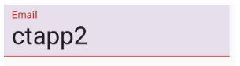
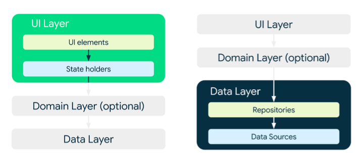
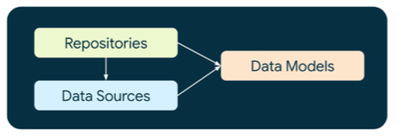
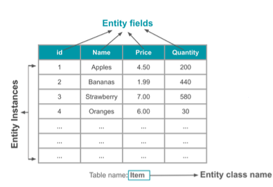
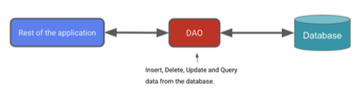

# State Hoisting & Room2

## State Hoisting
- Moving state to the *lowest common ancestor* for all the composables that read or write it
    - maintains a clear single source of truth
    - no unnecessary recompositions
    - reusability and more maintainable code
- Example of a **single source of truth**
    ```kotlin
    @Composable
    fun MyComposable(){
        var value by remember {
            mutableStateOf(0)
        }
        val increment: () -> Unit = { value++ }
        Column {
            Text("$value")
            MyButton(increment)
        }
    }

    @Composable
    fun MyButton(increment:() -> Unit) {
        Button(onClick = increment) {
            Text("Increment")
        }
    }
    ```
    
    Example 2

    ```kotlin
    @Composable
    fun MyTextField() {
        var value by remember { mutableStateOf("")}

        TextField(
            value = value,
            onValueChange = {
                value = it
            },
            textStyle = TextStyle(fontSize = 30.sp)
        )
    }
    ```
- When we hoist state, we make a composable *stateless*
    - stateless composables don't hold or modify state
    - state variable is repalced with
        - **current value** that is read
        - the event callback that sets the **value**

        ```kotlin
        @Composable
        fun MyTextField(value: String, onValueChanged:(String)->Unit) { // current value, event callback
            // no value 

            TextField(
                value = value,
                onValueChange = onValueChanged,
                textStyle = TextStyle(fontSize = 30.sp)
            )
        }
        ```
        
        - MyTextField now becomes more decoupled
        - we can resue it with different values and event callbacks
        ```kotlin
        @Composable
        fun MySignatureComposable() {
            //state for name
            var name by remember { mutableStateOf("") }
            val onNameChanged:(String)->Unit = {
                name = it
            }

            //state for email
            var email by remember { mutableStateOf("") }
            val onEmailChanged:(String)->Unit = {
                email = it
            }

            Column(
                modifier = Modifier.fillMaxWidth(),
            ){
                MyTextField(name, onNameChanged)
                MyTextFiled(email, onEmailChanged)
            }
        }
        ```

## State Holder 
- Knowing where and when to hoist state is important
    -sometimes it isn't necessary to hoist state at at all
    - other times you might need to hoist your state to a state holder
- A *state holder* favors the separation of concerns principle
- *UI loigic state holder* : one example of state holder
    - the composable oversees the emitting of UI elements
    - the state holder contains the UI state and logic

## UI Logic State Holder
- A common UI logic state holder is a **plain class**
- Useful when the UI state and logic become too hard be to maintained within the composable itself
- Hoist your state to a UI logic state holder when
    - your composable has *multiple state objects* 
        email, name
    - UI logic is becoming too comple
- You can then use one object to manage all your state
    ```kotlin
    @Composable
    fun MySignupForm(){
        val state = remember {
            SignupState()
        }

        Column {
            MyTextField(state.name, state.onNameChanged)
            MyTextField(state.email, state.onEmailChanged)
        }
    }
    ```

### UI Logic
- Related to *how* the content is being displayed and experienced
    
    ```kotlin
    var email by mutableStateOf("")

    fun onEmailChanged(value:String){
        email = value
        validEmail = email.contains("@")
        var validEmail = false
    }
    ```

### Busines Logic State Holder
- one of state holder 
    - usually a plain class or
    - a *ViewModel* when working with android dependencies
- Provides access to the business logic(aka app logic) within the app
- Prepares the application data for presentation
    - application data: the information that is generated, used, and stored within the app

### Business Logic
- Implements the rules and requirements for the application data
- Think of *business* as the company or organization building an app
- Connected with core functionalities and the manipulation of application data to meet *business requirements*
- Sometimes reffered to as application logic

## Layers
- When our app begins to grow, we need to a way to maintain it
- To modularize an app into layers
- With regards to an app, you typically have two important layers
    - **UI Layer** : contains the UI elements (composables in this case), UI logic and state holders
    - **Data Lyaer**: contains the application data and business logic
    
    - data layer and ui layer are usually separate
        - often they are written in different langauges
        -> useful to reuse a data layer for a different platform or app
        - it promotes a more modular and maintainable system

### Data layer
- 3 important parts
    
    - **Data sources**
    - **Repositories**
    - **Data Models**

    - A data layer can contain 1+ data sources, which can be either local or remote
    - Local data sources
        - File: ideal for storing raw complex data
        - Local distance: ideal for storing structured and relational data with querying capabilities
        - DataStore (Jetpack library): ideal for storing small and simple datasets

## Room
- Room is on of the Jetpack libraries that provides access to local SQLite database
- Primary components in Room
    - **Data entities**
    - **Data access objects**
    - **Database class**

### Adding KSP
- need to add KSP(kotlin symbol processing)
    gradle scripts> build.gradle.kts>plugins>id("com.google.devtools.ksp") version "2.0.21-1.0.25" apply false
- update module-level build.grade as well
    gradle scrips>build.gradle.kts>plugins>id("com.google.devtools.ksp")
- add dependencies KSP in module-level build.gradle
    ksp("androidx.room:room-compiler:2.6.1")
- sync the project and run app 

## Room cont.
- Data entities represent tables in your db
- Each instance of Entity class represents a row in the table

- `@Entity` marks a class as a database Entity class
- `@PrimaryKey` marks a field as the primary key
    - every entity instance must have a primary key
- Each filed is represented as a column in the database
    `@ColumnInfo` allows us to provide a custom name for it

```kotlin
@Entity(tableName = "user_table")
data cass LocalUser(
    @PrimaryKey(autoGenerate = true) val uid: Int? = null,
    @ColumnInfo(name = "user_name") val userName: String?, val email: String?
)
```

- **Data Access Objects**(DAOs) provide the methods that the app uses to interact with db
    
    - query, update, insert, delete, etc
- The room library provides **convenience annotations** without requireing you to write a SQL statement
    ```kotlin
    @Dao
    interface UserDao {
        @Query("SELECT * FROM user_table")
        fun getAll(): List<LocalUser>

        @Insert
        fun add(user: LocalUser)

    }
    ```
- The db class annotated with `@Database` holds the database
    - the main access point to the persisted data
    - it defines the **list of entities**
    - The db class also provides the **instances of the DAOs**
    - the DAOs are abstract because Room auto creates the implementation for us at compile time
        - in this example we just have LocalUser
        ```kotlin
        @Database(entities = [LocalUser::class], version = 1)
        abstract class AppDatabase: RoomDatabase() {
            abstract fun userDao(): UserDao
        }
        ```
- Creating a db instance is expensive so we only want to initialize it once
    - the lazy delegate will come in handy
    ```kotlin
    private val db by lazy {
        Room.databaseBuilder(
            applicationContext,
            AppDatabase::class.java, "my-cool-database")
            .allowMainThreadQueries()
            .build()
    }
    ```

## Application Context
- Application context is used to obtain information about the application
- Room databases are stored locally on the device in a directory specific to our application
- Room doesn't allow a db to be accessed on the main thread by default
    - it could freeze or slow down the main thread significantly
    - we will **allow** it to be accessed on the main thread
    - good place for the local db initialization is in the Application class: ensures there is only one instance of the db throught the entire lifecycle of the app
        java>ui>MyApp.kt
    ```kotlin
    class MyApp: Application() {
        Room.databaseBuilder(
            applicationContext, // store locally
            AppDatabase::class.java,
            .alloMainThreadQueries() // allow!
            .build()
        )
    }
    ```
- Once we have created a custom application class we need to inform the Android system
    app>manifests>AndroidManifest.xml> application> android:name=".MyApp"
    - this ensures that the custom application class is the entry point for the app

### Data Layer
- We created our data source, we need a *Repository* to expose the app data and provide and business logic
    ```kotlin
    class UserRepository(private val userDao: UserDao) {
        // any business logic would go here

        fun insertEntity(user: LocalUser){
            userDao.add(user)
        }
        fun getAll(): List<LocalUser>{
            return userDao.getAll()
        }
    }
    ```
- We only want one instance of a repository thorugh the lifecycle of thea pp
    - we also need a reference to our DAO
    - palcing it inour app class seems like a natural choice
        ```kotlin
        class MyApp: Application(){
            private val db by lazy {...}

            val userRepository by lazy {
                UserRepository(db.userDao())
            }
        }
        ```
### State Holder
- we need to create a state holder for app data, to the UI layer
- We can create some **state** that reflects our current users
    ```kotlin
    class UsersState(private val repository: UserRepository) {
        // UI state
        var usrs = repository.getAll().toMutableStateList()

        // Insert an entity
        fun add(localUser: localUser) {
            repository.insertEntity(localUser)
        }
        
        // Set our state
        fun refresh(){
            users.apply {
                clear()
                addAll(repository.getAll())
            }
        }
    }
    ```
- We need to initialize and inject our Repository into our state holder class
- also need to ege a reference to the application
    - These both can be achived if we initialize it in *MainActivity onCrete*
        ```kotlin
        val userRepository = (application as MyApp).userRepository
        ```
- Ready to build our UI
    ```kotlin
    val userRepository = (application as MyApp).userRepository

    setContent {
        val userState = remember{
            UserState(userRepository)
        }
        MainContent(userState)
    }
    ```

## App Inspector
- See a GUI of your database
    - view->Tools Windows->App Inspection
    - you can also all quierise directly from db inspector