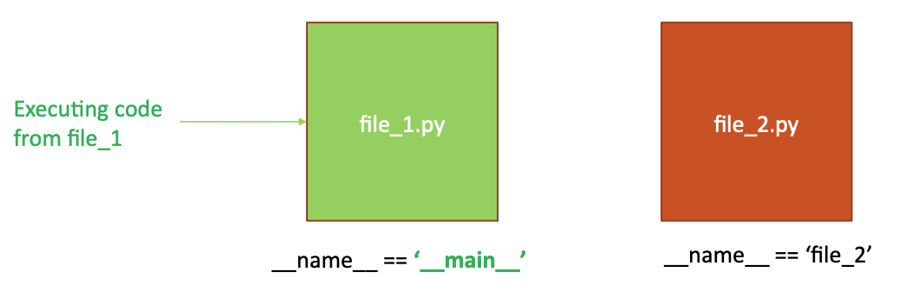
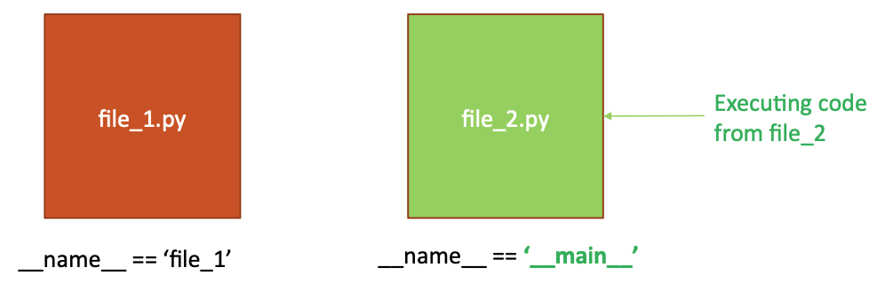
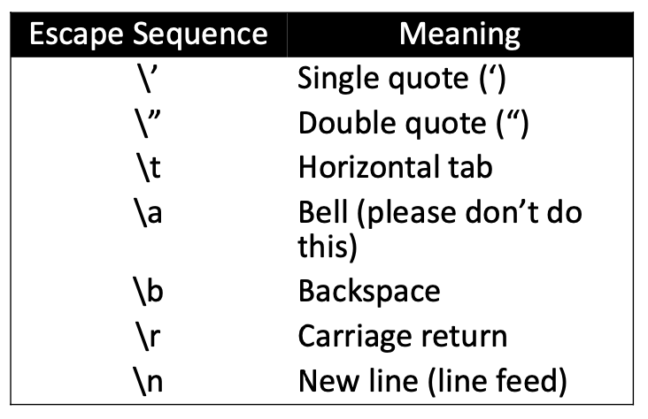
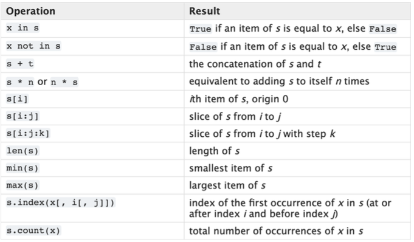
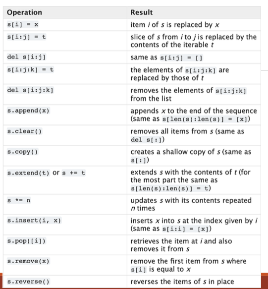

# Python Fundamentals

Goal of OOP2

- Code in Python
  - OOP concepts classes, inheritance, polymorphism
  - Containers
  - Exceptions
  - Concurrency etc
- Write good clean reusable code
  - S.O.L.I.D principles
- Write with design patterns
  - Behavioural, Creational, Structural Patterns

## Intro to Python

- Large and comprehensive standard library
- Support multiple programming paradigms like OOP, functional, procedural
- **Interpreted language**
- Dynamically typed
- Strongly typed

## Basic of Basic

### Main

- Python doesn't have a main functino, so we need

  ```python
  if __name__== '__main__':
      main()
  ```

- A built in variable in every python module(file)
- Its value is set automatically
- `__name__` is set to the name of the current value
- But as soon as code begins running from a file, the` __name__` of that file evaluates to`__main__`
  That file’s name remains `__main__` for the duration of the program
  
  
- If we're running code starting from this script, call a main functino

- **Indent** matters

### Dynamically Typed Language

```python
num1 = 5
num2 = 10
```

- No type in front of `num1` and `num2`

  - Types are **inferred**

- If statement

### Comments and Docstrings

- Docstrings
  - implemented as the first statment inside a `module`, `function`, `class`, `method`
  - phrase that ends in a period `.`
    ```python
    def add_ints(a, b):
        ”””
        Return the sum of the two arguments.
        :param a: an int
        :param b: an int
        :precondition: a must be an int
        :precondition: b must be an int
        :return: the sum of the ints ”””
        return a + b
    ```
    - `help(my_module)`: call docstring

### PEP-8 Style Guide

- The defacto accepted standard for formatting your Python code
  - consistency, readibility, parsing, efficient and ease while coding, collaboration
- function: `my_function`
- variable: `my_variable`
- class: `MyClass`
- method: `my_method`
- constant: `CONSTANT_A`
- module: `my_module.py`
- package: `mypackage`

### Strings, ASCII, Unicode

- `String` is an **immutable** sequence of Unicode (UTF-8) codepoints
- `String literal` is the value of a string
- `Unicode` is used to represent every possible character as a unique integer(code point)
  - `ord('A')` returns 65
  - `chr(65)` returns 'A'
- Escape characters
  
- Raw Strings with `r` or `R`

  - use instead of escape characters

  ```python
  "hello\nworld"
  // hello
  // world

  r"hello\nworld"
  //hello\nworld
  ```

- Common string methods, functions, features

  - The original string **DOESNT CHANGE**

  ```python
  “string”.title()
  my_string = “Comp 3522”
  my_string.upper()
  my_string.lower()
  len(my_string)
  my_string[3]
  my_string[-2]
  ```

- Concatenate Strings

  - Faster than concatenation using `+=` since no temp strings are created

    1. capitalize
    2. replace
    3. isalpha
    4. isdigit
    5. split
    6. join

  - `help(function name)` for documentation
  - `dir(object)` to read the properties and methods of the specified object

- Multi-line Strings

  1. Break lines with te \ character:
     ```python
     string_long = "This is a very long string" \
             " that I wrote to help somebody" \
             " who had a question about" \
             " writing long strings in Python"
     ```
  2. Use parentheses:

     ```python
     string_long = ("This is very long"
                    " haha")
     ```

  3. Use triple quotes:

  ```python
  string_long = """
      This is good long
      """
  ```

### String Formatting

1. The string format method
2. f-strings
3. % operator along with format specifiers

#### 1. `str.Format()` Method

```python
// Example 1
“I earned {0} in {1}”.format(98.5, “Architecture”)
“I earned {0} in {1} and {0} in {2}”.format(65, “Comm”, “Math”)
“I earned {grade} in {course}”.format(grade=65, course=“Comm”)

// Example 2
grades = (98.5, 65)
“I earned {g[0]} and {g[1]}”.format(g = grades)

// Example 3
import math
“Pi equals {m.pi}”.format(m = math)
“Pi equals {m.pi:.3f}”.format(m = math)
```

#### 2. F-strings

- `f` or `F`
- Evaluated at runtime

```python
grade = 98.5
course = “C”
f”I earned {grade} in {course}”
name = “OOP 2 with Python”
F”My favourite course (so far) is {name.title()}!”
```

#### 3. Conversion Specifiers

- A **string formatting expression** allows a programmer to create a string with placeholders(**conversion specifier**, `%`) that are replaced by the value of variables

  - `%d`: integer
  - `%f`: floating point number
  - `%s`: string
  - `%x, %X`: hexadecimal
  - `%e, %E`: scientific notation

        ```python
            apr = float(input('Enter APR:\n’))

            print('Annual percentage rate as a float is %f ' % apr)
            # Annual percentage rate as a float is 100.000000

            print('Annual percentage rate as a float is %f%% ' % apr)

            # Annual percentage rate as a float is 100.000000%
        ```

    ```python
    name = ‘COMP 3522’ room = 655

    print(‘Course %s is in %d\n’ % (name, room))
    ```

### Decial Places, Extra Curly Braces

```python
name = "Jeff"
room = 202
my_string = 'hello {0} {{0}}, it is the year {1}'.format('class', 2023.123)
print(my_string)
print('Course %s is in %.2f\n' % (name, room)) #decimal places with .2f print('Course %s {0} is in %.2f\n' % (name, room))
```

```
hello class {0}, it is the year 2023.123
Course Jeff is in 202.00

Traceback (most recent call last):
  ...
ValueError: not enough arguments for format string
```

### Mutability

- Strings are immutable

  ```python
  word = ‘supercalifragilisticexpialidocious’
  word = word.title( ) # this allocates new memory (and un-references the previous one)
  print(word) # ‘Supercalifragilisticexpialidocious’
  ```

- Immutable types

  - `int()`, `float( )`, `complex( )`, `str( )`, `tuple( )`, `bytes( )`, `frozenset( )` ... almost everything

- Assignment is not mutation

  - When we assign a value to a variable, we are **assigning the reference** to that value's location in memory

    ```python
    id(2.5)
    a = 2.5
    type(a)
    id(a) # same address as id(2.5)!
    a = a + 0.0456
    id(a) # Not the same – a contains the address of a new float!
    ```

### Sequence Types

- Sequence is the generic term for an ordered set
  - str, list, range, tuple, bytes
- Common sequence operators
  
- Mutable sequence operators
  

### List

- **Containers** are data structures used to group related values together
  - Compound type
  - container contains reference to other objects
- List
  - an item = element
  - heterogenous (can have various element types)
    ```python
    student_data = [“A022343234”, [99,70,85.0], ‘P’]
    student_data[0] #A022342334
    student_data[-1] #P
    ```
  - lists are mutable
- Sequence functions are methods

  - **sequnce-type functions**

    - built in functinos that operate on sequences like `lists` and `strings`

    ```python
    length = len(my_sequence)
    new_sorted = sorted(my_sequence)
    ```

  - **sequnce-type methods**

    - built into the class definition of sequences like `lists`, `strings`
      ```python
      my_sequence.sort()
      my_sequence.clear()
      ```

- Membership operator
  - `in`, `not in`
  - used with sequence types
    - determine wheter is a string is a substring or
    - matching subset of characters
    ```python
    request_str = 'GET index.html HTTP/1.1'
    if '/1.1' in request_str:
        print('HTTP protocol 1.1')
    if 'HTTPS' not in request_str:
        print('Unsecured connection')
    ```

### Tuples

- An immutable sequnce

```python
parliament_hill_coords = (45.4236, 75.7009) #tuples use round parentheses
print('Coordinates:', parliament_hill_coords)
print('Tuple length:', len(parliament_hill_coords))
# Access tuples via index
print('\nLatitude:', parliament_hill_coords[0], 'north')
print('Longitude:', parliament_hill_coords[1], 'west\n')
# Error. Tuples are immutable
parliament_hill_coords[1] = 50
```

### Dictionaries

- Collection of key-value pairs
- Mutable
- Keys in a dict do not have to be the same type
- Anything immutable can be keys

```python
>>> my_dictionary = {} #create new empty dictionary using curly braces >>> my_dictionary['value'] = 100.0
>>> my_dictionary[1] = 1
>>> my_dictionary[2] = 2
>>> my_dictionary[2.5] = 'hello'
>>> print(my_dictionary)
{'value': 100.0, 1: 1, 2: 2, 2.5: 'hello'}
del my_dict[2.5]
```

### Views

- A **virtual sequcne**, used for looping
- Provides a dynamic view of the entries

```python
meals = {‘bfast’:’egg’, ‘lunch’:’poké’, ‘dinner’:’spinach’}
keys = meals.keys()
values = meals.values()
entries = meals.items()

# return views
print(type(keys))
<class 'dict_keys'>
print(type(values))
<class 'dict_values'>
print(type(entries))
<class 'dict_items'>
```

- Views support three functions
  1. `len(dictview)`
     - returns the number of entires in the dictionary
  2. `x in dictview`
     - returns `True` if x is in the underlying dictionary's keys() values() or items()
  3. `iter(dictview)`
     - returns an iterator over the view

```python
new_dictionary = {1 : 'jeff', 2 : 'eric'}
entries = new_dictionary.items()
print(new_dictionary) #{1: 'jeff', 2: 'eric'} print(entries) #dict_items([(1, 'jeff'), (2, 'eric')])
del new_dictionary[1] print(new_dictionary) #{2: 'eric'} print(entries) #dict_items([(2, 'eric')])
```

### Loops

- Used with sequnece types `for`, `while`
