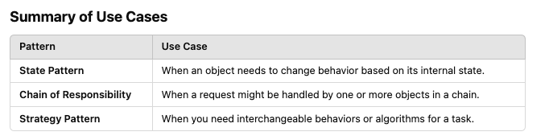

# Behavioural Patterns in Design pattern


Focused on communication and interaction between objects. How do we get objects talking to each other while minimizing coupling? Algorithmic Patterns


## Chain of Responsibility


• When a request needs to go through a series of steps.
• Decouples the sequencing of these steps and makes them re-usable.

- When an object or a set of objects needs to undergo different “steps” of processing.
  - checks, validation, formatting, security, setup,...
- Set up a series of `Handlers `
  - Each `handler` is unique but implements the same interface and does something to a `Request`
  - Each `Handler` has a reference to another handler
- Lnked list of responsibilities

- Requirements:

  - Each Handler implements the same interface.
  - BaseHandler is an Optional parent class that can hold some duplicate code
  - Each handler implements a handle(request) method which is where they carry out their specific code.

- When we use it:
  - program is expected to process different kinds of requests in various ways
  - do something in a particular order
  - sequence and ordering of request-processing is not known before hand and needs to be determined at run-time
  - **Single Responsibility Principle**: each handler does one thing
  - **Open/Closed Principle**: introduce new handlers without modifying existing handlers or client code
- Disadvatnage: more classes, some requests may end up unhandled (order issue)

```python
from abc import ABC, abstractmethod

# Abstract Handler
class Handler(ABC):
    def __init__(self, next_handler=None):
        self.next_handler = next_handler

    @abstractmethod
    def handle(self, request):
        pass

# Concrete Handlers
class AuthHandler(Handler):
    def handle(self, request):
        if not request.get("authenticated"):
            print("Authentication failed!")
            return False
        print("Authentication passed.")
        if self.next_handler:
            return self.next_handler.handle(request)
        return True

class ValidationHandler(Handler):
    def handle(self, request):
        if not request.get("valid"):
            print("Validation failed!")
            return False
        print("Validation passed.")
        if self.next_handler:
            return self.next_handler.handle(request)
        return True

class LoggingHandler(Handler):
    def handle(self, request):
        print("Logging request.")
        if self.next_handler:
            return self.next_handler.handle(request)
        return True

# Build the chain
chain = AuthHandler(ValidationHandler(LoggingHandler()))

# Test Requests
request = {"authenticated": True, "valid": True}
chain.handle(request)
# Output:
# Authentication passed.
# Validation passed.
# Logging request.

request = {"authenticated": False, "valid": True}
chain.handle(request)
# Output:
# Authentication failed!

```

## Strategy

• When you need to switch behaviours at runtime
• Another way of phrasing this is that it let’s you swap algorithms at run-time.

- Liskov Substitution Principle
  - Objects in a program should be replaceable with instances of their base types without altering the correctness of that program
- Create a hierarchy of behaviours that inherit from a base class
  - Use composition to be able to swap behaviors at run time
- When we use it
  - use a different algorithm for different use cases (swappable at run time)
  - **open closed principle**: add new strategies without modifying the context
  - replace inheritance with composition (similar to bridge pattern)
  - Isolate the implementation of a strategy from the code that uses it
- Disadvantages: client needs to be aware of stragateis to select, not good for small algo

```python
from abc import ABC, abstractmethod

# Abstract Strategy
class PaymentStrategy(ABC):
    @abstractmethod
    def pay(self, amount):
        pass

# Concrete Strategies
class CreditCardPayment(PaymentStrategy):
    def pay(self, amount):
        print(f"Paid {amount} using Credit Card.")

class PayPalPayment(PaymentStrategy):
    def pay(self, amount):
        print(f"Paid {amount} using PayPal.")

class CryptoPayment(PaymentStrategy):
    def pay(self, amount):
        print(f"Paid {amount} using Cryptocurrency.")

# Context
class PaymentContext:
    def __init__(self, strategy: PaymentStrategy):
        self.strategy = strategy

    def set_strategy(self, strategy: PaymentStrategy):
        self.strategy = strategy

    def pay(self, amount):
        self.strategy.pay(amount)

# Usage
context = PaymentContext(CreditCardPayment())
context.pay(100)  # Output: Paid 100 using Credit Card.

context.set_strategy(PayPalPayment())
context.pay(200)  # Output: Paid 200 using PayPal.

context.set_strategy(CryptoPayment())
context.pay(300)  # Output: Paid 300 using Cryptocurrency.

```

## State

- A state of an object is defined as the value and behaviours of the object at any given time during program execution
- A pattern implemented when an object wants to alter its behaviour. It might behave like a different class
- The state pattern enables a modular way to add states and control transitions

  - we want to decouple the sate from the object

- Finite State Machine

  - The circles are our `states`
  - The arrows between them are transitions that encapsulate rules for state switching

- When we use it

  - when an object’s behaviour is heavily dependent on its states and the number of states can be large
  - if statement blocks to handle object behaviours based on state conditions
  - create hierarchies of state classes if there are a lot of similar states that share code
  - **Single Responsibility Principle**: each state is self-contained
  - **Open/Closed Principle**: add and remove states w/o modifying the context and multiple if-else statements

- Disadvantages:

  - hard to maintain if the object rarely changes state or only has a few states
  - complex when each state knows about its neighbouring states -> highly coupled
  - maintain difficulty

- State vs Strategy
  - `Strategy`
    ◦ Choose an algorithm at run time
    ◦ Algorithms don’t know about each other
    ◦ Context and Strategy interfaces don’t have to be the same ◦ Strategy usually does not have a reference to context
  - `State`
    ◦ Change between states often based on some rules prescribed by a finite state machine.
    ◦ States can know about each other
    ◦ Context and state interfaces match
    ◦ Can have a reference to context

```python
from abc import ABC, abstractmethod

# Abstract State
class State(ABC):
    @abstractmethod
    def handle(self, context):
        pass

# Concrete States
class IdleState(State):
    def handle(self, context):
        print("System is idle. Moving to running state.")
        context.set_state(RunningState())

class RunningState(State):
    def handle(self, context):
        print("System is running. Moving to stopped state.")
        context.set_state(StoppedState())

class StoppedState(State):
    def handle(self, context):
        print("System is stopped. Moving to idle state.")
        context.set_state(IdleState())

# Context
class Context:
    def __init__(self, state: State):
        self._state = state

    def set_state(self, state: State):
        self._state = state

    def request(self):
        self._state.handle(self)

# Usage
context = Context(IdleState())
context.request()  # Output: System is idle. Moving to running state.
context.request()  # Output: System is running. Moving to stopped state.
context.request()  # Output: System is stopped. Moving to idle state.
```

# Design pattern summary


