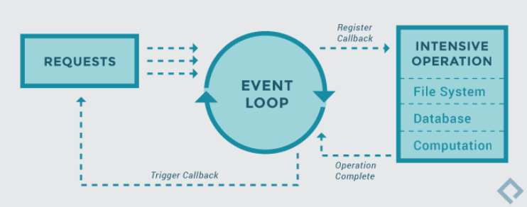

# Concurrency


- the act or the “perceived act” of processing multiple events in parallel
- We write concurrent systems to **speed up the time** it takes to run an application and make it more responsive

- Asynchronous Programming
  ◦ Defines a discrete unit of work
  ◦ This unit of work runs in “parallel” from the main thread
  ◦ When this unit of work is complete, it notifies the main thread about the completion or failure of its task. (usually done through a callback)

- Concurrency in Python

  - `Threading`
    - Creating different threads that execute parts of our code in parallel
    - Runs on the same core
    - Good for I/O Bound problems
  - `Tasks`
    - Units of work defined using AsyncIO and Coroutines
    - Good for I/O Bound problems
  - `Multiprocessing`
    - Creates a whole new process with its own address space and python interpreter
    - Runs on different CPU cores
    - Good for CPU Bound problems

- I/O Bound

  - An I/O Bound problem causes your program to run slowly
    - it spends the bulk of its time waiting for Input/Output operations
  - A CPU Bound problem spends the bulk of it’s time processing data instead of waiting on Input/Output

- When to use
  - If there is no need to speed up our code we should avoid it: complex and debug
  - premature optimization is the enemy of good code
  - If there is a known performance issue, then determine what type of concurrency you need
    - First Identify any CPU or I/O bound sections of your code, then add concurrency to them

## Thread

A thread is the smallest unit of execution in a program. It is part of a process, and multiple threads can run concurrently within the same process. Threads allow programs to perform multiple tasks at once, enabling efficient utilization of CPU resources and better responsiveness

```python
import threading

def print_numbers():
    for i in range(5):
        print(f"Thread: {i}")

# Create and start threads
thread = threading.Thread(target=print_numbers)
thread.start()

# Main thread continues execution
for i in range(5):
    print(f"Main: {i}")

```

- sequence of instructions within a process that can be executed independently
- A process can run multiple threads
- Threads operate within the same address space and as such, share the same resources and data
- All threads that belong to a process run on the single processor (or CPU Core)

  - only a single thread can be active at any given time
  - threads are being processed sequentially and not paralle

- `Pre-emptive Multitasking`: the OS can pre-empt your thread to make a switch
- `Cooperative Multitasking`:

  - Using coroutines and asyncio, we can emulate `tasks`
    - `Tasks` are independent units of work that can run concurrently
    - developers write code that can announce a switch: be in control and avoid bugs

- Setting up a Thread

1. Create an object of type Thread and assign a target function to it
2. Inherit from Thread and create your own thread class
   ◦ If we inherit and create our own Thread subtype then we need to override the run()
   method with the code that will execute on the thread
   ◦ Call the start() method to start a thread
3. Create a Thread Pool Executor (Used to execute multiple threads)

- Advantages
  - code runs faster
  - great for I/O bound situations
  - most languages have support for threading
  - share the same memory space -> easy to sahre data
- Disadvantages

  - not so good for cpu bound situations
  - race conditions
  - deadlocks
  - more code, hard to debug

- **Race Conditions**

  ```python
  # Race conditions - may result in unpredictable behaviour
  import threading
  counter = 0

  def increment():
    global counter
    for \_ in range(1000000):
        counter += 1

  t1 = threading.Thread(target=increment)
  t2 = threading.Thread(target=increment)

  t1.start()
  t2.start()

  t1.join()
  t2.join()

  print(counter) # Expected: 2000000, but result may vary due to race conditions

  ```

- when two or more concurrent streams of executions (threads, tasks, processes) try to access the same resource
- If the sequencing of the access is not controlled, then the shared resource may be altered out of order and this can lead to abnormal behaviour

- Controlling access to shared resources
  These requirements must be met for thread safe access:
  - Mutual Exclusion of Critical Section:
    - Only one thread is allowed to execute the code that accesses the shared data (known as the “critical section”) at a time
  - Local copy of variables
    - Each thread must maintain its own copy of local variables where it stores partly calculated results
  - Atomic instructions
    - Shared data should be accessed using atomic operations which cannot be interrupted by other threads
    - Since the operations are atomic the shared data is always kept in a valid state

### Locks


- special object provided by the threading module, aka Mutex
- lock ensures that **only one thread can access data at a time**
- A thread acquires a lock
- Once you have created a lock object, you can acquire a lock by calling the `acquire()` method
- All locks should be released once they are no longer needed, with `release()` method

- Locks are context managers:
  - they have the `__enter__()` and `__exit__()`
  - avoid calls to `acquire()` and `release()` by using the `with` statement
  - Files are context managers too

```python
import threading

counter = 0
lock = threading.Lock()

def increment():
    global counter
    for _ in range(1000000):
        with lock:  # Ensure only one thread modifies counter at a time
            counter += 1

t1 = threading.Thread(target=increment)
t2 = threading.Thread(target=increment)

t1.start()
t2.start()

t1.join()
t2.join()

print(counter)  # Output: 2000000

```

```python
# Daemon threads run in the background and automatically terminate when the main thread ends
import threading
import time

def background_task():
    while True:
        print("Background task running...")
        time.sleep(1)

thread = threading.Thread(target=background_task, daemon=True)
thread.start()

time.sleep(3)
print("Main thread ends.")  # Background thread stops here

```

### Deadlock


- A deadlock occurs when two or more threads are waiting on locks held by each other
- Neither can release their locks and are stuck in a limbo, waiting for each other
- This causes our code to become unresponsive and crash

```python
import threading
import time

# Define two locks
lock1 = threading.Lock()
lock2 = threading.Lock()

def thread1():
    print("Thread 1: Acquiring lock1...")
    lock1.acquire()
    print("Thread 1: lock1 acquired.")

    time.sleep(1)  # Simulate work and ensure thread 2 gets a chance to run

    print("Thread 1: Trying to acquire lock2...")
    lock2.acquire()
    print("Thread 1: lock2 acquired.")

    lock2.release()
    lock1.release()
    print("Thread 1: Released both locks.")

def thread2():
    print("Thread 2: Acquiring lock2...")
    lock2.acquire()
    print("Thread 2: lock2 acquired.")

    time.sleep(1)  # Simulate work

    print("Thread 2: Trying to acquire lock1...")
    lock1.acquire()
    print("Thread 2: lock1 acquired.")

    lock1.release()
    lock2.release()
    print("Thread 2: Released both locks.")

# Create and start threads
t1 = threading.Thread(target=thread1)
t2 = threading.Thread(target=thread2)

t1.start()
t2.start()

t1.join()
t2.join()

```

```python
# Deadlock in a Dining Philosophers Problem
import threading
import time

# Number of philosophers
NUM_PHILOSOPHERS = 5

# One lock per fork
forks = [threading.Lock() for _ in range(NUM_PHILOSOPHERS)]

def philosopher(philosopher_id):
    left_fork = philosopher_id
    right_fork = (philosopher_id + 1) % NUM_PHILOSOPHERS

    while True:
        print(f"Philosopher {philosopher_id} is thinking.")
        time.sleep(1)

        print(f"Philosopher {philosopher_id} is hungry and tries to pick up left fork.")
        forks[left_fork].acquire()
        print(f"Philosopher {philosopher_id} picked up left fork.")

        print(f"Philosopher {philosopher_id} tries to pick up right fork.")
        forks[right_fork].acquire()
        print(f"Philosopher {philosopher_id} picked up right fork and is eating.")

        time.sleep(1)

        print(f"Philosopher {philosopher_id} is putting down forks.")
        forks[right_fork].release()
        forks[left_fork].release()

# Create threads for each philosopher
threads = [threading.Thread(target=philosopher, args=(i,)) for i in range(NUM_PHILOSOPHERS)]

for t in threads:
    t.start()

```

## Coroutines

- Task: A coroutine wrapped in an object

  - A function that does something asynchronously.
  - By Asynchronous, we mean code may not run in order and there may be a gap of time between statements (eg: http request)

- Generators with yield statement generate values
- Coroutines generate AND consume values
  - coroutines are fuunctions that use a yield statement
  - also take in new data in the middle of a program’s execution


- functions are also knows as subroutines
  - can only accept values via parameters at the beginning and return data at the end
  - Coroutines are a generalized form of subroutines
  - Coroutines can return and accept values anywhere in the function
  - couroutines are for suspend and resume execution (event loops, exceptions, multitasking)

```python
import asyncio

async def greet(name):
    print(f"Hello, {name}!")
    await asyncio.sleep(1)  # Simulates an I/O-bound task
    print(f"Goodbye, {name}!")

# Running a coroutine
asyncio.run(greet("Alice"))
```

## AsyncIO

- AsyncIO is a built-in package that lets us create tasks and coroutines

  - web request, database query, filehandling...
  - `await` and `async` keyword: functions that are time-intensive and are usually blocked by an I/O task

```python
import asyncio

async def task1():
    print("Task 1 started.")
    await asyncio.sleep(2)  # Simulates an I/O-bound operation
    print("Task 1 completed.")

async def task2():
    print("Task 2 started.")
    await asyncio.sleep(1)
    print("Task 2 completed.")

async def main():
    # Run both tasks concurrently
    await asyncio.gather(task1(), task2())

# Run the event loop
asyncio.run(main())

```

- Requests

  - program requests to perform an I/O task, wait for it to complete and then get a Response

- `Blocking call`

  - provide an opportunity to switch to another function/task and use the time waiting productively
  - time.sleep() but not really used in real life

- `Event Loop`
  

  - Event loop is responsible for keeping track of a number of requests
  - `asyncio.run()` starts event loop
  - When a request comes in to the event loop, the event loop will dispatch the request to the external service
    - Code is suspended and put on hold while external service is run
  - When the intensive operation of the request is complete, the operating system notifies the event loop that the task is complete
  - The event loop then triggers a call back which returns the response and continues the suspended execution

- `AsyncIO.Task`
  - AsyncIO.Task is an object that wraps around an async coroutine
  - It allows us to pass, store and execute async coroutines

```python
task = asyncio.create_task(async_coroutine())

# single task
asyncio.run(task)
# multiple tasks
asyncio.gather(*tasks)
asyncio.gather(task1, task2,..., task n)
```

- HTTP Requests - `aiohttp`

  - HTTP is a protocol, that is a set of rules to communicate requests and responses over the internet
  - `GET`
    GET requests are requests sent to a server to retrieve the state of a resource. In simple terms, it is a request to get data, usually in JSON format

    ◦ May require parameters. These are visible in the URL
    ◦ Browser can cache results
    ◦ Easy to test and implement

- `POST`
  POST requests are for writing data or submitting data to be processed. For example, logging in to a website with a username and password.
  ◦ Can send larger amounts of data in a more secure manner.
  ◦ Parameters are not visible in the URL.
  ◦ Browser will not cache results.
- `aiohttp` is a package that let’s you write code for asynchronous clients and servers
  - aiohttp can allow us to send GET and POST requests using asyncio coroutines.

```python
import asyncio
import aiohttp
import time

# A blocking function (simulates heavy computation or blocking I/O)
def blocking_task():
    print("Blocking task started...")
    time.sleep(5)  # Simulates a blocking operation
    print("Blocking task completed.")

# Asynchronous function to fetch data using aiohttp
async def fetch_data(url):
    async with aiohttp.ClientSession() as session:
        async with session.get(url) as response:
            print(f"Fetched data from {url}")
            return await response.text()

# Main coroutine
async def main():
    url = "https://jsonplaceholder.typicode.com/posts/1"

    # Start blocking task (incorrect usage in async context)
    print("Starting blocking task...")
    blocking_task()  # Blocks the event loop

    # Fetch data asynchronously
    print("Fetching data...")
    data = await fetch_data(url)
    print(f"Data: {data[:100]}")  # Print first 100 characters of the response

# Run the event loop
asyncio.run(main())
```

```
Starting blocking task...
Blocking task started...
Blocking task completed.
Fetching data...
Fetched data from https://jsonplaceholder.typicode.com/posts/1
Data: { ...response content... }
```
