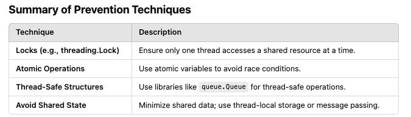

# Race Conditions and Locks

## Threads - Race Conditions


A race condition occurs when two or more concurrent streams of executions (threads, tasks, processes) try to access the same resource.

If the sequencing of the access is not controlled, then the shared resource may be altered out of order and this can lead to abnormal behaviour.

- Example1: The threads simultaneously read, modify, and write the counter variable, causing lost updates.

```python
import threading

counter = 0  # Shared resource

def increment():
    global counter
    for _ in range(100000):
        counter += 1

# Create two threads
thread1 = threading.Thread(target=increment)
thread2 = threading.Thread(target=increment)

# Start the threads
thread1.start()
thread2.start()

# Wait for threads to finish
thread1.join()
thread2.join()

print(f"Final counter value: {counter}")  # Expected: 200000, Actual: < 200000

```

- Example2: If the threads overlap during execution, the balance might not be updated correctly.

```python
import threading

balance = 1000  # Shared resource

def withdraw(amount):
    global balance
    if balance >= amount:
        balance -= amount

def deposit(amount):
    global balance
    balance += amount

# Create threads for withdrawal and deposit
thread1 = threading.Thread(target=withdraw, args=(500,))
thread2 = threading.Thread(target=deposit, args=(500,))

# Start the threads
thread1.start()
thread2.start()

# Wait for threads to finish
thread1.join()
thread2.join()

print(f"Final balance: {balance}")  # Expected: 1000, Actual: May vary

```

- Example 3: multiple threads writing to or reading from a shared file without corrdination can corrupt data

```python
import threading

def write_to_file(file_name, text):
    with open(file_name, 'a') as f:
        f.write(text + '\n')

threads = []
for i in range(5):
    t = threading.Thread(target=write_to_file, args=('shared.txt', f"Thread {i}"))
    threads.append(t)
    t.start()

for t in threads:
    t.join()

print("File write complete.")

```
