# Daytimem

- Unix epoch
  - time reference used in programming
  - point where time starts
  - jan 01 1970 at 00:00:00, UTC

## Time Module

- returns the number of seconds that have elapsed 'since time begin'
- float
- use this to profile code (measure how long a pecie of code takes to run)

```python
import time
time.time() # 1708490205.123456
time.sleep(seconds)
```

## Datetime Moudule

- Convenient format
- Represents a specific moment in time

### Datetime Object

- year, month, day, hour, minute, second

```python
import datetime
print(datetime.datetime.fromtimestamp(1000000))
#1970-01-12 05:46:40

import time
print(datetime.datetime.fromtimestamp(time.time()))
#2020-01-12 16:25:04.843986
# Whatever the time is atthe moment you ran the code
```

### Comparing Times

```python
from datetime import *

halloween = datetime(2018, 10, 31)
nyd = datetime(2019, 1, 1)
oct_31 = datetime(2018, 10, 31)

print(halloween == oct_31) #True
print(halloween > nyd) #False
print (nyd != oct_31) #True
```

### Timedata Datatype

- datetime: a point of time
- timedelta: a duration of time
  - weeks, days, hours, minutes, seconds, milliseconds, microseconds

```python
import datetime
halloween = datetime.datetime(2018, 10, 31)
nyd = datetime.datetime(2019, 1, 1)
delta = nyd - halloween
print(delta) #62 days, 0:00:00
delta2 = datetime.timedelta(days = 5, minutes = 11, seconds = 7) print(delta2) #5 days, 0:11:07
```

### Hacking time

- Pause a program until a specific time or date

```python
import datetime
import time
final_exam = datetime.datetime(2023, 4, 10, 9)
while datetime.datetime.now() < final_exam:
    time.sleep(1)
```

# Essential Object Oriented Programming

- Great modularization: easy to understand/collaborate
- Encapsulates data and the methods
- Adaptable and flexible use through **design idioms and patterns**
- Compatible with modern software development
- Great for modeling real world programs

## Class

- A class is a blueprint
  - serves to create `object`
    - independent, distinct instances
  - defines all the **attributes** and **methods**

### Object

- An object is an instance of a class with its own attributes
- An object has a `state` and `behaviour

  - encapsulation of data and methods that act on the data

- The `state` of each object = values of variables at any given time
  - variables are an object's private property and last its lifetime
- Mutating the state = changing the values in the instance variables

### Special Method #1: `__init__(self)`

- **Initializer**, special built-in method
- The first method inside the class definition
- Executed once when a new object is created
- Accept 1+ parameters
- The variables defined in the `__init__` method are preface with `self`

#### Data Attributes (instance variables)

- always with `self`
  - without `self`, it's a local variable
  ```python
  class Cat:
      def __init__(self, name):
          self._nmae = name
  ```

#### Visibility

- Everything is public in python

### Special Method #2: `__repr__(self)`

- `toString` in Java
- Should contain unambigous information about the current state of the object
- Implicitly called when we pass an object to `print()` function
- For developpers' eyes
- Returns a string

```
“name: Tobias age: 3 food_prefs: ['Sushi', 'Raw fish'], num_lives: 9”
```

### Special Method #3: `__str__(self)`

- `toString` in Java
- Should be the same as the `repr`, better string format(not a single line)
- Not required
  - if not provided, `__repr__(self)` will be used
- Returns a string

```
“My name is Tobias and I'm 3 years old.
love eating ['Sushi', 'Raw fish']
I have 9 lives remaining”
```

### Instanciation

```
Class.__init__() # initializer
```

### Accessors and Mutators

- `Accessors` are methds that return the value of an attribute

  - `self` is the only parameter
  - must not modify or print or send messages

  ```python
  def get_player_health(self):
      pass
  ```

- `Mutators` are methods that set the value of a data attribute

  - `self` is the first parameter
  - may only modify a single value, and only if it remains logical

  ```python
  def set_player_health(self, health_value):
      pass
  ```

- Accessors and mutators need docstring comments

#### Properties vs Accessors / Mutators

- A property is a way to encapsulate the getter (accessor) and setter (mutator) of an attribute
- The variable name automatically invokes the Accessor and Mutator

```python
my_engine.temperature = 70 # this would invoke set_temperature(70)
```

### Static (Class) Variables

- Shared by all instances of a class
- Declared inside the class but not insidea mdthode
- Accessible directly
- Can be accessed using `ClassName.class_variable`

### Class Methods

```python
class Temperature:
    def __init__(self, tempFarenheit):
        self.temperature = tempFarenheit

    @classmethod
    def from_celcius(cls, tempCelcius):
        tempFarenheit = (tempCelcius * 9/5) + 32
        return cls(tempFarenheit)

temp = Temperature.from_celcius(50)
```

- Just like static variables
- Take `cls` as the first parameter
  - class itslef
- `@classmethod`
- Modify and access class variables but not instance variables
- Can be accessed through the class name

### Static Methods

- `@staticmethod`
- Static functions belong to and can be accessed by the class not the object
- Static functions do not require `cls`
- Cannot access the class variables/objects
  - behave as independent functinos within the scope of a class

```python
@staticmethod
 def convert_to_fahrenheit(tempCelcius):
     farenheit = (tempCelcius * 9/5) + 32
     return farenheit
 Temperature.convert_to_fahrenheit(100)
```

### Static Methods vs Class Methods

- Similarities
  - Class level methods called on the class, NOT the instance
  - No need to instance an instance of the class before caliing the method
- Differences
  - `@staticmethod`
    - to perform opertaion **without** aceess to static variables
  - `@classmethod@
    - to perfom operation **WITH** access to static class
    - `cls`

# The Core Tenents of Object Oritned Programming

- An object will often store its collaborators as its data attributes
  - since it refers to them frequently thoroughout its lifetime
- An object is **composed** of collaborators

## OOP Principles

- A programming paradigm that uses abstraction to create models based on the real world
- 4 techniques
  1. Modularity and abstraction
  2. Encapsulation
  3. Inheritance
  4. Polymorphism

### 1. Modularity and Abstraction

- Modularization

  - process of dividing something into well-defined parts
  - about the system and the bigger picture

- Abstraction
  - Divide problems into small problems
  - Ignore the details of the solutions
  - Treat each one as a single encapsulated building block

### 2. Encapsulation

- Encapsulation

  - putting data with the functions that manage it
  - Wrapping them up in an implenetrable barrier of privacy (a class or module)
  - making state change is reliable and predictable
  - python conventions - `_`, `__` - private method - private variable

    ```python
        class Visibility:
            def public_func(self):
                print('public')
            def __private_func(self):
                print("private")
            def other_func(self):
                self.public_func()
                self.__private_func()

        v = Visibility()
        v.__private_func()
        # ERROR 'Visibility' object has no attribute '__private'
    ```

- Information Hiding
  - distinction between private/public
  - making inner working inaccessible from client object
  - exposing only things that must be exposed

### 3. Interface

- The methods and data of one object that are visible to other objects and parts of the system is known as **the public interface** of that object
- Public: public interface (how we interact with an object)
- Private: implementation (object's data)
  - do not generate accessor and mutators for every instance variables
  - only fields that are part of an object's **public** description should have accessor methods, and possibly mutator methods

### 4. Polymorphism

- Gives us absolute control over every source code dependency in the system
- Creates a plugin architecture
  - modules contain high level policies are separate from modules with low-level details
- Ability of our system/object/functions/code to function differently and be context-aware
- **Context-Aware**
  - code behaves differently based on what kind of data and environment it's working on
    - ex. duck typing
    - `+` operator
      ```python
      5 + 4 = 9
      "5" + "4" = "54"
      ```

# Variables and Memory

- Unused value is still in memory
  - garbage collector will remove it

# Inheritance

- Push common attributes as far up the inheritance hierarchy as possbible
- Is-a relationship
- Subclass is a specialized version of the superclass

## Overriding and Super()

- Extend behaviour by adding new methods
- Access the original with `super()`
  - returns the object as an instance of the parent class
  - call parent method directly
  - call from inside any method

```python
class Animal:
    def __init__(self):
        print('Animal')
class Dog(Animal):
    def __init__(self):
        print('Dog')
a = Dog()
# Output: Dog
```

```python
class Animal:
    def __init__(self):
        print('Animal')
class Dog(Animal):
    def __init__(self):
        super().__init__()
        print('Dog')
a = Dog()
# Output: Animal Dog
```

### Orer of Initialization

```python
class Animal:
    print('A')
    animal_static_var = 5
    print('B')
def __init__(self):
    print('Animal')

class Dog(Animal):
    print('C')
    dog_static_var = 10
    print('D')

    def __init__(self):
        print('Dog')

a = Dog()
# Output A B C D Dog
```

# Interface

1. Informal interfaces

   a. duck typing

   b. protocols

2. Formal interfaces

   a. abstract base classes

## Duck Typing - Informal Interface

`If a bird walks, swims, and quacks like a duck, then call it a duck`

- When an object's suitability for typing takes place at runtime
- **Runtime polymorphism**

### Python uses Dynamic Typing

- Any type of object ans an argument
- Obejct type are decided during _runtime_
- _Interpreter_ is reponsible for checking
- <-> static typing

#### Python is strongly typed

- Interpreter keeps track of object types
- Cannot perform operations inapproprite for the type of the object
  - ex. string + num

### Structural vs Normal Typing

- **Normal typing**
  - names is how we determine if. they're the same
- **Structure typing**: PYTHON
  - internal structure is how we determine if they're same

## Protocols - Informal Interface

- Collections of methods
- A type must support certain operations

### The Sized Protocol

- `__len__(self)`
- Invoked when an instance is passed to the built-in function `len()`
- How object reports the correct value to the `len()`
  returns the length of the object, an integer >= 0
  - implemented by str, list, range, tuple, bytes, set, dict
  ```python
  def len(obj):
      return obj.__len__()
  ```

### The Container Protocol

- `__contains__(self, item)`
  - must return `True` if contains
  - implemented by str, list, range, tuple, bytes, set, dict
- Membership operator `in` or `not in` is invoked on an object, protocol invoked

### The Sequence Protocol

- Permits
  - retrieving an item by index `item=seq[index]`
  - finding an item by value `index=seq.index(item)`
  - counting items `num=seq.count(item)`
  - producing a reverse iterator `r=reversed(seq)`
- Must implement
  - count(item), index(item), `__len__()`, `__getitem__(self,key)`, `__contains(self, item)`, `__reversed__(self)`
  - implemented by str, list, range, tuple, bytes
- Iterator
  - must provide `__next__(self)`, `__iter__(self)`
- Collection
  - must provide `__len__(self)`, `__iter__(self)`, `__contains__(self, item)`

## Formal protocols and ABCs

- Abstract Base Classes complements duck-typing
- Defines a set of methods and properties that a class must implement
- Built-in ABCs for data structures, numbers, streams etc
- `@abc.abstractmethod`
  - without it: typeerror: cannot instantiate abstract X...

```python
import abc
class Bird(abc.ABC):
    @abc.abstractmethod
    def fly(self):
        pass

class Parrot(Bird):
    def fly(self):
        print("Flying")

p = Parrot()
isinstance(p, Bird)
# True
```

# UML

- To describe the static structure of the system
- Class attributes, operations
- Relationships among objects
- Language agnostic

## Class Diagram

- name of class / attributes and types / methods
  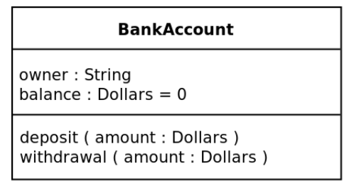

### Dependency

- A contains methods that use parameter B
  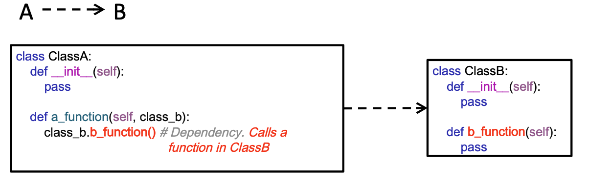

### Association

- A contains data attributes B
  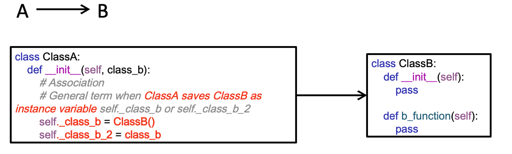

### Aggregation

- A is aggregated with B
- If A destroyed B still exists
  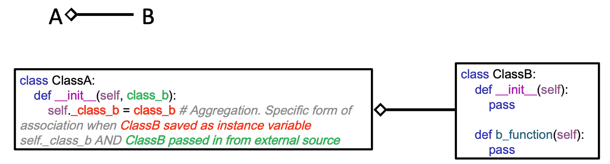

### Composition

- A is composed of B
- If A destroyed B also destroyed
  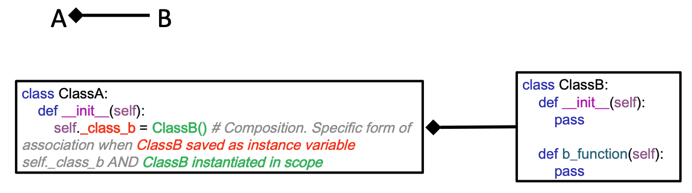

### Inheritance

- A is a subclass of B
  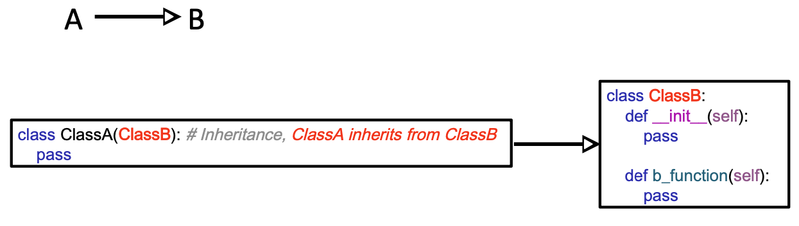

### Realization/Implementation

- A is implementing interface B
  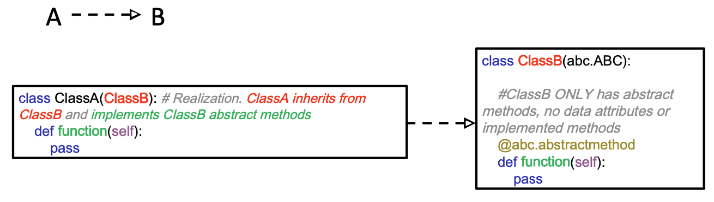

#### Example

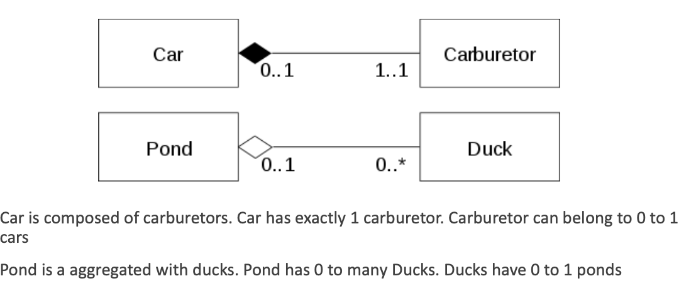
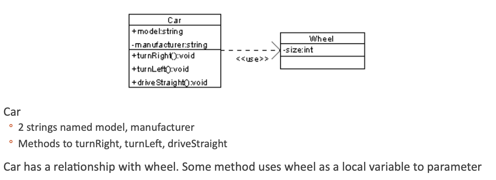
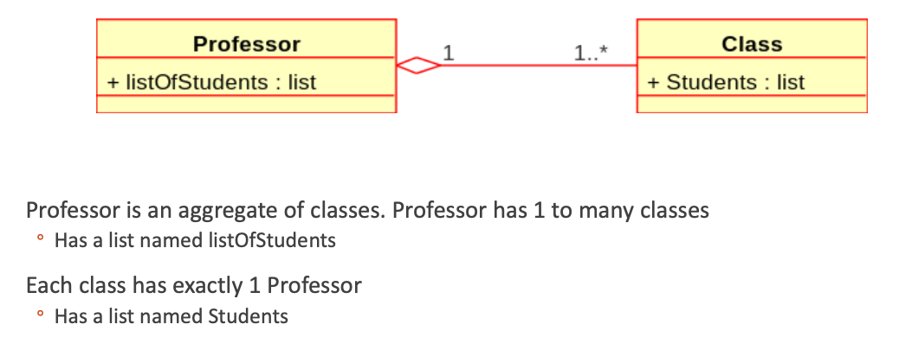
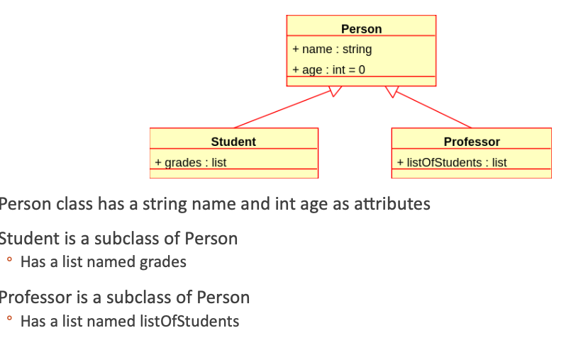
