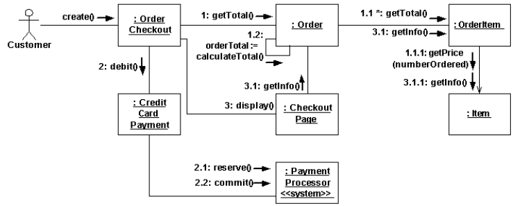
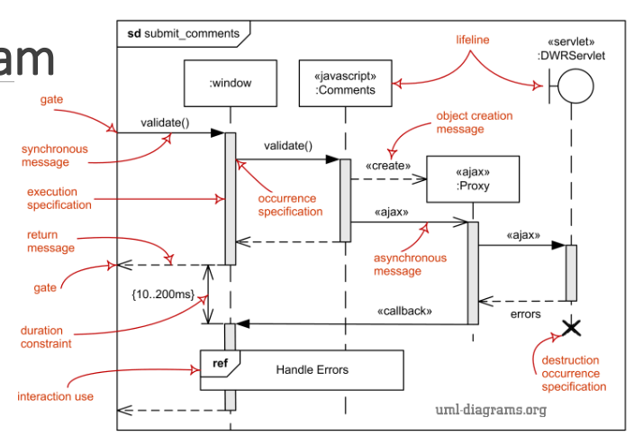
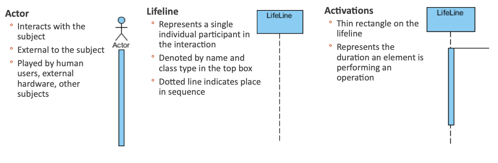
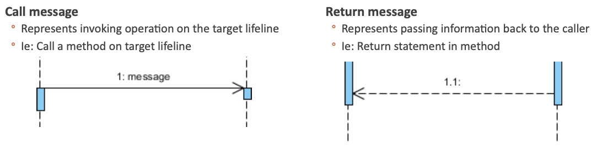
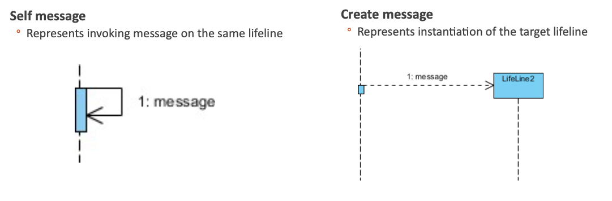
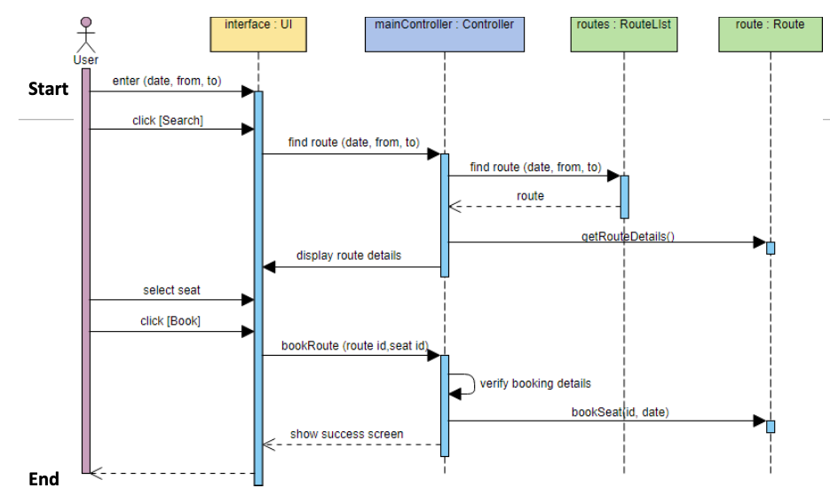
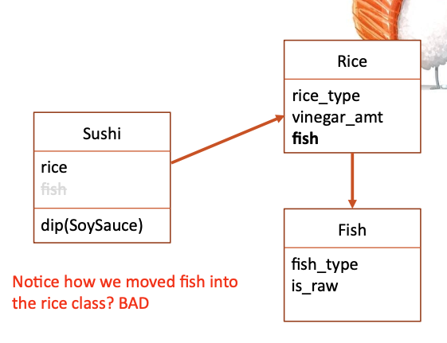
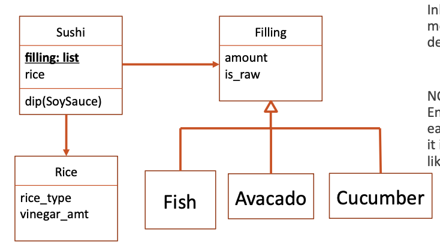

# Interfaces

# UML

## Collaboration Diagram

- Interactinos between objects as a sequnece of messages between objects from a structure perspective
- Shows how objects interact in a particular use case or subset of a use case
  
- obejct
- actor
- links : connects objects and actors
- messages

## Sequence Diagram

- Presents interactions between objects as a sequnce of messages between objects
- Time-based perspective
- Lifetime of the interactions between communicating objects
  
  
  
  
  

# Dependencies

- When one entity depneds on another entity
- Entity A uses entity B, then A is said to be dependent on B
  `Class Sushi would be dependent on Class Rice and Class Fish`

# Couping

- **Coupling** is a form of a strong dependency
  - avoid it as much as possbile
    
  - **interitance** and **interfaces** to decouple code
    

# SOLID Design Principles

## Single Responsibility Principle

- A class should have only a single responsibility

## Open/Closed Principle

- A software module should be open for extension but closed for modification

## Liskov Substituion Principle

- Objects in a program should be replaceable with instances of their subtypes without altering the correctness of that program

## Interface Segregation Principle

- Clients should not be forced to depened upon the interfaces that they do not use

## Dependency Inversion Principle

- Program to an interface, not to an implementation

# Law of Demeter

- Each unit should have only limited knowlege about other units

# Function Parameters

- Python is pass by ...anything
