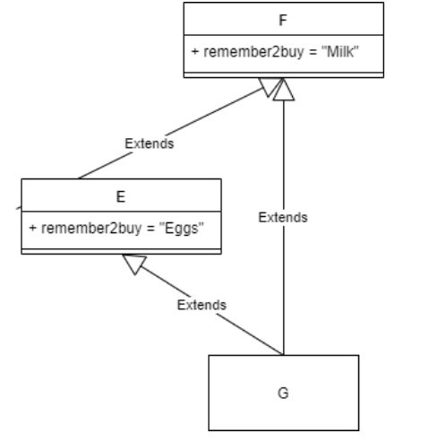

# Slicing

```python
letters = list('Hello world')
print(letters)
# ['H', 'e', 'l', 'l', 'o', ' ', 'w', 'o', 'r', 'l', 'd']
print(letters[0:5])
# ['H', 'e', ‘l’, ‘l’, ‘o’] # indices 0 through 4

breakfast = ["0 - Eggs", "1 - Toast", "2 - Granola", "3 - Yoghurt", "4 - Banana", "5 - Orange", "6 - Juice"]

print(breakfast[2:5:2])
# ['2 - Granola', '4 - Banana’]
print(breakfast[::2])
# ['0 - Eggs', '2 - Granola', '4 - Banana', '6 - Juice']
print(breakfast[5:2:-1])
#['5 - Orange', '4 - Banana', '3 - Yoghurt']
```

# Ranges

```python
list(range(10))
# [0, 1, 2, 3, 4, 5, 6, 7, 8, 9]
list(range(1, 11))
# [1, 2, 3, 4, 5, 6, 7, 8, 9, 10]
list(range(0, 30, 5))
# [0, 5, 10, 15, 20, 25]

list(range(0, -10, -1))
# [0, -1, -2, -3, -4, -5, -6, -7, -8, -9]
list(range(0))
# []
list(range(5, 0))
# []
list(range(5,0,-1))
# [5,4,3,2,1]

r = range(0, 20, 2)
print(r)
# range(0, 20, 2)
print(type(r))
# <class 'range’>
r.index(10) #which index is 10 at?
# 5

digits = range(1, 11)
max(digits)
#10
min(digits)
#1
sum(digits)
#55

```

# Iterators

- An iterator is an obejct that contains a countable number of values

```python
my_tuple = ("apple", "banana", "cherry")
my_it = iter(mytuple)
print(next(myit)) # apple
print(next(myit)) # banana
print(next(myit)) # cherry
```

- Iterator streams the contents of the container
- Calling `next()` returns successive items in the stream
- No more data is available -> `StopIteration` exception
  - iterator is exahusted and cannot be used again
- A container object produces a fresh iterator each time with

  - `iter()` function
  - for loop

  ```python
  mystr = "banana"
  myit = iter(mystr)
  print(next(myit)) #b
  print(next(myit)) #a
  print(next(myit)) #n
  print(next(myit)) #a
  print(next(myit)) #n
  print(next(myit)) #a
  print(next(myit)) #StopIteration exception

  while True:
    try:
        item = next(myit)
    except StopIteration:
        break
    print(item)
  ```

  ```python
    mystr = "banana"
    for item in mystr:
        print(item)

    # with iterator
    mystr = "banana"
    my_it = iter(mystr)
    for item in my_it:
        print(item)
  ```

# Function Overloading

- Python is dynamically typed -> same function names but different works
- Overloading in python with
  - default arguments
  - named arguments
  - variable list arguments
  - keyword arguments

# Arguments

## Default Arguments

```python
def __init__(self, team_number, team_name = “”, member_list = None):
    pass
```

### Python is Interpreted


## Named Arguments

- we can change the order of parameters

```python
def my_func(a_num=5, a_string='hello', a_list=['cat','dog']):
    pass
```

## Pass Unknown Number of Arguments

- `*args` treated like a sequence type
- `**kwargs` treated like a dictionary
  - interprets key/value parameters passed in as a dictionary

### Packing Arguments

```python
def my_print(*args):
    for item in args:
        print(item)

my_print('dog', 5, {1:'hi', 2:'hello'})
```

```python
def variable_keyword_args(**kwargs):
    for key, item in kwargs.items(): # it's dictionary!
        print(key, item)

variable_keyword_args(port=21, host='localhost', debug=True)
```

### Unpacking

```python
def my_print(in_str, in_int, in_dict):
    print(in_str, in_int, in_dict)
    my_list = ['dog', 5, {1: 'hi', 2: 'hello'}]

my_print(*my_list) #unpack list
```

# Function Parameters

## Mutable Parameters


- Can make functions appear to be pass by reference
- Can change the internal attributes
- Changes will affect the original object
- Assignment causes parameter to point to a different object.
- Causes function to appear to be pass by value

## Immutable Parameters


- Can make functions appear to be pass by value
- Can NOT change the internal attributes.
  - This is consistent with the concept of immutable types
- Any changes that appear to occur are actually new immutable objects that are created

# Multiple Inheritance

- Avoid if you can

## The Diamond Problem

- The `super()` keyword executes the methods in the parent class by first resolving the **Method Resolution Order**

### Method Resolution Order(MRO)

- **class precedence list** or **the linearization of [parent class name]**
  - linearization of class C is `[C, B, A, object]`
  - also callled `MOR of C`
- Must respect monotonicity
  - If B Precedes A in the Linearization of C, then B HAS TO precede A in the Linearization of any child class of C.
    - Linearization(C) = [C, B, A, object]
    - Linearization(D) = [D, C, B, A, object]
- Provide local precedence ordering

- Example
  

```python
class F:
    remember2buy = “Milk”
class E(F):
    remember2buy = “Eggs”
class G(E, F):
    pass
```

`Linearization(G) = [G, E, F, object]`

- Example 2
  

```
L(O) = [O]
L(A) = [A,O]
L(B) = [B,O]
L(C) = [C,O]
L(D) = [D,O]
L(E) = [E,O]
L(K1) = [K1, A, B, C, O] L(K2) = [K2, D, B, E, O] L(K3) = [K3, D, A, O]
```

```
L(Z) = [Z] + merge(L(K1), L(K2), L(K3), [K1, K2, K3])
```

```
L[Z] = [Z] + merge([K1, A, B, C, O], [K2, D, B, E, O], [K3, D, A, O], [K1, K2, K3])
```


## Mixins

- It is not intended to be instantiated directly.

  - Instead, it is meant to be inherited by other classes.

- These inherit and encapsulate behaviours and attributes from two completely different classes
- We then inherit from a mixin to create classes that can exhibit behaviours of both the base classes

```python

class Mixin1:
    def sayHi(self):
        print('Hi')
class Mixin2:
    def sayWorld(self):
    print('World')
class MultiDerived (Mixin1, Mixin2): def __init__(self):
        self.sayHi()
        self.sayWorld()

m = MultiDerived()
#Output:
#Hi
#World
```

# Interface Segregation Principle

- Multiple inheritance is a great way to implement differnt interfaces from parent ABC classes
- do not overlap
- avoid putting implementatino in the ABC's unless absolutely necessary
- use mixins to encapsulate differnet interfaces -> make a common base class

```python
class Walk(abc.ABC):
    @abc.abstractmethod
    def walk(self):
        pass
class Swim(abc.ABC):
    @abc.abstractmetod
    def swim(self):
        pass
class Human(Walk, Swim):
    def walk(self):
        pass

    def swim(self):
        pass
```
