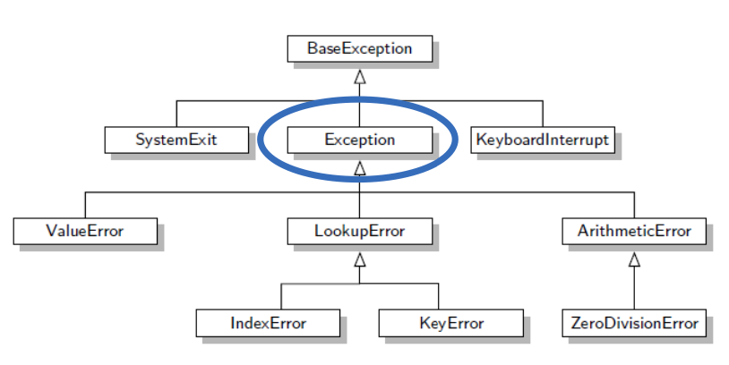
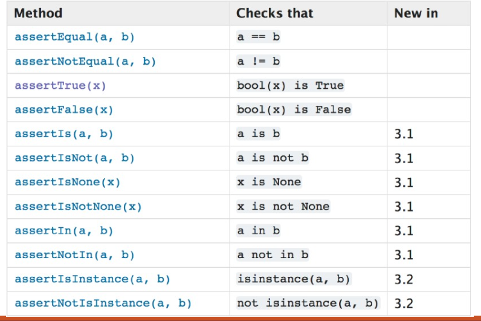
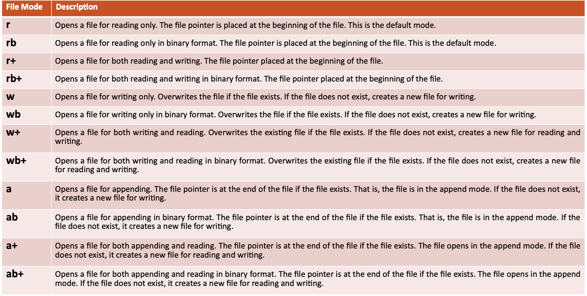
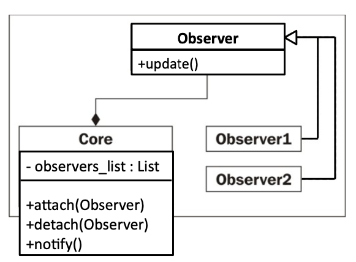

# Errors and Exceptions

- Inherit from the BaseExceptino class
- ValueError

  ```python
  >>> user_choice = int(input(“Enter Menu Option”))
  >>> “Hello”
  ```

- TypeError

  ```python
  >>> my_list = [1,2,3]
  >>> my_list + ‘4’

  ```

- AttributeError

  ```python
  >>> my_list.add(4)

  ```

- ZeroDivisionError
- SyntaxError

  ```python
  >>> print “99”  # This used to work in Python 2
  ```

- NameError

  ```python

  print(my_variable)

  ```

## Throwing an Exception

```python
def divide(num1, num2):
    if num2 == 0:
        raise ZeroDivisionError()
    return num1/num2
```

## Try-Except Block

```python
try:
    # The code that can possibly throw an exception
    add_something(1,3)
    add_something(‘3’,4)
except:
# Executed if an exception occurs
    print("An Exception was caught")
else:
    print("No exceptions")
finally:
    print("always execute this")

```

## Exception Inheritance Hierachy

- Most exceptions we handle inherit from `Exception`
  
- NEVER have an empty except
  - it will catch all the exceptions
- put smaller exceptions first, and go larger

## Easier to Ask for Forgiveness than Permission

- Multiple if-checks are bad (look before you leap)
  - exceptions are fast
  - waste CPU cycles
  - keep our functions atomic

## Custom Exceptions

```python
class MyCustomException(Exception): ◦ #class code
    pass

#Optional : Create an init with a custom error message
def __init__(self, my_msg):
    super().__init__(my_msg)
```

## `args` and `as` in Exceptions

- `args`
  - Get the instance of an exception to retrieve some data

```python
# catches the exception into the instance variable e
except MyException as e:
    print(e.args[0])
```

- `as`
  - the `BaseException`'s initializer contains an args to stroe a tuple of arguments
    - typically there is only one argument
      - string describign an error
  - additional arguments can be accessed using `[]` on the args

```python
try:
    raise MyException("Custom Error message", 999)
except MyException as e:
    print(e.args) #('Custom Error message', 999)
    print(e.args[0]) #Custom Error message
    print(e.args[1]) #999
```

# Unit Test

- A piece of code that exercises a very small, specific area of functionality of a given system
- A unit test invokes a particular function with a given input.
  - It then asserts whether the output received matches a given expected output
- It is an organized approach which helps break down our program into small bite sized pieces of functionality
- Each chunk of functionality can be tested in isolation
- Steps

1. Assemble – Create an environment in which the function can run
2. Act – Run the code with a given input(s).
3. Assert – Compare the result

- Rules
- A collectin of unit tests
- Each test is function that contains an **`assertion`**
- Assertions must test individual functions of your code
- The unit test functions go inside the test class
- The functions must all begin with **`test`**
  

```python
class Test(TestCase):
    def test_sum(self):
        self.assertTrue(MyClass.sum(1, 2)==3)
```

# File-Handling

1. Open a file
   - specify the encoding, file mode, file name
2. Conduct File Operations
   - read, write, append
3. Close the file
   - release memory and tie up any loose ends

```python
#Step1: Open a file
my_text_file = open("sample.txt", mode='r', encoding='utf-8')
#Step2: File operations
data = my_text_file.read() print(f"File Data:\n{data}")
#Step3: Close the file
my_text_file.close()
```



## `With` Keyword

- Closing files safely
- `With` defines an **identifier**
  - represents an object like a file, an active connection to a server, anything that needs to be initialized and de-initialized
- `__enter__(self)`, `__exit__(self)` needs to be implemented

```python
with open("test.txt", mode = 'w',encoding = 'utf-8') as f:
    f.write("my first file\n")
    f.write("This file\n\n")
    f.read() # This will cause an exception. The file will close safely
    f.write("contains three lines\n")
```

## `.seek(0)`

- EOF -> need to seek back to the begging for multiple reads

```python
with open("sample.txt", mode='r') as my_text_file:
    data = my_text_file.read()
    print(f"File Data:\n{data}")
    # This wont print anything since the file pointer # is at the end of the file
    data = my_text_file.read()
    print(f"Printing Data again: {data}")
    # You need to seek back to the beginning for # multiple reads
    my_text_file.seek(0)
    data = my_text_file.read()
    print(f"Printing data after seeking to the beginning:\n {data}")

```

## Load json from File

- `json.load(identifier)` to convert data into a dictionary

```python
import json
with open("data.json", mode='r', encoding='utf-8') as data_file:
    data = json.load(data_file)
    print(data)
```

## Write to json file

- Convert dictionary into json, then write json file out

```python
import json

person_dict = {"name": "Homer", "children": ["Bart", "Lisa","Maggie"], "married": True, "fav_food": 'Donut' }

with open('person.json', 'w') as json_file:
    json_data = json.dumps(person_dict)
    json_file.write(json_data)
    # json.dump(person_dict, json_file) #same as above 2 lines
```

# Enums

- An enumeration (Enum) is a user-defined type that consists of a set of named value constants that are known as enumerators
- Cannot modify the name or value after it's been created
- Cannot have duplicated keys

```python
import enum
class Days(enum.Enum):
    SUN = 0
    MON = 1
    TUE = 2
    WED = 3
    THU = 4
    FRI = 5
    SAT = 6

day = Days.MON
print(type(day)) #<enum 'Days'>
print(day) #Days.MON
print(day.name) #MON
print(day.value) #1
print (Days['SAT']) #Days.SAT
print (Days(4)) #Days.THU

day.name = Days.THU.name #ERROR
day.value = 5 #ERROR
day = Days.TUE # ok

for day in Days:
    print(day)
# Days.SUN Days.MON Days.TUE Days.WED Days.THU Days.FRI Days.SAT
```

# Iterators

- An `Iterator` is responsible for traversing an `Iterable`
  - An iterators primary responsibility is to iterate over the elements of an iterable.
  - An Iterable is something that you can loop over.
  - Iterator
    ◦ Implements `__next__(self)`
    ◦ Implements `__iter__(self)`
  - Iterable
    ◦ Implements `__iter__(self)`
- We would need to implement an iterable class and an iterator class

```python
# List iterator
my_list = [1, 2, 3]
list_iterator = iter(my_list)

print(next(list_iterator))  # Output: 1
print(next(list_iterator))  # Output: 2
print(next(list_iterator))  # Output: 3
# next(list_iterator) would raise StopIteration
```

```python
class MyIterator:
    def __init__(self, limit):
        self.limit = limit
        self.counter = 0

    def __iter__(self):
        return self

    def __next__(self):
        if self.counter < self.limit:
            self.counter += 1
            return self.counter
        else:
            raise StopIteration


# Using the custom iterator
my_iter = MyIterator(5)
for num in my_iter:
    print(num)  # Output: 1, 2, 3, 4, 5
```

```python
def my_generator(limit):
    counter = 0
    while counter < limit:
        counter += 1
        yield counter


# Using the generator
for value in my_generator(3):
    print(value)  # Output: 1, 2, 3
```

# Comprehensions

- Comprehensions allow us to transform/filter an iterable object into another iterable
  - create one iterable from another iterable (sequence/container) by following some special rules/filters.
- Simple, readable syntax

```
[item for item in grogeries if condition else]
```

- Dictionary Comprehension

  - with key-value pair

  ```
  { f(key): g(value) for key,value in some_iterable if conditional}

  {chr(i+65) : i+65 for i inrange(0,26) if i mod 2 == 0 return True}
  ```

- Why we use comprehensions
  - Comprehensions hide the working of iterators
  - Comprehensions leverage the power of iterators to do complex operations.
  - Comprehensions are faster
  - Comprehensions are readable
  - Comprehensions are maintainable

# Function Object and Observers

- Functions are objects

```python
>>> def some_function():
...     print(“Something”)
>>> function_obj = some_function
>>> print(function_obj) #<function some_function at 0x007B67C0> >>> print(function_obj.__name__) #some_function
>>> print(function_obj.__class__) #<class 'function'>
>>> print(type(function_obj)) #<class 'function'>
>>> function_obj() #Something
```

- Event Driven Programming

1. We can store functions as objects
2. Pass them around via arguments
3. Call them later in the future when some condition has been met.

- `Callbacks`: functions that are passed to be called back later
- `Event Handlers`: functions that are meant to handle an event such as a mouse or button click
  - event handler is another type of callback

# Observer Design Pattern



- `Core`: observers (ex. timer, button, inventory system...)
- When someothing changes, or significant state has been reached,
  - Core notifies its observers by calling all the callbacks
- for de-coupling code in GUI’s

- Requirements

1. All the callback functions accept the **same parameters**.

- all the observers implement either the same interface, or a similar method (informal interface)

2. The core doesn’t care who’s observing it or what they do when a change occurs.
3. Core only cares about

- it has to run a set number of callbacks
- call bakcs have the same interface to notify some observers that do something

## Callable Objects

- `__call__(self)`

```python
class CallableObject:
    def __call__(self, x, y):
        return x + y


# Creating an instance
add = CallableObject()

# Using it like a function
print(add(2, 3))  # Output: 5

```

Generators with `__call__`

```python

class Counter:
    def __init__(self):
        self.count = 0

    def __call__(self):
        self.count += 1
        return self.count


counter = Counter()
print(counter())  # Output: 1
print(counter())  # Output: 2
```

Callable from `collections.abc.Callable`

```python
from collections.abc import Callable

def my_function():
    pass

print(isinstance(my_function, Callable))  # Output: True

class NonCallable:
    pass

print(isinstance(NonCallable(), Callable))  # Output: False

```

Functions are the most common callable objects

```python
# User-defined function
def my_function():
    return "I'm callable!"

print(my_function())  # Output: "I'm callable!"

# Built-in function
print(len("Hello"))  # Output: 5

```

Instance Methods and class methods

```python
class MyClass:
    def instance_method(self):
        return "Instance method called!"

    @classmethod
    def class_method(cls):
        return "Class method called!"


obj = MyClass()
print(obj.instance_method())  # Output: "Instance method called!"
print(MyClass.class_method())  # Output: "Class method called!"

```

classes

```python
class MyClass:
    def __init__(self, name):
        self.name = name

    def greet(self):
        return f"Hello, {self.name}!"


# Calling the class
obj = MyClass("Alice")
print(obj.greet())  # Output: "Hello, Alice!"

```
