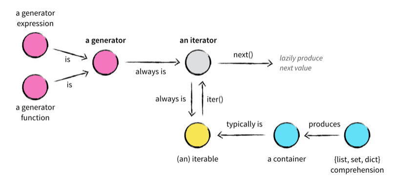
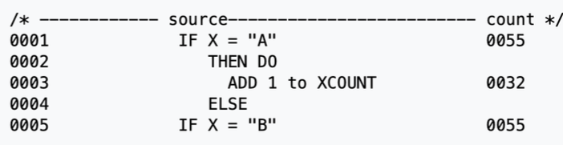

# Generators

- Special iterator

  - Operate over a sequence of objects / iterables
  - Use `yield` statement to return the next element in a sequence
  - Generators are special constructs and a special type of iterator that iterates over a sequence while saving memory
  - Benefits: memory efficient, infinite sequences, pipeline processing
  - Limit: single iteration, no random access

- Ranges
  - Advantages
    - They save memory
    - They are easy to read
    - They provide all the advantages of being an iterable
  - Not exactly like generators but the concep is the same

```python
my_range = range(1000)
a_list = [i for i in range(1000)]
print(my_range) #range(0,1000)
print(a_list) #[0,1,2, . . ., 997,998,999]

print(f"Range Size in bytes: {sys.getsizeof(my_range)}") #Range Size in bytes: 48
print(f"List Size in bytes: {sys.getsizeof(a_list)}") #List Size in bytes: 8856
```

```python
def my_generator():
    yield 1
    yield 2
    yield 3

# Using the generator
gen = my_generator()
print(next(gen))  # Output: 1
print(next(gen))  # Output: 2
print(next(gen))  # Output: 3
# next(gen) now would raise StopIteration
```

## Generator Function

```python
def my_function():
     n = 0
     #some code
     yield n #returns n and pauses. Execution continues from next line later
     #some more code
     yield n
```

- When python sees a generator function with a yield statement
  - it wraps it up in an object
  - `next(generator_object)` is called, the generator function executes _behind-the-scenes_
- `yield`
  - like a return statement, but instead of returning from a function
    - it **returns the value** and **remembers its place in the function**.
  - temporarily _yielding_ the flow

```python
def fibonacci(limit):
    a, b = 0, 1
    for _ in range(limit):
        yield a
        a, b = b, a + b

# Using the Fibonacci generator
for num in fibonacci(5):
    print(num)  # Output: 0, 1, 1, 2, 3

```

## Generator Expressions



```python
def gen_even_multiples(multiplier, start, stop):
    yield from (x * multiplier for x in range(start, stop) if x % 2 == 0)

for result in gen_even_multiples(5, 0, 100):
    print(result)
```

- Add more syntatic sugar
- Similar to a list comprehension
  - use `()` instead of `[]`
  - not as flexible because the generators cannot be re-used
  - but clean
    ```python
    ( f(x) for x in some_iterable if condition )
    ```

```python
def warning_filter_generator(file_object):
    #one line with generator expression!
    yield from (line for line in file_object if '[Warning]' in line)

with open("log_file.txt", mode='r', encoding='utf-8') as log_file:
    filter = warning_filter_generator(log_file)
    for warning_line in filter:
        print(warning_line)
```

```python
# List comprehension
squares_list = [x ** 2 for x in range(1000000)]  # Consumes a lot of memory

# Generator expression
squares_gen = (x ** 2 for x in range(1000000))  # Memory efficient

```

# Lambda Functions

```python
lambda parameters: expression

```

- Anonymous, inline functions
- No multi-line
- Why we use it
  - To define callbacks
  - Asynchronous code i.e code that does not run sequentially
  - In list comprehensions/generators
  - With `filter` and `map` built-in functions

```python
add = lambda x, y: x + y
print(add(3, 5))  # Output: 8
```

```python
# With map
nums = [1, 2, 3, 4]
squared = map(lambda x: x ** 2, nums)
print(list(squared))  # Output: [1, 4, 9, 16]

# With filter
nums = [1, 2, 3, 4, 5]
even = filter(lambda x: x % 2 == 0, nums)
print(list(even))  # Output: [2, 4]

```

# Map

- `map(function, iterable, ...)`
- Alternative to list comprehension

```python
# Function to double a number
def double(x):
    return x * 2

numbers = [1, 2, 3, 4]
result = map(double, numbers)
print(list(result))  # Output: [2, 4, 6, 8]
```

```python
# Function to add two numbers
def add(x, y):
    return x + y

list1 = [1, 2, 3]
list2 = [4, 5, 6]

result = map(add, list1, list2)
print(list(result))  # Output: [5, 7, 9]

result = map(lambda x, y: x + y, list1, list2)
print(list(result))  # Output: [5, 7, 9]
```

# Filter

- `filter(function, iterable, ...)`
- Work with one argument and one sequence, based on `True` or `False`
- returns a filter object

```python
type(filter(fun, list)) # <clas 'filter'>
```

```python
# Function to check if a number is even
def is_even(num):
    return num % 2 == 0

nums = [1, 2, 3, 4, 5, 6]
result = filter(is_even, nums)

print(list(result))  # Output: [2, 4, 6]
```

```python
nums = [1, 2, 3, 4, 5, 6]
result = filter(lambda x: x % 2 == 0, nums)

print(list(result))  # Output: [2, 4, 6]
```

```python
words = ["apple", "bat", "banana", "cat"]
result = filter(lambda word: len(word) >= 5, words)

print(list(result))  # Output: ['apple', 'banana']

```

# The Zen of Python

1. Beautiful is better than ugly

   - Code should be aesthetically pleasing and clean
   - Well-structured and readable code is easier to maintain and understand than messy or convoluted code

   ```python
    # Ugly
    x=5;y=10;print(x+y)

    # Beautiful
    x = 5
    y = 10
    print(x + y)
   ```

2. Explicit is better than implicit

- Code should clearly communicate its intent
- Avoid relying on hidden or obscure behavior that might confuse others

```python
# Implicit
from math import *  # Not clear which functions are being imported

# Explicit
from math import sqrt, pi  # Clear about the specific imports


# Implicit behavior
x = [1, 2, 3]
y = x  # Both variables refer to the same list
y.append(4)  # Modifies 'x' as well

# Explicit behavior
x = [1, 2, 3]
y = x.copy()  # Creates a new list explicitly
y.append(4)

```

3. Simple is better than complex

- Aim for simplicity in your code whenever possible
- Simple code is easier to understand, test, and maintaine

```python
# Complex
def find_maximum(nums):
    nums.sort()
    return nums[-1]

# Simple
def find_maximum(nums):
    return max(nums)

```

4. Complex is better than complicated

- Sometimes complexity is necessary, but it should be manageable and logical rather than convoluted or overly complicated

```python
# Complicated
def factorial(n):
    if n == 0:
        return 1
    result = 1
    for i in range(1, n + 1):
        result *= i
    return result

# Complex (but concise and logical)
def factorial(n):
    return 1 if n == 0 else n * factorial(n - 1)

```

# Profiling

- Analyzing our program’s runtime performance
  ◦ Space complexity
  ◦ Time complexity
  ◦ Usage of particular instructions
  ◦ Frequency and duration of function calls

  - how?
    - Call count statistics can be used to identify:
      ◦ Bugs (surprisingly high calls)
      ◦ Inline-expansion points
    - Internal time statistics can be used to identify “hot loops” that need to be optimized
    - Cumulative time statistics can be used to identify high-level errors in algorithms

- Profiling is a form of dynamic program analysis
- We build a profile with a `profiler`
- We use the profile to aid in program optimization
- Our goal is correct, dependable, efficient (fast) software.

- `Instrumentation`

  - Profiling works by instrumenting the program source code or a binary executable
  - Instrumentation measures the level of a product’s performance
  - Instrumentation incorporates: code tracing, debugging, performance counters, logging

- `Profiler`

  - provide code using a code profiler
  - methods: instrumentation, events, statistics, simulations, hardware interrupts, os hooks, performance counters...

- `Profilers` can produce `Profiles`

  - A profile is a statistical summary of the events observed
    

- `Profilers` can produece `Traces`

  - A trace is a stream of recorded events
  - for **parallel programs**, to understand what hpens
  - summary profile is usually sufficient for sequential programs

- Building the profile
  - Profilers run during a program’s execution (dynamic analysis)
  - The program execution must be interrupted by the profiler so that it can collect information
  - non-trivial effect on time measurements
  - Resultion is limited

## Profilters

- Statistical Profiling

  - randomly samples the instruction pointer and deduces where time is being spent
  - less overhead because it doesn’t require instrumentation
  - provides only relative indications of where the time was spent

- **Deterministic Profiling**
  - Python use this
  - monitors all function calls, function returns, and exception events
  - Precise times are recorded for the intervals between these events
  - requires overhead that can skew results (usulaly not a problem)
  - modules `cProfile`, `profile`

### cProfile Module

```
 python
    >>> import cProfile
    >>> import re
    >>> help(cProfile)
    >>> help(re)
    >>> help(cProfile.run)
```

- profiling a statement, saving as restats
  ```
  >>> cProfile.run('re.compile("foo|bar")', 'restats')
  p = pstats.Stats('restats')
  p.print_stats()
  ```
- primitive calls != receursive calls
- `ncalls`: how many times called
- `tottime` tottal time spent
- `percall` = tottime / numcalls
- `cumtime` cumulative time
- `percell`: another call measure cumtime / primitive calls

- Sort order

```python
  from pstats import SortKey
  p.strip_dirs().sort_stats(SortKey.STDNAME).print_stats()
```

```
python -m cProfile [-o output_file] [-s sort_order] filename.py
```

### Limitations: accuracy

◦ The underlying clock is only “ticking” once every millisecond
◦ No measurements can be more accurate than 0.001 seconds
◦ lag

# Intro to Design Patterns

- Design patterns describe how to structure our code/classes to solve some specific design issue
- Advantages
  - use a proven solution instead
  - abstract and can be applied to different problems
  - communicate ideas and concepts between developers
  - Language agnostic. Can be applied to most (if not all) OOP programs
- Disadvantages
  - more complex making the system harder to maintain
  - system may suffer from pattern overload
  - a developer may need to add a constraint they did not plan for
  - do not lead to direct code re-use
- Picking a pattern

1.  Understand the problem you are facing in terms of dependencies, modularity and abstract concepts
2.  Identify if this is a behavioural, structural or creational issue
3.  Are there any constraints that I need to follow
4.  Is there a simpler solution that works? If not, pick a pattern

### Creational Patterns:

Focus on object creation mechanisms.
Ensure objects are created in a manner suitable to the situation.
Examples:
Singleton
Factory Method
Abstract Factory
Builder
Prototype

### Structural Patterns:

Focus on composing objects and classes to form larger structures.
Help ensure flexibility and efficient organization of classes and objects.
Examples:
Adapter
Bridge
Composite
Decorator
Facade
Flyweight
Proxy

### Behavioral Patterns:

Focus on communication and responsibility among objects.
Define how objects interact and how responsibilities are distributed.
Examples:
Strategy
Observer
Command
Iterator
Mediator
Memento
Chain of Responsibility
State
Template Method
Visitor
