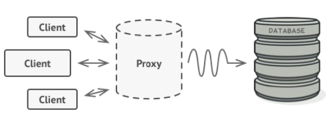

# Creational(Objects) in Design Pattern

## Singleton

- Guarantees that only a single instance of a class will ever exist
- want to prevent more than one copy from being constructed
- Requirements

1. Instantiates the object on its first use
2. Ideally hides a private initializer
3. Reveals a public get_instance function that returns a reference to a static instance of the class
4. Provides “global” access to a single object

```python
class Singleton:
    _instance = None

    def __new__(cls, *args, **kwargs):
        if not cls._instance:
            cls._instance = super().__new__(cls)
        return cls._instance

# Usage
singleton1 = Singleton()
singleton2 = Singleton()
print(singleton1 is singleton2)  # Output: True

```

## Factory (Factory Method)

- separate creation code from client code
- client or service to only depend on a base class for object creation and not each concrete class
- factory: pattern, class that creates objects, a static/class method that generates objects
- creation of a group of related objects
- create different variants of families of objects
- A method or function that is responsible for **creating an object**
  - different from constructor
  - doesn’t have to make a new instances of a class, it can return a cached object or even re-use objects from a collection
- **dependency inversion principle**
- Single Responsibility, Open Closed, Liskov Substitution and Dependency Inversion Principle
- use factory pattern when
  - the exact type and dependencies of the objects you need are unknown or susceptible to change
  - to separate and encapsulate the creation process
- Disadvantages: a lot of classes, hard to debug, artificial classes

```python
from abc import ABC, abstractmethod

# Abstract Product
class Shape(ABC):
    @abstractmethod
    def draw(self):
        pass

# Concrete Products
class Circle(Shape):
    def draw(self):
        return "Drawing a Circle"

class Square(Shape):
    def draw(self):
        return "Drawing a Square"

# Factory Method
class ShapeFactory:
    @staticmethod
    def create_shape(shape_type):
        if shape_type == "circle":
            return Circle()
        elif shape_type == "square":
            return Square()
        else:
            raise ValueError(f"Unknown shape type: {shape_type}")

# Client Code
shape = ShapeFactory.create_shape("circle")
print(shape.draw())  # Output: Drawing a Circle

shape = ShapeFactory.create_shape("square")
print(shape.draw())  # Output: Drawing a Square

```

## Abstract Factory

- Abstract Factory is a creational design pattern that lets you produce families of related objects without specifying their concrete classes
- Single Responsibility, Open/Closed Principle, Liskov Substitution and Dependency Inversion Principle
- Use this when
  - code needs to work with families of related objects
  - the exact number of Product Families are unknown and you will have to add in new ones in the future
- Disadvantages: lots of classes and interfaces, classes can get artificial

```python
from abc import ABC, abstractmethod

# Abstract Factory
class GUIFactory(ABC):
    @abstractmethod
    def create_button(self):
        pass

    @abstractmethod
    def create_checkbox(self):
        pass

# Abstract Products
class Button(ABC):
    @abstractmethod
    def click(self):
        pass

class Checkbox(ABC):
    @abstractmethod
    def check(self):
        pass

# Concrete Products for Windows
class WindowsButton(Button):
    def click(self):
        return "Windows Button clicked!"

class WindowsCheckbox(Checkbox):
    def check(self):
        return "Windows Checkbox checked!"

# Concrete Products for Mac
class MacButton(Button):
    def click(self):
        return "Mac Button clicked!"

class MacCheckbox(Checkbox):
    def check(self):
        return "Mac Checkbox checked!"

# Concrete Factories
class WindowsFactory(GUIFactory):
    def create_button(self):
        return WindowsButton()

    def create_checkbox(self):
        return WindowsCheckbox()

class MacFactory(GUIFactory):
    def create_button(self):
        return MacButton()

    def create_checkbox(self):
        return MacCheckbox()

# Client Code
def render_gui(factory: GUIFactory):
    button = factory.create_button()
    checkbox = factory.create_checkbox()
    print(button.click())
    print(checkbox.check())

# Usage
windows_factory = WindowsFactory()
mac_factory = MacFactory()

print("Windows GUI:")
render_gui(windows_factory)
# Output:
# Windows Button clicked!
# Windows Checkbox checked!

print("\nMac GUI:")
render_gui(mac_factory)
# Output:
# Mac Button clicked!
# Mac Checkbox checked!

```

# Structural Patterns in Design Pattern

architecting to allow for maximum flexibility and maintainability

## Proxy



- When you want to wrap around an object and control access to it
- A Proxy is a wrapper: It controls access to the wrapee
- Use this when
  - execute something before or after the primary service logic
  - Since the proxy implements the same interface as the service, it can be passed to any object that expects a ServiceInterfac
  - encapsulate and control access to expensive objects
  - can work even if the original service is not available
  - open closed principle: introduce new proxies that extend behavior instead of modifying the service
- Disadvantage: can complicate the codebase if multiple proxies, reponse from the service might be delayed if proxy is carrying out txtensive work before or after invoking the service

```python
class RealSubject:
    def request(self):
        return "RealSubject: Handling request."

class Proxy:
    def __init__(self, real_subject):
        self._real_subject = real_subject

    def request(self):
        print("Proxy: Checking access before forwarding request.")
        return self._real_subject.request()

# Usage
real_subject = RealSubject()
proxy = Proxy(real_subject)

print(proxy.request())
# Output:
# Proxy: Checking access before forwarding request.
# RealSubject: Handling request.

```

## Facade

- A simple interface to a complex API/Subsystem
- Encapsulates a complex system or API
- Use this when
  - provide a simple interface to a complex system
  - expand functionality by not breaking the Single Responsibility Principle
  - Encapsulation and Data Hiding
  - to avoid complex architectures if different parts of your code were dependent on complex tools / libraries / sub- systems
  - If we only want to use a small part of a larger more complex system
  - to organize a system into layers
- Disadvantages: extremly complex and large, epicentre of decouping

```python
# Subsystem classes
class SubsystemA:
    def operation_a(self):
        return "SubsystemA: Operation A"

class SubsystemB:
    def operation_b(self):
        return "SubsystemB: Operation B"

class SubsystemC:
    def operation_c(self):
        return "SubsystemC: Operation C"

# Facade
class Facade:
    def __init__(self):
        self._subsystem_a = SubsystemA()
        self._subsystem_b = SubsystemB()
        self._subsystem_c = SubsystemC()

    def unified_operation(self):
        result = [
            self._subsystem_a.operation_a(),
            self._subsystem_b.operation_b(),
            self._subsystem_c.operation_c()
        ]
        return "\n".join(result)

# Usage
facade = Facade()
print(facade.unified_operation())
# Output:
# SubsystemA: Operation A
# SubsystemB: Operation B
# SubsystemC: Operation C

```

## Bridge

- Breaking down a large class or a large set of coupled classes into **abstractions** and **implementations**
- Use this when
  - divide and conquer a huge class that has many variations
  - manage entities that have multiple orthogonal dimensions that can each be extended separately independent of each other
  - switch implementations at run-time
  - Open/Closed Principle (Introduce new abstraction and implementations independently)
  - ALL SOLID principles
- Disadvantages: complex, vague artificial

```python
# Implementation Interface
class Implementation:
    def operation(self):
        pass

# Concrete Implementations
class ConcreteImplementationA(Implementation):
    def operation(self):
        return "ConcreteImplementationA: Operation"

class ConcreteImplementationB(Implementation):
    def operation(self):
        return "ConcreteImplementationB: Operation"

# Abstraction
class Abstraction:
    def __init__(self, implementation):
        self._implementation = implementation

    def operation(self):
        return self._implementation.operation()

# Extended Abstraction
class ExtendedAbstraction(Abstraction):
    def operation(self):
        return f"ExtendedAbstraction: {self._implementation.operation()}"

# Usage
implementation_a = ConcreteImplementationA()
implementation_b = ConcreteImplementationB()

abstraction = Abstraction(implementation_a)
print(abstraction.operation())  # Output: ConcreteImplementationA: Operation

extended = ExtendedAbstraction(implementation_b)
print(extended.operation())  # Output: ExtendedAbstraction: ConcreteImplementationB: Operation

```

## Decorator

- When you want to dynamically add functionality to an object at runtime
- Decorator is a structural design pattern that lets you attach new behaviors to objects by placing these objects inside special wrapper objects that contain the behaviors
- decorative pieces
  ◦ Re-use the code of the Base Object also known as the Base Component
  ◦ Extend the functionality while maintaining the same interface by adding specialized behaviours or overriding attributes
- Advantages:
  - Single Responsibility Principle (Each decorator is responsible for one thing.
    ) - Open Close Principle (Concrete Component is closed to modifications but open to extension)
  - multiple combinations and behaviours without the need for multiple inheritance
  - Add or remove responsibilities at run-time
- Disadvantages:
  - difficult to remove or access the concrete object or a specific wrapper in the stack of wrappers
  - Subclasses need to maintain the same interface
  - difficult to trace and debug
  - avoid scenarios where the behavior changes based on the order in the decorators stack

```python
# Component Interface
class Component:
    def operation(self):
        pass

# Concrete Component
class ConcreteComponent(Component):
    def operation(self):
        return "ConcreteComponent"

# Decorator
class Decorator(Component):
    def __init__(self, component):
        self._component = component

    def operation(self):
        return self._component.operation()

# Concrete Decorators
class ConcreteDecoratorA(Decorator):
    def operation(self):
        return f"ConcreteDecoratorA({self._component.operation()})"

class ConcreteDecoratorB(Decorator):
    def operation(self):
        return f"ConcreteDecoratorB({self._component.operation()})"

# Usage
simple = ConcreteComponent()
print(simple.operation())  # Output: ConcreteComponent

decorated_a = ConcreteDecoratorA(simple)
print(decorated_a.operation())  # Output: ConcreteDecoratorA(ConcreteComponent)

decorated_b = ConcreteDecoratorB(decorated_a)
print(decorated_b.operation())  # Output: ConcreteDecoratorB(ConcreteDecoratorA(ConcreteComponent))

```
